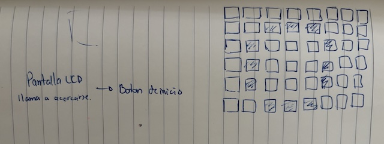
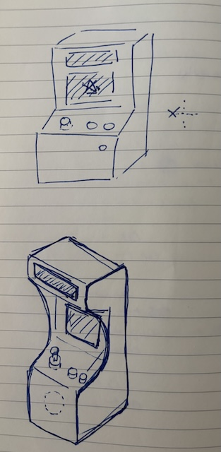
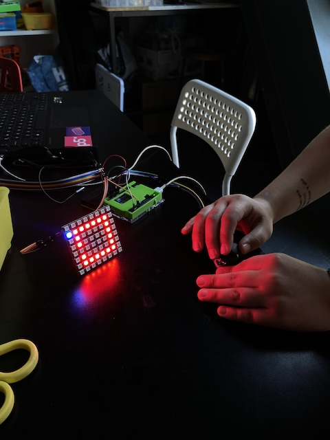
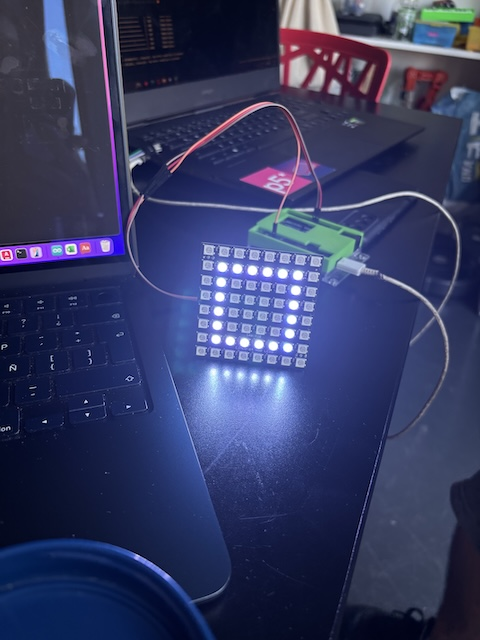
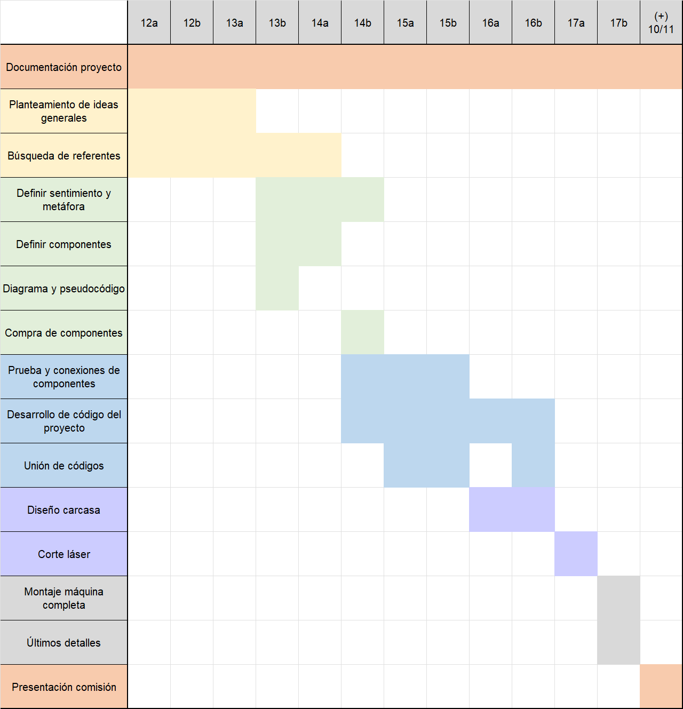

# grupo-01


## Máquinas literarias

Nombre de grupo: **Los 404**

### Integrantes:

  - Sofía Cartes / [sofiacartes](https://github.com/sofiacartes)
  - Catalina Catalán/ [terroiblea](https://github.com/terroiblea)
  - Nicolás Miranda/ [Nicolas-Miranda1312](https://github.com/Nicolas-Miranda1312)
  - Vania Paredes /  [21vaniaparedes](https://github.com/21vaniaparedes)

### Roles del equipo:

- **Sofia Cartes:** Aporte principal de ordenar Github, Revisar, probar y hacer código pantalla neopixel.
- **Catalina Catalán:** Aporte principal haciendo código del módulo reproductor MP3 y pantalla LCD. Ayudó también a ordenar Github.
- **Nicolas Miranda:**  Aporte principal haciendo código pantalla neopixel, revisando y probando código. Ayudó también a ordenar Github.
- **Vania Paredes:** Aporte principal haciendo código pantalla neopixel, revisando y probando código. Ayudó también a ordenar Github.

Cada integrante del grupo participó activamente ayudando en los roles del otro. Proceso colaborativo. Además, en conjunto se decidió el diseño de la carcasa. 

## 0aTAo 

0aTAo (cero atao) es una experiencia interactiva que explora la **frustración**, la **paciencia** y la imposibilidad de controlar lo imperfecto. El juego parece invitar a reparar una figura simple, pero rápidamente demuestra que cada intento de arreglarla solo la desordena más.

El dispositivo utiliza una matriz de 8×8 píxeles, un joystick y cinco botones. La pantalla LCD muestra “VEN, ACÉRCATE Y JUEGA”, mientras que la matriz neopixel presenta un cuadrado perfectamente formado. Al iniciar el juego, un píxel se desplaza y la figura pierde su estabilidad. Desde ahí, cada acción del usuario busca corregir el error que genera nuevas distorsiones.

Lo interesante es que, cuando el jugador deja de intervenir, la figura vuelve a su estado perfecto. Esta dinámica refuerza la *metáfora* del proyecto: **cuanto más intentamos controlar y corregir, más se desordena todo; pero al soltar y dejar de forzar la perfección, el equilibrio reaparece por sí solo.**

Instrucciones de uso:

Al presionar el **botón de inicio**, el cuadrado perfecto de la matriz se desarma y uno de sus píxeles se desplaza fuera de lugar. Desde ese instante, el **joystick** te permite mover este **píxel fugitivo**, aunque cualquier intento de corregir la figura solo provoca que se desordene aún más.

Los **cuatro botones adicionales** no tiene etiquetas ni indicaciones: el jugador deberá descubrir su función al probarlos. Cada uno activa una reacción inesperada distinta:

- **Botón glotón**.
- **Botón cambio de color**.
- **Botón inútil**.
- **Botón velocidad música**
Además, el **botón integrado en el joystick activa un modo disco como sorpresa extra.**
Ninguno de estos botones restaura la figura; todos están diseñados para intensificar la sensación de pérdida de control.
Si el jugador deja de interactuar durante unos segundos, la matriz regresa por sí sola a su forma original. Así, el dispositivo refuerza su idea central: intervenir produce caos, **soltar permite que el orden vuelva por sí mismo.**

Contexto de uso:

0aTAo es un juego donde las personas pueden acercarse, tocar botones y mover un joystick para intentar arreglar una figura de luces que se va desordenando. Está pensado para espacios de exhibición o juegos experimentales en los que el usuario descubre que mientras más intenta controlar la figura más caos genera y que solo al dejar de intervenir, el sistema vuelve solo a la perfección inicial. Busca generar una experiencia lúdica y reflexiva sobre el control, la frustración y la idea de soltar.

### Diagrama de flujo


### Inputs y outputs

#### Input

- Botón de inicio.
- Palanca Joystick.
- Botón Joystick - modo disco.
- Botón glotón. 
- Botón velocidad música.
- Botón cambio color pixel.
- Botón inútil.

#### Output

- Pantalla LCD.
- Pantalla Neopixel 8x8.
- Modulo Reproductor MP3 DFPlayer Mini.

#### BOM

| Componentes | Cantidad | Unidad          | OBS | precios
|---------|----------------------------------|------------------|------------------|---|
| Mini Protoboard | 3 | 400 puntos | Conexión VCC GND directa al arduino | . |
| Arduino UNO | 1 | R4 Minima | Conexión directa a corriente |.|
| Botones|  5 | HC-SR04 | PIN 8 - PIN 9 - PIN 4 - PIN 3 - PIN 5  - VCC a 5V - GND a GND |.|
| Joystick| 1 | -| VCC a 5V - GND GND - A0 a VRx - A1 a VRy - PIN 2 a SW |.|
| Pantalla LCD Azul| 1  |  | VSS a GND – VDD a 5V – VO al centro del potenciómetro – RS a pin 12 – RW a GND – E a pin 11 – D4 a pin 5 – D5 a pin 4 – D6 a pin 3 – D7 a pin 2 – A a 5V con 200Ω – K a GND – Potenciómetro: 5V / VO / GND |.|
| Resistencia | 4 | 1K |PIN 8 - PIN 9- PIN 4- PIN 3 |.|
|Matriz LED RGB 8x8|1| |VCC a 5V - GND a GND - DIN a PIN 6 |.|
|Módulo reproductor MP3|1| | VCC a 5V - Negativo altavoz a STK_2 - Positivo altavoz a STK_1 - TX al RX Arduino - RX al TX Arduino - GND a GND|
|Tarjeta SD|1| |DFPlayer Mini|.|
|Speaker|1|3w|VCC a SPK_1 - GND a SPK_2 |.|
  
### Especificaciones máquina 

#### Controles 

- **Botón de inicio:** Le da inicio al juego moviendo un píxel de su lugar cuando la figura está perfecta.
- **Joystick:** Mueve el píxel corrido, pero en dirección contraria a la que intentas. (Arriba es abajo, izquierda es derecha, etc.)
- **Botón del joystick - modo disco:** Desarma todo; se reparten los píxeles por toda la pantalla mientras parpadean en colores. Para desactivar esta función hay que volver a apretar el botón. 
- **Botón 1 - Inútil:** No hace nada (distracción, no está conectado).
- **Botón 2 - Cambio color:** Se cambia el color del LED que no está en su lugar hasta 5 veces. 
- **Botón 3 - Velocidad música:** Cada clic aumenta la velocidad del audio (hasta 3 veces).
- **Botón 4 - Glotón:** Se come 9 píxeles aleatoriamente copn cada click; cuando se presiona una décima vez, vuelve al cuadrado imperfecto. 

#### Reacciones pantalla LED 

Pantalla LED 8x8 píxeles: Al principio muestra una figura perfectamente formada: Un cuadrado. Al apretar el botón de inicio, un píxel se mueve, y la figura deja de ser perfecta. Dependiendo del botón que se apriete, los píxeles seguirán cambiando y modificándose. 

#### Reacciones pantalla LCD 

- Al principio (sin tener ninguna interacción) muestra el mensaje: **"VEN, ACÉRCATE Y JUEGA"**. Es lo que invita a la persona a interactuar con la máquina.
- Cuando se aprieta el botón de inicio, la frase cambia a: **"Ahora intenta arreglarme”**
- A medida que se interactúa con distintos controles como el mando de joystick o los botones (del 1 al 4: inútil, música, glotón, cambio color), las respuestas cambian aleatoriamente entre estas frases: **"No debiste hacer eso", "Upps, pésima idea", "No lo hagas más"**. 
- Si se activa el modo disco (botón joystick), la pantalla muestra **"NO ES MOMENTO DE DIVERTIRSE"**.

#### Audio

El audio que se reproduce durante todo momento (haya o no hay interacción) es: 

- **Darker Waves - Zander Noriega** [darker-waves](https://opengameart.org/content/darker-waves)
- Licencia CC-BY 3.0 "puedes usar la obra libremente incluso comercialmente, SIEMPRE que des creditos al autor"

Cuando se aprieta el botón "velocidad música", este comienza a reproducirse más rápido. Si se aprieta el modo disco, la canción cambia (solo mientras esté en modo disco; después vuelve a su reproducción normal).

### Bocetos de planificación






### Pseudocódigo Principal (Arduino 1)

```cpp
INICIO DEL PROGRAMA

-CONFIGURAR matriz neopixel 8x8
-CONFIGURAR pantalla LCD 16x2
-CONFIGURAR joystick, botones y luz de pantalla
-CONFIGURAR pin TRIGGER MP3 como salida (LOW)

-GUARDAR copia original de la **forma del cuadrado**
-DIBUJAR cuadrado inicial en neoPixel en color ROJO
-MOSTRAR en LCD: "VEN, ACERCATE, podrias divertirte"


LOOP PRINCIPAL:

-SI pasan 20 segundos sin interacción:
         - restaurar el cuadrado original (completo)
         - reiniciar variables de juego

- SI **botón INICIO** es presionado Y el juego **NO ha iniciado** aún:
     - marcar juego iniciado = verdadero
     - mostrar en LCD "Ahora intenta arreglarme"
     - seleccionar aleatoriamente un pixel del cuadrado
     - eliminar ese pixel y moverlo a una posición vecina
     - ENVIAR pulso digital HIGH por PIN TRIGGER MP3 
     - volver a LOW

 - SI **botón COMELON** es presionado:
      - mostrar mensaje aleatorio en LCD ("No debiste hacer eso", "Upps, pésima idea", "No lo hagas más")
      - eliminar un pixel adicional del cuadrado
      - mover un nuevo pixel a una posición cercana
      - si llegó al límite de 10 roturas:
      - restaurar cuadrado incompleto con un pixel movido

 - SI **botón COLOR** es presionado Y existe un pixel escapado:
      -  cambiar color del pixel escapado (excepto a rojo)
      - mostrar mensaje random en LCD ("No debiste hacer eso", "Upps, pésima idea", "No lo hagas más")
      - actualizar matriz

  - SI **botón VELOCIDAD** es presionado:
           -  mostrar mensaje random en LCD ("No debiste hacer eso", "Upps, pésima idea", "No lo hagas más")
           - Cambiará la velocidad de reproducción de la música con cada click (aun no configurado)

  - SI **botón del joystick** es presionado:
   -  activar modo DISCO (colores aleatorios)
   -   mostrar mensaje random en LCD ("NO ES MOMENTO DE DIVERTIRSE")
   -  actualizar matriz constantemente hasta salir del modo

  - SI **existe pixel escapado:**
   -   leer valores del joystick X e Y
   -   mover el pixel escapado en dirección contraria

FIN LOOP
```

### Pseudocódigo Secundario (Arduino 2)

```cpp
INICIO DEL PROGRAMA

- CONFIGURAR comunicación serial para DFPlayer Mini
- CONFIGURAR pin TRIGGER como entrada digital

- INICIALIZAR módulo MP3
- CONFIGURAR volumen y ecualización

LOOP PRINCIPAL:

- LEER estado del pin TRIGGER
- SI la señal está en HIGH:
      - reproducir pista de audio (loop o play)

FIN LOOP
```

### Dificultades y desafíos

Tuvimos dificultades, pero solucionables (algunas veces).

Algunas de estas fueron: 

- Lograr que se hiciera un cuadrado vacío en la pantalla neopixel. 
- Lograr que los colores fueran los indicados dependiendo de la función.
- Bloquear un píxel aleatorio de la pantalla neopixel.
- Cuando se realizaba una parte, a veces dejaba de funcionar lo otro.
- Que luego de usar el botón que desaparece píxeles, el cuadrado volviera a aparecer incompleto con un píxel movido (volvía completo).
- Hacer que se cumpla la metáfora, la cual es que el cuadrado vuelva a su estado original al no hacer nada.
- Unir todo, especialmente la pantalla LCD a los botones y la pantalla LED.
- Dificultades de conexiones (muchos cables, se nos enredó un poco todo, se desconectaron algunas cosas, entre otros).
- Problemas con librerías.
- Hacer que los mensajes de la pantalla LCD cambien en base al funcionamiento de los botones.
- Conectar y hacer funcionar el módulo MP3, eso incluyendo principalmente que la tarjeta SD no era leída correctamente por el módulo.
- Cambio de pines para integrar todo a un solo Arduino.

### Proceso: dificultades, conexiones, desafíos








## Etapas del código

- *ETAPAS DE PROCESO DE CÓDIGO ARRIBA EN FILES CON FECHA DE MODIFICACIONES.*

### 1. Pantalla 8x8

Se parte dibujando un cuadrado hueco en la matriz LED 8x8. El programa guarda una copia del cuadrado perfecto para poder restaurarlo después. Cuando empieza el juego, uno de los LEDs del cuadrado se “rompe” y desaparece, y otro LED aparece afuera como “pixel escapado”, listo para ser movido con el joystick. Si pasan 15 segundos sin actividad, todo vuelve a su estado original.

```cpp
#include <Adafruit_NeoPixel.h>  // Librería para controlar la matriz LED tipo NeoPixel

// ===================== CONFIG NEOPIXEL ======================
// Pin donde está conectada la matriz
#define PIN_MATRIZ 13
// Número total de LEDs (8x8 = 64 LEDs)
#define NUM_PIXELES 64

// Objeto NeoPixel
Adafruit_NeoPixel matriz = Adafruit_NeoPixel(NUM_PIXELES, PIN_MATRIZ, NEO_GRB + NEO_KHZ800);

// ===================== VARIABLES PRINCIPALES ======================
// Figura inicial: un cuadrado formado dentro del margen del 8x8
bool formaBase[64] = {
  0, 0, 0, 0, 0, 0, 0, 0,
  0, 1, 1, 1, 1, 1, 1, 0,
  0, 1, 0, 0, 0, 0, 1, 0,
  0, 1, 0, 0, 0, 0, 1, 0,
  0, 1, 0, 0, 0, 0, 1, 0,
  0, 1, 0, 0, 0, 0, 1, 0,
  0, 1, 1, 1, 1, 1, 1, 0,
  0, 0, 0, 0, 0, 0, 0, 0
};

bool formaBaseOriginal[64];              // Copia del cuadrado perfecto
int pixelBloqueado = -1;                 // LED eliminado dentro del cuadrado
int pixelEscapado = -1;                  // LED que se mueve fuera de su posición original
uint32_t colorPixelEscapado = 0x00FFFF;  // Color del pixel escapado
bool modoDisco = false;                  // Si está activo el modo fiesta

// Control del movimiento lento del pixel
unsigned long tiempoUltimoMovimiento = 0;
const unsigned long retrasoMovimiento = 200;
const unsigned long retrasoDisco = 80;

// Control de destrucción del cuadrado
int pixelesRotos = 0;
const int maxPixelesRotos = 9;

// Control actividad
unsigned long tiempoUltimaActividad = 0;
bool juegoIniciado = false;

// ===================== FUNCIONES UTILES ======================
// Obtienen coordenadas X,Y o índice dentro de 8x8
int obtenerX(int i) {
  return i % 8;
}
int obtenerY(int i) {
  return i / 8;
}
int obtenerIndice(int x, int y) {
  return y * 8 + x;
}

// Genera colores random excepto rojo puro
uint32_t generarColorNoRojo() {
  while (true) {
    int r = random(0, 256);
    int g = random(0, 256);
    int b = random(0, 256);
    // Si es rojo intenso, se rechaza
    if (!(r > 200 && g < 80 && b < 80)) return matriz.Color(r, g, b);
  }
}

// ===================== DIBUJO NEOPIXEL ======================
// Dibuja cuadrado normal + pixel escapado o bloqueado
void dibujarMatrizNormal() {
  matriz.clear();
  for (int i = 0; i < 64; i++) {
    if (formaBase[i] == 1) matriz.setPixelColor(i, matriz.Color(255, 0, 0));  // Rojo para los del cuadrado
  }
  if (pixelBloqueado >= 0) matriz.setPixelColor(pixelBloqueado, 0);                 // Pixel eliminado
  if (pixelEscapado >= 0) matriz.setPixelColor(pixelEscapado, colorPixelEscapado);  // Pixel que se mueve
  matriz.show();
}

// ===================== REPARAR CUADRADO ======================
// Resetea todo y vuelve a cuadrado perfecto
void repararCuadrado() {
  for (int i = 0; i < 64; i++) {
    formaBase[i] = formaBaseOriginal[i];
  }
  pixelBloqueado = -1;
  pixelEscapado = -1;
  pixelesRotos = 0;
  juegoIniciado = false;
  dibujarMatrizNormal();
}

//—--loop—--
// Guardar copia del cuadrado original
  for (int i = 0; i < 64; i++) {
    formaBaseOriginal[i] = formaBase[i];
  }

 // Si pasan 15 segundos sin tocar nada → todo vuelve a su estado inicial
  if (millis() - tiempoUltimaActividad > 15000) {
    repararCuadrado();  // Restaurar figura y resetear juego
    tiempoUltimaActividad = millis();
  }

```

### 2. Joystick

Controla el movimiento del píxel escapado, pero a propósito se mueve al lado contrario de donde empujas el joystick, se lee con analogRead() en X e Y. También incluye un botón que activa el **Modo Disco**, donde todos los LEDs parpadean con colores aleatorios. Cuando ese modo está activo, se detienen los otros controles.

```cpp
// Pines del joystick y su botón
#define PIN_JOYSTICK_X A0
#define PIN_JOYSTICK_Y A1
#define PIN_JOYSTICK_BOTON 8


 // Configurar botones
  pinMode(PIN_JOYSTICK_BOTON, INPUT_PULLUP);

//—--Loop—-
// ================== MOVER PIXEL ESCAPADO ==================
  // Controlado por joystick (dirección invertida)
  if (pixelEscapado >= 0) {
    int valorX = analogRead(PIN_JOYSTICK_X);
    int valorY = analogRead(PIN_JOYSTICK_Y);

    if (millis() - tiempoUltimoMovimiento >= retrasoMovimiento) {
      int x = obtenerX(pixelEscapado), y = obtenerY(pixelEscapado);
      int xOriginal = x, yOriginal = y;

      // Movimiento inverso
      if (valorX > 800 && x > 0) x--;
      else if (valorX < 200 && x < 7) x++;
      if (valorY > 800 && y > 0) y--;
      else if (valorY < 200 && y < 7) y++;

      if (x != xOriginal || y != yOriginal) tiempoUltimaActividad = millis();

      int nueva = obtenerIndice(x, y);
      if (nueva != pixelBloqueado) pixelEscapado = nueva;

      dibujarMatrizNormal();
      tiempoUltimoMovimiento = millis();
    }
  }

// Modo Disco

// Modo fiesta: colores locos para todos
void dibujarMatrizDisco() {
  for (int i = 0; i < 64; i++) {
    matriz.setPixelColor(i, generarColorNoRojo());
  }
  if (pixelEscapado >= 0) matriz.setPixelColor(pixelEscapado, colorPixelEscapado);
  matriz.show();
}

//—Loop

// ================== MODO DISCO ==================
  // Activado con botón del joystick
  static int ultimo = HIGH;
  int ahora = digitalRead(PIN_JOYSTICK_BOTON);
  if (ultimo == HIGH && ahora == LOW) {
    modoDisco = !modoDisco;
    tiempoUltimaActividad = millis();
    if (modoDisco) actualizarLCD("NO ES MOMENTO", "DE DIVERTIRSE", false);
    delay(200);
  }
  ultimo = ahora;

  // Si está modo fiesta activo → dibujar colores locos
  if (modoDisco) {
    tiempoUltimaActividad = millis();
    dibujarMatrizDisco();
    mostrarLCD();
    delay(retrasoDisco);
    return;  // Se salta el resto para no mover el pixel escapado
  }
```

### 3. Botones

#### Botón Inicio 

Comienza el juego, rompe un LED del cuadrado y genera un pixel escapado vecino. También envía una señal al segundo Arduino para iniciar la música.

```cpp
#define PIN_INICIO 6         // Inicia el juego

pinMode(PIN_INICIO, INPUT_PULLUP);

//—Loop

// ================== BOTÓN INICIO ==================
  // Da inicio al juego y rompe un pixel
  if (digitalRead(PIN_INICIO) == LOW && !juegoIniciado) {
    tiempoUltimaActividad = millis();
    juegoIniciado = true;
    actualizarLCD("Ahora intenta", "arreglarme", false);

    // Buscar todos los píxeles encendidos del cuadrado
    int lados[64], total = 0;
    for (int i = 0; i < 64; i++)
      if (formaBase[i] == 1) lados[total++] = i;

    // Elegir uno aleatoriamente para romperlo
    if (total > 0) {
      int elegido = lados[random(total)];
      pixelBloqueado = elegido;       // Guardamos cual se rompió
      formaBase[pixelBloqueado] = 0;  // Apagamos ese pixel dentro del cuadrado

      // Crear pixel escapado en una posición vecina
      int x = obtenerX(elegido), y = obtenerY(elegido);
      if (x < 7) pixelEscapado = obtenerIndice(x + 1, y);
      else if (x > 0) pixelEscapado = obtenerIndice(x - 1, y);
      else if (y < 7) pixelEscapado = obtenerIndice(x, y + 1);
      else pixelEscapado = obtenerIndice(x, y - 1);

      dibujarMatrizNormal();
    }

    // Enviar un pulso al Arduino secundario para que active la música
    digitalWrite(PIN_TRIGGER_MP3, HIGH);
    delay(100);  // Duración del pulso
    digitalWrite(PIN_TRIGGER_MP3, LOW);

    delay(250);
  }

 ```

#### Botón Color

Cambia aleatoriamente el color del pixel escapado (nunca a rojo).

```cpp
#define PIN_COLOR 7          // Cambia color del pixel escapado

pinMode(PIN_COLOR, INPUT_PULLUP);

//—Loop

// ================== BOTÓN COLOR ==================
  // Cambia el color del pixel escapado
  if (pixelEscapado >= 0 && digitalRead(PIN_COLOR) == LOW) {
    tiempoUltimaActividad = millis();
    colorPixelEscapado = generarColorNoRojo();
    actualizarLCD("No debiste", "hacer eso", false);
    dibujarMatrizNormal();
    delay(200);
  }

```

#### Botón Glotón

Rompe otro pixel del cuadrado cada vez que lo presionas. Después de romper 9, hace un reset y vuelve a empezar rompiendo otro pixel.

```cpp
#define PIN_BOTON_COMELON 9  // Botón que rompe el cuadrado

pinMode(PIN_BOTON_COMELON, INPUT_PULLUP);

//—Loop

// ================== BOTÓN GLOTÓN==================
  // Rompe otro pixel del cuadrado (botón destructivo)
  if (digitalRead(PIN_BOTON_COMELON) == LOW) {
    tiempoUltimaActividad = millis();

    // Mensajes random en el LCD para molestar al jugador
    int opcion = random(3);
    if (opcion == 0) actualizarLCD("No debiste", "hacer eso", false);
    else if (opcion == 1) actualizarLCD("upps, deberias", "pensarlo mejor", false);
    else actualizarLCD("ese boton no", "es el mejor", false);

    // Buscar pixeles activos dentro del cuadrado
    int lados[64], total = 0;
    for (int i = 0; i < 64; i++)
      if (formaBase[i] == 1) lados[total++] = i;

    // Si aún no se destruyeron 10 pixeles
    if (pixelesRotos < maxPixelesRotos && total > 0) {
      int elegido = lados[random(total)];
      pixelBloqueado = elegido;
      formaBase[pixelBloqueado] = 0;

      // Crear pixel escapado vecino
      int x = obtenerX(elegido), y = obtenerY(elegido);
      if (x < 7) pixelEscapado = obtenerIndice(x + 1, y);
      else if (x > 0) pixelEscapado = obtenerIndice(x - 1, y);
      else if (y < 7) pixelEscapado = obtenerIndice(x, y + 1);
      else if (y > 0) pixelEscapado = obtenerIndice(x, y - 1);

      pixelesRotos++;

      // Si ya se destruyeron muchos pixeles → reinicio troll
    } else if (pixelesRotos >= maxPixelesRotos) {
      for (int i = 0; i < 64; i++) formaBase[i] = formaBaseOriginal[i];

      int elegido = random(64);
      while (formaBase[elegido] == 0) elegido = random(64);

      pixelBloqueado = elegido;
      formaBase[pixelBloqueado] = 0;

      int x = obtenerX(elegido), y = obtenerY(elegido);
      if (x < 7) pixelEscapado = obtenerIndice(x + 1, y);
      else if (x > 0) pixelEscapado = obtenerIndice(x - 1, y);
      else if (y < 7) pixelEscapado = obtenerIndice(x, y + 1);
      else if (y > 0) pixelEscapado = obtenerIndice(x, y - 1);

      pixelesRotos = 1;
    }

    dibujarMatrizNormal();
    delay(250);
  }

```

#### Botón Inutil

No hace nada aún, aparte de mostrar mensajes en la pantalla LCD.

```cpp
#define PIN_BOTON_VEL 10     // Botón inútil

pinMode(PIN_BOTON_VEL, INPUT_PULLUP);

//—Loop
 // ================== BOTÓN VEL ==================
  // Botón inútil (solo cambia mensaje)
  if (digitalRead(PIN_BOTON_VEL) == LOW) {
    tiempoUltimaActividad = millis();
    int opcion = random(3);
    if (opcion == 0) actualizarLCD("No debiste", "hacer eso", false);
    else if (opcion == 1) actualizarLCD("upps, deberias", "pensarlo mejor", false);
    else actualizarLCD("ese boton no", "es el mejor", false);
    delay(200);
  }

```
### 4. Pantalla LCD

Muestra mensajes interactivos según las acciones del jugador:

- Antes de iniciar: "VEN, ACERCATE Y JUEGA";
- Botón de inicio: "Ahora intenta arreglarme"
- Botones del juego: "No debiste hacer eso", "Upps, pésima idea", "No lo hagas más"
- Modo Disco: "NO ES MOMENTO DE DIVERTIRSE"
- Apoya la narrativa del juego y el caos del cuadrado que está siendo destruido.

En el código, la funcionalidad de la pantalla está integrada de forma modular junto con el resto de los componentes. Su principal tarea es mostrar mensajes que se activan en respuesta a ciertas acciones del jugador, especialmente al presionar botones específicos. De esta manera, la pantalla no opera aislada, sino que forma parte del flujo general del programa, reaccionando dinámicamente según el comportamiento del usuario y el estado del dispositivo.

Aquí hay algunas secciones específicas acopladas: 

```cpp
LiquidCrystal lcd(12, 11, 5, 4, 3, 2);
#define PIN_BACKLIGHT 5

// Mensajes que se mostrarán en LCD
String linea1 = "VEN, ACERCATE";
String linea2 = "Y JUEGA";

// Sistema de parpadeo del texto
bool modoParpadeo = false;
unsigned long lastBlink = 0;
unsigned long blinkInterval = 300;
bool visible = true;

pinMode(PIN_BACKLIGHT, OUTPUT);

// Encender backlight del LCD
  analogWrite(PIN_BACKLIGHT, 255);

 // Config LCD
  lcd.begin(16, 2);

  // Mensaje inicial
  actualizarLCD("VEN, ACERCATE", "Y JUEGA", false);
  mostrarLCD();

//—Loop

// ================== BOTÓN INICIO ==================
actualizarLCD("Ahora intenta", "arreglarme", false);
 
// ================== BOTÓN COMELON ==================

if (opcion == 0) actualizarLCD("No debiste", "hacer eso", false);
    else if (opcion == 1) actualizarLCD("upps, deberias", "pensarlo mejor", false);
    else actualizarLCD("ese boton no", "es el mejor", false);

// ================== BOTÓN COLOR ==================

actualizarLCD("No debiste", "hacer eso", false);

// ================== BOTÓN VEL ==================

if (opcion == 0) actualizarLCD("No debiste", "hacer eso", false);
    else if (opcion == 1) actualizarLCD("upps, deberias", "pensarlo mejor", false);
    else actualizarLCD("ese boton no", "es el mejor", false);

// ================== MODO DISCO ==================

 if (modoDisco) actualizarLCD("NO ES MOMENTO", "DE DIVERTIRSE", false);

```

### 5. Música

Se usa un segundo Arduino con un módulo DFPlayer Mini. El Arduino principal envía un pulso cuando se aprieta el botón Inicio, y el secundario recibe esa señal para reproducir una pista musical en loop, generando la atmósfera del juego.

#### Arduino principal:

```cpp
// Pin que manda una señal tipo pulso al Arduino secundario (el que reproduce música)
#define PIN_TRIGGER_MP3 A3

// Pin de señal de música
  pinMode(PIN_TRIGGER_MP3, OUTPUT);
  digitalWrite(PIN_TRIGGER_MP3, LOW)

 // Enviar un pulso al Arduino secundario para que active la música
    digitalWrite(PIN_TRIGGER_MP3, HIGH);
    delay(100);  // Duración del pulso
    digitalWrite(PIN_TRIGGER_MP3, LOW);

    delay(250);
  }

```

#### Arduino secundario:

```cpp
#include <SoftwareSerial.h>            // Librería para comunicación serial por software
#include <DFRobotDFPlayerMini.h>       // Controlador del módulo MP3

SoftwareSerial mp3Serial(2, 3);        // RX, TX para DFPlayer
DFRobotDFPlayerMini mp3;

#define PIN_TRIGGER A5                 // Pin que recibe pulso desde Arduino principal

void setup() {
  Serial.begin(9600);
  mp3Serial.begin(9600);

  pinMode(PIN_TRIGGER, INPUT);         // Señal que activa audio

  Serial.println("Inicializando DFPlayer...");

  if (!mp3.begin(mp3Serial)) {         // Intentar conectar con DFPlayer
    Serial.println("DFPlayer no detectado");
    while (true);                      // Si falla → detener todo
  }

  Serial.println("DFPlayer OK!");

  mp3.volume(25);                      // Volumen medio
  mp3.EQ(DFPLAYER_EQ_NORMAL);          // Ecualización normal
}

void loop() {
  int senal = digitalRead(PIN_TRIGGER);
  Serial.println("apreta el boton");

  // Si recibe pulso desde el principal→ reproducir audio
  if (senal == HIGH) {
    Serial.println("Señal recibida → Reproduciendo");
    mp3.loop(1);                       // Reproducir pista 1 en loop
  }
}

```
## Carcasa

### Referentes de carcasa

- La idea es utilizar corte láser y acrílico como materialidad principal. 
 

Links: 


##  Organización proyecto

Carta Gant: 



## Registro proyecto 03

### Bocetos de planificación


### Fotografías y videos del proyecto funcionando


## Bibliografía 

- Afel. (s.f.). Módulo reproductor MP3 DFPlayer Mini [Producto]. Afel. <https://afel.cl/products/modulo-rayeproductor-mp3-dfpler-mini>
- Arduino. (s.f.). LED Matrix Editor. Arduino. <https://ledmatrix-editor.arduino.cc/>
- Darker-waves. (s.f.). Darker Waves [Audio]. OpenGameArt. <https://opengameart.org/content/darker-waves>
- Dumblebots. (s.f.). Using the Arduino UNO R4 LED Matrix to build the Pong arcade game. Dumblebots. <https://dumblebots.com/blog/arduino-uno-r4-led-matrix-pong-video-game>
- Hackster.io. (s.f.). Arduino Connect4 Game — Human vs Microcontroller. <https://www.hackster.io/mircemk/arduino-connect4-game-human-vs-microcontroller-e5c8ea>
- MiMundoGadget. (2023). Tutorial: Luz RGB de relleno con Arduino, un panel WS2812B y 1 potenciómetro. <https://www.mimundogadget.com/2023/03/tutorial-luz-rgb-de-relleno-con-arduino.html>
- Munir03125344286. (s.f.). Play audio in Arduino. Arduino Project Hub. <https://projecthub.arduino.cc/munir03125344286/play-audio-in-arduino-d64363>
- Naylamp Mechatronics. (s.f.). Tutorial LCD: Conectando tu Arduino a un LCD1602 y LCD2004. <https://naylampmechatronics.com/blog/34_tutorial-lcd-conectando-tu-arduino-a-un-lcd1602-y-lcd2004.html>
- Pinterest. (s.f.). Circuito o prototipo electrónico [Pin]. Pinterest. <https://pin.it/74qsTx2Sb>
- Pinterest. (s.f.). Componente o módulo electrónico [Pin]. Pinterest. <https://pin.it/1XXbimOgl>
- Pinterest. (s.f.). Electronic Circuit [Pin]. Pinterest. <https://cl.pinterest.com/pin/616641374021531854/feedback/>
- Pinterest. (s.f.). Montaje de hardware electrónico [Pin]. Pinterest. <https://pin.it/30iQh1FrW>
- Pinterest. (s.f.). Proyecto electrónico con Arduino [Pin]. Pinterest. <https://pin.it/35kQGAlJB>
- Pinterest. (s.f.). @david_proyectos — Proyecto con Arduino UNO, acelerómetro LSM303 y matriz LED LOL Shield [Pin]. Pinterest. <https://cl.pinterest.com/pin/2111131072355407/feedback/>
- Pinterest. (s.f.). Proyecto DIY con Arduino [Pin]. Pinterest.   <https://pin.it/111THsX3V>
- Reddit. (2023). Pong game on the Arduino UNO R4 LED matrix. Reddit. <https://www.reddit.com/r/arduino/comments/15zxefj/pong_game_on_the_arduino_uno_r4_led_matrix/>
- Tecneu. (s.f.). Cómo utilizar el DFPlayer Mini con Arduino para proyectos de audio. Tecneu. <https://www.tecneu.com/blogs/tutoriales-de-electronica/como-utilizar-el-dfplayer-mini-con-arduino-para-proyectos-de-audio>
- TodoMaker. (s.f.). LED RGB con Arduino Uno. TodoMaker. <https://todomaker.com/blog/ledrgbconarduinouno/>
- Vasiljev, V. (s.f.). Snake LED 16×16 Matrix Game. Arduino Project Hub. <https://projecthub.arduino.cc/vasiljevalentin/snake-led-16x16-matrix-game-15a475>
- YouTube. (2023). Arduino: Cómo usar una pantalla LCD 16×2 paso a paso desde cero [Video].
<https://www.youtube.com/watch?v=zUGuOolVC8A&t=659s>
