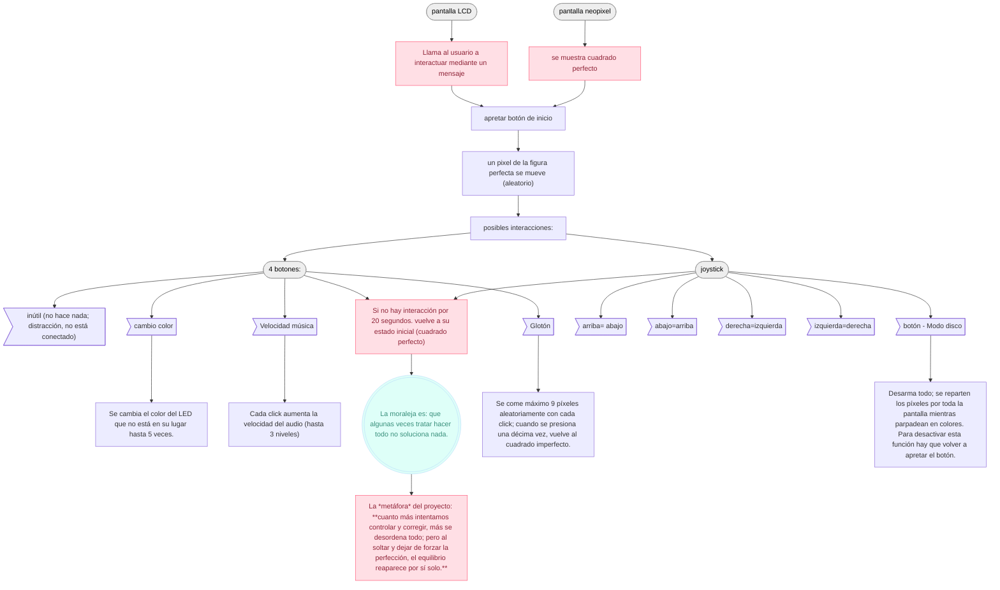
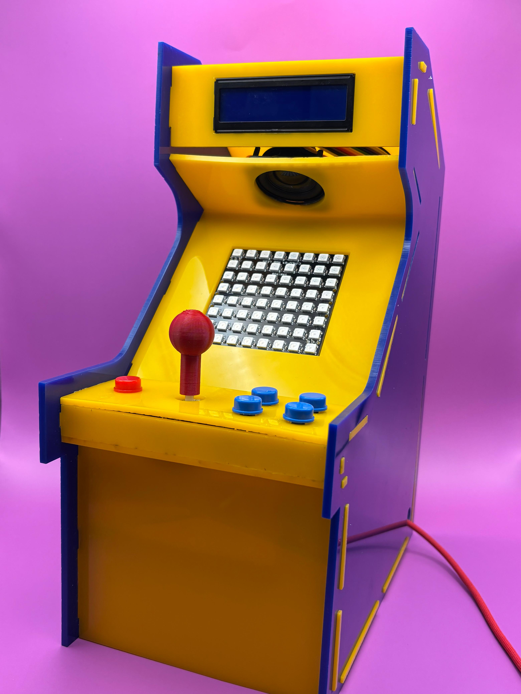
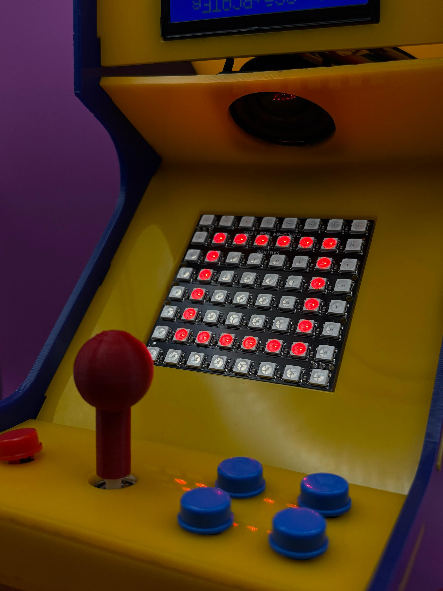
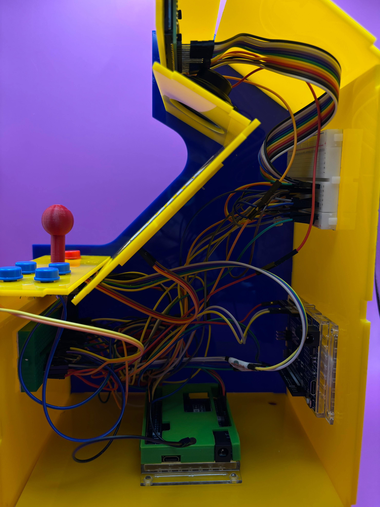
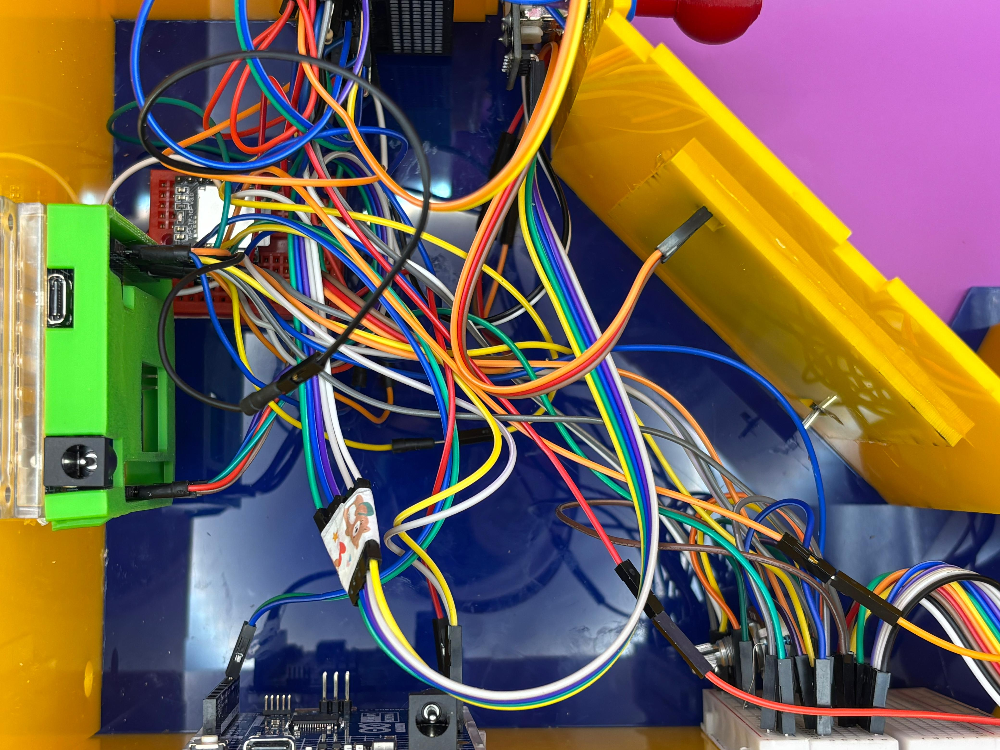

# grupo-01


## Máquinas literarias

Nombre de grupo: **Los 404**

### Integrantes:

  - Sofía Cartes / [sofiacartes](https://github.com/sofiacartes)
  - Catalina Catalán/ [terroiblea](https://github.com/terroiblea)
  - Nicolás Miranda/ [Nicolas-Miranda1312](https://github.com/Nicolas-Miranda1312)
  - Vania Paredes /  [21vaniaparedes](https://github.com/21vaniaparedes)

### Roles del equipo:

- **Sofia Cartes:** Aporte principal de ordenar Github, Revisar, probar y hacer código pantalla neopixel. Desarrollo y diseño de fanzine. 
- **Catalina Catalán:** Aporte principal haciendo código pantalla LCD, modelado y diseño en Autocad de la carcasa, conexiones generales pantala. Ayudó también a ordenar Github.
- **Nicolas Miranda:**  Aporte principal haciendo código pantalla neopixel, revisando y probando código; código del módulo reproductor MP3; conexiones generales proyecto final. Ayudó también a ordenar Github.
- **Vania Paredes:** Aporte principal haciendo código pantalla neopixel, revisando y probando código. Ayudó también a ordenar Github.

Cada integrante del grupo participó activamente ayudando en los roles del otro. Proceso colaborativo. En conjunto se realizó la unión de todos los componentes para el resultado final. 

## 0aTAo 

0aTAo (cero atao) es una experiencia interactiva que explora la **frustración**, la **paciencia** y la imposibilidad de controlar lo imperfecto. El juego parece invitar a reparar una figura simple, pero rápidamente demuestra que cada intento de arreglarla solo la desordena más.

El dispositivo utiliza una matriz de 8×8 píxeles, un joystick y cinco botones. La pantalla LCD muestra “VEN, ACÉRCATE Y JUEGA” (intervenida con caracteres), mientras que la matriz neopixel presenta un cuadrado cerrado. Al iniciar del juego, un píxel se desplaza y la figura pierde su estabilidad (queda abierta con un pixel corrido). Desde ahí, cada acción del usuario busca corregir el error que genera nuevas distorsiones.

Lo interesante es que, cuando el jugador deja de intervenir, la figura vuelve a su estado perfecto. Esta dinámica refuerza la *figura literaria* del proyecto: 

- **Aporía mecánica: la paradoja de un artefacto humano que se desordena con el control y recupera su equilibrio solo cuando renunciamos a dirigirlo.**
- cuanto más intentamos controlar y corregir, más se desordena todo; pero al soltar y dejar de forzar la perfección, el equilibrio reaparece por sí solo.

Instrucciones de uso:

Al presionar el **botón de inicio**, el cuadrado perfecto de la matriz se desarma y uno de sus píxeles se desplaza fuera de lugar. Desde ese instante, el **joystick** te permite mover este **píxel fugitivo**, aunque cualquier intento de corregir la figura solo provoca que se desordene aún más.

Los **cuatro botones adicionales** no tiene etiquetas ni indicaciones: el jugador deberá descubrir su función al probarlos. Cada uno activa una reacción inesperada distinta:

- **Botón glotón** se come (elimina) pixeles del cuadrado.
- **Botón color** cambia el color del pixel escapado y lo mueve a un lugar random de la pantalla.
- **Botón caos** desarma todos los pixeles del cuadrado.
- **Botón inútil**
  
Contexto de uso:

0aTAo es un juego donde las personas pueden acercarse, tocar botones y mover un joystick para intentar arreglar una figura de luces que se va desordenando. Está pensado para espacios de exhibición o juegos experimentales en los que el usuario descubre que mientras más intenta controlar la figura más caos genera y que solo al dejar de intervenir, el sistema vuelve solo a la perfección inicial. Busca generar una experiencia lúdica y reflexiva sobre el control, la frustración y la idea de soltar.

### Diagrama de flujo



### Inputs y outputs

#### Input

- Botón de inicio.
- Palanca Joystick.
- Botón Joystick - modo disco.
- Botón glotón. 
- Botón cambio color pixel.
- Botón caos.
- Botón inútil.

#### Output

- Pantalla LCD.
- Pantalla Neopixel 8x8.
- Modulo Reproductor MP3 DFPlayer Mini.

#### BOM

| Componentes | Cantidad | Unidad          | OBS | precios| links |
|---------|----------------------------------|------------------|------------------|---|---|
| Mini Protoboard | 3 | 400 puntos | Conexión VCC GND directa al arduino | $990 |<https://afel.cl/products/mini-protoboard-170-puntos?_pos=2&_sid=736b22f67&_ss=r>|
| Arduino UNO | 1 | R4 Minima | Conexión directa a corriente |$24.990|<https://arduino.cl/producto/arduino-uno-r4-minima/?srsltid=AfmBOor5ihhImrR9DyuEKGp_E9JAcANMOeBQJvIVGgssyiaP55zMHOTZ>|
| Botones|  5 | HC-SR04 | PIN 8 - PIN 9 - PIN 4 - PIN 3 - PIN 5  - VCC a 5V - GND a GND |$100|<https://afel.cl/products/boton-tactil-tapa-12x12x7-3-interruptor?_pos=9&_sid=2dbfd08b0&_ss=r>|
| Joystick| 1 | -| VCC a 5V - GND GND - A0 a VRx - A1 a VRy - PIN 2 a SW |$1.390|<https://www.mechatronicstore.cl/modulo-joystick-analogo-de-playstation/?srsltid=AfmBOoq1Q_yhEE7T8D8IvMCLuZEt7LON5Bzmf7Ury5uouSIVnNRU33xQQKA>|
| Pantalla LCD Azul| 1  |  | VSS a GND – VDD a 5V – VO al centro del potenciómetro – RS a pin 12 – RW a GND – E a pin 11 – D4 a pin 5 – D5 a pin 4 – D6 a pin 3 – D7 a pin 2 – A a 5V con 200Ω – K a GND – Potenciómetro: 5V / VO / GND |$2.400|<https://afel.cl/products/pantalla-lcd-azul-16x02?_pos=2&_sid=f665c421a&_ss=r>|
| Resistencia | 4 | 1K |PIN 8 - PIN 9- PIN 4- PIN 3 |kit $4.990| <https://afel.cl/products/kit-600-resistencias-1-4w-30-valores?_pos=1&_sid=a1ae0dc91&_ss=r>|
|Matriz LED RGB 8x8|1| |VCC a 5V - GND a GND - DIN a PIN 6 |$9.990|<https://afel.cl/products/matriz-led-rgb-neopixel-8x8-ws2812-cjmcu64?_pos=4&_sid=5c8f94117&_ss=r>|
|Módulo reproductor MP3|1| | VCC a 5V - Negativo altavoz a STK_2 - Positivo altavoz a STK_1 - TX al RX Arduino - RX al TX Arduino - GND a GND|$2.990|<http://afel.cl/products/modulo-reproductor-mp3-dfplayer-mini?_pos=1&_psq=modulo+rep&_ss=e&_v=1.0>|
|Tarjeta SD|1| |DFPlayer Mini|$9.990|<https://www.pcfactory.cl/producto/54503-kingston-memoria-64gb-microsdxc-canvas-select-plus-gen3-100mb-s-a1-card--adapter?origin=PCF>|
|Speaker|1|3w|VCC a SPK_1 - GND a SPK_2 |$3.000|<https://afel.cl/products/mini-parlante-altavoz-de-3w?_pos=1&_sid=f851455c2&_ss=r>|
  
### Especificaciones máquina 

#### Controles 

- **Botón de inicio:** Le da inicio al juego moviendo un píxel de su lugar cuando la figura está perfecta.
- **Joystick:** Mueve el píxel corrido, pero en dirección contraria a la que intentas. (Arriba es abajo, izquierda es derecha, etc.)
- **Botón del joystick - modo disco:** Desarma todo; se reparten los píxeles por toda la pantalla mientras parpadean en colores. Para desactivar esta función hay que volver a apretar el botón. 
- **Botón 1 - Inútil:** No hace nada (distracción, no está conectado).
- **Botón 2 - Cambio color:** Se cambia el color del LED que no está en su lugar hasta 5 veces. 
- **Botón 3 - Caos:** Desarma todos los pixeles del cuadrado.
- **Botón 4 - Glotón:** Se come 9 píxeles aleatoriamente copn cada click; cuando se presiona una décima vez, vuelve al cuadrado imperfecto. 

#### Reacciones pantalla LED 

Pantalla LED 8x8 píxeles: Al principio muestra una figura perfectamente formada: Un cuadrado. Al apretar el botón de inicio, un píxel se mueve, y la figura deja de ser perfecta. Dependiendo del botón que se apriete, los píxeles seguirán cambiando y modificándose. 

` PONER FOTOS DE ESQUEMA DE LO QUE HACE LA PANTALLA 

#### Reacciones pantalla LCD 

- Al principio (sin tener ninguna interacción) muestra el mensaje: **"VEN, ACÉRCATE Y JUEGA"**. Es lo que invita a la persona a interactuar con la máquina.
- Cuando se aprieta el botón de inicio, la frase cambia a: **"Ahora intenta arreglarme”**
- A medida que se interactúa con distintos controles como el mando de joystick o los botones (del 1 al 4: inútil, música, glotón, cambio color), las respuestas cambian aleatoriamente entre estas frases: **"No debiste hacer eso", "Upps, pésima idea", "No lo hagas más"**. 
- Si se activa el modo disco (botón joystick), la pantalla muestra **"NO ES MOMENTO DE DIVERTIRSE"**.

` PONER FOTOS DE ESQUEMA DE LO QUE HACE LA PANTALLA 

#### Audio

El audio que se reproduce durante cuando se inicia el juego es: 

- **Darker Waves - Zander Noriega** [darker-waves](https://opengameart.org/content/darker-waves)
- Licencia CC-BY 3.0 "puedes usar la obra libremente incluso comercialmente, SIEMPRE que des creditos al autor"

### Bocetos de planificación


### Pseudocódigo Principal (Arduino 1)

```cpp
INICIO DEL PROGRAMA

-CONFIGURAR matriz neopixel 8x8
-CONFIGURAR pantalla LCD 16x2
-CONFIGURAR joystick, botones y luz de pantalla
-CONFIGURAR pin TRIGGER MP3 como salida (LOW)

-GUARDAR copia original de la **forma del cuadrado**
-DIBUJAR cuadrado inicial en neoPixel en color ROJO
-MOSTRAR en LCD: "VEN, ACERCATE, podrias divertirte"


LOOP PRINCIPAL:

-SI pasan 20 segundos sin interacción:
         - restaurar el cuadrado original (completo)
         - reiniciar variables de juego

- SI **botón INICIO** es presionado Y el juego **NO ha iniciado** aún:
     - marcar juego iniciado = verdadero
     - mostrar en LCD "Ahora intenta arreglarme"
     - seleccionar aleatoriamente un pixel del cuadrado
     - eliminar ese pixel y moverlo a una posición vecina
     - ENVIAR pulso digital HIGH por PIN TRIGGER MP3 
     - volver a LOW

 - SI **botón COMELON** es presionado:
      - mostrar mensaje aleatorio en LCD ("No debiste hacer eso", "Upps, pésima idea", "No lo hagas más")
      - eliminar un pixel adicional del cuadrado
      - mover un nuevo pixel a una posición cercana
      - si llegó al límite de 10 roturas:
      - restaurar cuadrado incompleto con un pixel movido

 - SI **botón COLOR** es presionado Y existe un pixel escapado:
      -  cambiar color del pixel escapado (excepto a rojo)
      - mostrar mensaje random en LCD ("No debiste hacer eso", "Upps, pésima idea", "No lo hagas más")
      - actualizar matriz

  - SI **botón VELOCIDAD** es presionado:
           -  mostrar mensaje random en LCD ("No debiste hacer eso", "Upps, pésima idea", "No lo hagas más")
           - Cambiará la velocidad de reproducción de la música con cada click (aun no configurado)

  - SI **botón del joystick** es presionado:
   -  activar modo DISCO (colores aleatorios)
   -   mostrar mensaje random en LCD ("NO ES MOMENTO DE DIVERTIRSE")
   -  actualizar matriz constantemente hasta salir del modo

  - SI **existe pixel escapado:**
   -   leer valores del joystick X e Y
   -   mover el pixel escapado en dirección contraria

FIN LOOP
```

### Pseudocódigo Secundario (Arduino 2)

```cpp
INICIO DEL PROGRAMA

- CONFIGURAR comunicación serial para DFPlayer Mini
- CONFIGURAR pin TRIGGER como entrada digital

- INICIALIZAR módulo MP3
- CONFIGURAR volumen y ecualización

LOOP PRINCIPAL:

- LEER estado del pin TRIGGER
- SI la señal está en HIGH:
      - reproducir pista de audio (loop o play)

FIN LOOP
```

### Dificultades y desafíos

Tuvimos dificultades, pero solucionables (algunas veces).

Algunas de estas fueron: 

- Lograr que se hiciera un cuadrado vacío en la pantalla neopixel. 
- Lograr que los colores fueran los indicados dependiendo de la función.
- Bloquear un píxel aleatorio de la pantalla neopixel.
- Cuando se realizaba una parte, a veces dejaba de funcionar lo otro.
- Que luego de usar el botón que desaparece píxeles, el cuadrado volviera a aparecer incompleto con un píxel movido (volvía completo).
- Hacer que se cumpla la metáfora, la cual es que el cuadrado vuelva a su estado original al no hacer nada.
- Unir todo, especialmente la pantalla LCD a los botones y la pantalla LED.
- Dificultades de conexiones (muchos cables, se nos enredó un poco todo, se desconectaron algunas cosas, entre otros).
- Problemas con librerías.
- Hacer que los mensajes de la pantalla LCD cambien en base al funcionamiento de los botones.
- Conectar y hacer funcionar el módulo MP3, eso incluyendo principalmente que la tarjeta SD no era leída correctamente por el módulo.
- Cambio de pines para integrar todo a un solo Arduino.
- Cambios en base a correciones previas como cambio de botones o funciones generales. 
- Carcasa, calce de piezas, errores en corte laser.
- Conexiones de todo (unir proyecto) a la carcasa.
- Botones no caen bien en el acrilico (no pulsan).
- Lograr que todo funcione una vez unido a la carcasa.
- Entre otras. 

### Proceso: dificultades, conexiones, desafíos

|||
|--|--|
| |  |
| |  |
||  |
|  |  |
|  |  |
|  |  |

## Etapas del código

- *ETAPAS DE PROCESO DE CÓDIGO ARRIBA EN FILES CON FECHA DE MODIFICACIONES.*

### 1. Pantalla 8x8

Se parte dibujando un cuadrado hueco en la matriz LED 8x8. El programa guarda una copia del cuadrado perfecto para poder restaurarlo después. Cuando empieza el juego, uno de los LEDs del cuadrado se “rompe” y desaparece, y otro LED aparece afuera como “pixel escapado”, listo para ser movido con el joystick. Si pasan 15 segundos sin actividad, todo vuelve a su estado original.

```cpp
// Pin para enviar un pulso al Arduino esclavo (música)
#define PIN_TRIGGER_MP3 A3      

// Objeto NeoPixel que controla la matriz completa
Adafruit_NeoPixel matriz = Adafruit_NeoPixel(NUM_PIXELES, PIN_MATRIZ, NEO_GRB + NEO_KHZ800);

// ===================== VARIABLES PRINCIPALES ======================
// Figura inicial: un cuadrado 8x8 con un hueco interior
// 1 = LED encendido (forma parte del cuadrado)
// 0 = LED apagado
bool formaBase[64] = {
 0,0,0,0,0,0,0,0,
 0,1,1,1,1,1,1,0,
 0,1,0,0,0,0,1,0,
 0,1,0,0,0,0,1,0,
 0,1,0,0,0,0,1,0,
 0,1,0,0,0,0,1,0,
 0,1,1,1,1,1,1,0,
 0,0,0,0,0,0,0,0
};

bool formaBaseOriginal[64];   // Copia del cuadrado perfecto para restaurarlo mas adelante
int pixelBloqueado = -1;      // LED interno removido (de dode se escapa uno)
int pixelEscapado = -1;       // LED que “escapa” y se mueve por la matriz
uint32_t colorPixelEscapado = 0xFF0000;  // Color del pixel escapado (inicialmente rojo)
bool modoDisco = false;       // Para activar el modo disco

// Tiempos para animación del pixel escapado
unsigned long tiempoUltimoMovimiento = 0;       // Último avance del pixel
const unsigned long retrasoMovimiento = 200;    // Velocidad de movimiento normal
const unsigned long retrasoDisco = 80;          // Velocidad más rápida del modo disco

// Control de destrucción de la figura
int pixelesRotos = 0;                // Cuántos pixel se han roto
const int maxPixelesRotos = 9;       // Máximo 9 comidos antes de reinicio

// Control de actividad para autoreinicio
unsigned long tiempoUltimaActividad = 0;   // Última vez que se tocó algo
bool juegoIniciado = false;                // Para evitar reinicios antes de empezar

```

### 2. Joystick

Controla el movimiento del píxel escapado, pero a propósito se mueve al lado contrario de donde empujas el joystick, se lee con analogRead() en X e Y. También incluye un botón que activa el **Modo Disco**, donde todos los LEDs parpadean con colores aleatorios. Cuando ese modo está activo, se detienen los otros controles.

```cpp
// ================== MOVIMIENTO DEL PIXEL ESCAPADO ==================

   if(pixelEscapado >= 0){                     // Si hay un pixel activo que debe moverse
    int x = obtenerX(pixelEscapado),        // Convierte el índice actual del pixel a su coordenada X
        y = obtenerY(pixelEscapado);        // Convierte el índice actual del pixel a su coordenada Y

    int nueva = x, nuevaY = y;              // Copias iniciales donde se guardará la posición nueva

    int vX = analogRead(PIN_JOYSTICK_X);    // Lectura del eje X del joystick
    int vY = analogRead(PIN_JOYSTICK_Y);    // Lectura del eje Y del joystick
    
// Detecta movimiento REAL del joystick (deadzone ampliado)
if( abs(vX - 512) > 80 || abs(vY - 512) > 80 ){
    tiempoUltimaActividad = millis();
}


    // Para evitar movimientos demasiado rápidos, solo permite mover después de cierto tiempo
    if(millis() - tiempoUltimoMovimiento >= retrasoMovimiento){

        // ----- Movimiento horizontal -----
        // Si el joystick está hacia la izquierda y queda espacio, mueve a la izquierda
        if(vX > 800 && x > 0) nueva = x - 1;
        // Si está hacia la derecha y queda espacio, mueve a la derecha
        else if(vX < 200 && x < 7) nueva = x + 1;

        // ----- Movimiento vertical -----
        // Si el joystick está hacia arriba y queda espacio, sube
        if(vY > 800 && y > 0) nuevaY = y - 1;
        // Si está hacia abajo y queda espacio, baja
        else if(vY < 200 && y < 7) nuevaY = y + 1;

        // Calcula el índice del pixel en su nueva posición
        int indiceNuevo = obtenerIndice(nueva, nuevaY);

        // ----- LÓGICA DE REBOTE -----
        // Si el pixel intenta moverse hacia el Pixel Bloqueado
           if(indiceNuevo == pixelBloqueado){
            pixelEscapado = pixelBloqueado;   // Lo deja caer al agujero momentáneamente
            dibujarMatrizNormal();            // Redibuja
            delay(90);                      

            // Prepara una lista de vecinos posibles para rebotar
            int vecinos[4], cnt = 0;

            if(x < 7) vecinos[cnt++] = obtenerIndice(x + 1, y); // vecino derecha
            if(x > 0) vecinos[cnt++] = obtenerIndice(x - 1, y); // vecino izquierda
            if(y < 7) vecinos[cnt++] = obtenerIndice(x, y + 1); // vecino abajo
            if(y > 0) vecinos[cnt++] = obtenerIndice(x, y - 1); // vecino arriba

            // Escoge uno al azar y lo manda ahí (rebote)
            pixelEscapado = vecinos[random(cnt)];
        } else {
            // Movimiento normal: el pixel se cambia a la nueva posición
            pixelEscapado = indiceNuevo;
            tiempoUltimaActividad = millis();
        }
        dibujarMatrizNormal();                // Redibuja la matriz con el movimiento final
        tiempoUltimoMovimiento = millis();    // Actualiza el tiempo del último movimiento
    }
  }
}

```

### 3. Botones

#### Botón Inicio 

Comienza el juego, rompe un LED del cuadrado y genera un pixel escapado vecino. También envía una señal al segundo Arduino para iniciar la música.

```cpp
 // ================== BOTÓN INICIO ==================
  // Primer paso del juego: romper un pixel y liberar el escapado
  if(digitalRead(PIN_INICIO)==LOW && !juegoIniciado){
    tiempoUltimaActividad = millis(); 
    juegoIniciado = true;

    actualizarLCD("AH0ra Intent!","arregLxrm3", false);
    mostrarLCD();

    // Obtiene todos los píxeles encendidos para elegir uno al azar
    int lados[64], total=0;
    for(int i=0;i<64;i++) if(formaBase[i]==1) lados[total++] = i;

    // Selección aleatoria de pixel a romper
    if(total>0){
      int elegido=lados[random(total)];
      pixelBloqueado=elegido;
      formaBase[pixelBloqueado]=0;

      // Genera pixel escapado en un vecino 
      int x=obtenerX(elegido), y=obtenerY(elegido);
      if(x<7) pixelEscapado=obtenerIndice(x+1,y);
      else if(x>0) pixelEscapado=obtenerIndice(x-1,y);
      else if(y<7) pixelEscapado=obtenerIndice(x,y+1);
      else pixelEscapado=obtenerIndice(x,y-1);

      dibujarMatrizNormal();
    }

    // Pulso al otro arduino para activar la música
    digitalWrite(PIN_TRIGGER_MP3, HIGH);
    delay(100);
    digitalWrite(PIN_TRIGGER_MP3, LOW);

    delay(250);
  }

 ```

#### Botón Color

Cambia aleatoriamente el color del pixel escapado (nunca a rojo) y se mueve aleatoriamente.

```cpp
 // ================== BOTÓN COLOR ==================
  // Cambia color del pixel escapado y lo mueve a un lugar random
  if(pixelEscapado>=0 && digitalRead(PIN_COLOR)==LOW){
    tiempoUltimaActividad = millis();

    colorPixelEscapado = generarColorNoRojo();  // Nuevo color aleatorio

    // Frases aleatorias
    int opc = random(3);
    if(opc==0) actualizarLCD("pa d0nd3 v4s?", "jajajaja", false);
    else if(opc==1) actualizarLCD("uy si c4si", "m3ntiraaa", false);
    mostrarLCD();

    // Nuevo movimiento aleatorio total
    int nuevoLugar = pixelEscapado;
    while(nuevoLugar == pixelEscapado){
      nuevoLugar = random(64);
    }
    pixelEscapado = nuevoLugar;

    dibujarMatrizNormal();
    delay(220);
  }

```

#### Botón Comelón

Rompe otro pixel del cuadrado cada vez que lo presionas. Después de romper 9, hace un reset y vuelve a empezar rompiendo otro pixel.

```cpp
// ================== BOTÓN COMELON ==================
  // Rota y destruye píxeles del cuadrado de forma adicional
  if(digitalRead(PIN_BOTON_COMELON)==LOW){
    tiempoUltimaActividad = millis();

    // Frases aleatorias para el LCD
    int opcion = random(3);
    if(opcion==0) actualizarLCD("N0 deB1st3","hacer es0", false);
    else if(opcion==1) actualizarLCD("uppss, deberí4s","p3nsarl0 mej0r", false);
    else actualizarLCD("es3 botón n0","3s el mej0r", false);
    mostrarLCD();

    // Encuentra los píxeles activos actuales
    int lados[64], total=0;
    for(int i=0;i<64;i++) if(formaBase[i]==1) lados[total++] = i;

    // Si aún no llega al límite de destrucción y existen píxeles
   if(pixelesRotos < maxPixelesRotos && total > 0){

   // Elige un píxel aleatorio
   int elegido = lados[random(total)];

   pixelBloqueado = elegido;          // Guarda cuál píxel será roto
   formaBase[pixelBloqueado] = 0;     // Lo elimina de la forma (lo apaga)

   // Obtiene coordenadas del píxel elegido
   int x = obtenerX(elegido), y = obtenerY(elegido);

   // Define un píxel vecino para "escapar" según hacia dónde pueda moverse
   if(x < 7) 
    pixelEscapado = obtenerIndice(x + 1, y);      // Escapa a la derecha
   else if(x > 0) 
    pixelEscapado = obtenerIndice(x - 1, y);      // Escapa a la izquierda
   else if(y < 7) 
    pixelEscapado = obtenerIndice(x, y + 1);      // Escapa hacia abajo
   else if(y > 0) 
    pixelEscapado = obtenerIndice(x, y - 1);      // Escapa hacia arriba

   pixelesRotos++;   // Aumenta el conteo de píxeles destruidos
   }

    // Reinicio después de romper demasiado
    } else if(pixelesRotos>=maxPixelesRotos){

      // Reconstruye figura
      for(int i=0;i<64;i++) formaBase[i]=formaBaseOriginal[i];

      // Selecciona un nuevo pixel para romper
      int elegido=random(64);
      while(formaBase[elegido]==0) elegido=random(64);

      pixelBloqueado=elegido;
      formaBase[pixelBloqueado]=0;

      int x=obtenerX(elegido), y=obtenerY(elegido);

      if(x<7) pixelEscapado=obtenerIndice(x+1,y);
      else if(x>0) pixelEscapado=obtenerIndice(x-1,y);
      else if(y<7) pixelEscapado=obtenerIndice(x,y+1);
      else if(y>0) pixelEscapado=obtenerIndice(x,y-1);

      pixelesRotos=1;
    }

    dibujarMatrizNormal();
    delay(250);

```

#### Botón Inutil

No hace nada aún, aparte de mostrar mensajes en la pantalla LCD.

### 4. Pantalla LCD

Muestra mensajes interactivos según las acciones del jugador:

- Antes de iniciar: "VEN, ACERCATE Y JUEGA";
- Botón de inicio: "Ahora intenta arreglarme"
- Botones del juego: "No debiste hacer eso", "Upps, pésima idea", "No lo hagas más"
- Modo Disco: "NO ES MOMENTO DE DIVERTIRSE"
- Apoya la narrativa del juego y el caos del cuadrado que está siendo destruido.

En el código, la funcionalidad de la pantalla está integrada de forma modular junto con el resto de los componentes. Su principal tarea es mostrar mensajes que se activan en respuesta a ciertas acciones del jugador, especialmente al presionar botones específicos. De esta manera, la pantalla no opera aislada, sino que forma parte del flujo general del programa, reaccionando dinámicamente según el comportamiento del usuario y el estado del dispositivo.

Aquí hay algunas secciones específicas acopladas: 

```cpp
// ===================== FUNCIONES LCD ======================
// Actualiza el contenido mostrado y si parpadea o no
void actualizarLCD(String msg1, String msg2, bool parpadeo=false){
  linea1 = msg1;
  linea2 = msg2;
  modoParpadeo = parpadeo;
  lcd.clear();
}

// Muestra texto normal o parpadeando
// Render del LCD (con parpadeo opcional)
void mostrarLCD(){
  if(modoParpadeo){
    // Control de parpadeo
    if(millis() - lastBlink >= blinkInterval){
      lastBlink = millis();
      visible = !visible;
    }

    lcd.clear();
    
    if(visible){
      // Imprime respetando el límite de 16 caracteres
      lcd.setCursor(0,0);
      lcd.print(linea1.substring(0, min(16, (int)linea1.length())));
      lcd.setCursor(0,1);
      lcd.print(linea2.substring(0, min(16, (int)linea2.length())));
    }
  } else {
    // Modo estático
    lcd.setCursor(0,0);
    lcd.print(linea1.substring(0, min(16, (int)linea1.length())));
    lcd.setCursor(0,1);
    lcd.print(linea2.substring(0, min(16, (int)linea2.length())));
  }
}

```

### 5. Música

Se usa un segundo Arduino con un módulo DFPlayer Mini. El Arduino principal envía un pulso cuando se aprieta el botón Inicio, y el secundario recibe esa señal para reproducir una pista musical en loop, generando la atmósfera del juego.

#### Arduino principal:

```cpp
// Pin que manda una señal tipo pulso al Arduino secundario (el que reproduce música)
#define PIN_TRIGGER_MP3 A3

// Pin de señal de música
  pinMode(PIN_TRIGGER_MP3, OUTPUT);
  digitalWrite(PIN_TRIGGER_MP3, LOW)

 // Enviar un pulso al Arduino secundario para que active la música
    digitalWrite(PIN_TRIGGER_MP3, HIGH);
    delay(100);  // Duración del pulso
    digitalWrite(PIN_TRIGGER_MP3, LOW);

    delay(250);
  }

```

#### Arduino secundario:

```cpp
#include <SoftwareSerial.h>            // Librería para comunicación serial por software
#include <DFRobotDFPlayerMini.h>       // Controlador del módulo MP3

SoftwareSerial mp3Serial(2, 3);        // RX, TX para DFPlayer
DFRobotDFPlayerMini mp3;

#define PIN_TRIGGER A5                 // Pin que recibe pulso desde Arduino principal

void setup() {
  Serial.begin(9600);
  mp3Serial.begin(9600);

  pinMode(PIN_TRIGGER, INPUT);         // Señal que activa audio

  Serial.println("Inicializando DFPlayer...");

  if (!mp3.begin(mp3Serial)) {         // Intentar conectar con DFPlayer
    Serial.println("DFPlayer no detectado");
    while (true);                      // Si falla → detener todo
  }

  Serial.println("DFPlayer OK!");

  mp3.volume(25);                      // Volumen medio
  mp3.EQ(DFPLAYER_EQ_NORMAL);          // Ecualización normal
}

void loop() {
  int senal = digitalRead(PIN_TRIGGER);
  Serial.println("apreta el boton");

  // Si recibe pulso desde el principal→ reproducir audio
  if (senal == HIGH) {
    Serial.println("Señal recibida → Reproduciendo");
    mp3.loop(1);                       // Reproducir pista 1 en loop
  }
}

```
## Carcasa

### Referentes de carcasa

Primera fase: 
|||
|--|--|
| | |
| | |

Segunda fase: 

- La idea es utilizar corte láser y acrílico como materialidad principal.

|||
|--|--|
| |  | 


Links: 

[referente](https://cl.pinterest.com/pin/198088083603835176/feedback/?invite_code=30fd10c56d244c36b8a9a41d281d5832&sender_id=661114557707883264)

[referente](https://cl.pinterest.com/pin/23643966788418210/feedback/?invite_code=af42162fde36425c8c1192a8112cada6&sender_id=661114557707883264)

[referente](https://cl.pinterest.com/pin/351912465989238/feedback/?invite_code=c9f2c30c64db4177b9bbfd99e3631143&sender_id=661114557707883264)

[referente](https://cl.pinterest.com/pin/6896205672491507/)

[referente](https://cl.pinterest.com/pin/7599893116105926/)

##  Organización proyecto

Carta Gant: 


## Registro proyecto 03

### Fotografías y videos del proyecto funcionando

|||
|--|--|
|| |


### Interior máquina 

|||
|--|--|
| |  |
| |  | |
|||

## Bibliografía 

- Afel. (s.f.). Módulo reproductor MP3 DFPlayer Mini [Producto]. Afel. <https://afel.cl/products/modulo-rayeproductor-mp3-dfpler-mini>
- Arduino. (s.f.). LED Matrix Editor. Arduino. <https://ledmatrix-editor.arduino.cc/>
- Darker-waves. (s.f.). Darker Waves [Audio]. OpenGameArt. <https://opengameart.org/content/darker-waves>
- Dumblebots. (s.f.). Using the Arduino UNO R4 LED Matrix to build the Pong arcade game. Dumblebots. <https://dumblebots.com/blog/arduino-uno-r4-led-matrix-pong-video-game>
- Hackster.io. (s.f.). Arduino Connect4 Game — Human vs Microcontroller. <https://www.hackster.io/mircemk/arduino-connect4-game-human-vs-microcontroller-e5c8ea>
- MiMundoGadget. (2023). Tutorial: Luz RGB de relleno con Arduino, un panel WS2812B y 1 potenciómetro. <https://www.mimundogadget.com/2023/03/tutorial-luz-rgb-de-relleno-con-arduino.html>
- Munir03125344286. (s.f.). Play audio in Arduino. Arduino Project Hub. <https://projecthub.arduino.cc/munir03125344286/play-audio-in-arduino-d64363>
- Naylamp Mechatronics. (s.f.). Tutorial LCD: Conectando tu Arduino a un LCD1602 y LCD2004. <https://naylampmechatronics.com/blog/34_tutorial-lcd-conectando-tu-arduino-a-un-lcd1602-y-lcd2004.html>
- Pinterest. (s.f.). Circuito o prototipo electrónico [Pin]. Pinterest. <https://pin.it/74qsTx2Sb>
- Pinterest. (s.f.). Componente o módulo electrónico [Pin]. Pinterest. <https://pin.it/1XXbimOgl>
- Pinterest. (s.f.). Electronic Circuit [Pin]. Pinterest. <https://cl.pinterest.com/pin/616641374021531854/feedback/>
- Pinterest. (s.f.). Montaje de hardware electrónico [Pin]. Pinterest. <https://pin.it/30iQh1FrW>
- Pinterest. (s.f.). Proyecto electrónico con Arduino [Pin]. Pinterest. <https://pin.it/35kQGAlJB>
- Pinterest. (s.f.). @david_proyectos — Proyecto con Arduino UNO, acelerómetro LSM303 y matriz LED LOL Shield [Pin]. Pinterest. <https://cl.pinterest.com/pin/2111131072355407/feedback/>
- Pinterest. (s.f.). Proyecto DIY con Arduino [Pin]. Pinterest.   <https://pin.it/111THsX3V>
- Reddit. (2023). Pong game on the Arduino UNO R4 LED matrix. Reddit. <https://www.reddit.com/r/arduino/comments/15zxefj/pong_game_on_the_arduino_uno_r4_led_matrix/>
- Tecneu. (s.f.). Cómo utilizar el DFPlayer Mini con Arduino para proyectos de audio. Tecneu. <https://www.tecneu.com/blogs/tutoriales-de-electronica/como-utilizar-el-dfplayer-mini-con-arduino-para-proyectos-de-audio>
- TodoMaker. (s.f.). LED RGB con Arduino Uno. TodoMaker. <https://todomaker.com/blog/ledrgbconarduinouno/>
- Vasiljev, V. (s.f.). Snake LED 16×16 Matrix Game. Arduino Project Hub. <https://projecthub.arduino.cc/vasiljevalentin/snake-led-16x16-matrix-game-15a475>
- YouTube. (2023). Arduino: Cómo usar una pantalla LCD 16×2 paso a paso desde cero [Video].
<https://www.youtube.com/watch?v=zUGuOolVC8A&t=659s>
