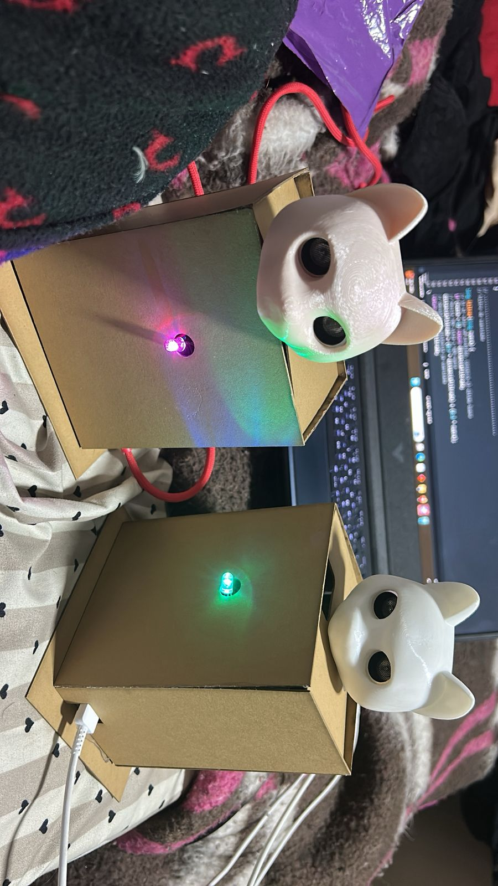
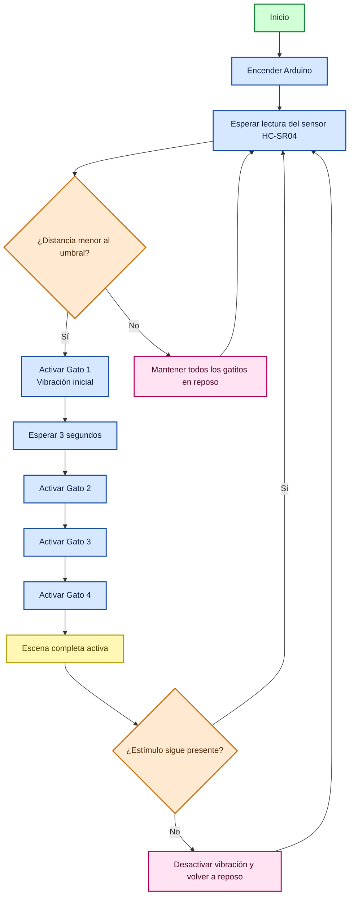
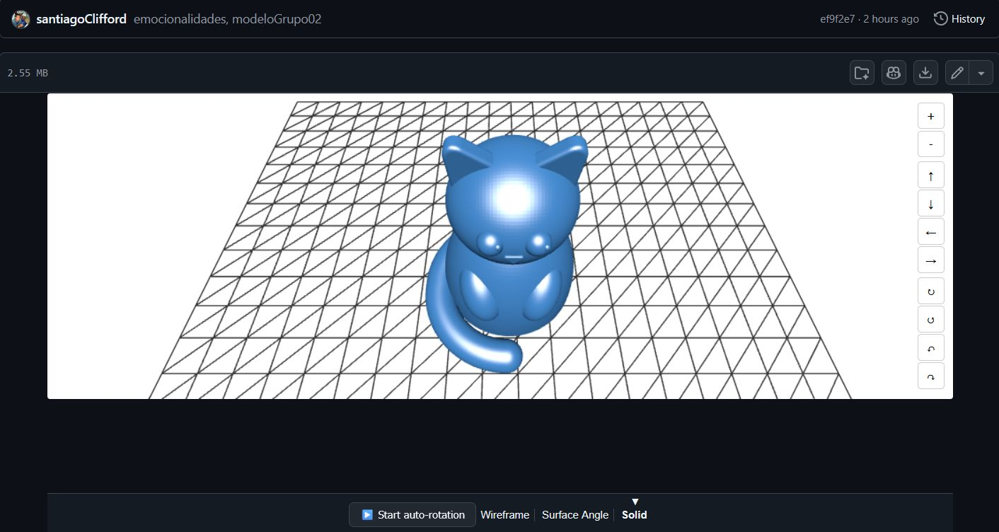
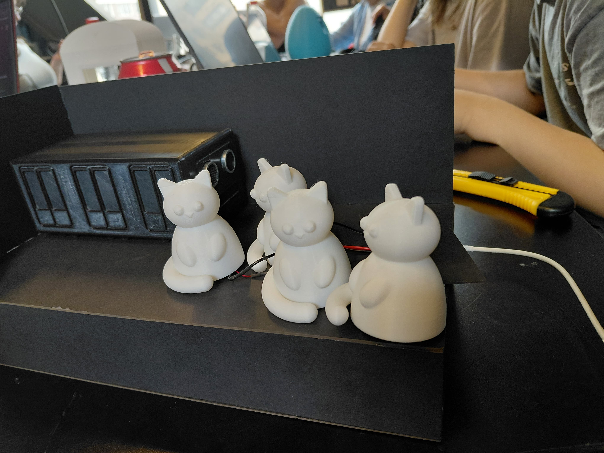
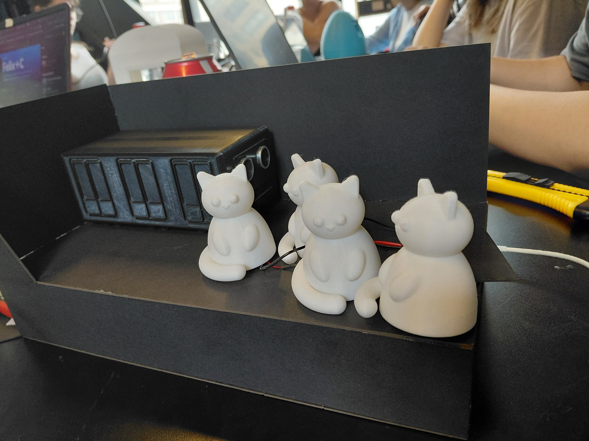
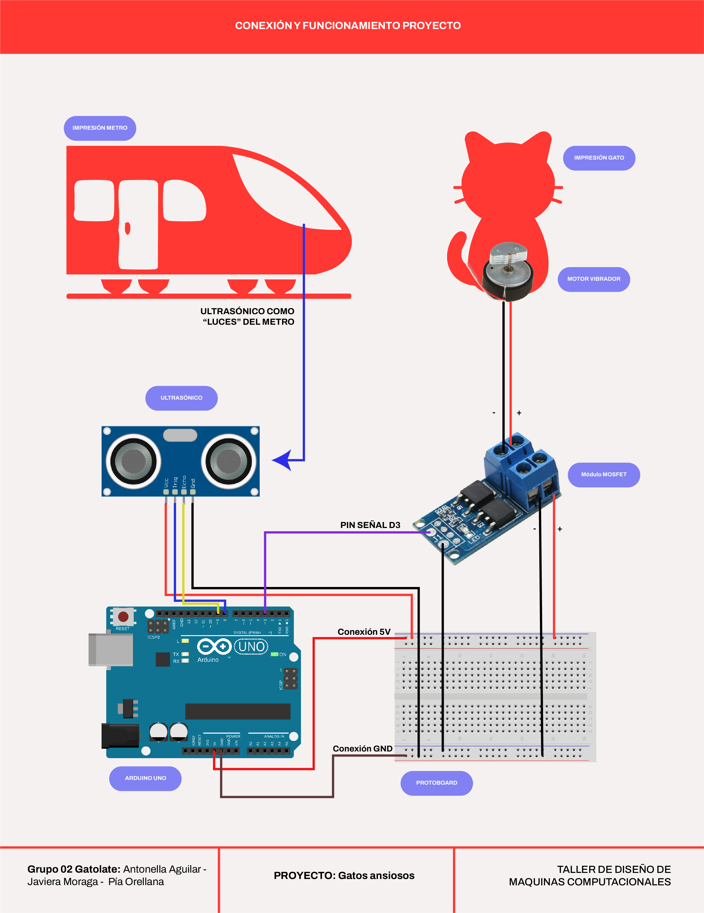
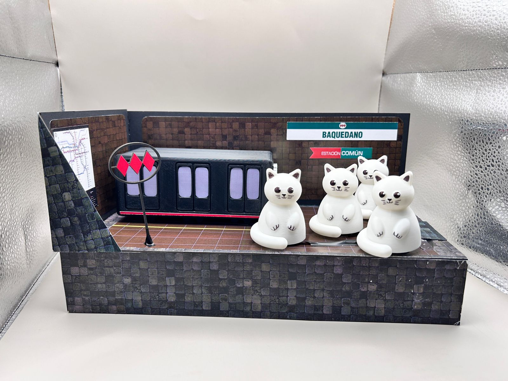
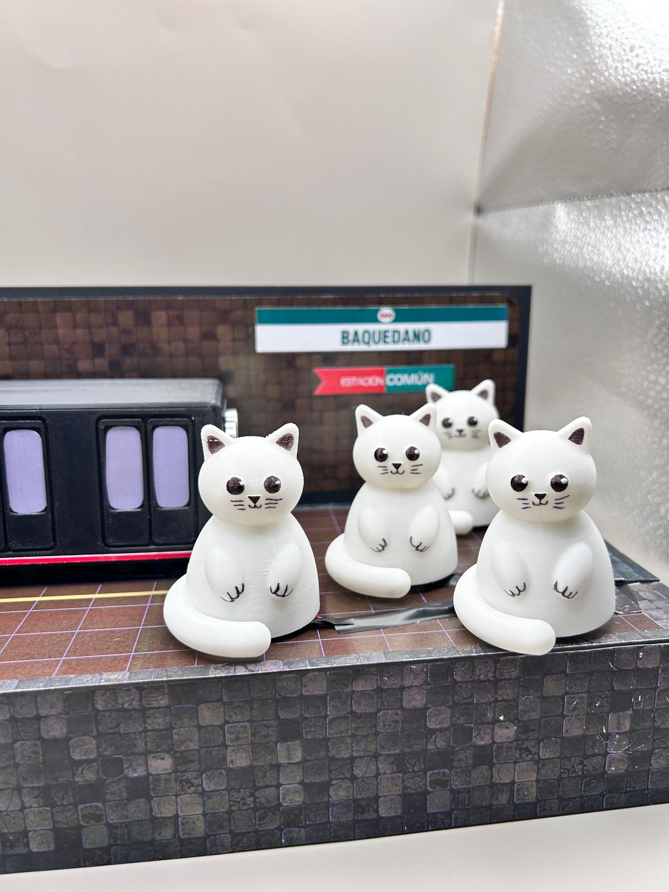

# grupo-02 - Gatolate ₊˚⊹ᰔ

**Integrantes:**  
 - 01-[antokiaraa](https://github.com/antokiaraa/)
 - 16-[javieramoraga-rgb](https://github.com/javieramoraga-rgb/)
 - 18-[ppia97](https://github.com/ppia97/)

## Introducción .☘︎ ݁˖
En este proyecto buscamos explorar cómo una emoción, que normalmente es invisible, puede tomar forma a través de una máquina. Trabajamos con la figura literaria de prosopopeya, por lo que decidimos darle vida a cuatro gatitos que reaccionan como si fueran personas.
La idea es representar cómo la ansiedad aparece frente a un estímulo cotidiano (en este caso, un “metro” que se acerca) y cómo esa sensación puede contagiarse a otros, casi sin darnos cuenta. Cuando el metro entra en escena, el primer gato empieza a vibrar y el LED a parpadear, como si algo dentro de él se activara. Luego los demás lo siguen, mostrando cómo las emociones se transmiten en cadena dentro de un mismo ambiente.
Más que una máquina funcional, lo que construimos es una pequeña metáfora física: un grupo de figuritas que “sienten” y reaccionan, usando vibración y luz para mostrar lo que a veces nos cuesta expresar. Nuestro objetivo es que esta escena nos haga mirar las emociones silenciosas desde otro lugar, entendiendo que incluso lo más cotidiano puede desencadenar reacciones profundas, tanto en nosotros como en quienes nos rodean.

## Significado de figura literaria. ☘︎ ݁˖

### ⤷ Prosopopeya (también llamada personificación): 
> Hablamos de prosopopeya, al atribuir propiedades humanas a un referente que normalmente carece de ellas, como un animal, una planta o un objeto inanimado.

## Significado de emoción. ☘︎ ݁˖

### ⤷ Ansiedad:
> Es un estado de **anticipación y alerta constante**. No siempre ocurre algo, pero el cuerpo actúa como si algo estuviera por pasar. Se manifiesta en forma de tensión, latido rápido, vibración o inquietud permanente. No descansa del todo.
Esta emoción casi nunca se explica hablando; se expresa **con gestos, posturas y reacciones corporales**. Por eso, nuestras máquinas **no hablan, se comportan.**

## INPUT (Entradas del sistema). ☘︎ ݁˖

Las señales o datos que el sistema recibe para funcionar:

- **Distancia del sensor ultrasónico HC-SR04**  
  - Mide la presencia del objeto (metro) frente a la maqueta.  
  - Es el dato principal que activa o desactiva la secuencia emocional de los gatos.

- **Alimentación eléctrica del sistema**
  - Arduino (USB o 5V)
  - Fuente externa de 5V para los motores vibradores y sus MOSFETs.


## OUTPUT (Salidas del sistema). ☘︎ ݁˖

Lo que el sistema produce como resultado:

- **Vibración de los 4 motores (PWM)**
  - Representa la respuesta emocional del conjunto de gatos.
  - La intensidad es fija (PWM 180), pero los gatos se activan por etapas.

- **Secuencia emocional progresiva**
  - 0s → se activa Gato 1  
  - 3s → se activa Gato 2  
  - 6s → se activa Gato 3  
  - 9s → se activa Gato 4  
  - Todos vibran con la misma fuerza.

- **Retorno a la calma**
  - Si el objeto ya no está a ≤ 2 cm, los motores se apagan y el sistema vuelve a reposo.

──── ୨୧ ────

## Planificación y proceso previo 𓏲 ๋࣭ ࣪ ˖🎐

### Primera fase del proyecto — Entrega anterior.
En la primera etapa del proyecto definimos la emoción que iba a representar nuestras máquinas (ansiedad) y exploramos cómo podría expresarse mediante movimientos y luz, además de descartar la idea de dos máquinas distintas con distintas emociones. Probamos distintos componentes, hicimos los primeros prototipos y descubrimos varias limitaciones que nos obligaron a ajustar ideas y cambiar algunos elementos del diseño. Aunque muchas cosas fueron cambiando después, esta fase inicial fue clave para entender la dirección del proyecto y construir las bases de lo que desarrollamos más adelante.



### Fase actual — Toma de decisiones, desarrollo y montaje.
En la fase actual, tomamos decisiones en base al proyecto anterior, como orientar el proyecto a 4 máquinas más pequeñas y simples que compartirán comportamiento en un determinado escenario (decidimos ocupar el metro), además de ya darle un sentido mucho más específico al querer representar una emoción en un entorno cotidiano, que muchos de nosotros vivimos diariamente.

### Planificación.


⋆ 𐙚 ̊. Día 1 — Planificación y Cotización.
Trabajo teórico, sin hardware.
Organización de componentes, links y precios.
Boceto del circuito (explicación y diagrama).
Redacción del resumen del proyecto y objetivos.
Definición estética de la maqueta: referencias del metro, medidas de la base y de los gatos, cotización/encargo de impresión 3D.
Preparación del código base sin motores:
Lectura del sensor HC-SR04
Simulación del “contagio de ansiedad” con delays
Meta del día: dejar todo listo para ejecutar en el siguiente día.

⋆ 𐙚 ̊.  Día 2 — Maqueta 3D, Documentación y Código sin motores
Creación del README inicial: descripción, concepto, metáfora, esquema.
Generación del diagrama inicial del circuito.
Modelado o edición de los STL: gatos y base tipo metro.
Envío de archivos a impresión 3D y definición de colores/materiales.
Codificación de la lógica en cadena (sin motores):
Activación secuencial de gatos según distancia
Ajustes de tiempos y PWM simulado
Meta del día: maqueta en proceso, código avanzado y documentación ordenada.

⋆ 𐙚 ̊. Día 3 — Integración de Motores N20
Cableado completo del circuito real.
Prueba individual de cada MOSFET con su motor.
Etiquetado del cableado (Gato 1, Gato 2, etc.).
Pintura/acabado de piezas impresas y definición de espacios para motores y LEDs.
Integración de motores al código: Ajuste de PWM real, Prueba de la secuencia de vibración
Meta del día: circuito funcional y primeras pruebas físicas.

⋆ 𐙚 ̊. Día 4 — Montaje Final
Montaje de motores dentro de los gatos y asegurado de cableado.
Fijación de MOSFETs en la base.
Ensamblaje visual: paneles del metro, piso, señaléticas.
Pruebas completas con todo integrado:
Sensibilidad del ultrasónico
Tiempos de contagio
Meta del día: maqueta completamente funcional.

⋆ 𐙚 ̊. Día 5 — Documentación Final y Entrega
Redacción final en GitHub:
Introducción
Justificación
Prosopopeya
Materiales
Diagrama final
Otros
Subida de fotos y videos del proyecto.
Formateo del código, comentarios y subida al repositorio.
Meta del día: proyecto listo para entrega.

──── ୨୧ ────

## Diagrama de Flujo



###  ¿Qué representa este diagrama?
- **Los gatitos no se activan todos a la vez**, sino en **cadena**, siguiendo la metáfora emocional.  
- El **primer gatito** reacciona al sensor.  
- Los demás se activan después, como si la ansiedad se **contagiara**.  
- Si el estímulo desaparece, todo el sistema vuelve **gradualmente** a la calma (sin apagarse de golpe).
──── ୨୧ ────

## Bill of Materials (BOM) ๋ ࣭ ⭑

### Componentes Electrónicos ⋆ 𐙚 ̊.

| Elemento | Cantidad | ¿Para qué sirve? |
|---------|----------|------------------|
| **Arduino UNO o Nano** | 1 | Controla los 5 gatos, los motores y el sensor. Uno basta para todo el sistema. |
| **Motores vibradores joystick**| 4 | Permiten el temblor/vibración de cada gato. |
| **Sensor ultrasónico HC-SR04** | 1 | Detecta la cercanía del usuario (disparador de la ansiedad). |
| **Protoboard grande** | 1 | Para armar todo el circuito de manera centralizada. |
| **Cables Dupont (M-M / M-H)** | Muchos | Cableado de motores, LEDs y sensor. |
| **Módulo MOSFET 15A 400W PWM** | 5 | Controla la vibración y potencia de cada motor N20. |

### Maqueta + Montaje ⋆ 𐙚 ̊.
| Elemento | Cantidad | ¿Para qué sirve? |
|---------|----------|------------------|
| **Filamento PLA (1 kg)** | 1 | Impresión 3D de gatos, bases y soportes. |
| **Cartón pluma** | 1 | Construcción del piso y paredes de la maqueta. |
| **Silicona caliente / Pegamento / Cinta** | — | Fijar motores y piezas. |

## 2. Tabla de Costos (Estimados AFEL) ⋆ 𐙚 ̊.
| Ítem | Cantidad | Precio Unitario | Total |
|------|----------|------------------|--------|
| Motor vibrador  joystick | 4 | $0 | $0 |
| Sensor ultrasónico HC-SR04 | 1 | $0 | $0 |
| Protoboard | 1 | $0 | $0 |
| Resistencias 220Ω | 10 | $0 | $0 |
| Cables Dupont | 1 pack | $0 | $0 |
| Cartón pluma / MDF | 1 | $3.000 | $3.000 |
| Módulo MOSFET 15A 400W PWM | 5 | $1.200 | $4.800 |
## Total gastado: $7.800 CLP

>  Este total corresponde únicamente al gasto real del grupo.  
> Muchos componentes fueron aportados por el laboratorio o ya estaban en posesión del equipo.

## Links de compra ๋ ࣭ ⭑

A continuación se incluyen los enlaces de compra mencionados en el proceso.

### Módulo MOSFET 15A / 400W PWM  
https://afel.cl/products/modulo-mosfet-15a-400w-pwm 

### Cables HH
https://afel.cl/products/pack-20-cables-de-conexion-hembra-hembra?_pos=2&_sid=79ff9b6a9&_ss=r 

### Sensores ultrasónicos HC-SR04  
https://afel.cl/products/sensor-de-ultrasonico-hc-sr04 

──── ୨୧ ────

## Gatitos Ansiedad — Comportamiento ≽^- ˕ -^≼
**Cuando el “metro” se acerca**, el primer gatito es el que detecta el estímulo:
- Comienza a vibrar de forma notoria.

**Cuando el primer gatito se activa**, los demás comienzan a contagiarse emocionalmente:
- El segundo gatito vibra poco después.
- El tercero y cuarto siguen la cadena, como si la ansiedad se expandiera.
- Cada uno suma un ligero desfase, imitando cómo una emoción se propaga en un espacio compartido.


**Si el metro está muy cerca o la presencia es intensa**, la escena completa entra en un estado de ansiedad elevada:
- Los cuatro gatitos vibran con mayor intensidad.


**Cuando el estímulo se aleja**, los gatitos entran en un periodo de “desactivación emocional”:
- La vibración disminuye gradualmente.
- No vuelven al reposo inmediatamente, dejando un pequeño “residuo emocional”.


──── ୨୧ ────

## Recomendaciones ‼
Mantén el sensor ultrasónico con vista despejada hacia la maqueta del “metro” para evitar activaciones falsas.
Asegura bien los motores vibradores joystick dentro de cada gatito para que la vibración sea clara y no se suelten.
Evita bloquear o mover los gatitos mientras están vibrando, ya que puede desajustar su comportamiento.
Coloca la maqueta sobre una superficie firme para que la vibración no se disperse.

## Contexto de Uso  ⋆ 𐙚 ̊.
Esta instalación está pensada para mostrarse en un espacio controlado, como una sala de clases, laboratorio o exposición. El público observa cómo el “metro” se acerca a la maqueta y cómo los gatitos reaccionan en cadena con vibración y luz.
El objetivo es que el espectador pueda interpretar la emoción de ansiedad a través del comportamiento de las figuras, entendiendo cómo un estímulo cotidiano puede influir en todos los que comparten un mismo entorno.

──── ୨୧ ────

## Desarrollo del circuito ⊹ ࣪ ˖
###  CIRCUITO COMPLETO

### A) Alimentación General

- Los **motores vibradores joystick y los módulos MOSFET NO se alimentan desde el Arduino**.  
- El Arduino solo **controla**, no alimenta los motores.
- Se utiliza una **fuente externa de 5V** para todos los motores.
- El Arduino se alimenta por **USB**.

####  Requisito crítico: **GND común**
Debes unir todos los GND:

- GND de la fuente externa  
- GND del Arduino  
- GND de cada módulo MOSFET  

> Sin GND común, el circuito **no funcionará**.

---

### B) Conexión del Sensor Ultrasónico HC-SR04

| Pin del Sensor | Conexión |
|----------------|----------|
| **VCC** | 5V del Arduino |
| **GND** | GND común |
| **TRIG** | Pin digital **D8** |
| **ECHO** | Pin digital **D9** |


---

### C) Motores N20 + Módulos MOSFET  
Cada gato utiliza **1 motor vibradores joystick** y **1 módulo MOSFET**.  
Esto permite activar cada motor de forma independiente y en secuencia (efecto “contagio”).

#### Conexión por cada motor:

1. **Alimentación del módulo MOSFET**
   - +V del módulo → 5V de la fuente  
   - GND del módulo → GND común  

2. **Motor**
   - Motor **+** → 5V de la fuente  
   - Motor **–** → **OUT–** del MOSFET  
   *(El MOSFET abre/cierra el camino negativo del motor.)*


3. **Señal de control (PWM)**
   - Pin SIGNAL del MOSFET → Pin PWM del Arduino  
   - GND del MOSFET → GND del Arduino (ya común)

#### Distribución de pines recomendada:

| Gato | MOSFET | Pin PWM del Arduino |
|------|--------|----------------------|
| **Gato 1** | MOSFET 1 | **D3** |
| **Gato 2** | MOSFET 2 | **D5** |
| **Gato 3** | MOSFET 3 | **D6** |
| **Gato 4** | MOSFET 4 | **D10** |


---

### D) Resumen Visual

```java
                    ┌──────────────┐
                    │    ARDUINO   │
                    └──────┬───────┘
             5V ───────────┘
             GND ──────────────── GND común
 Ultrasónico
   TRIG ───── D8
   ECHO ───── D9

 Motores (cada uno igual)
 Fuente 5V → Motor +
 Fuente GND → Módulo GND → Arduino GND

 D3  → MOSFET 1 SIGNAL → Motor1 -
 D5  → MOSFET 2 SIGNAL → Motor2 -
 D6  → MOSFET 3 SIGNAL → Motor3 -
 D10 → MOSFET 4 SIGNAL → Motor4 -

```


### E) ¿Por qué funciona este circuito?

- El **sensor ultrasónico** detecta la distancia del “metro”.
- El **Arduino interpreta esa información** y activa el primer gatito.
- Cada MOSFET controla de forma independiente la vibración de cada motor.
- La secuencia de activación crea el **efecto emocional de contagio**.

### F) Seguridad Mínima 

- **TODOS los GND deben estar unidos.**  
- Usar siempre **fuente externa de 5V** para los motores.  
- Asegurar bien los cables (la vibración puede soltarlos).  
- Añadir un capacitor grande (recomendado **470µF** entre +6–9V y GND) para evitar reinicios inesperados del Arduino.

### Pseudocódigo

```cpp
INICIAR sistema

DECLARAR:
    - Sensor ultrasónico (pines TRIG y ECHO)
    - 4 motores (gato1, gato2, gato3, gato4), controlados por PWM
    - Intensidad fija de vibración = 180
    - Distancia de activación = 20 cm

CONFIGURAR pines del sensor y de los motores como salida/entrada

APAGAR los 4 motores al iniciar el sistema


BUCLE PRINCIPAL (se repite constantemente):

    MEDIR distancia usando el sensor ultrasónico

    SI la distancia es válida Y menor que el umbral (20 cm):
        
        // Algo está cerca → activar ansiedad
        ENCENDER los 4 motores con intensidad 180

    SINO:
        
        // No hay nada cerca → calma total
        APAGAR los 4 motores


ESPERAR un instante corto para estabilizar la lectura (≈60 ms)

REPETIR indefinidamente

```


### carcasa

Para carcasa, tenemos 4 gatitos modelados en 3D impresos en PLA blanco, los cuales dentro llevarán cada uno su motor correspondiente. 





Además, un modelo de metro que también fue impreso y dentro lleva el sensor ultrasónico. Usamos como base el modelo de [https://cults3d.com/es/modelo-3d/artilugios/metro] que fue modificado por nosotras para que pudiera abrirse en dos piezas y llevara los componentes por dentro. 




──── ୨୧ ────


### ¿Cómo se conecta por dentro? ⋆˙⟡



## Prototipo Final 𓏲 ๋࣭ ࣪ ˖🎐




──── ୨୧ ────


### Código explicado

```cpp

// ---------------------------------------------
// Proyecto: Gatitos en Ansiedad
// Versión: Arduino UNO R4 
// Descripción general:
// Este programa controla 4 pequeños motores que representan 
// a gatitos que “sienten ansiedad”. Cuando el sensor ultrasónico 
// detecta que algo (como un metro acercándose) está cerca, 
// los gatitos vibran con una intensidad definida. Si no hay nada 
// cerca, permanecen tranquilos. 
// ---------------------------------------------

// ----------- PINES DE LOS MOTORES ------------
// Cada pin controla un motor mediante PWM 
int gato1 = 3;
int gato2 = 5;
int gato3 = 6;
int gato4 = 10;

// ----------- PINES DEL SENSOR ULTRASÓNICO -----------
// pinTrig envía el pulso
// pinEcho recibe el eco
int pinTrig = 8;
int pinEcho = 9;

// Intensidad de vibración para todos los gatitos
// (valor PWM entre 0 y 255)
int intensidadGato = 180;

// Distancia mínima (en cm) para activar los motores
int distanciaUmbral = 20;

// Variables donde guardamos la duración del eco y la distancia calculada
long duracion;
int distancia;

void setup() {
  Serial.begin(9600);  // Activamos el monitor serial para ver datos en pantalla

  // Configuramos los pines del sensor
  pinMode(pinTrig, OUTPUT);
  pinMode(pinEcho, INPUT);

  // Configuramos los pines de los motores como salida
  pinMode(gato1, OUTPUT);
  pinMode(gato2, OUTPUT);
  pinMode(gato3, OUTPUT);
  pinMode(gato4, OUTPUT);

  // Dejamos todos los motores apagados al iniciar
  analogWrite(gato1, 0);
  analogWrite(gato2, 0);
  analogWrite(gato3, 0);
  analogWrite(gato4, 0);
}

void loop() {

  // --- MEDIR LA DISTANCIA CON EL SENSOR ---
  // Preparamos el pulso inicial
  digitalWrite(pinTrig, LOW);
  delayMicroseconds(1);

  // Disparo del pulso ultrasónico por 10 microsegundos
  digitalWrite(pinTrig, HIGH);
  delayMicroseconds(10);
  digitalWrite(pinTrig, LOW);

  // Medimos cuánto tiempo tarda en regresar el eco
  duracion = pulseIn(pinEcho, HIGH);

  // Convertimos ese tiempo a distancia en centímetros
  distancia = duracion * 0.034 / 1;

  // Mostramos la distancia por el monitor serial
  Serial.print("Distancia: ");
  Serial.println(distancia);

  // --- ACTIVAR O DESACTIVAR MOTORES SEGÚN DISTANCIA ---
  if (distancia > 0 && distancia < distanciaUmbral) {

    // Si algo está cerca del sensor:
    // Encendemos los 4 motores con la intensidad definida
    analogWrite(gato1, intensidadGato);
    analogWrite(gato2, intensidadGato);
    analogWrite(gato3, intensidadGato);
    analogWrite(gato4, intensidadGato);

  } else {
    // Si no hay nada cerca:
    // Apagamos completamente todos los motores
    analogWrite(gato1, 0);
    analogWrite(gato2, 0);
    analogWrite(gato3, 0);
    analogWrite(gato4, 0);
  }

  // Pequeño retardo para estabilizar la lectura
  delay(60);
}

```

──── ୨୧ ────

## Bibliografía 𓏲 ๋࣭ ࣪ ˖🎐

### Referentes Conceptuales

Kuramoto, Y. (1984). *Chemical oscillations, waves, and turbulence*. Springer.
https://es.wikipedia.org/wiki/Modelo_de_Kuramoto 

Damasio, A. (2006). *El error de Descartes: La razón, la emoción y el cerebro humano*. Crítica.  
Artículo de apoyo: Calcedo, A. (2020). *La teoría del marcador somático de Antonio Damasio*. Recuperado de  
https://www.alfredocalcedo.net/post/la-teoria-del-marcador-somatico-de-antonio-damasio

Mitchell, M. (2009). *Complexity: A guided tour*. Oxford University Press.  
Recurso asociado: *Emergent Behavior — ScienceDirect Topics*. Recuperado de  
https://www-sciencedirect-com.translate.goog/topics/computer-science/emergent-behavior?_x_tr_sl=en&_x_tr_tl=es&_x_tr_hl=es&_x_tr_pto=wa


### Documentación Técnica Oficial (Arduino)

Arduino. (s.f.). *analogWrite() — PWM*. Recuperado de  
https://docs.arduino.cc/language-reference/en/functions/analog-io/analogWrite/

Arduino. (s.f.). *pulseIn() — lectura de pulsos*. Recuperado de  
https://docs.arduino.cc/language-reference/en/functions/advanced-io/pulseIn/

Arduino. (s.f.). *pinMode() — configuración de pines*. Recuperado de  
https://docs.arduino.cc/language-reference/en/functions/digital-io/pinMode/


### Sensores

Santos, R., & Santos, S. (2019). *Complete Guide for Ultrasonic Sensor HC-SR04*. Random Nerd Tutorials.  
Recuperado de  
https://randomnerdtutorials.com/complete-guide-for-ultrasonic-sensor-hc-sr04/


### MOSFET y Control de Motores

DroneBot Workshop. (2020). *Using Transistors & MOSFETs with Arduino*. Recuperado de  
https://dronebotworkshop.com/transistors-mosfets/


### Motores Vibradores

DeepBlue Embedded. (2021). *Arduino Vibration Motor Code & Circuit*. Recuperado de  
https://deepbluembedded.com/arduino-vibration-motor-code-circuit/
