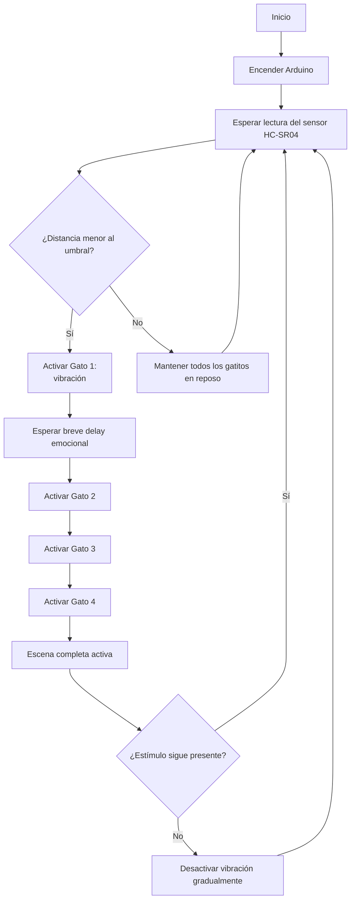

# grupo-02 - Gatolate ₊˚⊹ᰔ

**Integrantes:**  
 - 01-[antokiaraa](https://github.com/antokiaraa/)
 - 16-[javieramoraga-rgb](https://github.com/javieramoraga-rgb/)
 - 18-[ppia97](https://github.com/ppia97/)

## Introducción .☘︎ ݁˖
En este proyecto buscamos explorar cómo una emoción, que normalmente es invisible, puede tomar forma a través de una máquina. Trabajamos con la figura literaria de prosopopeya, por lo que decidimos darle vida a cuatro gatitos que reaccionan como si fueran personas.
La idea es representar cómo la ansiedad aparece frente a un estímulo cotidiano (en este caso, un “metro” que se acerca) y cómo esa sensación puede contagiarse a otros, casi sin darnos cuenta. Cuando el metro entra en escena, el primer gato empieza a vibrar y el LED a parpadear, como si algo dentro de él se activara. Luego los demás lo siguen, mostrando cómo las emociones se transmiten en cadena dentro de un mismo ambiente.
Más que una máquina funcional, lo que construimos es una pequeña metáfora física: un grupo de figuritas que “sienten” y reaccionan, usando vibración y luz para mostrar lo que a veces nos cuesta expresar. Nuestro objetivo es que esta escena nos haga mirar las emociones silenciosas desde otro lugar, entendiendo que incluso lo más cotidiano puede desencadenar reacciones profundas, tanto en nosotros como en quienes nos rodean.

## Significado de figura literaria. ☘︎ ݁˖

### ⤷ Prosopopeya (también llamada personificación): 
> Hablamos de prosopopeya, al atribuir propiedades humanas a un referente que normalmente carece de ellas, como un animal, una planta o un objeto inanimado.

## Significado de emoción. ☘︎ ݁˖

### ⤷ Ansiedad:
> Es un estado de **anticipación y alerta constante**. No siempre ocurre algo, pero el cuerpo actúa como si algo estuviera por pasar. Se manifiesta en forma de tensión, latido rápido, vibración o inquietud permanente. No descansa del todo.
Esta emoción casi nunca se explica hablando; se expresa **con gestos, posturas y reacciones corporales**. Por eso, nuestras máquinas **no hablan, se comportan.**

──── ୨୧ ────

## Planificación y proceso previo 𓏲 ๋࣭ ࣪ ˖🎐

### Primera fase del proyecto — Entrega anterior.
En la primera etapa del proyecto definimos la emoción que iba a representar nuestras máquinas (ansiedad) y exploramos cómo podría expresarse mediante movimientos y luz, además de descartar la idea de dos máquinas distintas con distintas emociones. Probamos distintos componentes, hicimos los primeros prototipos y descubrimos varias limitaciones que nos obligaron a ajustar ideas y cambiar algunos elementos del diseño. Aunque muchas cosas fueron cambiando después, esta fase inicial fue clave para entender la dirección del proyecto y construir las bases de lo que desarrollamos más adelante.
[Fotos primera entrega, gatitos en caja y todo lo referente a eso]

### Fase actual — Toma de decisiones, desarrollo y montaje.
En la fase actual, tomamos decisiones en base al proyecto anterior, como orientar el proyecto a 4 máquinas más pequeñas y simples que compartirán comportamiento en un determinado escenario (decidimos ocupar el metro), además de ya darle un sentido mucho más específico al querer representar una emoción en un entorno cotidiano, que muchos de nosotros vivimos diariamente.

### Planificación.

⋆ 𐙚 ̊. Día 1 — Planificación y Cotización.
Trabajo teórico, sin hardware.
Organización de componentes, links y precios.
Boceto del circuito (explicación y diagrama).
Redacción del resumen del proyecto y objetivos.
Definición estética de la maqueta: referencias del metro, medidas de la base y de los gatos, cotización/encargo de impresión 3D.
Preparación del código base sin motores:
Lectura del sensor HC-SR04
Simulación del “contagio de ansiedad” con delays
Meta del día: dejar todo listo para ejecutar en el siguiente día.

⋆ 𐙚 ̊.  Día 2 — Maqueta 3D, Documentación y Código sin motores
Creación del README inicial: descripción, concepto, metáfora, esquema.
Generación del diagrama inicial del circuito.
Modelado o edición de los STL: gatos y base tipo metro.
Envío de archivos a impresión 3D y definición de colores/materiales.
Codificación de la lógica en cadena (sin motores):
Activación secuencial de gatos según distancia
Ajustes de tiempos y PWM simulado
Meta del día: maqueta en proceso, código avanzado y documentación ordenada.

⋆ 𐙚 ̊. Día 3 — Integración de Motores N20
Cableado completo del circuito real.
Prueba individual de cada MOSFET con su motor.
Etiquetado del cableado (Gato 1, Gato 2, etc.).
Pintura/acabado de piezas impresas y definición de espacios para motores y LEDs.
Integración de motores al código: Ajuste de PWM real, Prueba de la secuencia de vibración
Meta del día: circuito funcional y primeras pruebas físicas.

⋆ 𐙚 ̊. Día 4 — Montaje Final
Montaje de motores dentro de los gatos y asegurado de cableado.
Fijación de MOSFETs en la base.
Ensamblaje visual: paneles del metro, piso, señaléticas.
Pruebas completas con todo integrado:
Sensibilidad del ultrasónico
Tiempos de contagio
Meta del día: maqueta completamente funcional.

⋆ 𐙚 ̊. Día 5 — Documentación Final y Entrega
Redacción final en GitHub:
Introducción
Justificación
Prosopopeya
Materiales
Diagrama final
Otros
Subida de fotos y videos del proyecto.
Formateo del código, comentarios y subida al repositorio.
Meta del día: proyecto listo para entrega.

──── ୨୧ ────

## Diagrama de Flujo



###  ¿Qué representa este diagrama?
- **Los gatitos no se activan todos a la vez**, sino en **cadena**, siguiendo la metáfora emocional.  
- El **primer gatito** reacciona al sensor.  
- Los demás se activan después, como si la ansiedad se **contagiara**.  
- Si el estímulo desaparece, todo el sistema vuelve **gradualmente** a la calma (sin apagarse de golpe).
- 
──── ୨୧ ────

## Bill of Materials (BOM) ๋ ࣭ ⭑

### Componentes Electrónicos ⋆ 𐙚 ̊.

| Elemento | Cantidad | ¿Para qué sirve? |
|---------|----------|------------------|
| **Arduino UNO o Nano** | 1 | Controla los 5 gatos, los motores y el sensor. Uno basta para todo el sistema. |
| **Motores vibradores joystick**| 4 | Permiten el temblor/vibración de cada gato. |
| **Sensor ultrasónico HC-SR04** | 1 | Detecta la cercanía del usuario (disparador de la ansiedad). |
| **Protoboard grande** | 1 | Para armar todo el circuito de manera centralizada. |
| **Cables Dupont (M-M / M-H)** | Muchos | Cableado de motores, LEDs y sensor. |
| **Módulo MOSFET 15A 400W PWM** | 5 | Controla la vibración y potencia de cada motor N20. |

### Maqueta + Montaje ⋆ 𐙚 ̊.
| Elemento | Cantidad | ¿Para qué sirve? |
|---------|----------|------------------|
| **Filamento PLA (1 kg)** | 1 | Impresión 3D de gatos, bases y soportes. |
| **Cartón pluma** | 1 | Construcción del piso y paredes de la maqueta. |
| **Silicona caliente / Pegamento / Cinta** | — | Fijar motores y piezas. |

## 2. Tabla de Costos (Estimados AFEL) ⋆ 𐙚 ̊.
| Ítem | Cantidad | Precio Unitario | Total |
|------|----------|------------------|--------|
| Motor vibrador  joystick | 4 | $0 | $0 |
| Sensor ultrasónico HC-SR04 | 1 | $0 | $0 |
| Protoboard | 1 | $0 | $0 |
| Resistencias 220Ω | 10 | $0 | $0 |
| Cables Dupont | 1 pack | $0 | $0 |
| Cartón pluma / MDF | 1 | $3.000 | $3.000 |
| Módulo MOSFET 15A 400W PWM | 5 | $1.200 | $4.800 |
## Total gastado: $7.800 CLP

>  Este total corresponde únicamente al gasto real del grupo.  
> Muchos componentes fueron aportados por el laboratorio o ya estaban en posesión del equipo.

## Links de compra ๋ ࣭ ⭑

A continuación se incluyen los enlaces de compra mencionados en el proceso.

### Módulo MOSFET 15A / 400W PWM  
https://afel.cl/products/modulo-mosfet-15a-400w-pwm 

### Cables HH
https://afel.cl/products/pack-20-cables-de-conexion-hembra-hembra?_pos=2&_sid=79ff9b6a9&_ss=r 

### Sensores ultrasónicos HC-SR04  
https://afel.cl/products/sensor-de-ultrasonico-hc-sr04 

──── ୨୧ ────

## Gatitos Ansiedad — Comportamiento ≽^- ˕ -^≼
**Cuando el “metro” se acerca**, el primer gatito es el que detecta el estímulo:
- Comienza a vibrar de forma notoria.

**Cuando el primer gatito se activa**, los demás comienzan a contagiarse emocionalmente:
- El segundo gatito vibra poco después.
- El tercero y cuarto siguen la cadena, como si la ansiedad se expandiera.
- Cada uno suma un ligero desfase, imitando cómo una emoción se propaga en un espacio compartido.


**Si el metro está muy cerca o la presencia es intensa**, la escena completa entra en un estado de ansiedad elevada:
- Los cuatro gatitos vibran con mayor intensidad.


**Cuando el estímulo se aleja**, los gatitos entran en un periodo de “desactivación emocional”:
- La vibración disminuye gradualmente.
- No vuelven al reposo inmediatamente, dejando un pequeño “residuo emocional”.


──── ୨୧ ────

## Recomendaciones ‼
Mantén el sensor ultrasónico con vista despejada hacia la maqueta del “metro” para evitar activaciones falsas.
Asegura bien los motores vibradores joystick dentro de cada gatito para que la vibración sea clara y no se suelten.
Evita bloquear o mover los gatitos mientras están vibrando, ya que puede desajustar su comportamiento.
Coloca la maqueta sobre una superficie firme para que la vibración no se disperse.

## Contexto de Uso  ⋆ 𐙚 ̊.
Esta instalación está pensada para mostrarse en un espacio controlado, como una sala de clases, laboratorio o exposición. El público observa cómo el “metro” se acerca a la maqueta y cómo los gatitos reaccionan en cadena con vibración y luz.
El objetivo es que el espectador pueda interpretar la emoción de ansiedad a través del comportamiento de las figuras, entendiendo cómo un estímulo cotidiano puede influir en todos los que comparten un mismo entorno.

──── ୨୧ ────

## Desarrollo del circuito ⊹ ࣪ ˖
###  CIRCUITO COMPLETO
## Circuito Completo 

### A) Alimentación General

- Los **motores vibradores joystick y los módulos MOSFET NO se alimentan desde el Arduino**.  
- El Arduino solo **controla**, no alimenta los motores.
- Se utiliza una **fuente externa de 5V** para todos los motores.
- El Arduino se alimenta por **USB**.

####  Requisito crítico: **GND común**
Debes unir todos los GND:

- GND de la fuente externa  
- GND del Arduino  
- GND de cada módulo MOSFET  

> Sin GND común, el circuito **no funcionará**.

---

### B) Conexión del Sensor Ultrasónico HC-SR04

| Pin del Sensor | Conexión |
|----------------|----------|
| **VCC** | 5V del Arduino |
| **GND** | GND común |
| **TRIG** | Pin digital **D8** |
| **ECHO** | Pin digital **D9** |

[Foto de la conexión de sensor HC]

---

### C) Motores N20 + Módulos MOSFET  
Cada gato utiliza **1 motor vibradores joystick** y **1 módulo MOSFET**.  
Esto permite activar cada motor de forma independiente y en secuencia (efecto “contagio”).

#### Conexión por cada motor:

1. **Alimentación del módulo MOSFET**
   - +V del módulo → 5V de la fuente  
   - GND del módulo → GND común  

2. **Motor**
   - Motor **+** → 5V de la fuente  
   - Motor **–** → **OUT–** del MOSFET  
   *(El MOSFET abre/cierra el camino negativo del motor.)*

[Foto conexión del motor]

3. **Señal de control (PWM)**
   - Pin SIGNAL del MOSFET → Pin PWM del Arduino  
   - GND del MOSFET → GND del Arduino (ya común)

#### Distribución de pines recomendada:

| Gato | MOSFET | Pin PWM del Arduino |
|------|--------|----------------------|
| **Gato 1** | MOSFET 1 | **D3** |
| **Gato 2** | MOSFET 2 | **D5** |
| **Gato 3** | MOSFET 3 | **D6** |
| **Gato 4** | MOSFET 4 | **D10** |


---

### D) Resumen Visual

```java
                    ┌──────────────┐
                    │    ARDUINO   │
                    └──────┬───────┘
             5V ───────────┘
             GND ──────────────── GND común
 Ultrasónico
   TRIG ───── D8
   ECHO ───── D9

 Motores (cada uno igual)
 Fuente 5V → Motor +
 Fuente GND → Módulo GND → Arduino GND

 D3  → MOSFET 1 SIGNAL → Motor1 -
 D5  → MOSFET 2 SIGNAL → Motor2 -
 D6  → MOSFET 3 SIGNAL → Motor3 -
 D10 → MOSFET 4 SIGNAL → Motor4 -

```


### E) ¿Por qué funciona este circuito?

- El **sensor ultrasónico** detecta la distancia del “metro”.
- El **Arduino interpreta esa información** y activa el primer gatito.
- Cada MOSFET controla de forma independiente la vibración de cada motor.
- La secuencia de activación crea el **efecto emocional de contagio**.

### F) Seguridad Mínima 

- **TODOS los GND deben estar unidos.**  
- Usar siempre **fuente externa de 5V** para los motores.  
- Asegurar bien los cables (la vibración puede soltarlos).  
- Añadir un capacitor grande (recomendado **470µF** entre +6–9V y GND) para evitar reinicios inesperados del Arduino.

### Pseudocódigo

```cpp
INICIAR sistema

DEFINIR:
    - Sensor ultrasónico: mide distancia frente al prototipo
    - 4 gatos vibradores, cada uno con salida PWM independiente
    - Intensidad fija de vibración = 180
    - Distancia de activación = 2 cm
    - Tiempo entre sumas de gatos = 3 segundos

APAGAR todos los gatos al iniciar


BUCLE PRINCIPAL (repetir siempre):
    
    LEER distancia desde sensor ultrasónico

    SI distancia es válida Y es menor o igual a 2 cm:
        
        SI todavía no estamos en modo activado:
            Entrar en modo activado
            Registrar tiempo de inicio
            Activar primer gato (Gato 1)
        
        CALCULAR cuánto tiempo ha pasado desde que se activó el primero
        
        SEGÚN el tiempo transcurrido:
            - 0 a 3 segundos     → activar 1 gato
            - 3 a 6 segundos     → activar 2 gatos
            - 6 a 9 segundos     → activar 3 gatos
            - 9 segundos o más   → activar 4 gatos
        
        TODOS los gatos activos vibran con la misma intensidad (180)
    
    SINO (si la distancia es mayor a 2 cm):
        
        Salir del modo activado
        Apagar los 4 gatos al instante
        Reiniciar el contador de gatos activos


REPETIR indefinidamente
```


### carcasa

Para carcasa, tenemos 4 gatitos modelados en 3D impresos en PLA blanco, los cuales dentro llevarán cada uno su motor correspondiente. 

[Fotos modelado gatitos + gatitos finales]

Además, un modelo de metro que también fue impreso y dentro lleva el sensor ultrasónico. Usamos como base el modelo de [https://cults3d.com/es/modelo-3d/artilugios/metro] que fue modificado por nosotras para que pudiera abrirse en dos piezas y llevara los componentes por dentro. 

[fotos modelado metro + metro final]

### Código explicado

```cpp
// ---------------------------------------------
// Proyecto: Gatitos en Ansiedad
// Versión: Arduino UNO R4 
// Descripción:
// Este código controla 4 gatitos que “sienten” ansiedad
// cuando el metro se acerca. Se activa por un sensor
// ultrasónico, vibra con motores controlados por MOSFET
// ---------------------------------------------

// ----------- PINES ---------------
int gato1 = 3;
int gato2 = 5;
int gato3 = 6;
int gato4 = 10;

// --------------------------------------------------------------
//  Pines del sensor ultrasónico HC-SR04 
// --------------------------------------------------------------
int pinTrig = 8;
int pinEcho = 9;

// --------------------------------------------------------------
//  Intensidad de vibración (0 a 255)
// --------------------------------------------------------------
int intensidadGato = 180;

// --------------------------------------------------------------
//  Umbral de distancia para activar la escena
//  Cuando algo está a 2 cm o menos → comienza la cadena
// --------------------------------------------------------------
int distanciaActivacion = 2;

// --------------------------------------------------------------
//  Tiempo entre cada gato sumado (3 segundos = 3000 ms)
// --------------------------------------------------------------
unsigned long tiempoEntreGatos = 3000;

// --------------------------------------------------------------
//  Variables de control de la secuencia
// --------------------------------------------------------------
bool secuenciaActiva = false;
unsigned long momentoInicioSecuencia = 0;
int gatosEncendidos = 0;   // 0→ninguno, 1→gato1, 2→gato2, etc.

// --------------------------------------------------------------
//  Esta función mide la distancia real del sensor ultrasónico
//  Se devuelve en centímetros
// --------------------------------------------------------------
long medirDistancia() {

  // Limpia el TRIG
  digitalWrite(pinTrig, LOW);
  delayMicroseconds(2);

  // Envía un pulso de 10 microsegundos
  digitalWrite(pinTrig, HIGH);
  delayMicroseconds(10);
  digitalWrite(pinTrig, LOW);

  // Lee el pulso de retorno
  long duracion = pulseIn(pinEcho, HIGH, 30000);  
  // 30000 µs = evita lecturas falsas o ruido

  // Si no llega nada válido → distancia imposible (999 cm)
  if (duracion == 0) {
    return 999;
  }

  // Conversión a centímetros
  long distancia = duracion * 0.034 / 2;

  return distancia;
}

// --------------------------------------------------------------
//  Esta función apaga TODOS los gatos al mismo tiempo
// --------------------------------------------------------------
void apagarTodosLosGatos() {
  analogWrite(gato1, 0);
  analogWrite(gato2, 0);
  analogWrite(gato3, 0);
  analogWrite(gato4, 0);
}


// --------------------------------------------------------------
//  CONFIGURACIÓN INICIAL: aquí se deja todo listo antes de arrancar
// --------------------------------------------------------------
void setup() {
  pinMode(gato1, OUTPUT);
  pinMode(gato2, OUTPUT);
  pinMode(gato3, OUTPUT);
  pinMode(gato4, OUTPUT);

  pinMode(pinTrig, OUTPUT);
  pinMode(pinEcho, INPUT);

  apagarTodosLosGatos(); // Seguridad total al iniciar
}


// --------------------------------------------------------------
//  LOOP PRINCIPAL: aquí se ejecuta todo el tiempo la lógica
// --------------------------------------------------------------
void loop() {

  // Leer distancia actual
  long distancia = medirDistancia();

  // ----------- CASO 1: NO HAY ESTÍMULO (distancia mayor a 2 cm) ----------
  if (distancia > distanciaActivacion) {

    // Si la secuencia estaba activa, se detiene todo
    if (secuenciaActiva == true) {
      secuenciaActiva = false;
      gatosEncendidos = 0;
      apagarTodosLosGatos();
    }

    return;  // No seguimos con la secuencia
  }

  // ----------- CASO 2: SE DETECTA ALGO A 2 cm O MENOS -----------
  if (distancia <= distanciaActivacion) {

    // Si la secuencia recién empieza
    if (secuenciaActiva == false) {
      secuenciaActiva = true;
      momentoInicioSecuencia = millis();
      gatosEncendidos = 0;  
    }

    // Tiempo transcurrido desde que se activó el primer gato
    unsigned long tiempoPasado = millis() - momentoInicioSecuencia;

    // Activación en cadena cada 3 segundos
    if (tiempoPasado >= 0 && gatosEncendidos < 1) gatosEncendidos = 1;
    if (tiempoPasado >= tiempoEntreGatos && gatosEncendidos < 2) gatosEncendidos = 2;
    if (tiempoPasado >= tiempoEntreGatos * 2 && gatosEncendidos < 3) gatosEncendidos = 3;
    if (tiempoPasado >= tiempoEntreGatos * 3 && gatosEncendidos < 4) gatosEncendidos = 4;

    // Encender los gatos según el contador
    if (gatosEncendidos >= 1) analogWrite(gato1, intensidadGato);
    if (gatosEncendidos >= 2) analogWrite(gato2, intensidadGato);
    if (gatosEncendidos >= 3) analogWrite(gato3, intensidadGato);
    if (gatosEncendidos >= 4) analogWrite(gato4, intensidadGato);
  }
}

```
