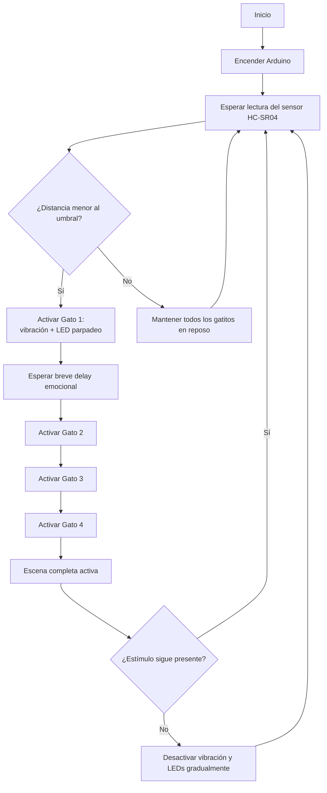

# grupo-02 — Gatolate ₊˚⊹ᰔ

Integrantes: 
 - 01-[antokiaraa](https://github.com/antokiaraa/)
 - 16-[javieramoraga-rgb](https://github.com/javieramoraga-rgb/)
 - 18-[ppia97](https://github.com/ppia97/)

## Introducción .☘︎ ݁˖
En este proyecto buscamos explorar cómo una emoción, que normalmente es invisible, puede **tomar forma a través de una máquina.** Trabajamos con la figura literaria de **prosopopeya**, por lo que decidimos darle vida a cuatro gatitos que reaccionan como si fueran personas.
La idea es representar cómo la ansiedad aparece frente a un estímulo cotidiano (en este caso, un “metro” que se acerca) y cómo esa sensación puede contagiarse a otros, casi sin darnos cuenta. Cuando el metro entra en escena, el primer gato empieza a vibrar, como si algo dentro de él se activara. Luego los demás lo siguen, mostrando cómo las emociones se transmiten en cadena dentro de un mismo ambiente.
Más que una máquina funcional, lo que construimos es una **pequeña metáfora física: un grupo de figuritas que “sienten” y reaccionan, usando vibración para mostrar lo que a veces nos cuesta expresar.** Nuestro objetivo es que esta escena nos haga mirar las **emociones silenciosas** desde otro lugar, entendiendo que incluso lo más cotidiano puede desencadenar reacciones profundas, tanto en nosotros como en quienes nos rodean.

## Significado de figura literaria. ☘︎ ݁˖

### ⤷ Prosopopeya (también llamada personificación): 
> Hablamos de prosopopeya, al **atribuir propiedades humanas** a un referente que normalmente carece de ellas, como un animal, una planta o un objeto inanimado.

## Significado de emoción. ☘︎ ݁˖

### ⤷ Ansiedad:
> Es un estado de **anticipación y alerta constante**. No siempre ocurre algo, pero el cuerpo actúa como si algo estuviera por pasar. Se manifiesta en forma de tensión, latido rápido, vibración o inquietud permanente. No descansa del todo.
Esta emoción casi nunca se explica hablando; se expresa **con gestos, posturas y reacciones corporales**. Por eso, nuestras máquinas **no hablan, se comportan.**

──── ୨୧ ────

## Planificación y proceso previo 𓏲 ๋࣭ ࣪ ˖🎐

### Primera fase del proyecto — Entrega anterior.
En la primera etapa del proyecto definimos la emoción que iba a representar nuestras máquinas (ansiedad) y exploramos cómo podría expresarse mediante movimientos, además de descartar la idea de dos máquinas distintas con distintas emociones. Probamos distintos componentes, hicimos los primeros prototipos y descubrimos varias limitaciones que nos obligaron a ajustar ideas y cambiar algunos elementos del diseño. Aunque muchas cosas fueron cambiando después, esta fase inicial fue clave para entender la dirección del proyecto y construir las bases de lo que desarrollamos más adelante.
[Fotos primera entrega, gatitos en caja y todo lo referente a eso]
### Fase actual — Toma de decisiones, desarrollo y montaje.
En la fase actual, tomamos decisiones en base al proyecto anterior, como orientar el proyecto a 4 máquinas más pequeñas y simples que compartirán comportamiento en un determinado escenario (decidimos ocupar el metro), descartamos el uso de LED, además de ya darle un sentido mucho más específico al querer **representar una emoción en un entorno cotidiano, que muchos de nosotros vivimos diariamente.**
### Planificación.
⋆ 𐙚 ̊. Día 1 — Planificación y Cotización.
- Trabajo teórico, sin hardware.
- Organización de componentes, links y precios.
- Boceto del circuito (explicación y diagrama).
- Redacción del resumen del proyecto y objetivos.
- Definición estética de la maqueta: referencias del metro, medidas de la base y de los gatos, cotización/encargo de impresión 3D.
- Preparación del código base sin motores:
- Lectura del sensor HC-SR04
- Simulación del “contagio de ansiedad” con delays
- Meta del día: dejar todo listo para ejecutar en el siguiente día.

⋆ 𐙚 ̊.  Día 2 — Maqueta 3D, Documentación y Código sin motores

- Creación del README inicial: descripción, concepto, metáfora, esquema.
- Generación del diagrama inicial del circuito.
- Modelado o edición de los STL: gatos y base tipo metro.
- Envío de archivos a impresión 3D y definición de colores/materiales.
- Codificación de la lógica en cadena (sin motores):
- Activación secuencial de gatos según distancia
- Ajustes de tiempos y PWM simulado
- Meta del día: maqueta en proceso, código avanzado y documentación ordenada.

⋆ 𐙚 ̊. Día 3 — Integración de Motores 
- Cableado completo del circuito real.
Prueba individual de cada MOSFET con su motor.
- Etiquetado del cableado (Gato 1, Gato 2, etc.).
- Pintura/acabado de piezas impresas y definición de espacios para motores. 
- Integración de motores al código:
Ajuste de PWM real
- Prueba de la secuencia de vibración
- Meta del día: circuito funcional y primeras pruebas físicas.
⋆ 𐙚 ̊. Día 4 — Montaje Final
- Montaje de motores dentro de los gatos y asegurado de cableado.
- Fijación de MOSFETs en la base.
- Ensamblaje visual: paneles del metro, piso, señaléticas. 
- Pruebas completas con todo integrado:
- Sensibilidad del ultrasónico
- Tiempos de contagio
- Meta del día: maqueta completamente funcional.
⋆ 𐙚 ̊. Día 5 — Documentación Final y Entrega
- Redacción final en GitHub:
- Introducción
- Justificación
- Prosopopeya
- Materiales
- Diagrama final
- Otros
- Subida de fotos y videos del proyecto.
- Formateo del código, comentarios y subida al repositorio.
- Meta del día: proyecto listo para entrega.
──── ୨୧ ────
## Diagrama de Flujo

###  ¿Qué representa este diagrama?
- **Los gatitos no se activan todos a la vez**, sino en **cadena**, siguiendo la metáfora emocional.  
- El **primer gatito** reacciona al sensor.  
- Los demás se activan después, como si la ansiedad se **contagiara**.  
- Si el estímulo desaparece, todo el sistema vuelve **gradualmente** a la calma (sin apagarse de golpe).  
──── ୨୧ ────
## Bill of Materials (BOM) ๋ ࣭ ⭑

### Componentes Electrónicos ⋆ 𐙚 ̊.

| Elemento | Cantidad | ¿Para qué sirve? |
|---------|----------|------------------|
| **Arduino UNO o Nano** | 1 | Controla los 5 gatos, los motores y el sensor. Uno basta para todo el sistema. |
| **Motores vibradores joystick**| 4 | Permiten el temblor/vibración de cada gato. |
| **Sensor ultrasónico HC-SR04** | 1 | Detecta la cercanía del usuario (disparador de la ansiedad). |
| **Protoboard grande** | 1 | Para armar todo el circuito de manera centralizada. |
| **Cables Dupont (M-M / M-H)** | Muchos | Cableado de motores y sensor. |
| **Módulo MOSFET 15A 400W PWM** | 5 | Controla la vibración y potencia de cada motor N20. |

### Maqueta + Montaje ⋆ 𐙚 ̊.
| Elemento | Cantidad | ¿Para qué sirve? |
|---------|----------|------------------|
| **Filamento PLA (1 kg)** | 1 | Impresión 3D de gatos, bases y soportes. |
| **Cartón pluma / MDF delgado** | 1 | Construcción del piso y paredes de la maqueta. |
| **Silicona caliente / Pegamento / Cinta** | — | Fijar motores y piezas. |

## 2. Tabla de Costos (Estimados AFEL) ⋆ 𐙚 ̊.
| Ítem | Cantidad | Precio Unitario | Total |
|------|----------|------------------|--------|
| Motor vibrador  joystick | 4 | $0 | $0 |
| Sensor ultrasónico HC-SR04 | 1 | $0 | $0 |
| Protoboard | 1 | $0 | $0 |
| Resistencias 220Ω | 10 | $0 | $0 |
| LEDs de color | 10 | $0 | $0 |
| Cables Dupont | 1 pack | $0 | $0 |
| Cartón pluma / MDF | 1 | $3.000 | $3.000 |
| Módulo MOSFET 15A 400W PWM | 5 | $1.200 | $4.800 |
## Total gastado: $7.800 CLP
>  Este total corresponde únicamente al gasto real del grupo.  
> Muchos componentes fueron aportados por el laboratorio o ya estaban en posesión del equipo.
> Terminamos descartando el uso de los LEDS.

## Links de compra ๋ ࣭ ⭑

A continuación se incluyen los enlaces de compra mencionados en el proceso.

### Módulo MOSFET 15A / 400W PWM  
https://afel.cl/products/modulo-mosfet-15a-400w-pwm 

### Cables HH
https://afel.cl/products/pack-20-cables-de-conexion-hembra-hembra?_pos=2&_sid=79ff9b6a9&_ss=r 

### Sensores ultrasónicos HC-SR04  
https://afel.cl/products/sensor-de-ultrasonico-hc-sr04 

### LED RGB 5mm  
https://afel.cl/products/diodo-led-rgb-5mm 

> Los motores N20 ya estaban en posesión del grupo, por lo que no los compramos.

──── ୨୧ ────

## Gatitos Ansiedad — Comportamiento ≽^- ˕ -^≼
**Cuando el “metro” se acerca**, el primer gatito es el que detecta el estímulo:
- Comienza a vibrar de forma notoria.
- Su LED empieza a parpadear, mostrando el aumento de tensión.

**Cuando el primer gatito se activa**, los demás comienzan a contagiarse emocionalmente:
- El segundo gatito vibra poco después.
- El tercero y cuarto siguen la cadena, como si la ansiedad se expandiera.
- Cada uno suma un ligero desfase, imitando cómo una emoción se propaga en un espacio compartido.

**Si el metro está muy cerca o la presencia es intensa**, la escena completa entra en un estado de ansiedad elevada:
- Los cuatro gatitos vibran con mayor intensidad.
- Los LEDs mantienen un parpadeo irregular, más rápido.

**Cuando el estímulo se aleja**, los gatitos entran en un periodo de “desactivación emocional”:
- La vibración disminuye gradualmente.
- El LED tarda unos segundos en volver a un parpadeo lento o apagarse.
- No vuelven al reposo inmediatamente, dejando un pequeño “residuo emocional”.
──── ୨୧ ────

## Recomendaciones ‼
- Mantén el sensor ultrasónico con vista despejada hacia la maqueta del “metro” para evitar activaciones falsas.
- Asegura bien los motores vibradores joystick dentro de cada gatito para que la vibración sea clara y no se suelten.
- Evita bloquear o mover los gatitos mientras están vibrando, ya que puede desajustar su comportamiento.
- Coloca la maqueta sobre una superficie firme para que la vibración no se disperse.
## Contexto de Uso  ⋆ 𐙚 ̊.
Esta instalación está pensada para mostrarse en un **espacio controlado**, como una sala de clases, laboratorio o exposición. El público observa cómo el “metro” se acerca a la maqueta y cómo los gatitos reaccionan en cadena con vibración. 
El objetivo es que **"el espectador pueda interpretar la emoción de ansiedad a través del comportamiento de las figuras**, entendiendo cómo un estímulo cotidiano puede influir en todos los que comparten un mismo entorno.
──── ୨୧ ────
## Desarrollo del circuito ⊹ ࣪ ˖
###  CIRCUITO COMPLETO

### A) Alimentación General

- Los **motores vibradores joystick y los módulos MOSFET NO se alimentan desde el Arduino**.  
- El Arduino solo **controla**, no alimenta los motores.
- Se utiliza una **fuente externa de 6–9V** para todos los motores.
- El Arduino se alimenta por **USB**.

####  Requisito crítico: **GND común**
Debes unir todos los GND:

- GND de la fuente externa  
- GND del Arduino  
- GND de cada módulo MOSFET  

> Sin GND común, el circuito **no funcionará**.

---

### B) Conexión del Sensor Ultrasónico HC-SR04

| Pin del Sensor | Conexión |
|----------------|----------|
| **VCC** | 5V del Arduino |
| **GND** | GND común |
| **TRIG** | Pin digital **D8** |
| **ECHO** | Pin digital **D9** |

[Foto de la conexión de sensor HC]

---

### C) Motores N20 + Módulos MOSFET  
Cada gato utiliza **1 motor vibradores joystick** y **1 módulo MOSFET**.  
Esto permite activar cada motor de forma independiente y en secuencia (efecto “contagio”).

#### Conexión por cada motor:

1. **Alimentación del módulo MOSFET**
   - +V del módulo → +6–9V de la fuente  
   - GND del módulo → GND común  

2. **Motor**
   - Motor **+** → +6–9V de la fuente  
   - Motor **–** → **OUT–** del MOSFET  
   *(El MOSFET abre/cierra el camino negativo del motor.)*

[Foto conexión del motor]

3. **Señal de control (PWM)**
   - Pin SIGNAL del MOSFET → Pin PWM del Arduino  
   - GND del MOSFET → GND del Arduino (ya común)

#### Distribución de pines recomendada:

| Gato | MOSFET | Pin PWM del Arduino |
|------|--------|----------------------|
| **Gato 1** | MOSFET 1 | **D3** |
| **Gato 2** | MOSFET 2 | **D5** |
| **Gato 3** | MOSFET 3 | **D6** |
| **Gato 4** | MOSFET 4 | **D10** |
| **Gato 5** | MOSFET 5 | **D11** |

---

### D) Conexión de los LEDs

- Ánodo (pierna larga) → **Pin digital del Arduino**  
- Cátodo (pierna corta) → **Resistencia 220Ω** → GND  

[Foto conexión de los LED]

| LED | Pin Arduino |
|------|-------------|
| **LED Gato 1** | D2 |
| **LED Gato 2** | D4 |
| **LED Gato 3** | D7 |
| **LED Gato 4** | D12 |
| **LED Gato 5** | D13 |

---

### E) Resumen Visual

### F) ¿Por qué funciona este circuito?

- El **sensor ultrasónico** detecta la distancia del “metro”.
- El **Arduino interpreta esa información** y activa el primer gatito.
- Cada MOSFET controla de forma independiente la vibración de cada motor.
- La secuencia de activación crea el **efecto emocional de contagio**.
- Los LEDs refuerzan visualmente el nivel de ansiedad en cada gato.

### G) Seguridad Mínima 

- **TODOS los GND deben estar unidos.**  
- Los motores **jamás** deben alimentarse desde el Arduino.  
- Usar siempre **fuente externa de 6–9V** para los motores.  
- Asegurar bien los cables (la vibración puede soltarlos).  
- Añadir un capacitor grande (recomendado **470µF** entre +6–9V y GND) para evitar reinicios inesperados del Arduino.

### Pseudocódigo
´´´cpp
/* =============================================================
   PROYECTO: "Gatitos en Ansiedad" – Reacción al Metro Cercano
   VERSIÓN: Arduino UNO R4
   DESCRIPCIÓN GENERAL:

   El sistema controla 4 gatitos que vibran cuando un tren del metro
   se acerca. La proximidad es detectada por un sensor ultrasónico.

   Cuando la distancia medida es suficientemente corta,
   los gatitos se activan uno por uno:
        Gato 1 → Gato 2 → Gato 3 → Gato 4

   Si el metro se aleja, los gatitos se calman lentamente.
================================================================ */
// ================================================================================
// DEFINICIÓN DE PINES
// Aquí definimos los pines de cada motor y sensor ultrasónico para que todo quede ordenado.
// Si cambia un cable físico, solo editar estos valores.
// ================================================================================

Definir pin_trig = 8
Definir pin_echo = 9

Definir motor_gato1 = 3
Definir motor_gato2 = 5
Definir motor_gato3 = 6
Definir motor_gato4 = 10

// ================================================================================
//PARÁMETROS Y VARIABLES GENERALES
// ================================================================================

Definir duracion_pulso como entero largo
Definir distancia_cm como entero

Definir umbral_activacion = 20   // distancia donde comienza la ansiedad

// ================================================================================
// Función: medirDistancia()
//Convierte un eco ultrasónico en centímetros reales.
// ================================================================================

función medirDistancia():

    Escribir LOW en pin_trig
    Esperar 2 microsegundos

    Escribir HIGH en pin_trig
    Esperar 10 microsegundos
    Escribir LOW en pin_trig

    Leer duracion_pulso = tiempo HIGH en pin_echo (timeout 25 ms)

    SI duracion_pulso = 0 ENTONCES
        retornar -1   // no se detectó nada
    FIN SI

    distancia = duracion_pulso * 0.034 / 2

    retornar distancia
fin función

// ================================================================================
//Función activarGatoX()
//Cada gato vibra con distinta intensidad emocional.
// ================================================================================

función activarGato1():
    escribir PWM 255 en motor_gato1
fin función

función activarGato2():
    escribir PWM 200 en motor_gato2
fin función

función activarGato3():
    escribir PWM 170 en motor_gato3
fin función

función activarGato4():
    escribir PWM 150 en motor_gato4
fin función

// ================================================================================
//Función desactivarGradual()
//Simula que los gatitos se calman poco a poco.
// ================================================================================
función desactivarGradual():

    para nivel desde 255 hasta 0, restando 15:

        escribir PWM nivel      en motor_gato1
        escribir PWM nivel*0.8  en motor_gato2
        escribir PWM nivel*0.6  en motor_gato3
        escribir PWM nivel*0.5  en motor_gato4

        esperar 40 ms
    fin para

fin función

// ================================================================================
//Función apagarTodosLosGatos()
//Apaga todos los motores al inicio.
// ================================================================================

función apagarTodosLosGatos():
    escribir PWM 0 en motor_gato1
    escribir PWM 0 en motor_gato2
    escribir PWM 0 en motor_gato3
    escribir PWM 0 en motor_gato4
fin función

// ================================================================================
//SETUP - se ejecuta una sola vez
// ================================================================================

función setup():

    Configurar pin_trig como SALIDA
    Configurar pin_echo como ENTRADA

    Configurar motores como SALIDA:
        motor_gato1
        motor_gato2
        motor_gato3
        motor_gato4

    Llamar apagarTodosLosGatos()

    Iniciar monitor serial a 9600

fin función

// ================================================================================
//LOOP PRINCIPAL
//Lógica emocional del sistema: detectar → activar → calmar.
// ================================================================================

función loop():

    distancia_cm = medirDistancia()

    Imprimir "Distancia:" y distancia_cm

    SI distancia_cm > 0 Y distancia_cm ≤ umbral_activacion ENTONCES
        
        activarGato1()
        esperar 300 ms

        activarGato2()
        esperar 300 ms

        activarGato3()
        esperar 300 ms

        activarGato4()

    SINO

        desactivarGradual()

    FIN SI

fin función

´´´

### carcasa

Para carcasa, tenemos 4 gatitos modelados en 3D impresos en PLA blanco, los cuales dentro llevarán cada uno su motor correspondiente. 

[Fotos modelado gatitos + gatitos finales]

Además, un modelo de metro que también fue impreso y dentro lleva el sensor ultrasónico. Usamos como base el modelo de [https://cults3d.com/es/modelo-3d/artilugios/metro] que fue modificado por nosotras para que pudiera abrirse en dos piezas y llevara los componentes por dentro. 

[fotos modelado metro + metro final]

### Código explicado
Pines y variables
´´´cpp
// ---------------------------------------------
// Proyecto: Gatitos en Ansiedad
// Versión: Arduino UNO R4 
// Descripción:
// Este código controla 4 gatitos que “sienten” ansiedad
// cuando el metro se acerca. Se activa por un sensor
// ultrasónico y vibra con motores controlados por MOSFET.
// ---------------------------------------------

// ----------- PINES DEL SENSOR ---------------
int pin_trig = 8;
int pin_echo = 9;

// ----------- PINES DE MOTORES (MOSFET) ------
// Estos pines mandan la señal PWM al MOSFET.
// No alimentan el motor, solo lo controlan.
int motor_gato1 = 3;
int motor_gato2 = 5;
int motor_gato3 = 6;
int motor_gato4 = 10;

// ----------- VARIABLES GENERALES ------------
long duracion_pulso = 0;
int distancia_cm = 0;

// Esta es la distancia límite donde “el metro” ya está encima.
int umbral_activacion = 20; // cm
´´´

En este bloque se declaran todos los pines que usará Arduino:
-Pines del sensor ultrasónico
-Pines de los motores que controlan a los 4 gatitos
-Variables que guardan la duración del pulso y la distancia
-El umbral que define cuándo empieza la “ansiedad”
Este bloque solo prepara nombres para que el resto del código sea más fácil de entender.

setup(): preparación del sistema
´´´cpp
void setup() {

  // Configuramos el sensor ultrasónico
  pinMode(pin_trig, OUTPUT);
  pinMode(pin_echo, INPUT);

  // Motores (control PWM hacia el MOSFET)
  pinMode(motor_gato1, OUTPUT);
  pinMode(motor_gato2, OUTPUT);
  pinMode(motor_gato3, OUTPUT);
  pinMode(motor_gato4, OUTPUT);

  // Dejamos todo apagado al inicio
  apagarTodosLosGatos();

  Serial.begin(9600);
}

´´´
Este bloque prepara todo al encender Arduino:
-Configura pines de sensor y motores
-Inicializa el Serial
-Apaga los motores para que los gatitos comiencen calmados
Es la fase de preparación, se ejecuta solo una vez.

loop(): comportamiento principal
´´´cpp
void loop() {

  distancia_cm = medirDistancia();

  Serial.print("Distancia: ");
  Serial.println(distancia_cm);

  // Si el metro está cerca, comienza la ansiedad
  if (distancia_cm > 0 && distancia_cm <= umbral_activacion) {

    activarGato1();
    delay(300); // pequeña "duda" emocional

    activarGato2();
    delay(300);

    activarGato3();
    delay(300);

    activarGato4();

  } else {
    // Aquí los gatitos se van calmando de a poco
    desactivarGradual();
  }

}

´´´
Aquí ocurre el comportamiento “emocional”:
-Se mide la distancia con el ultrasónico.
-Si el metro está cerca (distancia ≤ umbral):
-Los 4 gatitos se activan uno por uno, con una pausa entre ellos.

-Si el metro no está cerca:
-Se ejecuta una calma progresiva que baja la vibración lentamente.

Este bloque decide si los gatitos entran en ansiedad o relajación.

 Funciones auxiliares
´´´cpp
// ---------------------------------------------------------
// FUNCIONES DEL SENSOR
// ---------------------------------------------------------

int medirDistancia() {

  // Disparo corto para iniciar el sensor
  digitalWrite(pin_trig, LOW);
  delayMicroseconds(2);
  digitalWrite(pin_trig, HIGH);
  delayMicroseconds(10);
  digitalWrite(pin_trig, LOW);

  // Leemos el tiempo del pulso
  duracion_pulso = pulseIn(pin_echo, HIGH, 25000); // timeout 25ms

  // Si no detectó nada, devolvemos -1
  if (duracion_pulso == 0) return -1;

  // Convertimos el tiempo a distancia
  int distancia = duracion_pulso * 0.034 / 2;
  return distancia;
}

// ---------------------------------------------------------
// FUNCIONES DE ACTIVACIÓN DE GATOS
// ---------------------------------------------------------

void activarGato1() {
  // Motor fuerte → gato que detecta el peligro primero
  analogWrite(motor_gato1, 255);  
}

void activarGato2() {
  analogWrite(motor_gato2, 200);  
}

void activarGato3() {
  analogWrite(motor_gato3, 170);
}

void activarGato4() {
  analogWrite(motor_gato4, 150);
}

// ---------------------------------------------------------
// DESACTIVACIÓN LENTA: los gatitos no se calman al tiro
// ---------------------------------------------------------

void desactivarGradual() {

  // Vamos bajando la vibración poquito a poco
  for (int nivel = 255; nivel >= 0; nivel -= 15) {

    analogWrite(motor_gato1, nivel);
    analogWrite(motor_gato2, nivel * 0.8);
    analogWrite(motor_gato3, nivel * 0.6);
    analogWrite(motor_gato4, nivel * 0.5);

    delay(40); // este delay suave da sensación de "calma"
  }
}

// ---------------------------------------------------------
// FUNCIÓN PARA APAGAR TODO AL INICIO
// ---------------------------------------------------------

void apagarTodosLosGatos() {
  analogWrite(motor_gato1, 0);
  analogWrite(motor_gato2, 0);
  analogWrite(motor_gato3, 0);
  analogWrite(motor_gato4, 0);
}

´´´
Este bloque contiene todas las funciones que apoyan al loop:
-medirDistancia(): usa el ultrasónico y devuelve la distancia en cm.
-activarGato1–4(): encienden cada motor con distinta intensidad.
-desactivarGradual(): baja la vibración poco a poco (efecto de “calma”).
-apagarTodosLosGatos(): apaga todos al inicio.
Son funciones que ordenan el código y separan tareas.

###  Código completo

´´´cpp
// ---------------------------------------------
// Proyecto: Gatitos en Ansiedad
// Versión: Arduino UNO R4
// Descripción:
// Este código controla 4 gatitos que “sienten” ansiedad
// cuando el metro se acerca. Se activa por un sensor
// ultrasónico y vibra con motores controlados por MOSFET.
// ---------------------------------------------

// ----------- PINES DEL SENSOR ---------------
int pin_trig = 8;
int pin_echo = 9;

// ----------- PINES DE MOTORES (MOSFET) ------
// Estos pines mandan la señal PWM al MOSFET.
// No alimentan el motor, solo lo controlan.
int motor_gato1 = 3;
int motor_gato2 = 5;
int motor_gato3 = 6;
int motor_gato4 = 10;

// ----------- VARIABLES GENERALES ------------
long duracion_pulso = 0;
int distancia_cm = 0;

// Esta es la distancia límite donde “el metro” ya está encima.
int umbral_activacion = 20; // cm

void setup() {

  // Configuramos el sensor ultrasónico
  pinMode(pin_trig, OUTPUT);
  pinMode(pin_echo, INPUT);

  // Motores (control PWM hacia el MOSFET)
  pinMode(motor_gato1, OUTPUT);
  pinMode(motor_gato2, OUTPUT);
  pinMode(motor_gato3, OUTPUT);
  pinMode(motor_gato4, OUTPUT);

  // Dejamos todo apagado al inicio
  apagarTodosLosGatos();

  Serial.begin(9600);
}

// ---------------------------------------------------------------
// LOOP PRINCIPAL: aquí se decide todo el comportamiento emocional
// ---------------------------------------------------------------

void loop() {

  distancia_cm = medirDistancia();

  Serial.print("Distancia: ");
  Serial.println(distancia_cm);

  // Si el metro está cerca, comienza la ansiedad
  if (distancia_cm > 0 && distancia_cm <= umbral_activacion) {

    activarGato1();
    delay(300); // pequeña "duda" emocional

    activarGato2();
    delay(300);

    activarGato3();
    delay(300);

    activarGato4();

  } else {
    // Aquí los gatitos se van calmando de a poco
    desactivarGradual();
  }

}

// ---------------------------------------------------------
// FUNCIONES DEL SENSOR
// ---------------------------------------------------------

int medirDistancia() {

  // Disparo corto para iniciar el sensor
  digitalWrite(pin_trig, LOW);
  delayMicroseconds(2);
  digitalWrite(pin_trig, HIGH);
  delayMicroseconds(10);
  digitalWrite(pin_trig, LOW);

  // Leemos el tiempo del pulso
  duracion_pulso = pulseIn(pin_echo, HIGH, 25000); // timeout 25ms

  // Si no detectó nada, devolvemos -1
  if (duracion_pulso == 0) return -1;

  // Convertimos el tiempo a distancia
  int distancia = duracion_pulso * 0.034 / 2;
  return distancia;
}

// ---------------------------------------------------------
// FUNCIONES DE ACTIVACIÓN DE GATOS
// ---------------------------------------------------------

void activarGato1() {
  // Motor fuerte → gato que detecta el peligro primero
  analogWrite(motor_gato1, 255);  
}

void activarGato2() {
  analogWrite(motor_gato2, 200);  
}

void activarGato3() {
  analogWrite(motor_gato3, 170);
}

void activarGato4() {
  analogWrite(motor_gato4, 150);
}

// ---------------------------------------------------------
// DESACTIVACIÓN LENTA: los gatitos no se calman al tiro
// ---------------------------------------------------------

void desactivarGradual() {

  // Vamos bajando la vibración poquito a poco
  for (int nivel = 255; nivel >= 0; nivel -= 15) {

    analogWrite(motor_gato1, nivel);
    analogWrite(motor_gato2, nivel * 0.8);
    analogWrite(motor_gato3, nivel * 0.6);
    analogWrite(motor_gato4, nivel * 0.5);

    delay(40); // este delay suave da sensación de "calma"
  }
}

// ---------------------------------------------------------
// FUNCIÓN PARA APAGAR TODO AL INICIO
// ---------------------------------------------------------

void apagarTodosLosGatos() {
  analogWrite(motor_gato1, 0);
  analogWrite(motor_gato2, 0);
  analogWrite(motor_gato3, 0);
  analogWrite(motor_gato4, 0);
}

´´´

