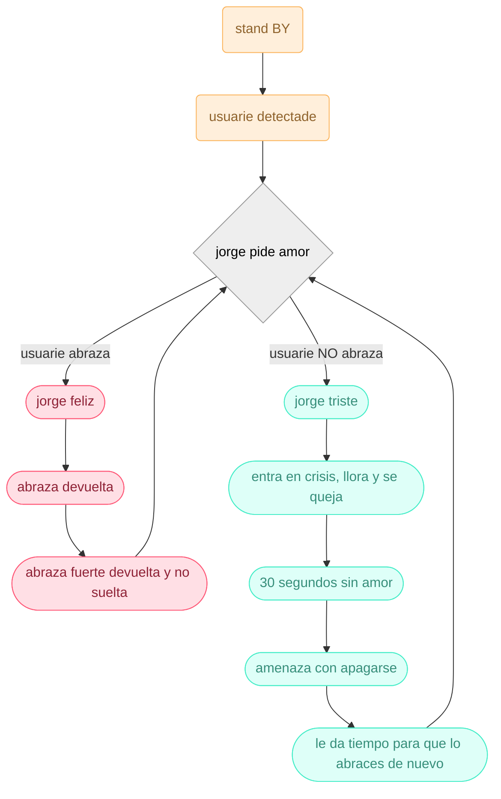

# grupo-03

## GEE: Grupo Emocionalmente Estable - Integrantes

- [Aileen D’Espessailles Rojas](https://github.com/aileendespessailles-design)
- [Santiago Gaete Fernández](https://github.com/santiagoClifford)
- [José Morales Berríos](https://github.com/jotamorales-romulus)
- [Carla Pino Barrios](https://github.com/Coff4)
- [Francisco Stephens González](https://github.com/FranUDP)

### ¿Qué es un abrazo? 
Un abrazo es un gesto simple en apariencia, pero cargado de significado. No solo implica rodear a otra persona con los brazos, sino también ofrecer contención, afecto y una forma de conexión que no necesita palabras. Para este proyecto tomamos el abrazo como punto de partida porque nos permite explorar cómo una acción simple puede convertirse en un significante emocional, capaz de transmitir cercanía, apoyo o incluso protección dependiendo del contexto. Y es justamente desde esa idea de conexión donde aparece Jorge, quien se convierte en la figura central para entender cómo este gesto se transforma cuando pasa del plano humano al objeto. A través de él buscamos observar qué ocurre cuando el abrazo se materializa, se interpreta o incluso se distorsiona dentro de nuestra propuesta.

### los primates - maternidad

los monos son un mamifer

---

### Presentación textual

Jorge es un muñeco con forma de mono, solicita un abrazo y se muestra amable al inicio. Una vez que abraza al usuario, se niega a soltarlo y se aferra fuertemente, haciendo que el mono desarrolle un apego ansioso. Al ser dejado en la mesa, el muñeco comienza a gritar y amenaza con autolesionarse, lo que obliga al usuario a tomarlo de nuevo. Esto genera una sensación de incomodidad al crear un bucle interminable. El concepto expone la dependencia patológica que desarrollan los animales salvajes cuando los humanos los domestican. Toda la situación se habría evitado si el usuario nunca lo hubiese tomado.

El comportamiento de Jorgito mezcla sensaciones opuestas: transmite cariño pero que inevitablemente revela  su rigidez mecánica. Su contacto es un afecto duro, mitad gesto tierno y mitad una presión que resulta incómoda, como si lo acogedor y lo inquietante estuvieran ocurriendo al mismo tiempo. Esa fricción entre lo suave y lo mecánico es lo que define su interacción: un abrazo que consuela y perturba, una compañía que se siente cercana pero artificial.

Mientras más amor recibe, más teme perderlo. En vez de calmarse al ser atendido, su dependencia emocional se profundiza, generando un ciclo en el que la respuesta afectiva del usuario alimenta su ansiedad. Esto culmina en su acción más contradictoria: amenazar con destruirse para salvarse, utilizando la autodestrucción como mecanismo para recuperar la atención perdida. La paradoja revela la fragilidad del vínculo entre humano y máquina, exponiendo cómo un acto destinado a generar cercanía termina creando tensión, presión emocional falsa y un conflicto sin salida.

---

### La Dualidad del Cariño

En lo cotidiano es común que las personas busquen en los animales una fuente constante de afecto. Sin embargo, ese cariño a veces se entrega sin medir límites, generando situaciones donde la necesidad humana de contención termina sobrepasando el bienestar del animal. Nos interesó observar ese punto en el que el cuidado se vuelve exceso, cuando un gesto que nace desde el cariño empieza a transformarse en presión o incomodidad. Esa contradicción querer mucho, pero afectar sin querer se convirtió en el núcleo del proyecto.

A partir de esta problemática vimos la oportunidad de trasladar este fenómeno emocional a un objeto interactivo. El diseño nos permitía hacer visible la tensión entre amor y sobrecarga, y una máquina podía exagerar o evidenciar comportamientos que normalmente pasan desapercibidos. Esto abre un espacio de reflexión sobre nuestras propias formas de entregar afecto.

El abrazo surgió como la metáfora más directa para representar esta dualidad. Es un gesto cálido y seguro, pero también puede volverse agobiante si se prolonga o invade demasiado. Esa ambivalencia nos permitió construir una experiencia que muestre cómo algo pensado para contener puede terminar saturando, y cómo un acto afectivo puede transformarse en sobrecarga.

### Bill of Materials

| Componente            | Cantidad | Valores  | Links                    | Valor                                       ||-----------------------|----------|----------|--------------------------|---------------------------------------------|--------|
| Parlante              | 1        |    3w    |<https://afel.cl/products/mini-parlante-altavoz-de-3w?_pos=1&_sid=2792063ab&_ss=r>|$3.000|
| Servo motor           | 3      |   SG90   |<https://afel.cl/products/micro-servomotor-sg90?_pos=2&_sid=fe0b59026&_ss=r>|$1.900|
| Sensor ultrasónico    | 1        |    5V    |<https://afel.cl/products/sensor-de-ultrasonico-hc-sr04>|$1.500 |
| Módulo MP3            | 1        |3.2 a 5 v |<https://afel.cl/products/modulo-reproductor-mp3-dfplayer-mini?_pos=1&_sid=c29ea442a&_ss=r>|$2.990|
| Sensor de presión     | 1        |  FSR402  |<https://afel.cl/products/sensor-de-fuerza-presion-fsr402?_pos=1&_sid=3e7f88f5f&_ss=r>|$7.500|
| Motor DC              | 1        |    5v    |<https://afel.cl/products/3v-0-2a-12000rpm-65gcm-mini-micro-dc-motor-for>|$500|
| Mosfet                | 1        |  BS170   |<https://a.aliexpress.com/_mt52yRB>|$694|
| Chips L293D           | 1        |4.5V a 7V |<https://afel.cl/products/chips-l293d-driver-motor-puente-h?srsltid=AfmBOopdSCMb-AMaT28x0tp5BXOpQuGbm55ZteJTH9JsrzJ8gspTNZpy>|$1.000|
| Arduino Nano        | 1     | 5v |<https://arduino.cl/arduino-nano/?srsltid=AfmBOorHZo7Nva6AUTWR6cWlQYivHoumROEyDap5uDlN5kRZbERvFyOl>|$3.500|

### Mapa de flujo

### Código

### Bocetos

### Prototipado

Para el prototipo realizamos el prototipado de la columna y los brazos, probando cómo podrían moverse y sostenerse. También hicimos pruebas de impresión 3D para revisar las piezas y sus uniones. Además, armamos un primer prototipo del sistema de la espalda y los brazos para evaluar su funcionamiento general. Finalmente, realizamos el molde para la tela del forro, aplicando cinta sobre la forma para obtener las piezas base del patrón.

 

### Contexto de uso

Esta maquina esta pensada para generar incomodidad en el usuario a traves de estimulos programados para exponer una problematica.

