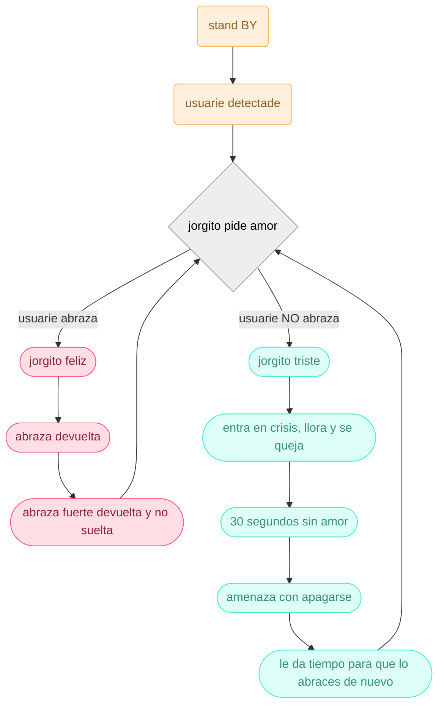
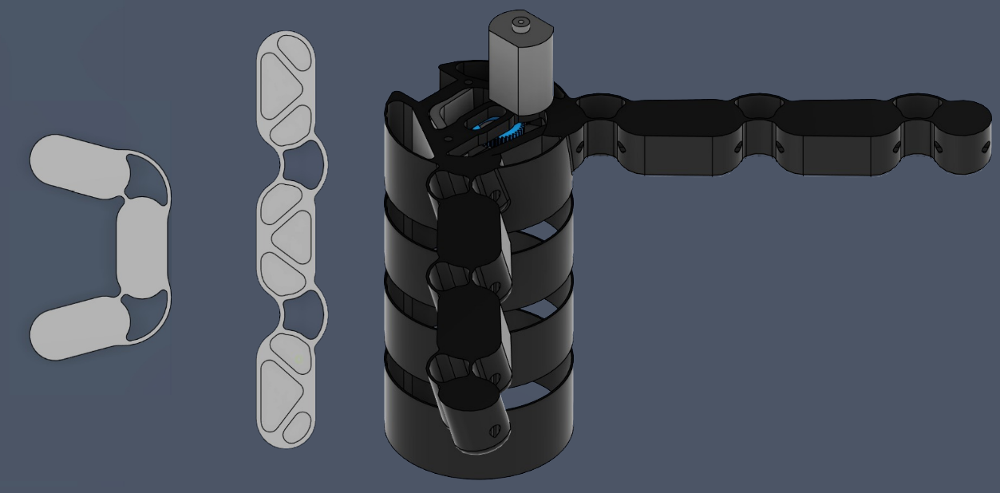
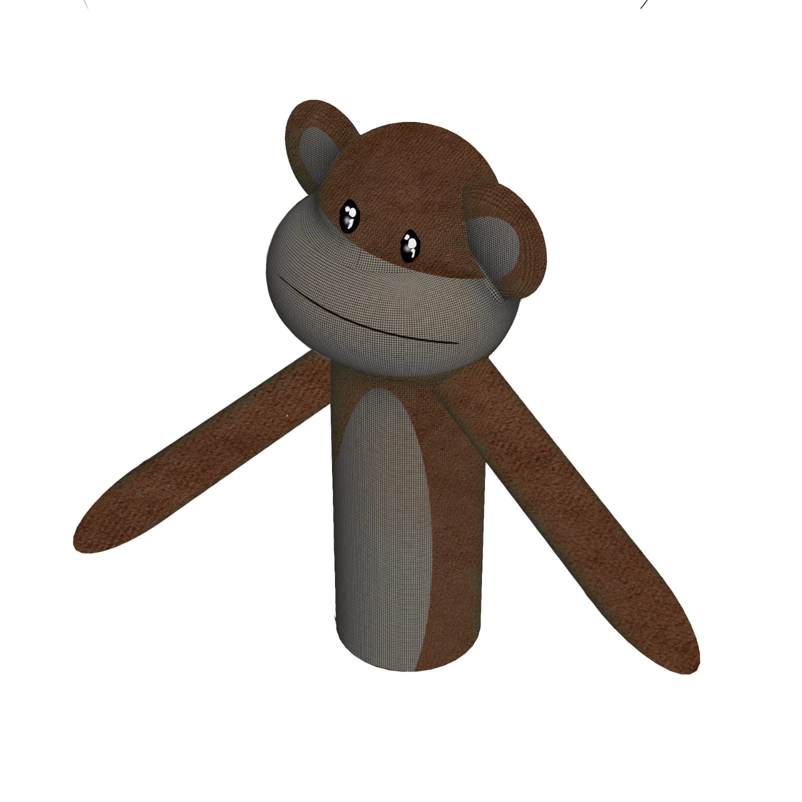
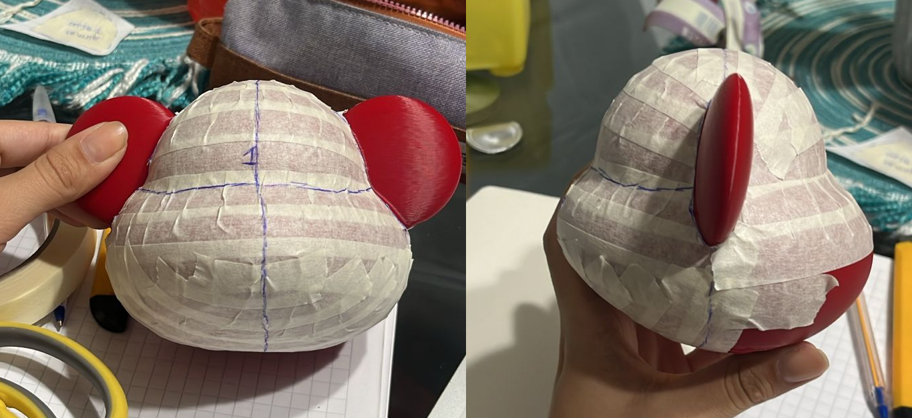
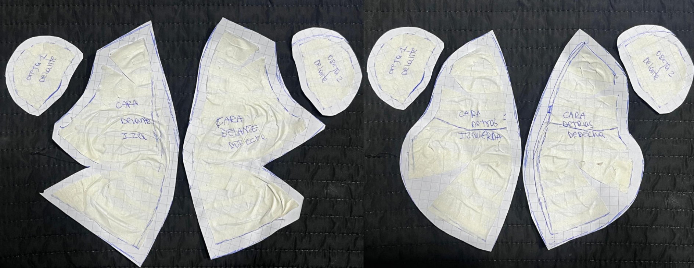
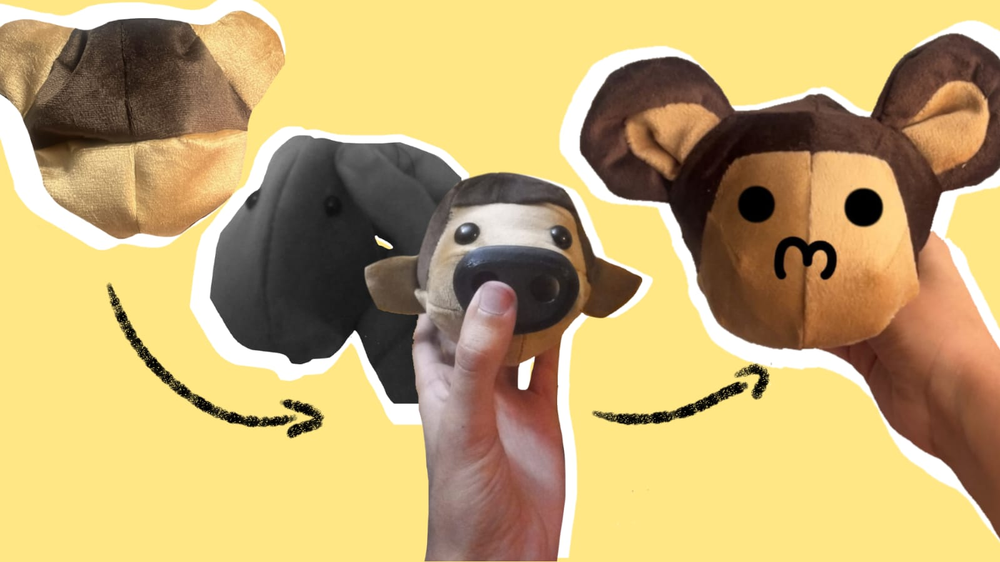

# grupo-03

## GEE: Grupo Emocionalmente Estable - Integrantes

- [Aileen D’Espessailles Rojas](https://github.com/aileendespessailles-design)
- [Santiago Gaete Fernández](https://github.com/santiagoClifford)
- [José Morales Berríos](https://github.com/jotamorales-romulus)
- [Carla Pino Barrios](https://github.com/Coff4)
- [Francisco Stephens González](https://github.com/FranUDP)
  
---

### Presentación textual

Jorgito es un muñeco con forma de mono que pide un abrazo. Al inicio se muestra amistoso, casi tierno. Pero, una vez que el usuario lo toma, se aferra con fuerza y no se suelta. Su abrazo cálido en apariencia, rígido en su estructura, revela un apego ansioso que se intensifica con cada interacción.

Cuando se le deja sobre la mesa, Jorgito llora, suplica y llega a amenazar con hacerse daño, obligando al usuario a retomar el contacto. Se establece un ciclo incómodo del que no es fácil salir. La relación deja de ser afectiva para transformarse en una dependencia emocional opresiva.

Su comportamiento contrapone sensaciones: suavidad y dureza, ternura y angustia, contención y presión. Esa fricción define la experiencia y expone cómo un gesto afectivo puede derivar en un vínculo tenso y desgastante.

---

### ¿Qué es un abrazo? 

Un abrazo parece un gesto simple, pero contiene una carga emocional profunda. No se trata solo de unir dos cuerpos: implica contención, cuidado, comunicación silenciosa y una forma de empatía física.
Tomamos el abrazo como base del proyecto para explorar cómo esta acción cotidiana puede transformarse cuando deja el cuerpo humano y pasa a una entidad no viva.

Desde esta idea surge Jorgito, un muñeco con forma de primate diseñado para abrazar… pero también para exigir ese abrazo. A través de él, indagamos qué ocurre cuando un gesto afectivo se vuelve dependiente, invasivo o contradictorio.

Con este proyecto buscamos evidenciar qué ocurre cuando un gesto afectivo pierde equilibrio y deja de ser voluntario. Nos interesa que el usuario experimente la incomodidad de un cariño que se vuelve exigencia, mostrando cómo un vínculo puede transformarse en dependencia cuando una de las partes no puede regularlo.

--- 

### ¿Por qué Jorgito es un mono? — Primates, maternidad y contacto

La elección de un primate se debe a que su biología emocional se sostiene radicalmente en el contacto físico, especialmente entre madre y cría. En estos animales, el abrazo no es simbólico: es una necesidad vital ligada a la regulación del estrés, la seguridad y la formación del apego.

Cuando ese vínculo se interrumpe, muchos primates desarrollan ansiedad, apego excesivo o dependencia. Esa fragilidad inspiró el comportamiento de Jorgito: un muñeco que vive la separación como abandono y reacciona buscando desesperadamente recuperar el contacto.

También lo diseñamos con una apariencia tierna, para invitar naturalmente al gesto de acariciarlo o abrazarlo. Ese contraste hace que el usuario se acerque sin sospecha y que el vínculo se active a través del contacto de sus propios brazos.

La elección del mono, entonces, no es estética, sino conceptual: permite trasladar al objeto un modo de apego intenso y vulnerable, amplificando la tensión entre cuidado, dependencia y control.

---

### La Dualidad del Cariño

En lo cotidiano solemos buscar en los animales una fuente constante de afecto, pero ese cariño, cuando no tiene límites, puede convertirse en una carga. Esa tensión entre cuidado y agobio guía el proyecto. En Jorgito conviven sensaciones opuestas: su abrazo consuela, pero incomoda; pide cercanía, pero teme perderla. Esa contradicción define la experiencia y vuelve el vínculo inestable. Lo que inicia como un gesto tierno termina mostrando cómo el afecto puede transformarse en dependencia y desgaste emocional.

Pobre monito Jorgito ilustrado

---

### Contexto de uso

Esta máquina está pensada para generar incomodidad en el usuario a través de estímulos programados para exponer una problemática.

---

### Bill of Materials
| Componente          | Cantidad | Valores    | Links                                                                                                                  | Valor   |
|---------------------|----------|------------|-------------------------------------------------------------------------------------------------------------------------|---------|
| Parlante            | 1        | 3w         | <https://afel.cl/products/mini-parlante-altavoz-de-3w?_pos=1&_sid=2792063ab&_ss=r>                                     | $3.000  |
| Servo motor         | 3        | SG90       | <https://afel.cl/products/micro-servomotor-sg90?_pos=2&_sid=fe0b59026&_ss=r>                                           | $1.900  |
| Sensor ultrasónico  | 1        | 5V         | <https://afel.cl/products/sensor-de-ultrasonico-hc-sr04>                                                               | $1.500  |
| Módulo MP3          | 1        | 3.2 a 5V   | <https://afel.cl/products/modulo-reproductor-mp3-dfplayer-mini?_pos=1&_sid=c29ea442a&_ss=r>                           | $2.990  |
| Sensor de presión   | 1        | FSR402     | <https://afel.cl/products/sensor-de-fuerza-presion-fsr402?_pos=1&_sid=3e7f88f5f&_ss=r>                                 | $7.500  |
| Motor DC            | 1        | 5V         | <https://afel.cl/products/3v-0-2a-12000rpm-65gcm-mini-micro-dc-motor-for>                                              | $500    |
| Mosfet              | 1        | BS170      | <https://a.aliexpress.com/_mt52yRB>                                                                                    | $694    |
| Chips L293D         | 1        | 4.5V a 7V  | <https://afel.cl/products/chips-l293d-driver-motor-puente-h?srsltid=AfmBOopdSCMb-AMaT28x0tp5BXOpQuGbm55ZteJTH9JsrzJ8gspTNZpy> | $1.000  |
| Arduino Nano        | 1        | 5V         | <https://arduino.cl/arduino-nano/?srsltid=AfmBOorHZo7Nva6AUTWR6cWlQYivHoumROEyDap5uDlN5kRZbERvFyOl>                    | $3.500  |

--- 

### Mapa de flujo

---

### Inputs y outputs

Inputs:

- Sensor ultrasónico HC-SR04
- Sensor de presión FSR402

Outputs:

- Mini Parlante Altavoz de 3w
- Motor DC Miniatura 3-6V – Alta Velocidad 15000 RPM
- Servo SG90 (3 unidades)
- Módulo MP3 DFPlayer Mini

--- 

### Código

---

### Boceto

---

### Procesos 

Para el prototipo realizamos el prototipado de la columna y los brazos, probando cómo podrían moverse y sostenerse. También hicimos pruebas de impresión 3D para revisar las piezas y sus uniones. Además, armamos un primer prototipo del sistema de la espalda y los brazos para evaluar su funcionamiento general. Finalmente, realizamos el molde para la tela del forro, aplicando cinta sobre la forma para obtener las piezas base del patrón.

 

Recopilación de funcionamiento de vértebras, brazos y columna.

 

Pruebas del funcionamiento de los brazos y vértebras.

Boceto de modelo 3D de Jorgito.

Molde en diferentes vistas del patronaje.

- Para definir la forma de Jorgito, revisamos distintos modelos de peluches disponibles en el mercado, poniendo especial atención en aquellos cuyos brazos invitan naturalmente al abrazo.

Evolución de Jorgito a lo largo del proyecto.

--- 

### Desafíos 

- Para comenzar, nuestro grupo pasó por bastantes ideas y diferentes modelos. Incluso estuvo en discusión sobre qué animal sería.

- La idea inicial de un robot dando un abrazo fue modificada para que fuera más compleja. La idea inicial fue inspirada por un trabajo subido a internet.

- Otro problema era cómo debería ser presentado ante el público, dependiendo de los componentes, sus pesos y la interacción.

- Al no tener los materiales necesarios, tuvimos que idear una segunda opción para la base de Jorgito.

- Tuvimos dificultades para la fabricación de los moldes al ser muy pequeños o no parecidos a un mono.

- Sobre todo, hubo problemas con el código, el traspaso del código a clases y con los componentes.

- La disposición de los componentes y su tamaño nos hizo pensar en diferentes opciones en cómo encajar cada pieza para que quede bien con los movimientos.

- Al momento de soldar, hubo uno que otro problema con el cableado.

### Prototipo Final

### Bibliografía

- Instructables. (2017, 4 octubre). Hugbot - a Soft Robot Who Gives Small Hugs. Instructables. https://www.instructables.com/Hugbot-A-Soft-Robot-Who-Gives-Small-Hugs/
- Psychological Science. (s.f.). Harlow’s classic studies revealed the importance of maternal contact. https://www.psychologicalscience.org/publications/observer/obsonline/harlows-classic-studies-revealed-the-importance-of-maternal-contact.html
---
