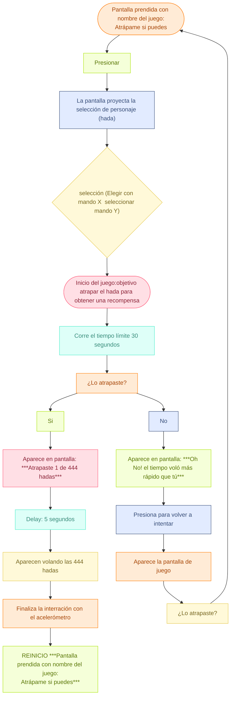

# grupo-04 - Las Ratas Ciegas de Shrek

### `MÁQUINAS LITERARIAS`

INTEGRANTES
- Yamna Carrión / [yamna-bit](https://github.com/yamna-bit)
- Valentina Chávez / [valechavezalb](https://github.com/valechavezalb)
- Antonia Fuentealba / [AntFuentealba](https://github.com/AntFuentealba)
- Millaray Millar / [mmillar95](https://github.com/mmillar95)
- Sofía Pérez / [sofia-perezm](https://github.com/sofia-perezm)
- Valentina Ruz / [vxlentiinaa](https://github.com/vxlentiinaa)

---

## Presentación textual - Máquinas Literarias

<!-- QUÉ -->

`Atrápame si puedes` es un juego interactivo diseñado para frustrar al usuario. El controlador del juego es contraintuitivo, no tiene un manual claro ni lineal, y requiere mucha destreza de parte del usuario para lograr tareas que parecen simples. Esto llega a hacerle dudar si vale la pena seguir intentando ganar. Los personajes del juego consisten en el equipo docente de este curso, funcionando como una parodia de la poca proporcionalidad que existe en la academia entre esfuerzo y resultados.

<!-- PARA QUIÉN / DÓNDE / CUÁNDO -->

Este es un juego para 1 persona a la vez, dura 30 segundos la interacción, y es una instalación tipo tótem. Existen dos tipos de interacción: la del usuario y la del espectador, y la relación entre ambas estructura la experiencia. Aquí aparece la metáfora central del proyecto, inspirada en figuras como el mito de Sísifo y el castigo de Tántalo: el jugador vive un “casi logro” constante, donde cada intento parece acercarlo, pero nunca del todo; mientras que la audiencia observa este esfuerzo repetitivo que roza lo absurdo, generando una mezcla de tensión y humor. Esta doble lectura sostiene el sentido del juego, donde lo frustrante se vuelve cómico cuando es compartido.

<!-- HISTORIA DEL JUEGO -->

El juego consiste en una pantalla con animaciones que muestran el estado actual del sistema, y dos controladores que deben usarse simultáneamente. El objetivo es atrapar hadas, lo que se dificulta por los controles: el jugador descubre progresivamente cómo usar sus manos dentro del juego, y esa torpeza inicial genera una frustración cómica para los espectadores, haciendo que el jugador, en vez de controlar, genere caos. Cuando por fin atrapa un hada, aparece un mensaje de felicitación, pero también un recordatorio frustrante: después de todo el esfuerzo de atrapar una, aún quedan unas 444 hadas por atrapar para lograr un minúsculo bono en la nota de un examen.

<!-- INSTRUCCIONES DE USO -->

El jugador presiona los sensores para controlar una red atrapahadas y capturar a las hadas, que representan a los docentes. Para concretar la captura, debe aplicar la presión adecuada con ambas manos y, al alcanzar el objetivo, mover el mando arriba y abajo con un gesto rápido que activa el acelerómetro. Esta secuencia de acciones contribuye a la sensación de “casi” y esfuerzo repetitivo que estructura toda la experiencia.

<!-- POR QUÉ HICIMOS ESTO  -->

Diseñamos a partir de lo cómico, ver cómo podíamos convertir en parodia situacional de la vida lo que para muchas personas podría ser algo frustrante. Para nosotros es un símbolo de humor, frustración y esfuerzo. El juego muestra cómo pequeños detalles pueden complicar incluso las metas más simples, y aun así seguimos intentando. Y eso no tiene nada de malo: frustrarse, ¿para qué?, si se puede pasar bien incluso en esas situaciones. No queremos confundir al usuario de manera errónea; solo buscamos generar un sentimiento ridículo, no tomarse las cosas tan personales cuando a veces simplemente buscamos pasar el tiempo y ver que no son tan trágicas como parecen. La forma en que entendemos este proyecto se basa en mirar el esfuerzo y el fracaso como algo ligero, exagerado y humorístico, donde la experiencia pertenece totalmente a quien la vive y no pretende ser más que eso un juego que hace visible lo absurdo.

Contexto de uso:

- `Atrápame Si puedes`es un demo, donde las personas deben tomar los mandos y ejercer una presión con los dedos para atrapar el hada. La única manera de terminar el juego, es que no pudiste atrapar el hada en el tiempo establecido y otra manera es hacer la acción de "atrapar" con el mando. Está pensado para espacios de exhibición de juegos experimentales, donde se juega con la tensión y paciencia del usuario

---

## Inputs y Outputs

`Inputs (entradas)`

- Inicio del usuario: Presionar para comenzar
- Selección: Elegir un personaje (hada) con el mando
- Interacción física: Aplicar presión en los sensores
- Movimiento: Activar el acelerómetro moviéndose
- Intento: Acción de atrapar durante el tiempo límite


`Outputs (salidas)`

- Pantalla inicial: Nombre del juego
- Pantalla de selección: Opciones de hadas
- Inicio del juego: Instrucciones y activación del tiempo
- Feedback del resultado:
- Si atrapa: mensaje de éxito
- Si no atrapa: mensaje de derrota

---

## Bill of materials

|Componenetes|Cantidad|Unidad|OBS|Valor|
|---|---|---|---|---|
|Sensor de fuerza|2|FSR402|Conexión a pin A0 / A1|$7.500|
|Sensor Acelerómetro|1|GY-291 ADXL345 - 3 ejes|Conexión SCL a A5 / Conexión SDA a A4|$3.800|
|Arduino Uno|1|R4 minima|Conexión directa a corriente|$24.990|
|Resistencias|2|120 Ohms|Conexión para sensores|estaban en el lab|
|Mini Protoboard|2|85 puntos|Conexión VCC GND directa al arduino|$1.990|
|Pantalla|1|14 pulgadas|Conexión a computador|$139.990|
|Carcasa|3|Filamento:PLA|Impresión 3D|Impresión en el Lab|
|Plinto|1|Filamento:PLA|Impresión 3D|Impresión en el Lab|
|Cables|20 aprox.|macho-macho|-|$1.000|

## Específicaciones de sensores

- Sensor de presión X: funciona para mover el cursor en el eje X
- Sensor de presión Y: funciona para mover el cursor en el eje Y y funciona como botón/click
- Acelerómetro: funciona para darle fin al juego, mediante el eje Y

**Audio**
- Compramos la subscripción para obtener este audio con derechos de autor:
  - The Fairy Dance by Bonnie Grace
  - <https://www.epidemicsound.com/es/music/tracks/9051f76e-fafa-40d7-af4f-f11c3e250371/>


---

## Planificación

Como grupo planificamos que haremos en cada semana del trabajo mediante una carta gantt, vimos el presupuesto de los materiales que necesitabamos (algunos ya estaban, pero decidimos dejarlos) y por último, hicimos un diagrama de flujo del proyecto en [mermaid](https://mermaid.js.org/)

### Carta Gantt


<!-- -->

### Presupuesto


<!-- -->

### Diagrama de Flujo



LINK MERMAID (porque no se ve completo y no sabemos porqué): [MERMAID DIAGRAMA DE FLUJO](https://www.mermaidchart.com/play?utm_source=mermaid_live_editor&utm_medium=toggle#pako:eNqlVMluG0cQ_ZUKDQSyIAK0xE1zcDKcRaJEkVp8sGHm0Jopki3NdI97mrIVwx_jD8hJN18MhD-W6iZnIWMYUAJeWNt79aqq53MjkjE2nEaz2ZyKSIoZnztTAZCwR7nUDsRsrnAqbHiWyI_RgikNbwYmB8Ddez9tXDKhWZIwyBSKmMcMCAeETG8VQowJ3C1xLgnV1Wr1NWMpQs4hW2KM-bTxx0toNl_DwAApzLkUTJF3jT-wMY9iI4KveOQjRppRk5BjglHEV0-CqCBDlRPAHcLegsXsZQnkWSCfgGoFe0GCc65suykTsYS3UACaNjbOdxWMb2ECo3ooOGXV9MnbO9T8QQLTimVUTRHTBPWtGMhbjQIVLAUDhZFMMxQ5M_LXyIFFDgnYk4rmRsWaY5pJSFZ_pVwjHLWot_mSOsrLfkJbdUJVf38fFcy5xt_KjBObcUoZN5yc8CsM6f9YlgmnNuGMnC41ihFRi3LUDuzv77sFKrwyM26321ZXTqES5cyinBOKj3Q6DnT-3ey5zRlVTAIeZGJHnLC8wi0LRrbgggpCLljC_7Qb50KjUmy9QrM6GhWLaGtq9ZSiVpW0oa0f_0TaZAFj-Utt2NTQ6gnS1dcczK1y6u3DEkGvvtXVji3wpHay6yVT9QPteN0j0VSHPLEVl7VWktpB01TtDZXplzb96id7vbIZ7tq4sMY1pV8Hw_HQG06MuP_zLgu15mffz--fIV-wDB1zvfrL5jlU3pizdOMF13Gcm6XIUW8cA3KMeIob0zPx-8eN5ZP1DhP6ttzIWVERkPNa5kVFSKb7Yck25skuwek2wXCL4Gwb63wba_Qj-otdgvE2wWSL4HI3--pHmNdbEBGdfO7jDNaFkNPh3mPzI4_1wnmVfTooPPQg6JOr6E0JKbBwOy_CsOe2Wgcw40lirGDgdw9ow4lUzgv3uN1ptXaZ7h-fT3PUa_s9r6AJDoNBGJY06-AOTSX8-WxB1-u3vUpUeOwfl2w9t9s73BVlFvtfhtc57vUrHj8MOiVPPzg8POru8JjNPZ_H7Qft2pI6xFTp6bhmgzs85jKfz9PuBr5X6vEDmly_tqV-0HMbX_4B_NGFGQ)

---

## `PROPUESTA ELEGIDA`

- Máquina Literaria "Atrápame si puedes"

`PROPUESTA VISUAL`

- Para la gráfica decidimos usar pixel art. Utilizamos la aplicación web [Piskel](https://www.piskelapp.com/)
- Paleta de colores: tonos de celestes, verdes, azules, rosados, etcétera
- Tipografía: pixel-retro
- Máquina física: control retro de la red atrapahadas, hecho con impresión 3D
- Cursor: red atrapa hadas hecho con pixel art
- Hadas: inspiradas en los profes y ayudantes, hechos con pixel art

  

  

 

<!--  --> <!--  -->


<!--  --> <!--  -->
 

<!--  --> <!--  -->
 

|Hada|Volando|Estático|
|---|---|---|
||||
||||
||||
||||

---

## Procesos y bocetos

`Dificultades y desafíos`

1. Teníamos idea una de máquina literaria, donde decidimos como grupo cambiar la propuesta ya que no nos llamaba la atención y no estabamos satisfechas con el  antiguo proyecto. El proyecto consistía en un objeto que responde al contacto directo mediante las manos, dependiendo de la intensidad de fuerza; como respuesta de este tacto, se proyectaba una gráfica distinta.
2. Otras de las dificultades fue conectar p5.js con el arduino. Aquí vimos un tutorial en youtube y utilizamos una librería en específica: [p5.webserial.js](https://github.com/gohai/p5.webserial)
3. Conectar el sensor acelerómetro de 3 ejes, con p5.js. Antes de esto, en Arduino IDE, cuando pasabamos el código de acelerómetro a clases, este ya no leía los valores.
4. Desde p5.js fue dificil agregarle una función al sensor Y, ya sea como botón y para desplazamiento.
5. Decisión de las impresiones en 3d, la dificultad de ver como ibamos a tapar el navegador de chrome y el mando para los sensores Y.

|Proceso|Proceso|Proceso|
|---|---|---|
||||
||||
||||
|||

LINK DE VIDEOS DE PROCESO EN YOUTUBE: <https://youtube.com/playlist?list=PL3fzND9R5FHDLYDBtv4JIqarJQSRjgctv&si=1Aa0JSF82YntMdhg>

### Proceso y diseño de carcasa 

- Comenzamos diseñando un mando tipo retro pixel, que contuviera dos botones para los sensores y además unos botones falsos, para confundir al usuario. Esta idea nos gustaba, pero decidimos cambiarla a diseñar un mando con forma de hada, pero nos preguntamos "¿Para qué atrapar el hada, si ya tenemos el hada en nuestras manos?". Así que también fue descartada
- Por último, decidimos diseñar la red atrapahadas como mando, para que tuviera más lógica de "Atrapar el hada"

  

  

 

---

## Código y pseudocódigo

`PSEUDOCÓDIGO`

Comenzamos realizando un pseudocódigo para crear un puente entre la idea y el código real.

```cpp
INICIAR variables:
    estado = "espera"
    puntaje = 0
    objetivo = posición_inicial

MIENTRAS el sistema esté encendido:

    lee presión y los ejes x, y, z de los mandos en interacción

    SI estado == "espera" Y el usuario se acerca:
        mostrar_mensaje("atrapame si puedes")
        estado = "invitación"

    SI estado == "invitación" Y el usuario toma los mandos:
        calibrar_controles()
        estado = "jugando"

    SI estado == "jugando":
        mover_cursor_según_Fuerza()
        mover_para_atrapar_mover_rapidamente()

    SI el jugador atrapa el objetivo:
            SI aparece un mensaje de supuesto logro porque aún falta 443 más:
              Opciones: salir o reintentar()

    Si se acabo el tiempo se perdió
                Mostrar mensaje de juego perdido()
                Esperar inactividad por 10 seg.()
                Vuelve a la pantalla principal
```

- Luego hicimos el código real en Arduino IDE, donde separamos el archivo principal (.ino) en clases (.cpp / .h)

`ARCHIVO PRINCIPAL`

**grupo-04-2025-AtrapameSiPuedes-Demo.ino**

```cpp
// incluir 1 clase para recibir datos de sensores
// incluir 1 clase para emitir datos segun eso

#include "SensorFuerza.h" // incluye las clases SensorFuerza y acelerometro
#include "Acelerometro.h"

SensorFuerza ejeX;
SensorFuerza ejeY;
Acelerometro acelerometro;

void setup() {
  Serial.begin(9600);
  ejeX.configurar(A0);   // se asigna un sensor al pinA0
  ejeY.configurar(A1);   // se asigna un sensor al pinA1

  acelerometro.iniciar();
}

void loop() {   // se actualiza el valor del sensor del eje X y del eje Y
  ejeX.leer();
  ejeY.leer();

  acelerometro.actualizar(); // se actualiza el acelerometro

  float valorYacel = acelerometro.getY();

  Serial.print(ejeX.valorCrudo);  // manda al serial monitor el valor crudo del sensor X
  Serial.print(", ");
  Serial.print(ejeY.valorCrudo);  // manda al serial monitor el valor crudo del sensor Y
  Serial.print(", ");
  Serial.println(valorYacel);  // manda al serial monitor el valor del eje Y

  Serial.print("valorX");
  Serial.print(", ");
  Serial.print("valorY");
  Serial.print(", ");
  Serial.println("valorYacel");

  delay(40);
  // enviar valores a p5
  // enviar valor ejeX.valorCrudo
  // luego enviar ejeY.valorCrudo
  // Serial.write(ejeX.valorCrudo, ejeY.valorCrudo);
}
```

`.CPP ACEL`

**Acelerometro.cpp**

```cpp
#include "Acelerometro.h"

// constructor de variables acel
Acelerometro::Acelerometro()
: accel(Adafruit_ADXL345_Unified(12345)),
  xRaw(0), yRaw(0), zRaw(0),
  xAbs(0), yAbs(0), zAbs(0),
  totalMovement(0)
{}

Acelerometro::~Acelerometro() {}

// imprime informacion tecnica del sensor
void Acelerometro::displaySensorDetails() {
  sensor_t sensor;
  accel.getSensor(&sensor);
  Serial.println("------------------------------------");
  Serial.print  ("Sensor:       "); Serial.println(sensor.name);
  Serial.print  ("Driver Ver:   "); Serial.println(sensor.version);
  Serial.print  ("Unique ID:    "); Serial.println(sensor.sensor_id);
  Serial.print  ("Max Value:    "); Serial.print(sensor.max_value); Serial.println(" m/s^2");
  Serial.print  ("Min Value:    "); Serial.print(sensor.min_value); Serial.println(" m/s^2");
  Serial.print  ("Resolution:   "); Serial.print(sensor.resolution); Serial.println(" m/s^2");
  Serial.println("------------------------------------");
  Serial.println("");
  delay(50);
}

// muestra la frecuencia de lectura que esta usando ADXL345
void Acelerometro::displayDataRate() {
  Serial.print("Data Rate: ");
  switch (accel.getDataRate()) {
    case ADXL345_DATARATE_3200_HZ: Serial.print("3200 "); break;
    case ADXL345_DATARATE_1600_HZ: Serial.print("1600 "); break;
    case ADXL345_DATARATE_800_HZ:  Serial.print("800 ");  break;
    case ADXL345_DATARATE_400_HZ:  Serial.print("400 ");  break;
    case ADXL345_DATARATE_200_HZ:  Serial.print("200 ");  break;
    case ADXL345_DATARATE_100_HZ:  Serial.print("100 ");  break;
    case ADXL345_DATARATE_50_HZ:   Serial.print("50 ");   break;
    case ADXL345_DATARATE_25_HZ:   Serial.print("25 ");   break;
    case ADXL345_DATARATE_12_5_HZ: Serial.print("12.5 "); break;
    case ADXL345_DATARATE_6_25HZ:  Serial.print("6.25 "); break;
    case ADXL345_DATARATE_3_13_HZ: Serial.print("3.13 "); break;
    case ADXL345_DATARATE_1_56_HZ: Serial.print("1.56 "); break;
    case ADXL345_DATARATE_0_78_HZ: Serial.print("0.78 "); break;
    case ADXL345_DATARATE_0_39_HZ: Serial.print("0.39 "); break;
    case ADXL345_DATARATE_0_20_HZ: Serial.print("0.20 "); break;
    case ADXL345_DATARATE_0_10_HZ: Serial.print("0.10 "); break;
    default: Serial.print("???? "); break;
  }
  Serial.println(" Hz");
}

// muestra el rango configurado del sensor
void Acelerometro::displayRange() {
  Serial.print("Range: +/- ");
  switch (accel.getRange()) {
    case ADXL345_RANGE_16_G: Serial.print("16 "); break;
    case ADXL345_RANGE_8_G:  Serial.print("8 ");  break;
    case ADXL345_RANGE_4_G:  Serial.print("4 ");  break;
    case ADXL345_RANGE_2_G:  Serial.print("2 ");  break;
    default: Serial.print("?? "); break;
  }
  Serial.println(" g");
}

// verifica que el ADXL345 este conectado
void Acelerometro::iniciar() {
  Serial.println("Accelerometer Test\n");

  if (!accel.begin()) {
    Serial.println("Ooops, no ADXL345 detected ... Check your wiring!");
    while (1);
  }

  accel.setRange(ADXL345_RANGE_16_G);

  displaySensorDetails();
}

// lee los valores x,y,z
void Acelerometro::actualizar() {
  sensors_event_t event;
  accel.getEvent(&event);

// guarda dichos valores
  xRaw = event.acceleration.x;
  yRaw = event.acceleration.y;
  zRaw = event.acceleration.z;

// calcula los valores absolutos
  xAbs = abs(xRaw);
  yAbs = abs(yRaw);
  zAbs = abs(zRaw);

// los suma en un totalMovement
  totalMovement = xAbs + yAbs + zAbs;
}

float Acelerometro::getX() { return xAbs; }
float Acelerometro::getY() { return yAbs; } // valor que quiero que imprima
float Acelerometro::getZ() { return zAbs; }
float Acelerometro::getTotal() { return totalMovement; }
```

`.H ACEL`

**Acelerometro.h**

```cpp
#ifndef ACELEROMETRO_H
#define ACELEROMETRO_H

#include <Arduino.h>
#include <Wire.h>
#include <Adafruit_Sensor.h>
#include <Adafruit_ADXL345_U.h>

class Acelerometro {
public:
  Acelerometro();  // constructir
  ~Acelerometro(); // destructor

  void iniciar();       // equivalente a setup del acelerómetro
  void actualizar();    // equivalente al loop del acelerómetro

// lee los datos del sensor y luego actualiza
  float getX();
  float getY();
  float getZ();
  float getTotal();   // suma de los 3 ejes

private:
  void displaySensorDetails(); // imprime información técnica del sensor
  void displayDataRate();      // imprime la frecuencia del sensor
  void displayRange();         // muestra el rango en G configurado

  Adafruit_ADXL345_Unified accel;

// datos crudos del sensor
  float xRaw, yRaw, zRaw;
  float xAbs, yAbs, zAbs;
  float totalMovement;
};

#endif
```

`.CPP SENSOR`

**SensorFuerza.cpp**

```cpp
#include "SensorFuerza.h"
// incluye el .h de SensorFuerza

SensorFuerza::SensorFuerza() {} //constructor

SensorFuerza::~SensorFuerza() {} // destructor

void SensorFuerza::configurar(int nuevaPatita) { // aqui se configura el sensor
  SensorFuerza::patita = nuevaPatita;
  pinMode(SensorFuerza::patita, INPUT);  // pin donde se encuentra el sensor
}

void SensorFuerza::leer() {   // funcion para leer el sensor
  SensorFuerza::valorCrudo = analogRead(SensorFuerza::patita);  // guarda el valor de la presion del sensor
                                                                // y cada vez que se llama .leer, se actualiza el valor
}
```

`.H SENSOR`

**SensorFuerza.h**

```cpp
#ifndef SENSOR_FUERZA_H // si no esta Sensor fuerza definido
#define SENSOR_FUERZA_H // aqui lo definimos 

#include <Arduino.h>  // incluimos las funciones basicas de arduino

class SensorFuerza {     // definimos la clase sensor fuerza
public:
  SensorFuerza();  // constructor
  ~SensorFuerza(); // destructor

  void configurar(int nuevaPatita); // guarda en que pin se encuentra el sensor
  void leer();  // declara la funcion para leer el sensor

  int patita;       // guarda el numero del pin (A0,A1)
  int valorCrudo;   // guarda el numero del sensor, entre 0 a 1023 (segun presion)
  int valorMapeado; 
};

#endif
```

- Luego de tener listo este código en Arduino, comenzamos a realizar el código en p5.js

```cpp
//este sketch fue hecho con ayuda de la librería de Gohai
//se encuentra en el siguiente link //https://github.com/gohai/p5.webserial/blob/main/libraries/p5.webserial.js
//conexión de datos de arduino hacia p5 utilizando un sensor de fuerza y un acelerómetro
//este sensor de fuerza lee parámetros como izquierda-derecha, arriba-abajo
//proyecto de juego realizado para el taller de diseño de maquinas computacionales de la UDP
//proyecto examen taller vertical noviembre-diciembre 2025
//por el grupo "Las Ratas Ciegas de Shrek" compuesto por Yamna Carrión, Valentina Chávez, Antonia Fuentealba, Valentina Ruz y Sofía Pérez

// ---------------------------------------
// VARIABLES GLOBALES
// ---------------------------------------
// ---------------------------------------
// VARIABLES GLOBALES
// ---------------------------------------

const BAUDRATE = 9600;
let port = null;
let connectBtn;

// Sensores
let sensorX = 0;
let sensorY = 0;
let acelY = 0;

// Click fuerte calibrado
// fuerte = 1013–1014
const UMBRAL_CLICK = 850;     
let prevFSRPressed = false;

// Atrapado por acelerómetro
const UMBRAL_ATRAPAR = 8;

// Estados del juego
// inicio → seleccion → juego → final → ganador
let estado = "inicio";        
let personajeSeleccionado = null;
let juegoIniciado = false;

// Timer
let tiempoRestante = 15;
let timerInicio = 0;
let juegoConTimer = false;

// Control general
let permitirClickInicio = false;
let sensorActivo = false;

// Imágenes y GIFs
let atrapaPNG, inicio2PNG, fondoBG, fondoSeleccionGIF, fondoFinal, fondoGanador;
let persSelectGIF = [];
let persGameGIF   = [];

// Movimiento del hada
let charX = 0, charY = 0;
let charVX = 4, charVY = 3;

// Otros
let hoverAnim = 0;
let alphaBlink = 0;
let fontDoto;

let nombresPersonajes = ["Matías", "Aarón", "Janis", "Mateo"];

// Cursor inicial
let cursorInicioSet = false;
let cursorX_manual = null;
let cursorY_manual = null;

let musicaFondo;
let musicaIniciada = false;

// ---------------------------------------
// PRELOAD
// ---------------------------------------
function preload() {
  atrapaPNG = loadImage("atrapar.png");
  inicio2PNG = loadImage("atrapameInicio.gif");
  fondoBG = loadImage("fondo.gif");
  fondoSeleccionGIF = loadImage("fondoSeleccion.gif");
  fondoFinal = loadImage("fondoFinal.gif");
  fondoGanador = loadImage("ganaste.gif");
  fontDoto = loadFont("Doto-Black.ttf");
  musicaFondo = loadSound ("musicaJuego.mp3");
}

// ---------------------------------------
// SETUP
// ---------------------------------------
function setup() {
  createCanvas(1920, 1080);

  // GIFS selección
  let sel = ["pers1_sel.gif","pers2_sel.gif","pers3_sel.gif","pers4_sel.gif"];
  for (let i = 0; i < 4; i++) {
    persSelectGIF[i] = createImg(sel[i]);
    persSelectGIF[i].size(333, 333);
    persSelectGIF[i].style("pointer-events","none");
    persSelectGIF[i].hide();
  }

  // GIFS juego
  let game = ["pers1_game.gif","pers2_game.gif","pers3_game.gif","pers4_game.gif"];
  for (let i = 0; i < 4; i++) {
    persGameGIF[i] = createImg(game[i]);
    persGameGIF[i].size(350, 350);
    persGameGIF[i].style("pointer-events","none");
    persGameGIF[i].hide();
  }

  if (typeof createSerial === "function") {
    port = createSerial();
    port.bufferSize(1024);
  }

  // Botón conectar
  connectBtn = createButton("Conectar");
  connectBtn.addClass("connect-btn");
  connectBtn.position(20,20);
  connectBtn.mousePressed(connectBtnClick);
}

// ---------------------------------------
// LOOP PRINCIPAL
// ---------------------------------------
function draw() {
  
  console.log(estado);
  
  
  imageMode(CORNER);
  if (estado === "inicio")  {
    image(inicio2PNG,0,0,width,height);
  }   
  else if (estado === "seleccion") {
     image(fondoSeleccionGIF,0,0,width,height);
  }
  else if (estado === "juego") {
     image(fondoBG,0,0,width,height);
  }    
  else if (estado === "final") {
    image(fondoFinal,0,0,width,height);
  }     
  else if (estado === "ganador")  {
    image(fondoGanador,0,0,width,height);
  }  

  leerSerial();
  let click = hayClick();

  // console.log("estado:", estado, "sensorY:", sensorY, "click:", click);
  
  if (estado === "inicio") {
    dibujarPantallaInicio(click);
  }
  
  else if (estado === "seleccion")  {
    dibujarPantallaSeleccion(click);
  }
  else if (estado === "juego") {
    dibujarPantallaJuego();
  }     
  else if (estado === "final") {
     dibujarPantallaFinal(click);
  }    
  else if (estado === "ganador") {
    dibujarPantallaGanador(click);
  }   
}

// ---------------------------------------
// LECTURA SERIAL
// ---------------------------------------
function leerSerial() {
  if (!port || !port.opened()) return;

  let line = port.readUntil("\n");

  while (line && line.length > 0) {
    line = trim(line);

    if (line.includes(",")) {
      let p = line.split(",");

      if (p.length === 3) {
        let x = float(p[0]);
        let y = float(p[1]);
        let a = float(p[2]);

        if (!isNaN(x)) sensorX = x;
        if (!isNaN(y)) sensorY = y;
        if (!isNaN(a)) acelY = a;

        sensorActivo = true;
      }
    }
    line = port.readUntil("\n");
  }
}

// ---------------------------------------
// CLICK REAL Y ESTABLE DEL SENSOR Y
// ---------------------------------------
function hayClick() {

  // No hay click en juego (ahí Y es movimiento)
  if (estado === "juego") return false;

  if (!permitirClickInicio) return false;

  // Sensor presionado fuerte según tus valores reales
  let pressed = sensorY > UMBRAL_CLICK;

  // flanco ascendente
  let click = pressed && !prevFSRPressed;

  prevFSRPressed = pressed;
  return click;
}

// ---------------------------------------
// PANTALLA: INICIO
// ---------------------------------------
function dibujarPantallaInicio(click) {

  alphaBlink = map(sin(millis()*0.008), -1,1,0,255);
  fill(255,alphaBlink);
  textFont(fontDoto);
  textSize(60);
  textAlign(CENTER,CENTER);
  text(">Presiona para comenzar<", width/2, height*0.78);

  for (let g of persSelectGIF) g.hide();
  for (let g of persGameGIF) g.hide();

  if (!cursorInicioSet) {
    cursorX_manual = width/2;
    cursorY_manual = height*0.90;
    cursorInicioSet = true;
  }

  let cursorX = sensorActivo ?
    map(sensorX,0,1023,width*0.1,width*0.9) :
    cursorX_manual;

  let cursorY = cursorY_manual;

  imageMode(CENTER);
  image(atrapaPNG,cursorX,cursorY,150,150);

  // click → ir a selección
  if (click) {

    // iniciar musica
    if (!musicaIniciada) {
      musicaFondo.loop();        // se mantiene sonando siempre
      musicaFondo.setVolume(0.6); // volumen moderado
      musicaIniciada = true;
    }

    estado = "seleccion";
    cursorInicioSet = false;
    prevFSRPressed = true;
  }
}
// ---------------------------------------
// PANTALLA: SELECCIÓN
// ---------------------------------------
function dibujarPantallaSeleccion(click) {

  const yFila = height * 0.55;
  const personajeW = 333;
  const personajeH = 333;
  const espacio = 100;
  const total = personajeW*4 + espacio*3;
  const startX = width/2 - total/2;

  let pos = [];
  for (let i=0;i<4;i++){
    pos[i] = {
      x: startX + personajeW/2 + i*(personajeW+espacio),
      y: yFila
    };
  }

  // mostrar personajes
  for (let i=0;i<4;i++){
    persSelectGIF[i].show();
    persSelectGIF[i].position(pos[i].x - personajeW/2, pos[i].y - personajeH/2);
  }

  // cursor
  let cursorX = map(sensorX,0,1023,0,width);
  let cursorY = yFila;

  // encontrar más cercano
  let seleccionado = 0, mejor = Infinity;
  for (let i=0;i<4;i++){
    let dx = cursorX - pos[i].x;
    let d = dx*dx;
    if (d < mejor){ mejor=d; seleccionado=i; }
  }

  hoverAnim = lerp(hoverAnim,1,0.15);
  let animSize = personajeW + hoverAnim;

  fill(255,60);
  noStroke();
  rectMode(CENTER);
  rect(pos[seleccionado].x,pos[seleccionado].y,animSize,animSize);

  imageMode(CENTER);
  image(atrapaPNG,cursorX,cursorY,130,130);

  // nombres
  fill(255);
  textFont(fontDoto);
  textSize(55);
  textAlign(CENTER,TOP);

  for (let i=0;i<4;i++){
    text(nombresPersonajes[i], pos[i].x, pos[i].y + personajeH/2 + 20);
  }

  // click → entrar al juego
  if (click) {
    personajeSeleccionado = seleccionado;
    estado = "juego";
    juegoIniciado = false;
    prevFSRPressed = true;
  }
}

// ---------------------------------------
// PANTALLA: JUEGO
// ---------------------------------------
function dibujarPantallaJuego(){

  for (let g of persSelectGIF) g.hide();

  if (!juegoIniciado){

    juegoIniciado = true;
    for (let g of persGameGIF) g.hide();

    persGameGIF[personajeSeleccionado].show();

    charX = width/2;
    charY = height/2;

    charVX = random(-10,10);
    charVY = random(-8,8);
    if(abs(charVX)<2) charVX=4;
    if(abs(charVY)<2) charVY=3;

    juegoConTimer = true;
    timerInicio = millis();

    // evitar clicks fantasma
    prevFSRPressed = true;
  }

  // ATRAPAR hada por acelerómetro
  if (acelY > UMBRAL_ATRAPAR){
    estado = "ganador";
    juegoConTimer = false;
    persGameGIF[personajeSeleccionado].hide();
    return;
  }

  // TIMER
  if (juegoConTimer){
    let elapsed = floor((millis()-timerInicio)/1000);
    tiempoRestante = max(15 - elapsed, 0);

    if (tiempoRestante === 0){
      estado = "final";
      juegoConTimer = false;
      return;
    }
  }

  // Movimiento del hada
  charX += charVX;
  charY += charVY;

  let m = 130;
  if (charX<m || charX>width-m) charVX *= -1;
  if (charY<m || charY>height-m) charVY *= -1;

  persGameGIF[personajeSeleccionado].position(charX-130,charY-130);

  // Cursor libre XY
  let nx = map(sensorX,0,1023,0,width);
  let ny = map(sensorY,12,1014,height,0);
  ny = constrain(ny,0,height);

  imageMode(CENTER);
  image(atrapaPNG,nx,ny,220,220);

  // timer visual
  fill(255);
  textFont(fontDoto);
  textSize(60);
  textAlign(CENTER,TOP);
  text("Tiempo: "+tiempoRestante, width/2,40);
}

// ---------------------------------------
// PANTALLA: GANADOR
// ---------------------------------------
function dibujarPantallaGanador(click){

  for (let g of persSelectGIF) g.hide();
  for (let g of persGameGIF) g.hide();

  alphaBlink = map(sin(millis()*0.009), -1,1, 80,255);

  fill(255,alphaBlink);
  textFont(fontDoto);
  textAlign(CENTER,CENTER);
  textSize(55);
  text(">Presiona para volver a jugar<", width/2, height*0.82);

  if (click){
    estado = "juego";
    juegoIniciado = false;
    tiempoRestante = 15;
    juegoConTimer = true;
    timerInicio = millis();
    prevFSRPressed = true;
  }
}

// ---------------------------------------
// PANTALLA: FINAL (tiempo agotado)
// ---------------------------------------
function dibujarPantallaFinal(click){

  for (let g of persSelectGIF) g.hide();
  for (let g of persGameGIF) g.hide();

  alphaBlink = map(sin(millis()*0.008), -1,1, 60,255);

  fill(255,alphaBlink);
  textFont(fontDoto);
  textAlign(CENTER,CENTER);
  textSize(60);
  text(">Presiona para volver a jugar<", width/2, height*0.9);

  if (click){
    estado = "juego";
    juegoIniciado = false;
    tiempoRestante = 15;
    juegoConTimer = true;
    timerInicio = millis();
    prevFSRPressed = true;
  }
}

// ---------------------------------------
// BOTÓN CONECTAR
// ---------------------------------------
function connectBtnClick() {

  if (!port) {
    alert("p5.webserial no está cargado.");
    return;
  }

  if (!port.opened()) {
    estado = "inicio";
    permitirClickInicio = false;
    prevFSRPressed = false;
    sensorActivo = false;

    port.open(BAUDRATE);
    connectBtn.html("Conectando...");

    setTimeout(()=>{
      permitirClickInicio = true;
      connectBtn.hide();
    },1200);

  } else {
    port.close();
    connectBtn.show();
    connectBtn.html("Conectar");
    permitirClickInicio = false;
  }
}
```

---

## ¿Cómo conectamos Arduino con P5.js?

- Primero, vimos estos videos para entender la conexión entre Arduino y p5.js; [
Connecting p5 & Arduino through the serial port](https://www.youtube.com/watch?v=MtO1nDoM41Y) y [p5.js and Arduino serial communication - Send a digital sensor to a p5.js sketch](https://www.youtube.com/watch?v=feL_-clJQMs&t=1142s) 

### p5.webserial.js de Gohai

Esta es una biblioteca para p5.js que añade compatibilidad para interactuar con dispositivos serie mediante la API Web Serial, que actualmente está compatible con Chrome y Edge. Aarón nos recomendó usar esta libreria.

<https://github.com/gohai/p5.webserial?tab=readme-ov-file#getting-started>

---

**¿Cómo hacer la conexión?**

Primero, hay que descargar este archivo:(https://github.com/gohai/p5.webserial/blob/main/libraries/p5.webserial.js) o pegarlo en el head del html, debajo de la línea que carga p5 en p5.js.

```cpp
<script src="https://unpkg.com/@gohai/p5.webserial@^1/libraries/p5.webserial.js"></script>
```

Segundo, debemos crear una variable global y asignarle un nuevo puerto de serie dentro de la configuración.

```cpp
let port;

function setup() {
  port = createSerial();
  // ...
```

**Importante:** Los datos deben ser ordenados para que `p5.js` los entienda. Un formato recomendado es 123,456\n (dos valores separados por una coma y un salto de línea).

`p5.js` lee cada línea y actualiza las variables.

`p5.js` usa esos valores para mover esos gráficos, como una imagen, particulas, formas, etc.

Para que arduino envíe los datos correctos a p5.js. Lo que debe imprimir en el Serial Monitor se ve así:

```cpp
12, 30, 0.20
14, 45, 0.25
20, 50, 0.30
...
```

Tercero, viene la estructura del sketch de `p5.js`, una carpeta. Esta debe contener:

```
1. index.html
2. sketch.js
3. demás archivos que queremos utilizar, como audio, imágenes, etc.
```

### Botón para conectar el Arduino desde el navegador

Chrome y Edge exigen que el usuario haga click para acceder al puerto. Es por eso que se "dibujará" un botón para conectarlo manualmente.

```cpp
connectBtn = createButton('Conectar Arduino');
connectBtn.mousePressed(() => port.open(9600));
```

### Lectura Serial en p5.js

Para que `p5.js` lea los valores de la consola de Arduino, debemos colocar

```cpp
let line = port.readUntil("\n");
  while (line && line.length > 0) {
    line = trim(line);
```

### Posición de los sensores de fuerza

```cpp
let posX = map(sensorX, 0, 1023, 0, width); //para el movimiento de izquierda a derecha
let posY = map(sensorY, 0, 1023, height, 0); //para el movimiento de arriba a abajo
```

Para que funcione correctamente, debemos tener en cuenta que:

1. Arduino debe mandar los datos consistentes en el mismo formato.
2. p5.js deber leer las líneas completas de datos con `readUntil("\n")`
3. Chrome y Edge obligan a usar un botón para abrir el puerto y permitir la conexión.
4. NO ABRIR `Serial Monitor` de arduino mientras p5.js lo usa. Esto interrumpe la conexión.
5. Usar servidor local, como code con liver server para visualizar el html.
6. Cerrar ventanas p5.js repetidas, sólo accede a un puerto.

**Resultado**

 

---

## Fotografías del proyecto terminado

 

 

 

 

 

---

## Roles de equipo

- Yamna Carrión: Aporte principal en ordenar Github e investigar.
- Valentina Chavéz: Aporte principal haciendo, revisando y probando código.
- Antonia Fuentealba: Aporte principal en diseño de gráficas y gifs.
- Sofía Peréz: Aporte principal en diseño de gráficas y gifs.
- Millaray Millar: Aporte principal como diseñadora y reina del modelado de nuestro prototipo. 
- Valentina Ruz: Aporte principal haciendo, revisando y probando código. También ordenó Github.

---

## Bibliografía

- Afel. (2025). Sensor acelerómetro GY-291 ADXL345 — 3 ejes. <https://afel.cl/products/sensor-acelerometro-gy-291-adxl345-3-ejes?_pos=1&_sid=bb8703111&_ss=r>
- Afel. (s. f.). Sensor de fuerza / presión FSR402 [Producto]. <https://afel.cl/products/sensor-de-fuerza-presion-fsr402>
- Arduino.cl. (s. f.). Arduino UNO R4 Mínima. <https://arduino.cl/producto/arduino-uno-r4-minima/?srsltid=AfmBOoqBSLqpGT9CRKFQ4IaCLlnrIhTwcVLylGSazEoFdSGtGAhj6uXa>
- YouTube. (s. f.). Título del video [Video]. YouTube. <https://www.youtube.com/watch?v=E2_42DkFT4s>
- Pablo Eduardo J.C. (2025,08.06). Tutorial ADXL345 Sensor [Carpeta compartida]. Google Drive. <https://drive.google.com/drive/folders/1cRIQMYCmu9xg-Co9eqxS3qml1jfeBnEv>
- Pixilart Inc. (2025). Pixilart – free online drawing editor and social platform for everyone. <https://www.pixilart.com/>
- Gohai. (n.d.). p5.webserial.js: A library for p5.js which adds support for interacting with Serial devices, using the Web Serial API [Source code]. GitHub. <https://github.com/gohai/p5.webserial>
- p5.webserial.js. (n.d.). p5.webserial.js — A library for p5.js that adds support for interacting with Serial devices using the Web Serial API [Source code]. GitHub. <https://github.com/gohai/p5.webserial?tab=readme-ov-file#getting-started>
- Whimsical. (n.d.). Workspace board [Carpeta en línea]. <https://whimsical.com/Ca7qiC4VpqiA7dYewVCkAC>
- p5.js. (n.d.). p5.js – friendly tool for learning to code and make art. <https://p5js.org/>
- Epidemic Sound. (s. f.). Royalty-free music for video games [Página web]. Recuperado de <https://www.epidemicsound.com/game-development/music-for-video-games/>
- Ye Yuan, I. (2018, November 6). Tutorial: Serial communication with Arduino and p5.js [Blog post]. Medium. <https://medium.com/@yyyyyyyuan/tutorial-serial-communication-with-arduino-and-p5-js-cd39b3ac10ce>
- YouTube. (n.d.). Connecting p5 & Arduino through the serial port [Video]. YouTube. <https://www.youtube.com/watch?v=MtO1nDoM41Y>
- Ridler, A. (2019). Bloemenveiling [Trabajo artístico]. <https://annaridler.com/bloemenveiling>
- YouTube. (s. f.). [p5.js and Arduino serial communication - Send a digital sensor to a p5.js sketch] [Video]. YouTube. <https://www.youtube.com/watch?v=feL_-clJQMs>
`Referentes`
- Minecraft. (n.d.). Minecraft official site [Sitio web]. <https://www.minecraft.net/es-es>
- Inspiración en juegos 8-bits
