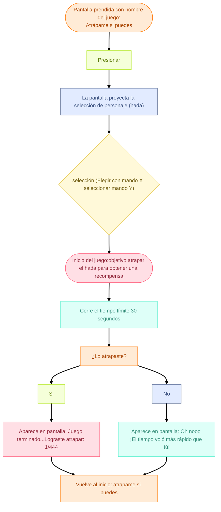

# grupo-04 - Cachureos

INTEGRANTES
- Yamna Carrión / [yamna-bit](https://github.com/yamna-bit)
- Valentina Chávez / [valechavezalb](https://github.com/valechavezalb)
- Antonia Fuentealba / [AntFuentealba](https://github.com/AntFuentealba)
- Millaray Millar / [mmillar95](https://github.com/mmillar95)
- Sofía Pérez / [sofia-perezm](https://github.com/sofia-perezm)
- Valentina Ruz / [vxlentiinaa](https://github.com/vxlentiinaa)

---

## Presentación textual

<!-- QUÉ -->

`Atrápame si puedes` es un juego interactivo diseñado para frustrar al usuario. El controlador del juego es contraintuitivo, no tiene un manual claro ni lineal, y requiere mucha destreza de parte del usuario para lograr tareas que parecen simples. Esto llega a hacerle dudar si vale la pena seguir intentando ganar. Los personajes del juego consisten en el equipo docente de este curso, funcionando como una parodia de la poca proporcionalidad que existe en la academia entre esfuerzo y resultados.

<!-- PARA QUIÉN / DÓNDE / CUÁNDO -->

Este es un juego para 1 persona a la vez, dura 30 segundos la interacción, y es una instalación tipo tótem. Existen dos tipos de interacción: la del usuario y la del espectador, y la relación entre ambas estructura la experiencia. Aquí aparece la metáfora central del proyecto, inspirada en figuras como el mito de Sísifo y el castigo de Tántalo: el jugador vive un “casi logro” constante, donde cada intento parece acercarlo, pero nunca del todo; mientras que la audiencia observa este esfuerzo repetitivo que roza lo absurdo, generando una mezcla de tensión y humor. Esta doble lectura sostiene el sentido del juego, donde lo frustrante se vuelve cómico cuando es compartido.

<!-- HISTORIA DEL JUEGO -->

El juego consiste en una pantalla con animaciones que muestran el estado actual del sistema, y dos controladores que deben usarse simultáneamente. El objetivo es atrapar hadas, lo que se dificulta por los controles: el jugador descubre progresivamente cómo usar sus manos dentro del juego, y esa torpeza inicial genera una frustración cómica para los espectadores, haciendo que el jugador, en vez de controlar, genere caos. Cuando por fin atrapa un hada, aparece un mensaje de felicitación, pero también un recordatorio frustrante: después de todo el esfuerzo de atrapar una, aún quedan unas 444 hadas por atrapar para lograr un minúsculo bono en la nota de un examen.

<!-- INSTRUCCIONES DE USO -->

El jugador presiona los sensores para controlar una red atrapahadas y capturar a las hadas, que representan a los docentes. Para concretar la captura, debe aplicar la presión adecuada con ambas manos y, al alcanzar el objetivo, mover el mando arriba y abajo con un gesto rápido que activa el acelerómetro. Esta secuencia de acciones contribuye a la sensación de “casi” y esfuerzo repetitivo que estructura toda la experiencia.

<!-- POR QUÉ HICIMOS ESTO  -->

Diseñamos a partir de lo cómico, ver cómo podíamos convertir en parodia situacional de la vida lo que para muchas personas podría ser algo frustrante. Para nosotros es un símbolo de humor, frustración y esfuerzo. El juego muestra cómo pequeños detalles pueden complicar incluso las metas más simples, y aun así seguimos intentando. Y eso no tiene nada de malo: frustrarse, ¿para qué?, si se puede pasar bien incluso en esas situaciones. No queremos confundir al usuario de manera errónea; solo buscamos generar un sentimiento ridículo, no tomarse las cosas tan personales cuando a veces simplemente buscamos pasar el tiempo y ver que no son tan trágicas como parecen. La forma en que entendemos este proyecto se basa en mirar el esfuerzo y el fracaso como algo ligero, exagerado y humorístico, donde la experiencia pertenece totalmente a quien la vive y no pretende ser más que eso un juego que hace visible lo absurdo.

## Inputs y Outputs

`Inputs (entradas)`

- Inicio del usuario: Presionar para comenzar
- Selección: Elegir un personaje (hada) con el mando
- Interacción física: Aplicar presión en los sensores
- Movimiento: Activar el acelerómetro moviéndose
- Intento: Acción de atrapar durante el tiempo límite

`Outputs (salidas)`

- Pantalla inicial: Nombre del juego
- Pantalla de selección: Opciones de hadas
- Inicio del juego: Instrucciones y activación del tiempo
- Feedback del resultado:
- Si atrapa: mensaje de éxito
- Si no atrapa: mensaje de derrota

---

### Bill of materials

|Componenetes|Cantidad|Unidad|OBS|Valor|
|---|---|---|---|---|
|Sensor de fuerza|2|FSR402|Conexión a pin A0 / A1|$7.500|
|Sensor Acelerómetro|1|GY-291 ADXL345 - 3 ejes|Conexión SCL a A5 / Conexión SDA a A4|$3.800|
|Arduino Uno|1|R4 minima|Conexión directa a corriente|$24.990|
|Resistencias|2|120 Ohms|Conexión para sensores|estaban en el lab|
|Mini Protoboard|2|85 puntos|Conexión VCC GND directa al arduino|$1.990|
|Pantalla|1|14 pulgadas|Conexión a computador|$139.990|
|Carcasa|3|Filamento:PLA|Impresión 3D|Impresión en el Lab|
|Plinto|1|Filamento:PLA|Impresión 3D|-|
|Cables|20 aprox.|macho-macho|-|$1.000|

---

## Planificación

Como grupo planificamos que haremos en cada semana del trabajo mediante una carta gantt, vimos el presupuesto de los materiales que necesitabamos (algunos ya estaban, pero decidimos dejarlos) y por último, hicimos un diagrama de flujo del proyecto en [mermaid](https://mermaid.js.org/)

### Carta Gantt

<!-- -->

### Presupuesto

<!-- -->

### Diagrama de Flujo

---

### `PROPUESTA ELEGIDA`

- Máquina sentimental "Atrápame si puedes"

`PROPUESTA VISUAL`

- Para la gráfica decidimos usar pixel art. Utilizamos la aplicación web [Piskel](https://www.piskelapp.com/)
- Paleta de colores: tonos de celestes, verdes, azules, rosados, etcétera
- Tipografía: pixel-retro
- Máquina física: control retro hecho con impresión 3D
- Cursor: red atrapa hadas hecho con pixel art
- Hadas: inspiradas en los profes y ayudantes, hechos con pixel art

|Hada|Volando|Estático|
|---|---|---|
||||
||||
||||
||||

|Paisaje|Inicio|
|---|---|
|||
|||
|||
|||

---

## Fotografías del proyecto terminado

## Roles de equipo

## Bibliografía
