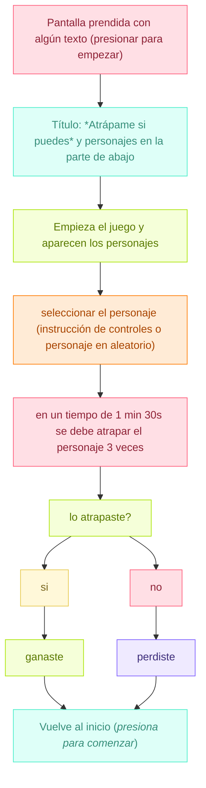

# grupo-04 - Cachureos

INTEGRANTES
- Yamna Carrión / [yamna-bit](https://github.com/yamna-bit)
- Valentina Chávez / [valechavezalb](https://github.com/valechavezalb)
- Antonia Fuentealba / [AntFuentealba](https://github.com/AntFuentealba)
- Millaray Millar / [mmillar95](https://github.com/mmillar95)
- Sofía Pérez / [sofia-perezm](https://github.com/sofia-perezm)
- Valentina Ruz / [vxlentiinaa](https://github.com/vxlentiinaa)

---

## Presentación textual

<!-- QUÉ -->

`Atrápame si puedes` es un juego interactivo diseñado para frustrar al usuario. El controlador del juego es contraintuitivo, no tiene un manual claro ni lineal, y requiere mucha destreza de parte del usuario para lograr tareas que parecen simples, llegando a hacerle dudar si vale la pena seguir intentando ganar. Los personajes del juego consisten en el equipo docente de este curso, que funcionan como parodia de la poca proporcionalidad en la academia entre esfuerzo y resultados.

<!-- PARA QUIÉN / DÓNDE / CUÁNDO -->

`Atrápame si puedes` es un juego de 1 persona a la vez, dura 15 minutos, y es una instalacion tipo tótem. FALTA. QUIZAS AQUI EXPLICAR LA METAFORA / FIGURA LITERARIA / EXPLICAR LO QUE LE PASA AL USUARIO, LO QUE LE PASA A LA AUDIENCIA.

<!-- HISTORIA DEL JUEGO -->

El juego consiste en una pantalla con animaciones que muestra el estado actual del sistema, y dos controladores para ser usados simultáneamente por una persona. El objetivo del juego es atrapar hadas, lo que se dificulta por los controles: el jugador descubre progresivamente cómo usar sus manos dentro del juego. Esta dificultad genera una frustración cómica para espectadores, haciendo que el jugador en vez de controlar, genere caos.

Cuando el jugador por fin atrapa un hada, aparece un mensaje de felicitación, pero a la vez un recordatorio frustrante, de que solamente tras hacer el esfuerzo de atrapar a 444 hadas, lograrás un minúsculo bono en la nota de un examen.

<!-- INSTRUCCIONES -->

El jugador presiona los sensores para controlar una red atrapahadas y capturar a las hadas, que representan a los docentes. Para concretar la captura, debe aplicar la presión adecuada con ambas manos y, al alcanzar el objetivo, mover el mando arriba y abajo con un gesto rápido que activa el acelerómetro.

<!-- POR QUÉ HICIMOS ESTO -->

La máquina refleja un desajuste constante: el jugador persigue un objetivo claro, pero la interfaz responde de manera inesperada. Entre humor, frustración y esfuerzo, el juego muestra cómo pequeños detalles pueden complicar incluso las metas más simples, y aun así seguimos intentando.

CRITERIOS de diseño / VALORES / PRINCIPIOS DE TU PRACTICA

ridículo

barato pero parecer fino

frustrante

como estan viendo cosas ridiculas, por favor volver a revisar la stupidhackathon.com

---

## Inputs y Outputs

`Inputs (entradas)`

La máquina recibe la presión aplicada por el usuario sobre los dos sensores de fuerza. Cada sensor entrega un valor analógico que indica intensidad de la presión, interpretándose como comandos de movimiento para la red atrapahadas. El sistema también recibe la intención de dirección del usuario, que se traduce en patrones de presión en dos diferentes direcciones.

1. Presión del usuario sobre los sensores FSR
   - El jugador presiona los sensores de fuerza (botones) para mover al personaje.
   - La cantidad de fuerza aplicada se traduce en velocidad o dirección.
   - Selección inicial del personaje
   - Antes de jugar, el usuario elige qué personaje quiere intentar atrapar.

La máquina toma como input la descoordinación, el error o la insistencia del jugador, todo eso afecta en cómo la red "atrapahadas" se mueve.

`Outputs (salidas)`

La máquina genera movimientos invertidos o desviados de la red según los valores recibidos, entregando desplazamientos que no coinciden con la dirección esperada por el usuario. También produce evasiones automáticas del personaje cuando detecta una presión que coincide con un intento de atrape. El resultado final son respuestas erróneas, escapes programados y un control que no deja precisión del usuario.

2. Movimiento del personaje en pantalla
   - El personaje se escapa cuando el jugador está cerca.

3. Movimiento de la red atrapahadas en pantalla
   - Red que se maneja mediante los sensores de fuerza.

4. Cambios en dirección, velocidad o animaciones del personaje.

---

### Bill of materials

|Componenetes|Cantidad|Unidad|OBS|Valor|
|---|---|---|---|---|
|Sensor de fuerza|2|FSR402|Conexión a pin A0 / A1|$7.500|
|Sensor Acelerómetro|1|GY-291 ADXL345 - 3 ejes|Conexión SCL a A5 / Conexión SDA a A4|$3.800|
|Arduino Uno|1|R4 minima|Conexión directa a corriente|$24.990|
|Resistencias|2|120 Ohms|Conexión para sensores|estaban en el lab|
|Mini Protoboard|2|85 puntos|Conexión VCC GND directa al arduino|$1.990|
|Pantalla|1|14 pulgadas|Conexión a computador|$139.990|
|Carcasa|3|Filamento:PLA|Impresión 3D|Impresión en el Lab|
|Plinto|1|Filamento:PLA|Impresión 3D|-|
|Cables|20 aprox.|macho-macho|-|$1.000|

---

## Planificación

Como grupo planificamos que haremos en cada semana del trabajo mediante una carta gantt, vimos el presupuesto de los materiales que necesitabamos (algunos ya estaban, pero decidimos dejarlos) y por último, hicimos un diagrama de flujo del proyecto en [mermaid](https://mermaid.js.org/)

### Carta Gantt

<!-- -->

### Presupuesto

<!-- -->

### Diagrama de Flujo

---

### `PROPUESTA ELEGIDA`

- Máquina sentimental "Atrápame si puedes"

`PROPUESTA VISUAL`

- Para la gráfica decidimos usar pixel art. Utilizamos la aplicación web [Piskel](https://www.piskelapp.com/)
- Paleta de colores: tonos de celestes, verdes, azules, rosados, etcétera
- Tipografía: pixel-retro
- Máquina física: control retro hecho con impresión 3D
- Cursor: red atrapa hadas hecho con pixel art
- Hadas: inspiradas en los profes y ayudantes, hechos con pixel art

|Hada|Volando|Estático|
|---|---|---|
||||
||||
||||
||||

|Paisaje|Inicio|
|---|---|
|||
|||
|||
|||

---

