# grupo-05

## La máquina asombrosa 🎰
### Integrantes
- Braulio Figueroa 
- Camila Parada
- Félix Rodriguez
- Miguel Vera

### La consigna
Para el proyecto 3 y posterior examen se nos encomendó hacer una máquina sentimental que hiciera representación de una figura literaria.
Esta idea es un constructo que combina los conocimientos vistos a lo largo del semestre (referente al desarrollo de mecanismos fabricados con la tecnología de Arduino, actuadores y sensores) en conjunto con rasgos y reacciones psicofisiológicas como lo son las emociones. Esta última se define como: “Alteración del ánimo intensa y pasajera (agradable o penosa) que va acompañada de cierta conmoción somática (relacionado con el cuerpo)”.
El eje de todo el proyecto se centra en conseguir un resultado que involucre al usuario y genere una respuesta en torno a la interacción entre ambas partes (objeto/máquina – emoción; acción – reacción; causa – efecto).

### Anticlimax
El ***anticlímax*** es una figura retórica que produce una decepción abrupta o un descenso de la seriedad al final de una oración, pasaje o trama, pasando de ideas importantes o tensas a algo trivial, insignificante o cómico. Esencialmente queremos decepcionar al usuario, y mientras más expectativa tenga, más se defraudará. Cosas como el nombre o elementos que atraen al usuario buscan aumentar esta expectativa lo más posible antes de dar una sorpresa (que no está a la altura) de manera abrupta.


***Vender humo*** se refiere a una persona que ofrece algo de escaso o nulo valor haciéndolo pasar por algo de mucho valor (generalmente de mala fe). Para nuestra máquina usaremos esta acepción y la idea de una literal transacción en la que recibes humo. Todos los aspectos de la máquina asombrosa buscan vender humo al usuario y apoyan la meta de generar expectativa para luego defraudarla.

### Nuestra máquina y la interacción
La máquina asombrosa tiene una apariencia similar a una máquina tragamonedas que, aunque no tiene ninguna invitación o promesa evidente, te llama a girar su manivela y ver qué pasa. Para que la máquina funcione apelamos a la curiosidad de las personas con la intención de que sigan girando la manivela e intenten llegar al término de la interacción. Nuestra manera de alimentar su curiosidad es ir añadiendo estímulos a medida que progresan y dar pistas de que algo viene y se está preparando.

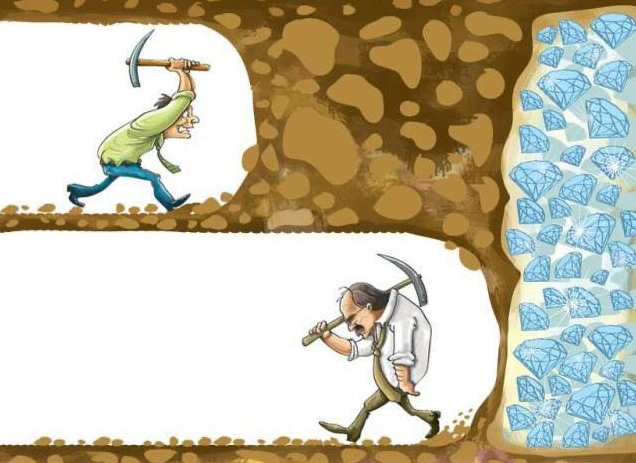

La interacción funciona de la siguiente manera:
1. El usuario ve la máquina y se acerca.
2. El usuario ve una manivela y la gira para ver que pasa.
3. Al girarla más de una vez se enciende una luz (1 de 5) y cada vuelta empieza a sonar. Esto inmediatamente busca limitar la interacción y declarar que la meta es encender las 5 luces.
4. Si gira un poco más se encenderá otra luz, confirmando la secuencialidad de cada activación. El sonido de cada vuelta cambiará y la máquina empezará a vibrar suavemente.
5. Al sumar vueltas se prenderá una 3ra luz, el sonido cambiará de nuevo y la vibración será más intensa.
6. Un poco más y habrán 4 luces encendidas, se activará un 4to sonido mecánico y la vibración será constante. Solo falta una luz y todo el esfuerzo girando la manivela se verá recompensado.
7. Con las últimas vueltas restantes se prenden todas las luces, el sonido cambia de nuevo y el motor se detiene, las preparaciones están listas.
8. Nuevamente guíado por la curiosidad y buscando una recompensa por su esfuerzo, el usuario dará una vuelta más. Esta vuelta desactiva las luces y hace sonar una corneta en celebración a la vez que suelta una humilde cantidad de humo.
9. La máquina queda desactivada hasta que un nuevo usuario gire la manivela y reinicie la interacción.

La experiencia que proponemos es bastante simple en esencia y está construida con una estructura similar a un chiste: preparación y remate. Su duración es de poco más de un minuto y, si logra hacer que alguien llegue al "gran final", ya cumplió su cometido. La gracia es que, aunque el usuario esperaba algo y no lo consiguió, ***la máquina nunca prometió nada***. Y aunque sea corta, la interacción usa el anticlímax para enseñar a medir nuestras expectativas.

## Contexto y oportunidad de diseño
La máquina asombrosa aprovecha elementos gráficos y morfológicos del mundo de las apuestas para ofrecer una experiencia en base a las expectativas. Nuestro proyecto llama a todo público a que se acerque y experimente un tipo de broma con el propósito de poner a prueba y hacer evidentes sus propias expectativas.

## Planificación
Los componentes definidos para nuestra máquina son los siguientes:

- A) Manivela/encoder 🕹️
- B) MP3 y parlante 🔊
- C) Luces LEDs 💡
- D) Humidificador 💨
- E) Motor vibrador 📳

### Cómo manejar los componentes
#### Encoder 🕹️
Este componente es el más importante en la máquina ya que dicta que ocurre con los demás y comunica a los actuadores con el usuario. El encoder funciona contando pasos al girar una perilla y pasar por mellas. Puede girar hacia ambos lados sin límites pero nosotros solo usaremos una dirección. Para ordenar cuando se activa cada cosa necesitamos que cierta cantidad de pasos (20) signifiquen una vuelta, que cada cantidad de vueltas se ordenen en respectivos rangos y que haya un contador que recuerde estos 3 valores. Con este propósito usamos una función que añade una vuelta cada vez que se pasa por un paso múltiplo de 20 y categorizamos la cantidad de vueltas. 


***funcionamiento del encoder y sus rangos, autoría propia, 2025***
#### Step a vueltas
```cpp
// si los ultimos estado actuales del CLK son diferentes entonces ocurrió un pulso
	// reacciona solo a 1 cambio de estado para evitar un doble conteo
	if (currentStateCLK != lastStateCLK && currentStateCLK == 1) {

		// lee el estado del DT para determinar la direccion
		// dependiendo de si es si va en sentido horario o antihorario
		if (digitalRead(DT) != currentStateCLK) {
			step++;
			currentDir = "CW";
		} else {
			step--;
			currentDir = "CCW";
		}

		if (step % 20 == 0) {
			vueltas++;
			//al completar una vuelta se alimenta la función vuelta actual
			//al aumentar se reproduce audio
			vueltaActual++;
		}
````
#### Vueltas a rangos
```cpp
	// --- CALCULO DE RANGOS ---
		if (vueltas >= 0 && vueltas <= 1) {
			rango = 0;
		} else if (vueltas >= 2 && vueltas <= 4) {
			rango = 1;
		} else if (vueltas >= 5 && vueltas <= 7) {
			rango = 2;
		} else if (vueltas >= 8 && vueltas <= 10) {
			rango = 3;
		} else if (vueltas >= 11 && vueltas <= 12) {
			rango = 4;
		} else if (vueltas >= 13 && vueltas <= 14) {
			rango = 5;
		} else if (vueltas >= 15) {
			rango = 6;
			//if (tiempoActualEncoder - tiempoNuevoEncoder >= cantidadDeTiempo){
			Serial.println("PERAME PORFAVOR");
			//step = 0;	
			//tiempoNuevoEncoder = tiempoActualEncoder;
		}
```
También extendimos el encoder con una manivela para que fuera más fácil de girar y para que las vueltas se demoraran más, dándole tiempo al audio.

#### MP3 y parlante 🔊
El DFPlayer funciona cargando archivos mp3 en una tarjeta SD, controlándolos con funciones de una biblioteca especial del reproductor y reproduciendolos con un parlante unido a pines TX/RX. Para este caso usamos **if/else if** para reproducir un audio distinto dependiendo del rango en el que se encontrara. Esta función es llamada por otra que detecta cuando se añade una vuelta para que solo suene ahí. Para armar el código usamos una función que simulaba el valor del encoder y nos basámos en códigos que usamos anteriormente.
```cpp
//función que detecta vueltas nuevas y activa la reproducción del audio adecuado
if (encoder.vueltaActual != encoder.vueltaAnterior) {
    audio.reproducirAudioPorfase();
    encoder.vueltaAnterior++;
  }

//función llamada por la anterior
//elige entre todas la pista correspondiente al rango
void Audio::reproducirAudioPorfase() {
  if (fase == 1) {
    myDFPlayer.play(1);
    Serial.println("fase 1");
  } else if (fase == 2) {
    myDFPlayer.play(2);
    Serial.println("fase 2");
  } else if (fase == 3) {
    myDFPlayer.play(3);
    Serial.println("fase 3");
  } else if (fase == 4) {
    myDFPlayer.play(4);
    Serial.println("fase 4");
  } else if (fase == 5) {
    myDFPlayer.play(5);
    Serial.println("fase 5");
  } else if (fase == 6) {
    myDFPlayer.play(6);
   // delay(4000);
    Serial.println("fase 6");
    Serial.println("REINICIO");
  } else {
    Serial.println("fuera de límites.");
  }
}
```
#### LEDs 💡
Los asociamos a 5 pines y unimos a tierra y 5v en una protoboard. Usamos 5 colores con valores de resistencia distintos para que la intensidad fuera pareja:
- Blanco - 2k
- Naranjo - 330
- Verde - 330
- Azul - 1k
- Rojo - 1k

Cada led se prende en su rango correspondiente y al llegar al último se apagan todas. 

```cpp
void Leds::usarLeds() {
	if (nivelLuz == 1) {
		digitalWrite(led1, HIGH);
		digitalWrite(led2, LOW);
		digitalWrite(led3, LOW);
		digitalWrite(led4, LOW);
		digitalWrite(led5, LOW);
	}

	if (nivelLuz == 2) {
		digitalWrite(led1, HIGH);
		digitalWrite(led2, HIGH);
		digitalWrite(led3, LOW);
		digitalWrite(led4, LOW);
		digitalWrite(led5, LOW);
	}
	if (nivelLuz == 3) {
		digitalWrite(led1, HIGH);
		digitalWrite(led2, HIGH);
		digitalWrite(led3, HIGH);
		digitalWrite(led4, LOW);
		digitalWrite(led5, LOW);
	}
}
```

#### Humidificador 💨
Este es un caso especial ya que tiene un elemento que se consume: algodón mojado. Una varita del material se presiona junto a un disco metálico que se calienta cuando pasa corriente. Esto resulta en la evaporación del líquido y la salida de vapor. Para controlar esta activación usamos HIGH que activa y LOW que desactiva pero también nos permitimos usar un delay, ya que al ser lo último que ocurre antes de reiniciarse no queda nada que entorpecer. Para que esto sea verdad decidimos usar una booliana tiraHumo que inicia false y se vuelve true en el rango 6. Esta booleana se *"consume"* una vez por ronda, asegurándonos que solo haya una descarga de humo hasta reiniciarse.
```cpp
void Humo::usarHumo(){
  if (tiraHumo == false && punto == 6) {
  digitalWrite(humo, HIGH);
  delay(3000);
  digitalWrite(humo, LOW);
  tiraHumo = true;
}
if (punto == 1){
  tiraHumo = false;
}
}
```
#### Motor vibrador 📳
Para el motor necesitábamos diferenciar un mínimo de 3 velocidades para demostrar progreso a medida que avanzaba la interacción. Con esta consigna en mente decidimos usar millis que pausarían puntos específicos de activación del motor sin usar delay que entorpecen al resto.
```cpp
void Vibrador::usarVibrador() {
  if (intervalo == 2) {  // acá se define qué velocidad responde (1, 2 o 3) según el rango en el que esté el intervalo
    velocidadVibrador(2000, 2000);
  } else if (intervalo == 3) {  // si en otro caso intervalo es 1, reproduce velocidad 2
    velocidadVibrador(3000, 500);
  } else if (intervalo == 4) {  // si en otro caso intervalo es 2, reproduce velocidad 3
    velocidadVibrador(3000, 0);
  } else if (intervalo == 5) {  // si en otro caso intervalo es 2, reproduce velocidad 3
    velocidadVibrador(0, 100000);
    //agregar opción rango 6 que apague el motor, ahora motor se apaga en rango 5 que es fiesta leds
  }
}
void Vibrador::velocidadVibrador(int pausaHIGH, int pausaLOW)
```
Como el resto de componentes, asociamos el vibrador a rangos del encoder. De esta manera definimos 3 cantidades de tiempo de *encendido* y *apagado* del motor que se diferencian entre sí y se repiten hasta cambiar de rango.

### Carta Gantt
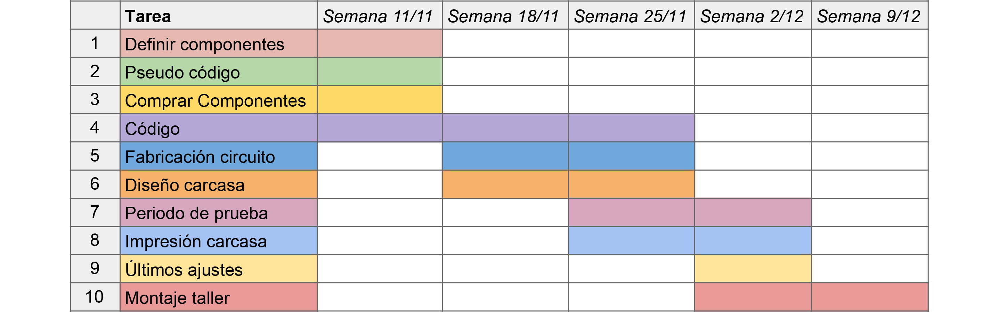

***planificación semana a semana del proyecto, autoría propia, 2025***

### Mapa de flujo
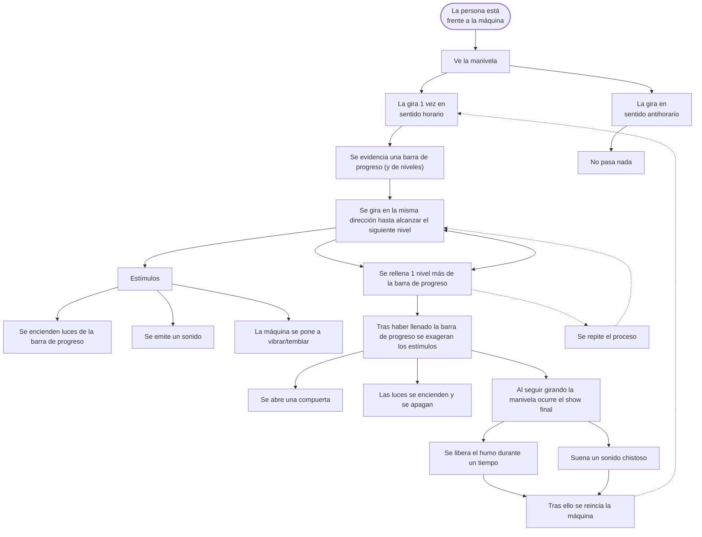
### Pseudocódigo
#### A) Manivela/encoder 🕹️
1. Definir cuantos pasos del encoder hacen una vuelta.
2. Vueltas de encoder alimentan un contador.
3. La cantidad de vueltas se califican en rangos secuenciales y exclusivos.
4. Rangos se ligan al resto de componentes y activan/desactivan.
5. Cantidad suficiente de vueltas de la manivela activan el humo.
6. Ejemplo: 15%, 30%, 60%, 80%, 100%. Porcentaje de avance de giros necesarios para llegar a climax.
8. Definir los rangos: rango 0 - 1 vuelta, rango 1 2 - 6 vueltas, etc.
9. Se reinicia al llegar al último rango.
#### B) MP3 y parlante 🔊
1. Ligar a función que suma vueltas al contador.
2. Elegir audio variable según rango en el que se encuentra.
3. Elegir audio *especial* que anuncia final de interacción.
4. Establecer instancia en la que suena cada audio. En este caso cuando se pasa por el punto superior de la manivela suena el audio (0,5/1 seg).
5. Audio cambia dependiendo del rango en el que se encuentra pero solo suena al girar manivela.
6. Siempre se reproduce el audio correspondiente al estado de avance actual.
7. Al llegar al climax se reproduce audio *especial* una vez. 
8. Se reinicia junto al resto.
#### C) Luces LEDs 💡
1. Instalar 5 led (o tiras) en sus respectivos pines.
2. Establecer cuando se enciende cada led y cuánto se mantiene encendida.
3. Ligar a rangos según valores de manivela. 
4. Se prende una luz al alcanzar el rango siguiente.
5. Al llegar al final las luces se apagan.
6. Se quedan desactivadas hasta reiniciar interacción

#### D) Humidificador 💨
1. Asociar a último rango (100%, vueltas completas).
2. Definir cantidad de tiempo de activación.
3. Suelta vapor modificado al alcanzar suficiente cantidad de vueltas.
4. Ocurre una vez y no puede ocurrir de nuevo en esa vuelta.
5. Se reinicia.
#### E) Motor vibrador 📳
1. Asociar a rangos de la manivela.
2. En un punto medio de progreso se activa y aumenta su intensidad a medida avanzan los rangos.
3. Se desactiva antes de completar la interacción.
4. Se reinicia junto al resto.
### Puntos esenciales del código
```cpp
//incluye todos los archivos de los componentes
#include "Encoder.h"
#include "Leds.h"
#include "Audio.h"
#include "Vibrador.h"
#include "Humo.h"

Encoder encoder;
Leds leds;
Audio audio;
Vibrador vibrador;
Humo humo;

void setup() {
  audio.prepararAudio();
  encoder.prepararEncoder();

  leds.prepararLeds();
  vibrador.prepararVibrador();
  humo.prepararHumo();
}

void loop() {
  encoder.usarEncoder();
  //hace que nivelLuz valga lo mismo que rango
  //sirve para activar las leds

  //el valor que manda va al final
  //en este caso encoder.rango es el que cambia al resto
  leds.nivelLuz = audio.fase = vibrador.intervalo = humo.punto = encoder.rango;

  //Esta función activa el audio solo cuando se añade una vuelta
  //Se activa solo cuando vueltaActual y vueltaAnterior son diferentes
  //la gracia es que inmediatamente cuando son diferentes suma a vueltaAnterior para que queden iguales
  //de esta manera solo suena una vez y no se interrumpe
  if (encoder.vueltaActual != encoder.vueltaAnterior) {
    audio.reproducirAudioPorfase();
    encoder.vueltaAnterior++;
  }
  leds.usarLeds();
  //vibrador llama a velocidadVibrador para controlar velocidad
  vibrador.usarVibrador();
  humo.usarHumo();
}
```
### Los Problemas
#### Código mata-arduino
El código del audio funcionaba pero, en palabras de mi compañero Sebastián, mataba al arduino. Estaba en un estado en el que casi no era detectado y daba problemas de funcionamiento fuera del código asi que no sabíamos como arreglarlo. Revisando minuciosamente los anuncios de error al compilar y llendo arreglando errores uno por uno llegamos a una versión que reproducía audio, auqnue con un int que simulaba el encoder.
#### Audio cruzado
Este problema siempre estaba presente y hacía que los audios se intercambiaran entre ellos después de desordenarse en la tarjeta SD. Lo solucionamos llamando al archivo que funcionara en vez del que correspondiera dejando casos como el siguiente:
```cpp
void Audio::reproducirAudioPorfase() {
  if (fase == 1) {
    myDFPlayer.play(2);
    Serial.println("fase 1");
  } else if (fase == 2) {
    myDFPlayer.play(4);
    Serial.println("fase 2");
  }
}
```
#### Reproducción cortada
Este problema fue una piedra constante en nuestro zapato que logramos solucionar hace relativamente poco tiempo. En promedio los audios duran 1 segundo pero por alguna razón algunos eran interrumpidos antes de reproducirse completamente y otros no. Para colmo también ocurría que el encoder dejaba de sumar aún cuando se giraba la manivela. Hicimos varias funciones que intentaban asegurar la reproducción pero lo empeoraron y le quitaron fluidez al código. Finalmente nos dimos cuenta de la causa era que algunos cables se soltaban y afectaban tanto audio como leds y otros componentes.

#### La interacción no llega a término
Para completar la interacción y soltar el humo era necesario pasar por todos los rangos anteriores uno por uno. En iteraciones preliminares del código, cuando unimos todo con clases, ocurrió mucho que al llegar a cierto punto la cuenta se detenía. En este caso ocurrió al revés y pensamos que el problema era mecánico pero resulta que un par de delays que usamos para retrasar algunas partes estancaban al resto del código. Al cambiarlos por millis y eliminar los innecesarios, pudimos llegar al último rango. 

#### No se reinicia
Para que la interacción fuera viable necesitábamos una manera de reiniciar todo de manera automática al terminar con un usuario. Para esto se nos ocurrió que la función que activa el humo también le asignaría un valor de 0 al int rango, trayendo todo lo que significa. Hacer esto simplemente lo estancó en el rango 6 con un par de luces que no se apagaban. Intentamos añadir formas de reinicio al cpp del encoder y descubrimos que el código del humo era muy "superficial" por lo que necesitábamos ir al hueso. Como el encoder podía contar pasos, vueltas y rangos, cada uno dependiente del anterior, decidimos que una vuelta específica (15) reiniciaría los 3 valores que dictan todo. Funcionó perfectamente y ahora opera constantemente sin nuestra intervención.
```cpp
if (vueltas > 15){
	//if (tiempoActualEncoder - tiempoNuevoEncoder >= cantidadDeTiempo){
    step = reiniciarTodo;
    rango = reiniciarTodo;
		vueltas = reiniciarTodo;
	//	tiempoNuevoEncoder = tiempoActualEncoder;
  //}
}
```
## Construcción Actuadores


***esquemático que muestra la conexión de los componentes, autoría propia, 2025***


***primeros avances de los actuadores para proyecto 3, autoría propia, 2025***

### Leds
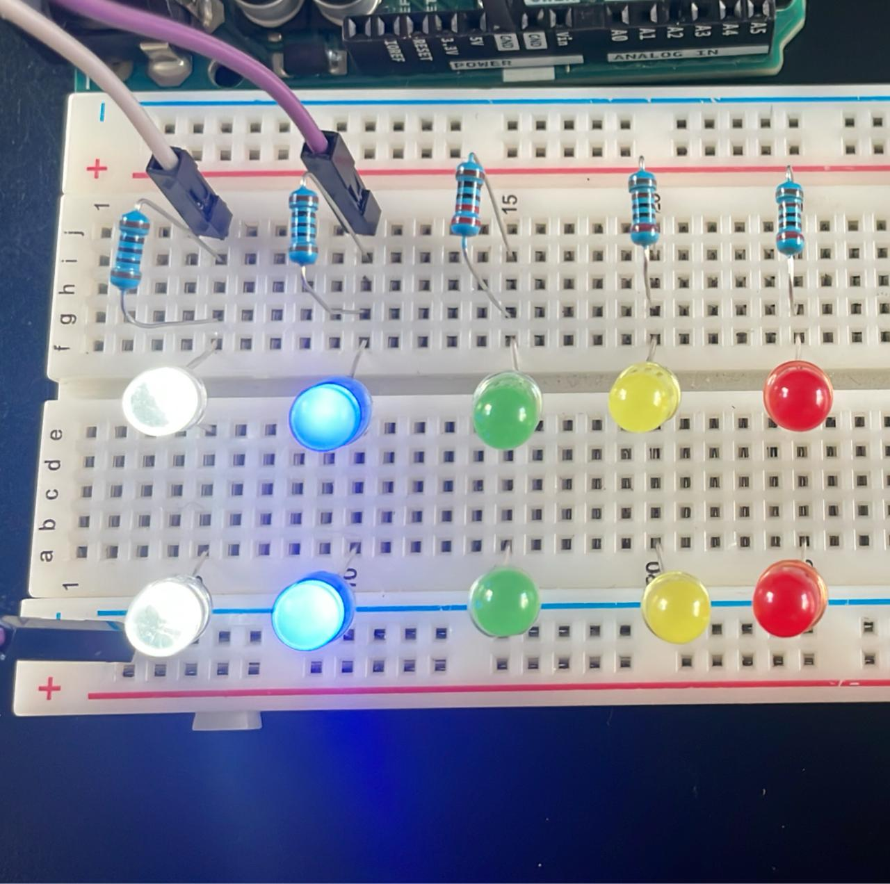

***primeras pruebas de leds en protobard, autoría propia, 2025***

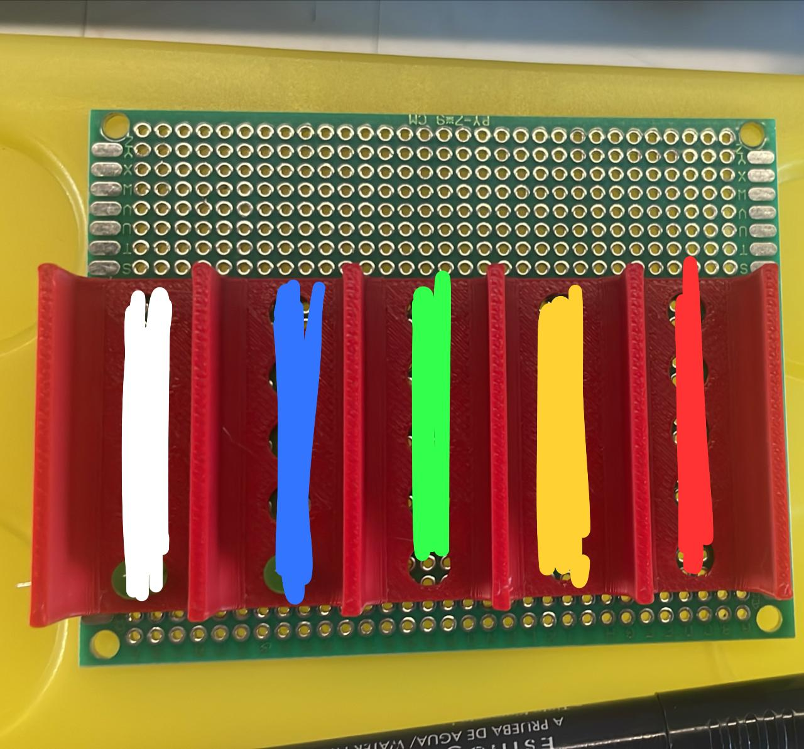

***planificación de leds en placa perforada, autoría propia, 2025***

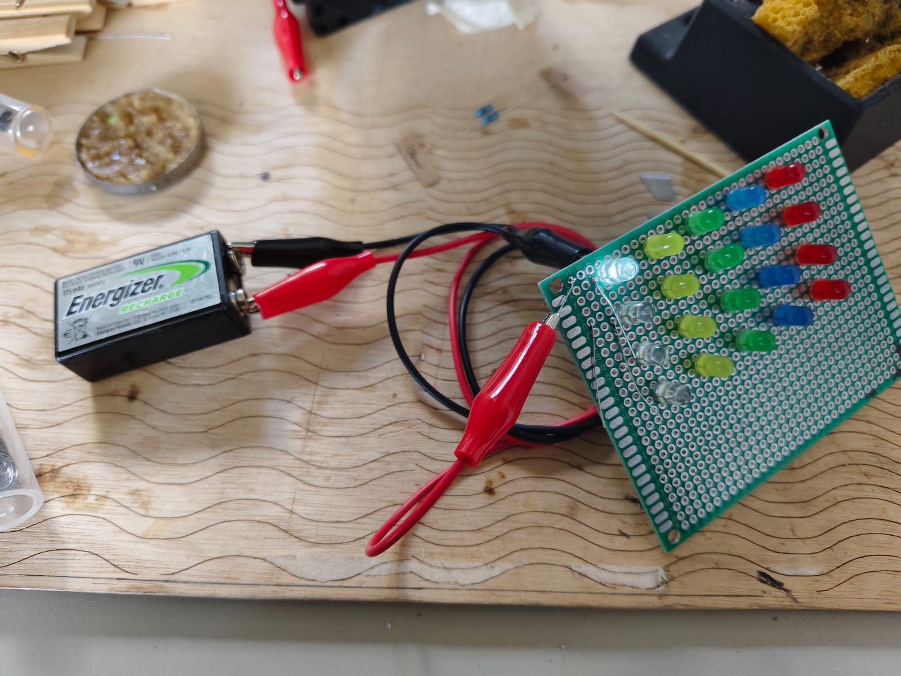

***leds puestos en placa perforada, autoría propia, 2025***


***leds soldados y funcionando en placa perforada, autoría propia, 2025***

### Motor
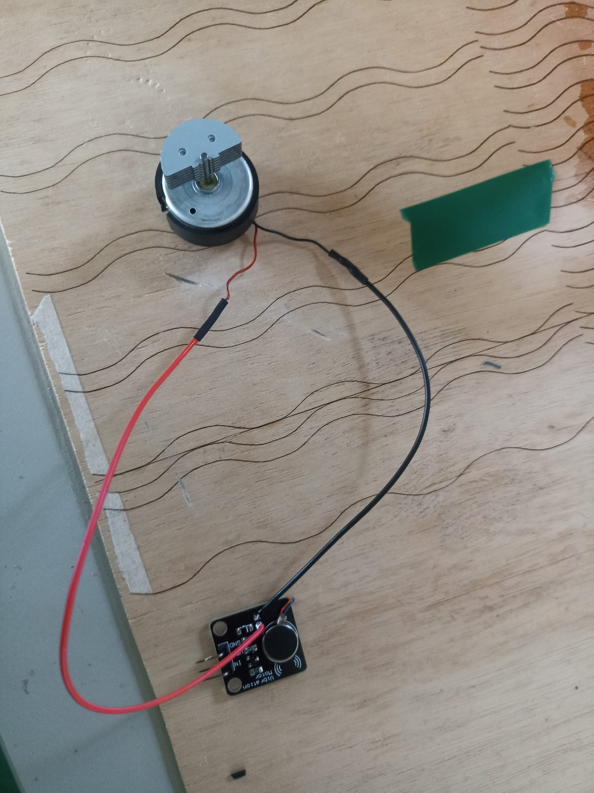

***vibrador de joystick soldado a un módulo vibrador, autoría propia, 2025***


***motor funcionando en circuito, autoría propia, 2025***

### Mp3
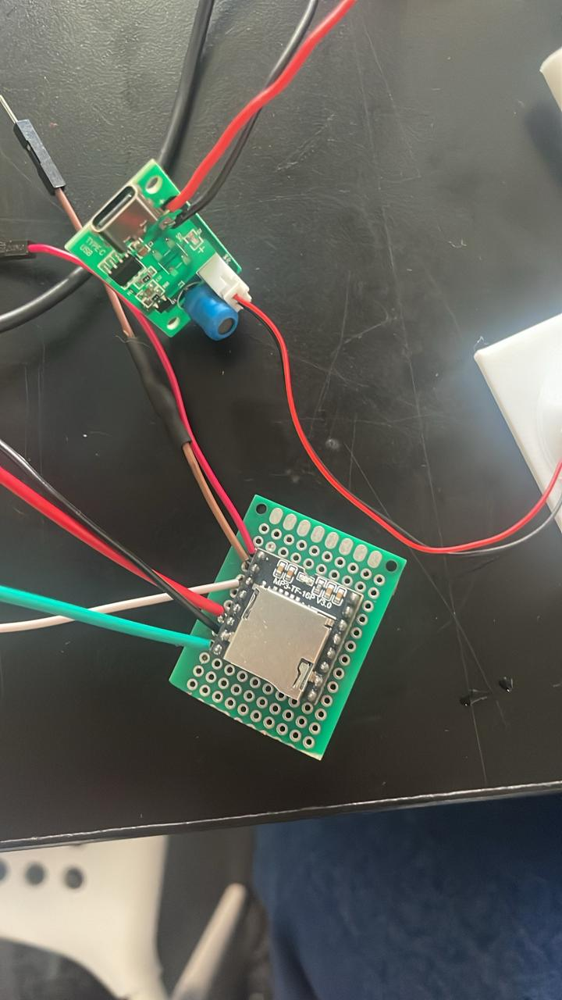

***módulo DFPlayer mp3 soldado en placa perforada, autoría propia, 2025***

### Humidificador


***primera conexión del humidificador, autoría propia, 2025***


### En paralelo


***módulo humidificador funcionando, autoría propia, 2025***


***sensor y actuadores funcionando en paralelo, autoría propia, 2025***

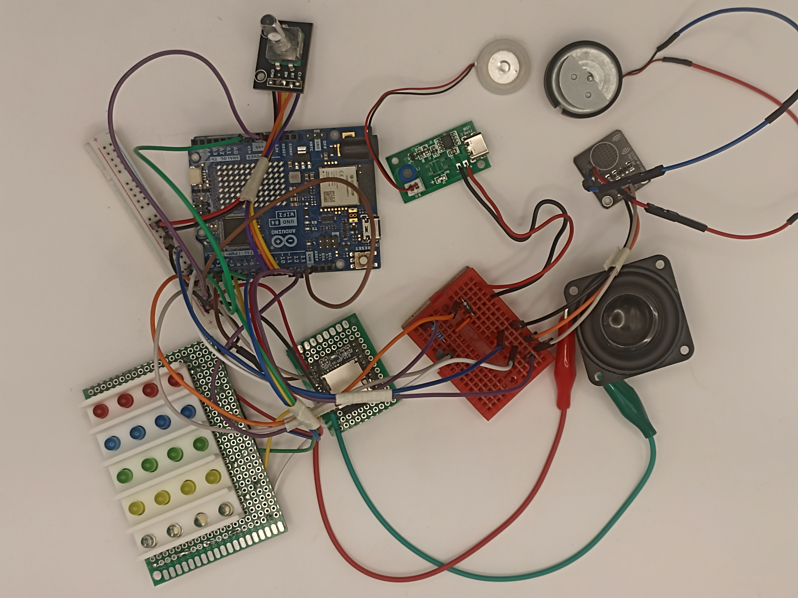

***todos los componentes soldados, autoría propia, 2025***

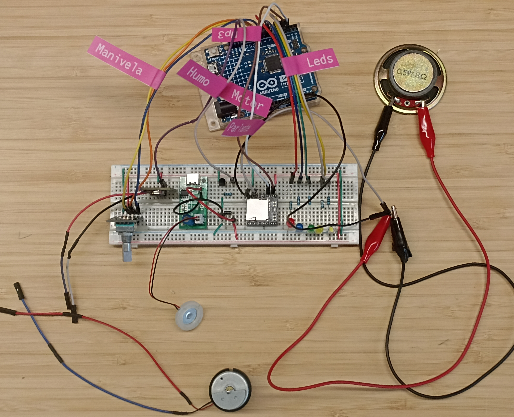

***componentes instalados en protoboard, autoría propia, 2025***

### Montado

https://github.com/user-attachments/assets/386438e4-af20-4db7-a441-7d1ce585cd18

***componentes montados en carcasa funcionando, autoría propia, 2025***


### Forma y carcasa
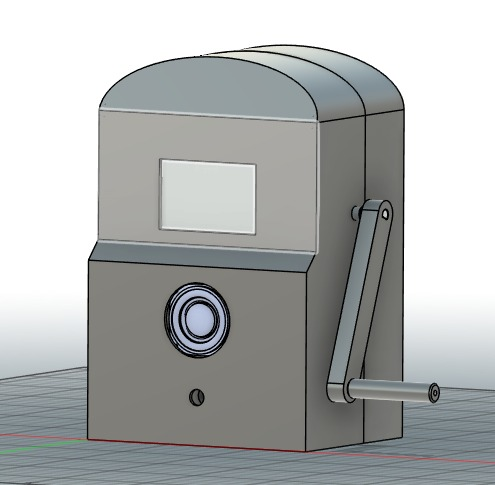

***render preliminar, autoría propia, 2025***

La forma de nuestra máquina está basada en una máquina tragamonedas, acorde a nuestra venta de humo. Al usar esta apariencia y adornarla con gráfica correspondiente hacemos que el usuario la asocie a algún tipo de apuesta/recompensa. 

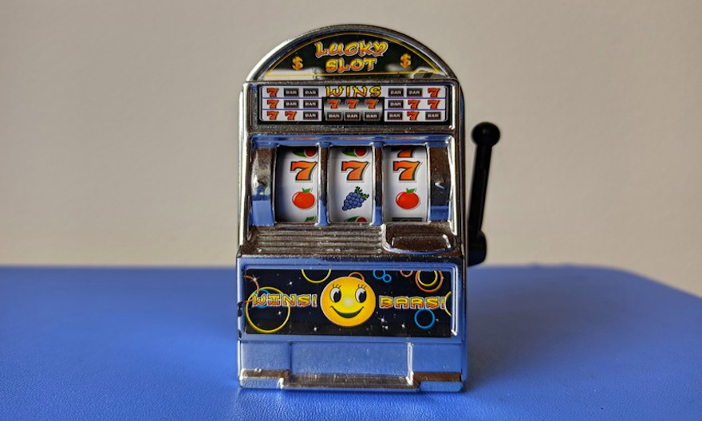

***referente de máquina tragamonedas, Infogate, 2021***

Las luces led de cada color hacen llamativa la máquina y muestran en tiempo real a dónde va tu esfuerzo, llenando una barra a medida que progresas. Para aprovechar la forma, pusimos las luces en donde iría la pantalla de la tragamonedas, directamente frente al usuario.


### Bill of materials
| Componentes | Tipo | Qty | Valor/tipo | Precio | Link |
|-------------|------|-----|------------|--------|------|
| Arduino UNO R4 Mínima | Tarjetas de Desarrollo | 1 | 5V | $24.990 | https://mcielectronics.cl/shop/product/arduino-uno-r4-minima |
| Mini Protoboard 400 Puntos | Conexión | 1 | 10.000 inserciones | $1.500 | https://afel.cl/products/mini-protoboard-400-puntos |
| Pack 60 Cables Dupont | Conexión | Varios | 300 V | $2.500 | https://afel.cl/products/pack-60-cables-de-conexion |
| Encoder rotatorio KY-040 360 grados | Sensor | 1 | 5V | $2.000  | https://afel.cl/products/encoder-rotatorio-ky-040-360-grados |
| Modulo reproductor MP3 | Actuador | 1 | 3.2 a 5V | $2.990 | https://afel.cl/products/modulo-reproductor-mp3-dfplayer-mini |
| Motor vibrador PWM Switch DC | Actuador | 1 | 3 a 5.3 VDC | $2.000 | https://afel.cl/products/motor-vibrador-pwm-switch-dc |
| Motor de vibración mando de Xbox 360 | Actuador | 1 | 5V | Reutilizado | https://es.aliexpress.com/item/1005002777653182.html |
| Mini humidificador USB tipo C de 5V | Actuador | 1 | 5V | $ 5.900 | https://www.tienda8.cl/mas-productos/humidificador-aire-domestico-generador-de-niebla-usb-5v-diy |
| Micro Servomotor SG90 | Actuador | 1 |  3 a 7.2 V | $1.990 | https://afel.cl/products/micro-servomotor-sg90 |
| Mini Parlante Altavoz de 3w | Salida audio | 1 | 3 VDC | $3.000 | https://afel.cl/products/mini-parlante-altavoz-de-3w |
| Pack Led 10mm (5) | Actuador | Varios | Blanca2k Naranjo330 Verde330 Azul1k Rojo1k | $3.033 a $3.156 | https://www.electroart.cl/3376/5x-pack-led-10mm |


