# **Grupo 06 Waos**

## **Integrantes**

- Bernardita Jesús / [Bernardita-Jesus](https://github.com/Bernardita-Jesus)

- Sebastián Sáez / [SebastianSaez1003](https://github.com/SebastianSaez1003)

- Morgan Aravena / [Mosswhosmoss](https://github.com/Mosswhosmoss)

- Angela O'Ryan / [Hiinalia](https://github.com/Hiinalia)

- Camila Delgado / [notcaamila](https://github.com/notcaamila)

- Josefa Quape / [Joquape](https://github.com/Joquape)

## **Examen** 

### **¿Qué es W.E.B.O?**

W.E.B.O la Entidad de Balance Ovoide, la paradoja del temporizador que no temporiza.

Esta idea se desarrolló a partir de volver inconveniente lo conveniente.

### **¿Qué es un temporizador?**

Es un dispositivo que permite medir el tiempo.

Un temporizador adecuado como el que se encuentra en un teléfono móvil, tiene ciertas características cuyo diseño es tan cotidiano que se vuelve imperceptible.

- Se pueden configurar con 3 resoluciones distintas: segundos, minutos y horas, adecuándose a la necesidad del usuario.

- Se puede elegir entre distintos sonidos, ajustar su volumen, añadir vibración y así definir la alarma emitida cuando el temporizador llega a 0.

¿Pero qué ocurriría si un temporizador fuera un ser vivo y complejo?

W.E.B.O es la respuesta a esta interrogante.

### **¿Cómo funciona W.E.B.O?**

Está pensado para una persona que necesita temporizar intervalos desde 5 segundos en adelante, según la demanda de su actividad.

Dentro de WEBO vive Ava, un ave del paraíso.
Ella es la encargada de alertar el fin del temporizador, pero esto presenta ciertas dificultades, ya que se distrae y se pone a bailar, como todos sabemos que hacen las aves del paraíso, y no cumple su labor. 

Ava se aburre simplemente realizando la cuenta regresiva del temporizador, así que cada cierto tiempo, se pondrá a bailar, haciendo piruetas de una manera tan intensa que… WEBO se puede caer de lado(apoyo visual para mostrar lo que sucede), esto es muy malo, porque Ava detesta estar en esa posición, por lo que hará sonar una alarma de alto volumen, para avisarle al usuario que algo malo ocurrió.

### **Sentimiento**

Entonces el sentimiento central del proyecto es **la frustración.**

Esto se evidencia durante toda la interacción que tenga el usuario con WEBO, porque desde el momento que se enciende, no sólo activa un temporizador, lo hace responsable de Ava, lo que implica **estar pendiente, observando y ansioso de que se pueda caer.**

En cambio en un temporizador común, el usuario activa el conteo y confía en no tener que estar pendiente del paso del tiempo ya que le avisará a uno en el momento justo.

Con WEBO esa lógica no funciona porque también pone en juego la capacidad de estar atento. Hace que el usuario esté consciente del tiempo al punto de la frustración.

Esto surge porque la alarma se convierte en una acusación de que el usuario falló , ya no se trata de que pasen los 5 segundos, sino que no ocurra otra caída.

WEBO transforma una acción simple en una experiencia molesta, mostrando cómo la frustración puede hacer que un **objeto útil se vuelva una carga**.

### **Instrucciones de uso**

- Usuario ve a WEBO.
- Necesita temporizar algo.
- Presiona el botón .
- Despierta a Ava .
- Vuelve a presionar el botón para definir el tiempo a temporizar (Los segundos agregados son de intervalos a partir de los 5).
- Si Ava empieza a girar **evita** que se caiga o ladee. 
- Si esto ocurre, Ava va a empezar una alarma, que **NO** es la que anuncia que el tiempo acabó.
- Asegurarse que no se ladee hasta que termine el tiempo y suene la alarma.
- Repetir el proceso cada vez que quieras temporizar.

### **Bill of Materials**

| Componente                        | Cantidad | Precio | Proveedor                                                               |
|-----------------------------------|----------|--------|-------------------------------------------------------------------------|
| Módulo sensor de inclinación tilt | 1        | $1496  | <https://altronics.cl/switch-inclinacion-sw520>                           |
| Módulo reproductor MP3            | 1        | $2.990 | <https://afel.cl/products/modulo-reproductor-mp3-dfplayer-mini>           |
| Pantalla display LCD Nokia 5110   | 1        | $5.000 | <https://afel.cl/products/pantalla-display-lcd-nokia-5110>                |
| Mini parlante altavoz 3w          | 1        | $3.000 | <https://afel.cl/products/mini-parlante-altavoz-de-3w>                    |
| Botón táctil 12x12x7.3            | 1        | $100   | <https://afel.cl/products/boton-tactil-tapa-12x12x7-3-interruptor>        |
| Motor DC alta velocidad           | 1        | $500   | <https://afel.cl/products/3v-0-2a-12000rpm-65gcm-mini-micro-dc-motor-for> |
| Cables dupont                     |          | $2500  | <https://afel.cl/products/pack-60-cables-de-conexion>                     |
| Cables dupont entrada salida      |          | $1000  | <https://afel.cl/products/pack-20-cables-de-conexion-macho-hembra>        |
| Resistencia 10k                   | 8        | $4990  | <https://afel.cl/products/kit-600-resistencias-1-4w-30-valores>           |
| Diodo Rectificador 1N4007         | 1        | $100   | <https://www.electroardu.cl/diodo-rectificador-1n4007>                    |
| MOSFET BS170 tipo N TO92          | 1        | $200   | <https://depaquete.cl/index.php>                                          |
| Tornillos 3m                      | 4        | $1.190 | <https://share.google/XGNMh6Vrv71Q1XYIs>                                  |
| Filamento PLA                     | 317 g    | $12.390| <https://share.google/eetowUUCaC65zfTWi>                                  |
| Powerbank                         | 1        | $9.990 | <https://www.sodimac.cl/sodimac-cl/articulo/139873283/Powerbank-de-bolsillo-5.000-MAH/139873284> |
| Alginato                          | 1        | $6.500 | <https://techdent.cl/producto/alginato-chromaprint-coltene-454g/>         |
| Stickers                          | 34       | $17.000| <https://www.instagram.com/rafita.studio/>                                |
| Afiche                            | 7        | $3.900 | <https://www.instagram.com/impresiondigitalr.r/>                                |
| Monedas de 10                     | 8        | $80    | <https://www.billetesymonedas.cl/Billetes/FamiliaBilletesActuales>        |

**Presupuesto estimado total – $56.426** 

### **Diagrama de flujo**

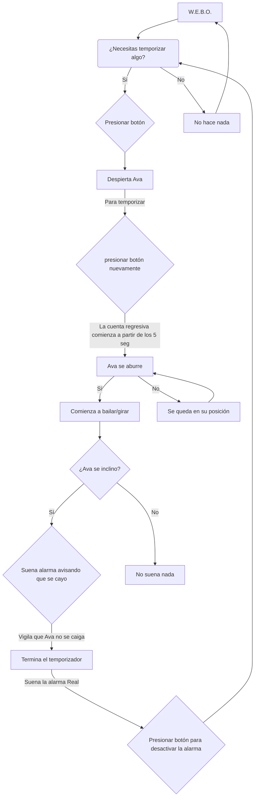

### **Fabricación**


#### **Interface**


Ava está basada en el ave del paraíso, o más especificamente Ptiloris Victoriae. Es un ave nativa de Australia muy común de encontrar. Tiene un baile de cortejo muy peculiar, del cual nos basamos para hacer el tutú de Ava y sus giros.


Cada cuadro de expresiones de Ava dentro del monitor está ilustrado en la página web [piskelapp](http://piskelapp.com), y convertido a bitmap con [image2cpp](https://javl.github.io/image2cpp/) para poder utilizarlo en la pantalla del arduino.

Ava puede sentir muchas emociones. Puede estar en un estado normal, dormir, hablar, saltar, y finalmente girar. Todo esto pasa según como esté posicionado WEBO.

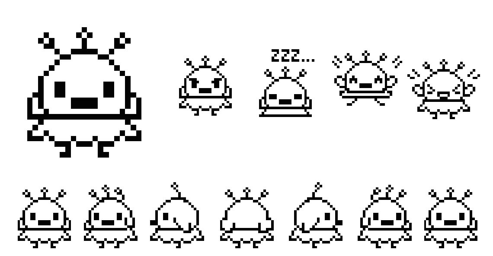

 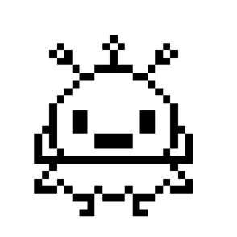 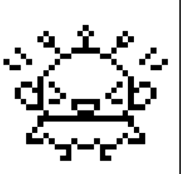

### **Carcasa**

#### Referentes y definición formal

Primero levantamos referentes, queríamos apoyarnos en la estética retro-portátil del Tamagotchi, Game & Watch y Game Boy. Luego decidimos que el proyecto necesitaba una utilidad más concreta, por lo que incorporamos la lógica operativa de un temporizador. 

Desde ahí retomamos el cruce semántico entre tamago (たまご, “huevo”) y watch (ウォッチ, “reloj”), tomando en cuenta esa interpretación asociada al acto de “cuidar”.


> Foto Game Boy, Game & Watch y Tamagotchi

Luego, después de al Seba le llegará la iluminación divina al ver la botella Misa caerse y balancearse. Definimos que queríamos que fuera un objeto que pudiera caerse, y de ahí planteamos una carcasa con morfología ovoide, generada a partir de un volumen continuo y sin aristas para favorecer el movimiento pendular.

En la base incorporamos un corte leve que actúa como punto de apoyo inestable, permitiendo que el objeto se mantenga de pie solo por un momento antes de perder el equilibrio.

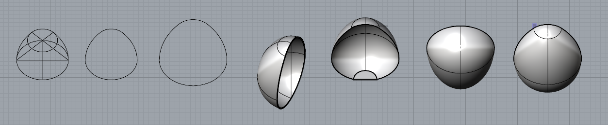

#### Mecánica y estructura general

Desarrollamos el sistema mecánico para las primeras pruebas, un soporte para el motor y un módulo encajable de contrapeso que desplaza la masa, incluyendo un conjunto de monedas, hacia un costado, generando el desequilibrio a partir del peso y el giro del motor.


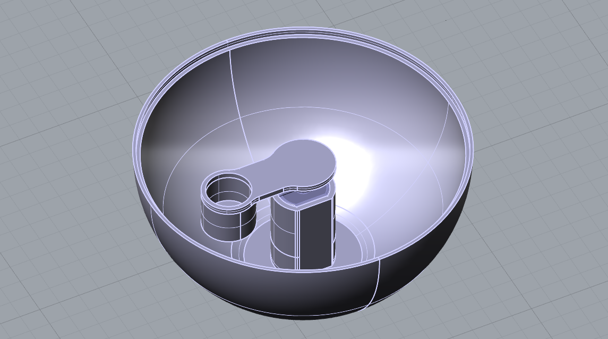


Después subdividimos el cuerpo en tres secciones principales, la cara frontal y la posterior junto a la base, las cuales son encajables, para poder abrir la pieza, armar y acceder a los circuitos de este “temporizador inconveniente”.

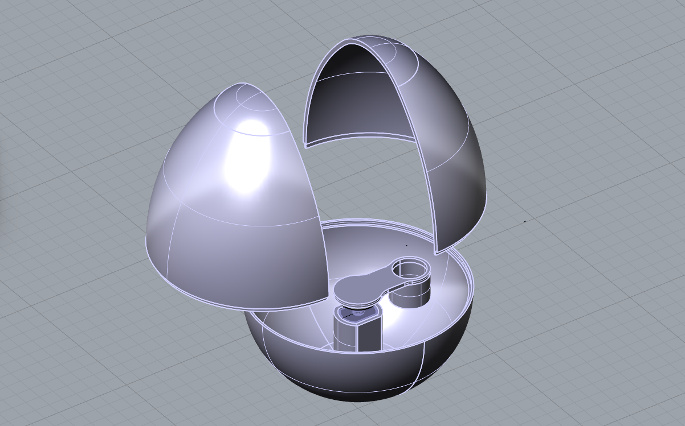

#### Integración electrónica y ajustes volumétricos

Continuamos con el diseño de los calces internos y la fachada externa de la cara frontal para montar la pantalla sin afectar la forma continua. Esta parte fue especialmente difícil debido a la geometría ovoide.


Optamos por integrar una power bank dentro de la carcasa para evitar cables externos, ya que podían enredarse con la pieza y limitar su movimiento, lo que nos obligó a reescalar el modelo varias veces para que todo quedara bien integrado.

Además diseñamos un sistema de plataforma para encajar el Arduino con la power bank, el sensor y la protoboard con sus respectivas tolerancias.

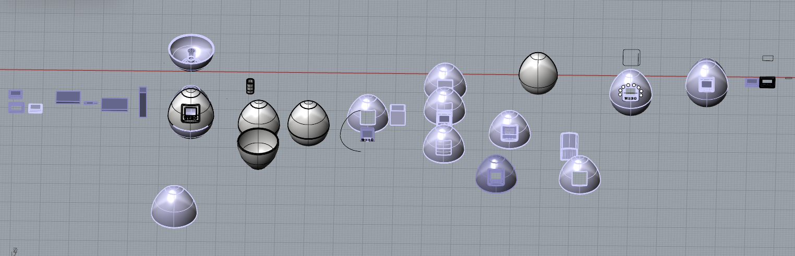
 
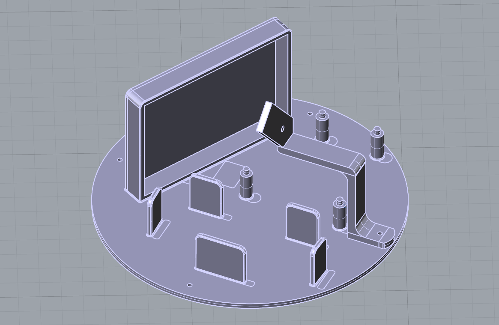

### Ajustes y Prototipado Final

Tuvimos que corregir varias cosas a medida que fuimos haciendo los testeos. Incorporamos el speaker en la parte superior con un encaje vertical y unas pequeñas perforaciones para dejar salir el sonido.

Agregamos el botón, que concentra la interacción principal, en la parte frontal.

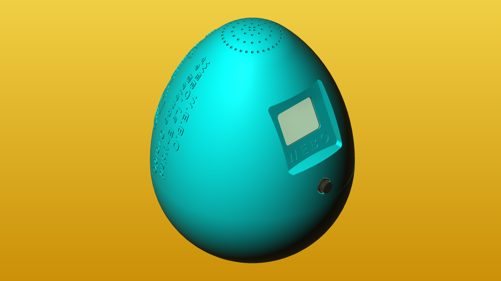

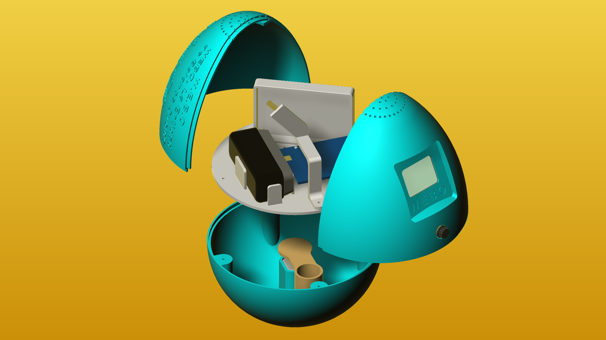

Además incorporamos su frase descriptiva junto a la ilustración de Ava en la pieza posterior y en el interior de la plataforma con los componentes.

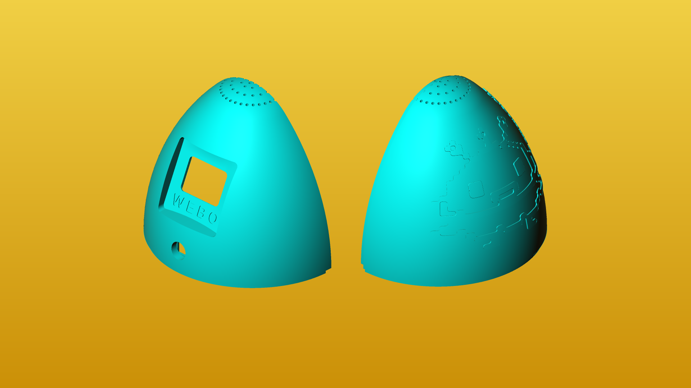

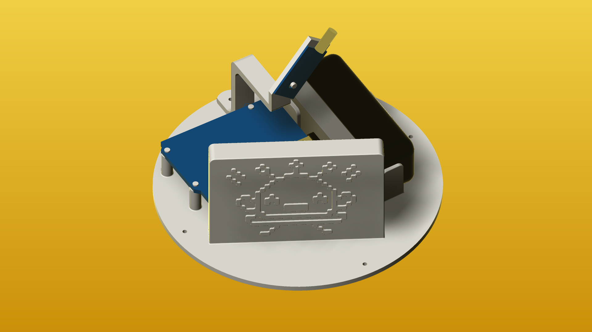

Como parte final del proyecto quisimos agregar una cobertura externa de alginato para amortiguar un poco el golpe y darle más dinamismo. 

Para esto realizamos un modelado exterior e interior y, a presión, se fue incorporando el alginato, que pensábamos pegar con silicona, pero finalmente decidimos no utilizarlo por razones funcionales, ya que dificultaba la caída por el peso.

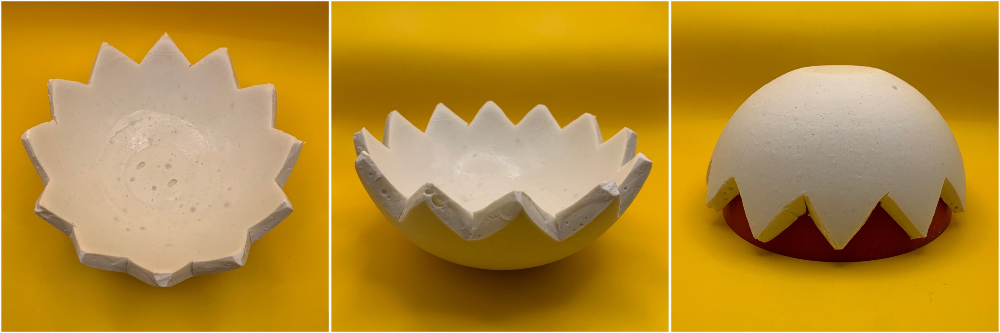

#### **Código**

#### Sensores y actuadores

Antes de iniciar con el código de W.E.B.O. se definen los sensores y actuadores por ocupar.

**Input**
Botón / Pulsador
Sensor de inclinación o tilt 

**Output**
Modulo reproductor MP3 DFPlayer mini
Motor DC alta velocidad
Display nokia 5110
Mini parlante altavoz

Luego de definir esto hablaremos de nuestro archivo .ino 

```cpp
// Aquí pasan todas las interacciones entre todos los componentes

#include "ActuadorDisplay.h"
#include "ActuadorMotor.h"
#include "SensorBoton.h"
#include "SensorTilt.h"
#include "SensorSD.h"

// sensor y actuador correspondientes
ActuadorDisplay actuadorDisplay;
ActuadorMotor actuadorMotor;
SensorBoton sensorBoton;
SensorTilt sensorTilt;
SensorSD sensorSD;

void setup() {
  sensorTilt.configuracionTilt();
  actuadorDisplay.configuracionDisplay();
  sensorBoton.configuracionBoton();
  sensorSD.configuracionSD();
  actuadorMotor.configuracionMotor();
}

void loop() {
  // Constantemente funciona el sensor de inclinación, de esto dependen casi todas las siguientes interacciones
  sensorTilt.funcionaTilt();

  // El botón controla el pasar del tiempo, el poder aumentar el temporizador y que lo que aparezca el display sea correcto según los segundos actuales
  sensorBoton.funcionaBoton();

  // El display muestra a AVA celebrando, siempre y cuando el temporizador termina correctamente con 0 segundos
  actuadorDisplay.celebracionDisplay();


  // Cuando no esta caido, osea:

  //----------------------------------
  //-------- WEBO ESTÁ PARADO --------
  //----------------------------------

  // Si es que el sensor de inclinación está hacia arriba, osea no inclinado
  if (!sensorTilt.caido) {
    // El display muestra el tiempo restante en segundos, con AVA realizando al cuent regresiva
    actuadorDisplay.cuentaDisplay();
    // Que el motor se active y se desactive en intervalos establecidos
    actuadorMotor.funcionaMotor();
    // cuando el motor se activa y está girando, AVA también gira
    actuadorDisplay.girandoDisplay();
    // Si es que el temporizador se cumple correctamente sonará la alarma débil
    sensorSD.funcionaSDAlarmaDebil();
    // Siempre y cuando el temporizador sea menor a 1 segundo y recién se va a empezar la interacción, o después de la celebración de AVA, ya que se cansa y se queda dormida
  actuadorDisplay.duermeDisplay();

  // El botón controla el pasar del tiempo, el poder aumentar el temporizador y que lo que aparezca el display sea correcto según los segundos actuales
  sensorBoton.funcionaBoton();
  }

  // Cuando está inclinado, osea:

  //----------------------------------
  //-------- WEBO ESTA CAIDO ---------
  //----------------------------------

  else {
    // suena la pataleta y AVA está enojada porque se cayo
    sensorSD.funcionaSDAlarmaFuerte();
    actuadorDisplay.caidaDisplay();
  }


```

#### **Complicaciones,  problemas y hallazgos**

El primer gran inconveniente que encontramos fue el reproductor mp3 mini, que a nivel de curso nos falló en numerosas ocasiones.

Asimismo, cambiar de la función “delay()” a “millis()” fue una de las mayores dificultades, ya que millis() es una función complicada de entender y utilizar (y la mayoría de los ejemplos de lo que deseábamos hacer emplean delay). En este proyecto, nos resultaba inalcanzable usar delay debido a la cantidad de elementos diversos que necesitan y dependen de una función que mida el tiempo.

Para aclarar:

Delay pone en pausa el funcionamiento total de arduino, mientras que millis contabiliza el tiempo desde que se enciende.

El código se volvió tan denso que al intentar cargar una actualización, el arduino se bloqueaba y mostraba el error 74, específicamente el **LIBUSB_ERROR_TIMEOUT**, llegando al extremo de pensar que habíamos dañado el arduino, lo solucionamos reiniciando el arduino cada vez que subíamos una nueva versión del código.

Problemas con bitmaps, al transferirlo al display, se perdieron algunos píxeles.

Complicaciones con el cableado, nuestra principal inquietud era quedarnos sin pines para todos los elementos.

Por último, nuestro problema final fue que el motor se quemó; no entendíamos por qué no funcionaba y creímos que habíamos cometido un error con el cableado hasta que nos percatamos de que estaba dañado.

Conseguimos solucionar millis con margen de error.

La interacción adecuada entre todos los Sensores y Actuadores.

Lo que más destacamos fue conseguir que cambiara de estado de espera / durmiendo al estado de temporizador, que era la comunicación entre el botón y el sensor de inclinación o tilt.

### Extras


## Bibliografía
- Platis, D. (s/f). nokia-5110-lcd-library: Arduino library for driving the Nokia 5110 LCD.
- Last Minute Engineers. (2018, noviembre 11). Interface Nokia 5110 Graphic LCD Display with arduino. Last Minute Engineers. https://lastminuteengineers.com/nokia-5110-lcd-arduino-tutorial/
- Kadluczka, P. (s/f). ArduinoDigitalClock: Digital clock for Arduino with Nokia 5110 LCD Display.
- » M. A. S. (2016, diciembre 9). How to Use NOKIA 5110 LCD Screen With Arduino. Instructables. https://www.instructables.com/Getting-Started-With-NOKIA-5110-LCD-Screen-Using-A/ 
- Bartnik, N. (2020, abril 3). Arduino count up timer using the Nokia 5110 LCD. Tutorial45. https://tutorial45.com/arduino-count-up-timer-using-the-nokia/
- Sensor de inclinación (Tilt Switch) – Prometec. (s/f). Prometec.net. Recuperado el 6 de diciembre de 2025, de https://www.prometec.net/tilt-switch/
- Tilt sensor. (s/f). Arduino.cc. Recuperado el 6 de diciembre de 2025, de https://docs.arduino.cc/tutorials/generic/tilt-sensor/ 
- Llamas, L. (2015, agosto 2). Measure tilt with Arduino and SW-520d tilt sensor. Luis Llamas. https://www.luisllamas.es/en/measure-tilt-arduino-tilt-sensor-sw-520d/ 
- Ramos, S. (s/f). Tilt sensor with Arduino easy tutorial. Arduino Intro. Recuperado el 6 de diciembre de 2025, de https://arduinointro.com/articles/projects/tilt-sensor-with-arduino-easy-tutorial
- Prueba_pantalla_clases_webo - wokwi ESP32, STM32, Arduino simulator. (s/f). Wokwi.com. Recuperado el 6 de diciembre de 2025, de https://wokwi.com/projects/447534178975226881 
- Baghayi, H. (s/f). Nokia_5110: Nokia 5110 LCD driver for Arduino :D.
- Liontron Systems. (s/f). NOKIA5110_TEXT: ASCII text Library for the Nokia 5110 LCD ( PCD8544 controller) for the Arduino microcontroller eco-system. Nine ASCII text fonts of various sizes . Designed to be light weight, low memory footprint. Tested on Arduino , STM32 and ESP-X.
- Bacon, R. (s/f). Nokia-5110-TFT: Connect your Arduino to the ubiquitous Nokia 5110 TFT. 
- Adafruit-PCD8544-Nokia-5110-LCD-library: Arduino driver for PC8544, most commonly found in small Nokia 5110’s. (s/f). 
- NOKIA 5110 LCD display with arduino. (s/f). Electronoobs.com. Recuperado el 6 de diciembre de 2025, de https://electronoobs.com/eng_arduino_tut53.php 
- Santos, R. (2015, septiembre 29). Complete guide for Nokia 5110 LCD with Arduino. Random Nerd Tutorials. https://randomnerdtutorials.com/complete-guide-for-nokia-5110-lcd-with-arduino/
- Ada, Lady. (2012, diciembre 17). Nokia 5110/3310 monochrome LCD. Adafruit.com; Adafruit. https://learn.adafruit.com/nokia-5110-3310-monochrome-lcd/testing
- » M. A. S. (2015, mayo 17). Nokia 5110 graphics tutorial. Instructables. https://www.instructables.com/Nokia-5110-graphics-tutorial/ 
- Graphic LCD hookup guide. (s/f). Sparkfun.com. Recuperado el 6 de diciembre de 2025, de https://learn.sparkfun.com/tutorials/graphic-lcd-hookup-guide 
- Nawazi, F. (2023, julio 4). Interface Nokia 5110 Graphic LCD display with Arduino. Circuits DIY. https://www.circuits-diy.com/interface-nokia-5110-graphic-lcd-display-with-arduino/ 
- Arduino Nokia 5110 text display once. (2014, octubre 7). Arduino Forum. https://forum.arduino.cc/t/arduino-nokia-5110-text-display-once/261824 
- AVR freaks. (s/f). Avrfreaks.net. Recuperado el 6 de diciembre de 2025, de https://www.avrfreaks.net/s/topic/a5C3l000000Uc4iEAC/t160152
- Nokia 5110 LCD Display not displaying anything. (2022, diciembre 15). Arduino Forum. https://forum.arduino.cc/t/nokia-5110-lcd-display-not-displaying-anything/1065701/3
- Build your countdown timer using Arduino. (s/f). Flyrobo.In. Recuperado el 6 de diciembre de 2025, de https://www.flyrobo.in/blog/countdown-timer-arduino?srsltid=AfmBOoqsjQ5Jys_Vykrd6liBXKexQhSGXNF0SoEkk03kzSeWN1_7u8m5 
- (S/f). Stackexchange.com. Recuperado el 6 de diciembre de 2025, de https://arduino.stackexchange.com/questions/66626/arduino-timer-with-increase-time-button 
- Cortés, A. (2021, febrero 18). Proyecto 21 - Sensor de inclinación SW-520D. Acortes Software; Andrés Cortés. https://acortes.co/proyecto-21-sensor-de-inclinacion-sw-520d/ 
- Science Buddies [@Science.Buddies]. (s/f). Control a DC motor with arduino (lesson #16) [[Object Object]]. Youtube. Recuperado el 6 de diciembre de 2025, de https://www.youtube.com/watch?v=XrJ_zLWFGFw 
- No title. (s/f). Arduino.cc. Recuperado el 6 de diciembre de 2025, de https://docs.arduino.cc/tutorials/generic/multiple-blinks/ 
- Arkhipenko, A. (s/f). examples/Scheduler_example01/Scheduler_example01.ino at master · arkhipenko/TaskScheduler. 
- (S/f). Github.com. Recuperado el 6 de diciembre de 2025, de https://github.com/adafruit/Adafruit-PCD8544-Nokia-5110-LCD-library/blob/master/examples/pcdtest/pcdtest.ino 
- Simple countdown timer. (2020, junio 28). Arduino Forum. https://forum.arduino.cc/t/simple-countdown-timer/662809/4 
- No title. (s/f-b). Arduino.cc. Recuperado el 6 de diciembre de 2025, de https://docs.arduino.cc/built-in-examples/digital/Button/

https://es.wikipedia.org/wiki/Game_Boy

https://es.wikipedia.org/wiki/Game_%26_Watch

https://es.wikipedia.org/wiki/Tamagotchi
