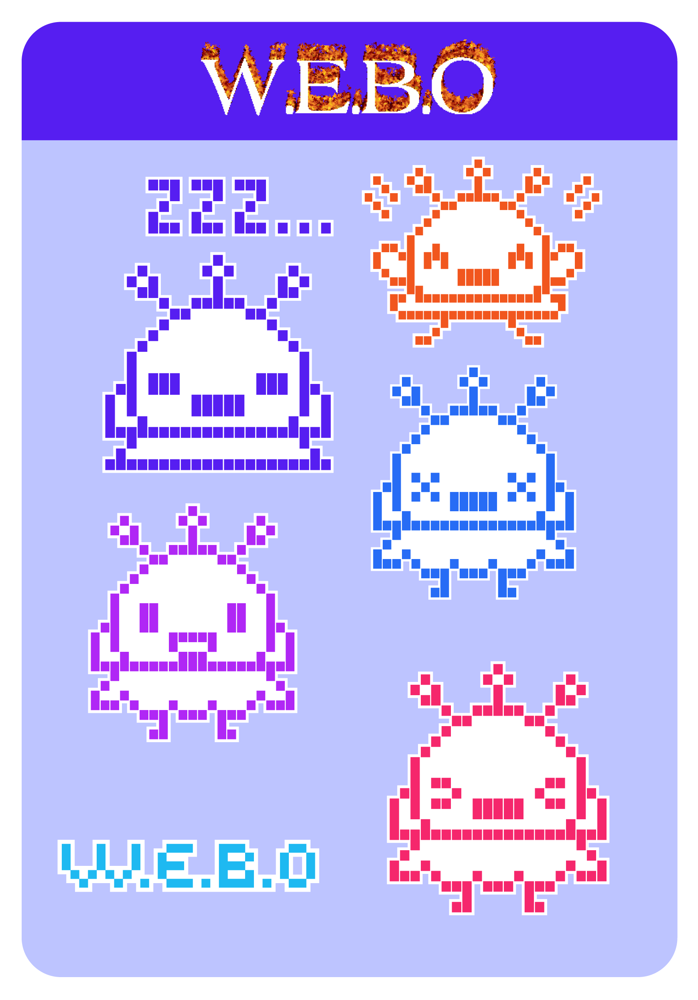

# **Grupo 06 Waos**

## **Integrantes**

- Bernardita Jesús / [Bernardita-Jesus](https://github.com/Bernardita-Jesus)

- Sebastian Saez / [SebastianSaez1003](https://github.com/SebastianSaez1003)

- Morgan Aravena / [Mosswhosmoss](https://github.com/Mosswhosmoss)

- Angela O'Ryan / [Hiinalia](https://github.com/Hiinalia)

- Camila Delgado / [notcaamila](https://github.com/notcaamila)

- Josefa Quape / [Joquape](https://github.com/Joquape)

## **Examen** 

### **¿Qué es W.E.B.O?**

W.E.B.O la Entidad de Balance Ovoide, la paradoja del temporizador que no temporiza.

Esta idea se desarrolló a partir de volver inconveniente lo conveniente.

### **¿Qué es un temporizador?**

Es un dispositivo que permite medir el tiempo.

Un temporizador adecuado como el que se encuentra en un teléfono móvil, tiene ciertas características cuyo diseño es tan cotidiano que se vuelve imperceptible.

- Se pueden configurar con 3 resoluciones distintas: segundos, minutos y horas, adecuándose a la necesidad del usuario.

- Se puede elegir entre distintos sonidos, ajustar su volumen, añadir vibración y así definir la alarma emitida cuando el temporizador llega a 0.

¿Pero qué ocurriría si un temporizador fuera un ser vivo y complejo?

W.E.B.O es la respuesta a esta interrogante.

### **¿Cómo funciona W.E.B.O?**

Está pensado para una persona que necesita temporizar intervalos desde 5 segundos en adelante, según la demanda de su actividad.

Dentro de WEBO vive Ava, un ave del paraíso.
Ella es la encargada de alertar el fin del temporizador, pero esto presenta ciertas dificultades, ya que se distrae y se pone a bailar, como todos sabemos que hacen las aves del paraíso, y no cumple su labor. 

Ava se aburre simplemente realizando la cuenta regresiva del temporizador, así que cada cierto tiempo, se pondrá a bailar, haciendo piruetas de una manera tan intensa que… WEBO se puede caer de lado(apoyo visual para mostrar lo que sucede), esto es muy malo, porque Ava detesta estar en esa posición, por lo que hará sonar una alarma de alto volumen, para avisarle al usuario que algo malo ocurrió.

### **Sentimiento**

Entonces el sentimiento central del proyecto es **la frustración.**

Esto se evidencia durante toda la interacción que tenga el usuario con WEBO, porque desde el momento que se enciende, no sólo activa un temporizador, lo hace responsable de Ava, lo que implica **estar pendiente, observando y ansioso de que se pueda caer.**

En cambio en un temporizador común, el usuario activa el conteo y confía en no tener que estar pendiente del paso del tiempo ya que le avisará a uno en el momento justo.

Con WEBO esa lógica no funciona porque también pone en juego la capacidad de estar atento. Hace que el usuario esté consciente del tiempo al punto de la frustración.

Esto surge porque la alarma se convierte en una acusación de que el usuario falló , ya no se trata de que pasen los 5 segundos, sino que no ocurra otra caída.

WEBO transforma una acción simple en una experiencia molesta, mostrando cómo la frustración puede hacer que un **objeto útil se vuelva una carga**.

### **Instrucciones de uso**

Usuario ve a WEBO.
Necesita temporizar algo.
Presiona el botón .
Despierta a Ava .
Vuelve a presionar el botón para definir el tiempo a temporizar (Los segundos agregados son de intervalos a partir de los 5).
Si Ava empieza a girar **evita** que se caiga o ladee. 
Si esto ocurre, Ava va a empezar una alarma, que **NO** es la que anuncia que el tiempo acabó.
Asegurarse que no se ladee hasta que termine el tiempo y suene la alarma.
Repetir el proceso cada vez que quieras temporizar.

### **Bill of Materials**

| Componente                        | Cantidad | Precio | Proveedor                                                               |
|-----------------------------------|----------|--------|-------------------------------------------------------------------------|
| Módulo sensor de inclinación tilt | 1        | $1496  | <https://altronics.cl/switch-inclinacion-sw520>                           |
| Módulo reproductor MP3            | 1        | $2990  | <https://afel.cl/products/modulo-reproductor-mp3-dfplayer-mini>           |
| Pantalla display LCD Nokia 5110   | 1        | $5000  | <https://afel.cl/products/pantalla-display-lcd-nokia-5110>                |
| Mini parlante altavoz 3w          | 1        | $3000  | <https://afel.cl/products/mini-parlante-altavoz-de-3w>                    |
| Botón táctil 12x12x7.3            | 1        | $100   | <https://afel.cl/products/boton-tactil-tapa-12x12x7-3-interruptor>        |
| Motor DC alta velocidad           | 1        | $500   | <https://afel.cl/products/3v-0-2a-12000rpm-65gcm-mini-micro-dc-motor-for> |
| Cables dupont                     |          | $2500  | <https://afel.cl/products/pack-60-cables-de-conexion>                     |
| Cables dupont entrada salida      |          | $1000  | <https://afel.cl/products/pack-20-cables-de-conexion-macho-hembra>        |
| Resistencia 10k                   | 8        | $4990  | <https://afel.cl/products/kit-600-resistencias-1-4w-30-valores>           |
| Diodo Rectificador 1N4007         | 1        | $100   | <https://www.electroardu.cl/diodo-rectificador-1n4007>                    |
| MOSFET BS170 tipo N TO92          | 1        | $200   | <https://depaquete.cl/index.php>                                          |

**Presupuesto estimado total – 21.876**

Gasto real del equipo – 6.400

### **Diagrama de flujo**

### **Fabricación**

#### **Interface**

INSERTAR IMAGENES DE BOCETOS Y GIF DE AVE DEL PARAISO BAILANDO

Cada cuadro de expresiones de Ava dentro del monitor está ilustrado en la página web http://piskelapp.com, y convertido a bitmap con https://javl.github.io/image2cpp/ para poder utilizarlo en la pantalla del arduino.

Ava puede sentir muchas emociones. Puede estar en un estado normal, dormir, hablar, saltar, y finalmente girar. Todo esto pasa según como esté posicionado WEBO.

INSERTAR IMAGENES DE EXPRESIONES DE AVA

#### **Carcasa**

#### **Código**

### **Extras**

## **Bibliografía**
Platis, D. (s/f). nokia-5110-lcd-library: Arduino library for driving the Nokia 5110 LCD.
Last Minute Engineers. (2018, noviembre 11). Interface Nokia 5110 Graphic LCD Display with arduino. Last Minute Engineers. https://lastminuteengineers.com/nokia-5110-lcd-arduino-tutorial/
Kadluczka, P. (s/f). ArduinoDigitalClock: Digital clock for Arduino with Nokia 5110 LCD Display.
» M. A. S. (2016, diciembre 9). How to Use NOKIA 5110 LCD Screen With Arduino. Instructables. https://www.instructables.com/Getting-Started-With-NOKIA-5110-LCD-Screen-Using-A/ 
Bartnik, N. (2020, abril 3). Arduino count up timer using the Nokia 5110 LCD. Tutorial45. https://tutorial45.com/arduino-count-up-timer-using-the-nokia/
Sensor de inclinación (Tilt Switch) – Prometec. (s/f). Prometec.net. Recuperado el 6 de diciembre de 2025, de https://www.prometec.net/tilt-switch/
Tilt sensor. (s/f). Arduino.cc. Recuperado el 6 de diciembre de 2025, de https://docs.arduino.cc/tutorials/generic/tilt-sensor/ 
Llamas, L. (2015, agosto 2). Measure tilt with Arduino and SW-520d tilt sensor. Luis Llamas. https://www.luisllamas.es/en/measure-tilt-arduino-tilt-sensor-sw-520d/ 
Ramos, S. (s/f). Tilt sensor with Arduino easy tutorial. Arduino Intro. Recuperado el 6 de diciembre de 2025, de https://arduinointro.com/articles/projects/tilt-sensor-with-arduino-easy-tutorial
Prueba_pantalla_clases_webo - wokwi ESP32, STM32, Arduino simulator. (s/f). Wokwi.com. Recuperado el 6 de diciembre de 2025, de https://wokwi.com/projects/447534178975226881 
Baghayi, H. (s/f). Nokia_5110: Nokia 5110 LCD driver for Arduino :D.
Liontron Systems. (s/f). NOKIA5110_TEXT: ASCII text Library for the Nokia 5110 LCD ( PCD8544 controller) for the Arduino microcontroller eco-system. Nine ASCII text fonts of various sizes . Designed to be light weight, low memory footprint. Tested on Arduino , STM32 and ESP-X.
Bacon, R. (s/f). Nokia-5110-TFT: Connect your Arduino to the ubiquitous Nokia 5110 TFT. 
Adafruit-PCD8544-Nokia-5110-LCD-library: Arduino driver for PC8544, most commonly found in small Nokia 5110’s. (s/f). 
NOKIA 5110 LCD display with arduino. (s/f). Electronoobs.com. Recuperado el 6 de diciembre de 2025, de https://electronoobs.com/eng_arduino_tut53.php 
Santos, R. (2015, septiembre 29). Complete guide for Nokia 5110 LCD with Arduino. Random Nerd Tutorials. https://randomnerdtutorials.com/complete-guide-for-nokia-5110-lcd-with-arduino/
Ada, Lady. (2012, diciembre 17). Nokia 5110/3310 monochrome LCD. Adafruit.com; Adafruit. https://learn.adafruit.com/nokia-5110-3310-monochrome-lcd/testing
» M. A. S. (2015, mayo 17). Nokia 5110 graphics tutorial. Instructables. https://www.instructables.com/Nokia-5110-graphics-tutorial/ 
Graphic LCD hookup guide. (s/f). Sparkfun.com. Recuperado el 6 de diciembre de 2025, de https://learn.sparkfun.com/tutorials/graphic-lcd-hookup-guide 
Nawazi, F. (2023, julio 4). Interface Nokia 5110 Graphic LCD display with Arduino. Circuits DIY. https://www.circuits-diy.com/interface-nokia-5110-graphic-lcd-display-with-arduino/ 
Arduino Nokia 5110 text display once. (2014, octubre 7). Arduino Forum. https://forum.arduino.cc/t/arduino-nokia-5110-text-display-once/261824 
AVR freaks. (s/f). Avrfreaks.net. Recuperado el 6 de diciembre de 2025, de https://www.avrfreaks.net/s/topic/a5C3l000000Uc4iEAC/t160152
Nokia 5110 LCD Display not displaying anything. (2022, diciembre 15). Arduino Forum. https://forum.arduino.cc/t/nokia-5110-lcd-display-not-displaying-anything/1065701/3
Build your countdown timer using Arduino. (s/f). Flyrobo.In. Recuperado el 6 de diciembre de 2025, de https://www.flyrobo.in/blog/countdown-timer-arduino?srsltid=AfmBOoqsjQ5Jys_Vykrd6liBXKexQhSGXNF0SoEkk03kzSeWN1_7u8m5 
 (S/f). Stackexchange.com. Recuperado el 6 de diciembre de 2025, de https://arduino.stackexchange.com/questions/66626/arduino-timer-with-increase-time-button 
Cortés, A. (2021, febrero 18). Proyecto 21 - Sensor de inclinación SW-520D. Acortes Software; Andrés Cortés. https://acortes.co/proyecto-21-sensor-de-inclinacion-sw-520d/ 
Science Buddies [@Science.Buddies]. (s/f). Control a DC motor with arduino (lesson #16) [[Object Object]]. Youtube. Recuperado el 6 de diciembre de 2025, de https://www.youtube.com/watch?v=XrJ_zLWFGFw 
No title. (s/f). Arduino.cc. Recuperado el 6 de diciembre de 2025, de https://docs.arduino.cc/tutorials/generic/multiple-blinks/ 
Arkhipenko, A. (s/f). examples/Scheduler_example01/Scheduler_example01.ino at master · arkhipenko/TaskScheduler. 
(S/f). Github.com. Recuperado el 6 de diciembre de 2025, de https://github.com/adafruit/Adafruit-PCD8544-Nokia-5110-LCD-library/blob/master/examples/pcdtest/pcdtest.ino 
Simple countdown timer. (2020, junio 28). Arduino Forum. https://forum.arduino.cc/t/simple-countdown-timer/662809/4 
No title. (s/f-b). Arduino.cc. Recuperado el 6 de diciembre de 2025, de https://docs.arduino.cc/built-in-examples/digital/Button/ 
