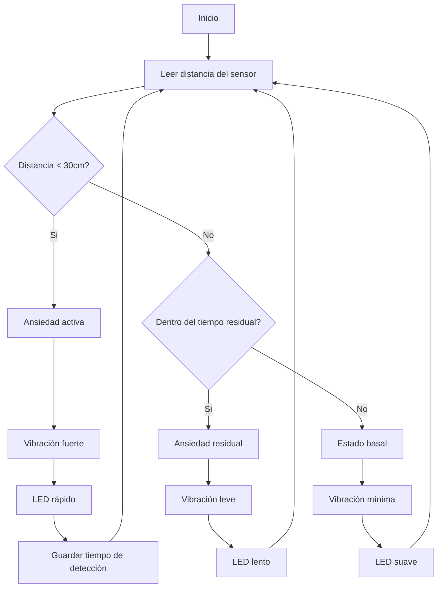
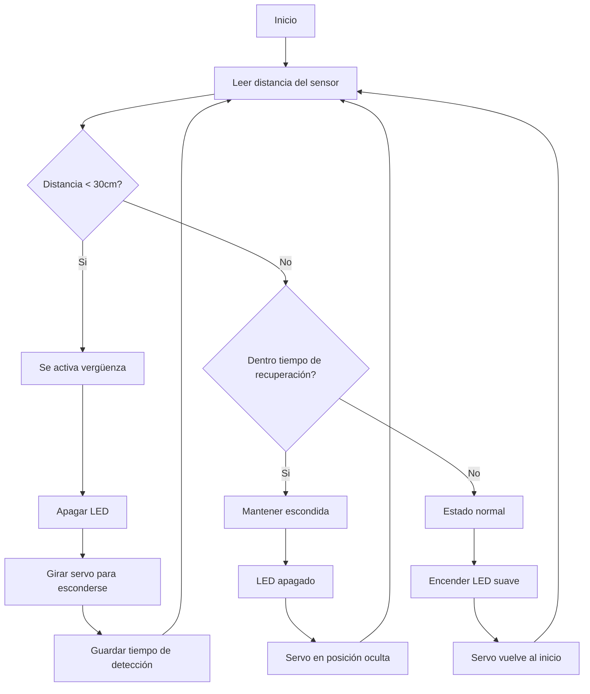

# grupo-02 - Gatolate ₊˚⊹ᰔ

**Integrantes:**  
- 01-antokiaraa
- 16-javieramoraga-rgb
- 18-ppia97

## Introducción .☘︎ ݁˖

Este proyecto surge desde la idea de crear **máquinas emocionales**, es decir, dispositivos que no buscan cumplir una función práctica, sino expresar una emoción a través del comportamiento físico: movimiento, luz, ritmo y tiempo.

Durante el taller, experimentamos con la idea de transformar emociones en acciones corporales de una máquina. En lugar de explicarlas con palabras, exploramos cómo una emoción puede **manifestarse físicamente**, como ocurre en una máquina que saluda, o un poema que reacciona al entorno.

Siguiendo esa lógica, diseñamos dos pequeñas máquinas que reaccionan a la presencia del usuario como si **sintieran algo**, sin hablar, solo comportándose.

Elegimos dos emociones silenciosas, difíciles de verbalizar, pero muy evidentes cuando se observan en un cuerpo: **Ansiedad** y **Vergüenza.**


## Significado de emociones .☘︎ ݁˖

### ⤷ Ansiedad:
> Es un estado de **anticipación y alerta constante**. No siempre ocurre algo, pero el cuerpo actúa como si algo estuviera por pasar. Se manifiesta en forma de tensión, latido rápido, vibración o inquietud permanente. No descansa del todo.

### ⤷ Vergüenza:
> Es el sentimiento que aparece cuando uno **se siente observado**. El cuerpo solo quiere esconderse, apagarse o evitar la mirada. No busca llamar la atención, sino desaparecer.


Estas emociones casi nunca se explican hablando; se expresan **con gestos, posturas y reacciones corporales**. Por eso, nuestras máquinas **no hablan, se comportan.**


### Máquina de la Ansiedad ᵎᵎ

Representa un cuerpo que **nunca consigue estar completamente quieto**.

- Vibra constantemente, incluso cuando no hay nadie cerca (motor N20 controlado con MOSFET).
- Cuando detecta aproximación (sensor ultrasónico), la vibración aumenta y el LED late más rápido, simulando un corazón nervioso.
- Al alejarse la persona, no vuelve inmediatamente a la calma: mantiene vibraciones leves, simulando el *residuo de tensión*.


──── ୨୧ ────


### Máquina de la Vergüenza ᵎᵎ
Representa un cuerpo que **prefiere no ser observado**.

- Cuando no hay nadie cerca, permanece encendida con luz suave y movimientos muy leves.
- Si alguien se acerca, la máquina apaga su LED y gira repentinamente con el servomotor, como un gesto de evasión.
- No vuelve a activarse inmediatamente. Espera antes de volver a mostrarse, como quien necesita tiempo para recuperarse después de sentirse observado.


### Relación emocional entre ambas .☘︎ ݁˖

Aunque funcionan por separado, comparten una lógica emocional:

| Situación | Reacción esperada |
|-----------|--------------------|
| La vergüenza se esconde | La ansiedad aumenta |
| La ansiedad se agita | La vergüenza se intensifica |

> No conversan entre sí, pero **se afectan emocionalmente**, igual que las personas.


## Planificación y proceso previo 𓏲 ๋࣭ ࣪ ˖🎐

Durante el proyecto, utilizamos una planificación modular por etapas. Aunque la Carta Gantt fue diseñada inicialmente, el cronograma fue ajustándose, ya que algunas decisiones técnicas (como el cambio de motor y uso de MOSFET) surgieron en etapas avanzadas.


### Etapas de trabajo

**1. Exploración conceptual**
- Investigación sobre emociones y cómo se manifiestan físicamente.
- Selección de Ansiedad y Vergüenza como emociones principales.
- Primeras ideas sobre cómo traducirlas en gestos mecánicos (temblor, giro, luz).

**2. Definición de componentes y posibles comportamientos**
- Búsqueda de actuadores que representaran físicamente cada emoción.
- Vergüenza → servomotor (giro evasivo) y LED que se apaga.
- Ansiedad → motor vibrador (luego reemplazado por motor N20 con MOSFET) y LED con pulso irregular.

**3. Primer prototipo técnico**
- Pruebas individuales de cada componente: sensor ultrasónico, servo, LED, motor vibrador.
- Primera programación básica de reacción a distancia.
- Problemas con la intensidad del motor vibrador → se detecta que no es suficiente.

**4. Redefinición técnica y compra de componentes**
- Se decide reemplazar el motor vibrador por un **micromotor N20** más potente.
- Se integra **MOSFET IRF520** (o equivalente) para controlar el motor con PWM.
- Ajustes en el diseño del código y reorganización del circuito.

**5. Integración de comportamientos emocionales**
- Ansiedad: implementación de vibración basal y vibración errática según cercanía.
- Vergüenza: programar apagado de color y giro evasivo.
- Se incorpora “residuo emocional”: tiempo de espera antes de calmarse.

**6. Montaje físico**
- Impresión 3D de piezas y pruebas de ensamblaje (cabeza de gatito para el ultrasónico).
- Consideración de caja como escondite emocional.
- Problemas iniciales con medidas y material (resina vs filamento).

**7. Pruebas de interacción y ajustes**
- Ajustes manuales de ángulos del servo.
- Ajuste de distancias mínimas y máximas para que cada máquina reaccione como se espera.
- Verificación de respuesta emocional (tiempo de reacción, intensidad, latencia).

**8. Documentación y preparación de entrega**
- Organización de bitácoras individuales.
- Redacción del informe final (este documento).
- Preparación de exposición.


──── ୨୧ ────


### Decisiones clave que modificaron el proyecto

| Problema | Cambio realizado |
|----------|------------------|
| Motor vibrador no tenía fuerza | Se reemplaza por motor N20 + MOSFET |
| Biblioteca NewPing incompatibilidad | Se decide usar lógica estándar de duración de pulso |
| Carcasa en resina rígida sin movilidad | Se decide pasar a impresión en filamento |
| Intensidad de gir muy brusca | Se ajusta PWM y delay para suavizar la respuesta |


──── ୨୧ ────


## Pseudocódigo Explicado ₊˚⊹ᰔ

### Componentes utilizados 

| Máquina   | Componentes principales | Función emocional                         |
|-----------|------------------------|-------------------------------------------|
| Ansiedad  | Sensor ultrasónico, motor DC N20 con MOSFET, LED RGB | Detecta cercanía, vibra, simula ritmo cardíaco |
| Vergüenza | Sensor ultrasónico, servomotor SG90, LED RGB | Detecta observación, se gira y apaga |


### Pseudocódigo — Máquina Ansiedad ⚡︎

```plaintext
INICIO

Definir pinSensorTrig = 2
Definir pinSensorEcho = 3
Definir pinLED = 9
Definir pinMotor = 5

Configurar pines como entrada o salida

Mientras la máquina está encendida:

  Leer distancia usando sensor ultrasónico

  Si distancia < 30 cm:
      // Ansiedad activa
      Aumentar PWM del motor (vibración fuerte)
      Aumentar velocidad de parpadeo del LED
      Guardar último tiempo en que se detectó presencia
  
  Sino si distancia >= 30 cm Y (tiempo desde la última detección < tiempo de residuo):
      // Ansiedad residual
      Mantener vibración leve (PWM medio-bajo)
      LED parpadea lento
  
  Sino:
      // Estado basal
      Vibración muy leve
      LED mantiene pulso lento

Fin

```


### Pseudocódigo — Máquina Vergüenza ⚡︎

```plaintext
INICIO

Definir pinSensorTrig = 2
Definir pinSensorEcho = 3
Definir pinServo = 6
Definir pinLED = 9

Configurar pines

Mientras la máquina está encendida:

  Leer distancia desde sensor ultrasónico

  Si distancia < 30 cm:
      // Se siente observada → se esconde
      Apagar LED
      Servo gira a posición de ocultamiento (ej. 120°)
      Guardar último tiempo de detección
  
  Sino si distancia >= 30 cm Y (tiempo desde la última detección < tiempo de recuperación):
      // Sigue escondida aunque ya no la miren
      Mantener LED apagado
      Mantener servo girado
  
  Sino:
      // Nadie la observa → tímida pero presente
      Encender LED con brillo suave
      Servo vuelve lentamente a posición inicial (ej. 0°)

Fin
```

────୨ৎ────


### Explicación del comportamiento emocional 𓏲 ๋࣭ ࣪ ˖🎐

| Estado del entorno | Máquina Ansiedad | Máquina Vergüenza |
|--------------------|------------------|-------------------|
| No hay nadie cerca | Vibra muy poco, LED lento (estado basal) | Luz tenue, servo centrado |
| Persona se acerca  | Vibra fuerte y LED acelera (alerta) | Apaga LED y se gira para esconderse |
| Persona se aleja   | Disminuye vibración lentamente (residuo emocional) | Espera antes de volver a mostrarse (recuperación emocional) |


### Idea central ๋ ࣭ ⭑

> Estas máquinas no cambian de estado inmediatamente.  
> Imitan el comportamiento emocional humano:  
> **las emociones tienen latencia, residuo y recuperación.**


────୨ৎ────


## Diagrama de Flujo — Máquina Ansiedad ⚡︎




## Diagrama de Flujo — Máquina Vergüenza ⚡︎



────୨ৎ────

## Bill of Materials (BOM) ๋ ࣭ ⭑

## Máquina Ansiedad — Componentes ⋆ 𐙚 ̊.

| Componente | Cantidad | Uso técnico | Rol emocional |
|-----------|----------|-------------|----------------|
| Arduino UNO / Nano | 1 | Microcontrolador principal | Gestiona los estados de ansiedad |
| Sensor ultrasónico HC-SR04 | 1 | Detección de distancia | Detecta cercanía como “alerta” |
| Motor DC N20 | 1 | Genera vibración | Representa temblor/agitamiento |
| Módulo MOSFET | 1 | Control de potencia del motor mediante PWM | Intensidad del “temblor emocional” |
| LED RGB | 1 | Señal luminosa | Representa latido ansioso |
| Resistencias 220–330Ω | 2–3 | Protegen el LED | — |
| Cables MM - MH | varios | Conexión | — |
| Protoboard | 1 | Ensamble | — |


## Máquina Vergüenza — Componentes ⋆ 𐙚 ̊.

| Componente | Cantidad | Uso técnico | Rol emocional |
|-----------|----------|-------------|----------------|
| Arduino UNO / Nano | 1 | Microcontrolador | Controla estados de vergüenza |
| Sensor ultrasónico HC-SR04 | 1 | Detecta presencia | “Se siente observada” |
| Servo SG90 | 1 | Movimiento rotacional | Se gira para esconderse |
| LED RGB | 1 | Iluminación | Se apaga en vergüenza |
| Resistencias | varias | Protegen LEDs | — |
| Cables MM - MH | varios | Conexión | — |
| Protoboard | 1 | Ensamble | — |


## Tabla de costos del proyecto ༘⋆


| Componente                          | Cantidad | Precio unitario | Subtotal | Nota |
|-------------------------------------|----------|------------------|----------|------|
| Módulo MOSFET                       | 1        | $1.200           | $1.200   | Comprado |
| Sensor ultrasónico HC-SR04         | 2        | $1.500           | $3.000   | Comprado |
| Motor vibrador (no usado)          | 1        | $2.000           | $2.000   | Comprado pero no utilizado |
| Micro motor N20 DC                 | 1        | $0               | $0       | Pedido al laboratorio |
| LED RGB (pack de 15)               | 15       | $100             | $1.500   | Comprado (pack completo) |
| Cables hembra–hembra (set)         | 1        | $1.000           | $1.000   | Comprado |
| Arduino UNO                         | 2        | $0               | $0       | Ya los tenían |
| Protoboard                          | 1        | $0               | $0       | Ya la tenían |
| Cable USB                           | 1        | $0               | $0       | Ya lo tenían |
| Servo SG90                          | 1        | $0               | $0       | Laboratorio |
| Resistencias                        | varias   | $0               | $0       | Laboratorio |
| Material de impresión 3D           | —        | $0               | $0       | Laboratorio |
| Silicona y fijación                 | —        | $0               | $0       | Ya lo tenían |


## **Total gastado realmente:** **$8.700**

> Este total corresponde únicamente al gasto real del grupo.  
> Muchos componentes fueron aportados por el laboratorio o ya estaban en posesión del equipo.

──── ୨୧ ────

## Instrucciones de uso ૮₍ ´ ꒳ `₎ა

Las máquinas están diseñadas para interactuar **entre ellas**, como dos gatitos hermanos que reaccionan a la presencia del otro. No requieren intervención humana más allá de colocarlas correctamente.

## Preparación inicial

1. Conecta ambas máquinas a su fuente de alimentación (USB o 5V).
2. Enciéndelas simultáneamente.
3. Ubícalas **una frente a la otra**, a una distancia aproximada de **20–40 cm**.
4. Ajusta su posición hasta que **sus sensores ultrasónicos se apunten directamente**, como si “se miraran”.


## Máquina Ansiedad — Comportamiento ≽^- ˕ -^≼

1. **Cuando la máquina Vergüenza se acerca**, la Ansiedad lo interpreta como una activación emocional.  
   - Aumenta su vibración.  
   - El LED acelera su ritmo.  

2. **Si la máquina Vergüenza se esconde o gira**, la Ansiedad incrementa su estado nervioso.  
   Reacciona con:  
   - Vibración más intensa,  
   - Cambios rápidos en el LED,  
   - Un “temblor” que tarda en calmarse.

3. **Cuando Vergüenza se aleja**, la Ansiedad no se calma de inmediato:  
   - Mantiene vibraciones residuales.  
   - Su LED sigue agitado unos segundos.

---

## Máquina Vergüenza — Comportamiento ≽^- ˕ -^≼

1. **Cuando la máquina Ansiedad se acerca**, Vergüenza reacciona como un gatito tímido:  
   - Se apaga el LED.  
   - El servo gira de forma abrupta para “esconderse”.

2. **Si Ansiedad está muy agitada**, Vergüenza se retrae aún más.  
   - Mantiene el servo en posición de ocultamiento.  
   - No vuelve a mostrarse hasta que la otra máquina se calme.

3. **Cuando Ansiedad reduce su vibración**, Vergüenza entra en un periodo de “recuperación”:  
   - No enciende su LED inmediatamente  
   - No vuelve a girar a su posición original enseguida  
   - Espera unos segundos antes de mostrar señales de calma


## Observación de la interacción ૮₍´˶• . • ⑅ ₎ა

- Las máquinas funcionan como “cuerpos emocionales”: **no responden al humano**, sino **a la presencia del otro**.  
- Puedes acercar o alejar una de la otra **como si fueran dos gatitos interactuando**.  
- No necesitan fuerza manual ni intervención directa: su lenguaje es gestual y sutil.


## Recomendaciones ‼

- Evita que los sensores ultrasónicos queden muy desalineados.  
- No manipular manualmente el servo o motor.  
- Mantener sobre una superficie estable.  
- Las máquinas no deben tener obstáculos entre ellas.


──── ୨୧ ────

## Contexto de uso ๋ ࣭ ⭑

Las máquinas fueron diseñadas como **dos criaturas emocionales**, inspiradas en el comportamiento de dos gatitos hermanos. No buscan resolver problemas prácticos ni cumplir funciones utilitarias: su propósito es **mostrar un vínculo emocional** construido únicamente a través de gestos mecánicos y distancia.


## Relación entre las máquinas ๋ ࣭ ⭑

Cada máquina encarna una emoción distinta:

- **Ansiedad:** se activa, tiembla, reacciona de manera intensa.
- **Vergüenza:** se esconde, se repliega, evita la mirada directa.

Aunque son diferentes, están conectadas por un mismo lenguaje corporal:  
**la distancia**.

Ambas dependen de la presencia de la otra para expresar su comportamiento.  
Sin la otra máquina, quedan en estado neutro, casi “sin identidad emocional”.


## Cómo se da la interacción ๋ ࣭ ⭑

Las máquinas deben estar **una frente a la otra**, como dos animales reconociéndose.  
Su “mirada” no es visual, sino digital: los sensores ultrasónicos detectan la proximidad y, a partir de eso, cada máquina interpreta la presencia de su compañera.

- Cuando **Ansiedad** se acerca con energía, provoca que **Vergüenza** se retraiga.  
- Cuando **Vergüenza** se esconde, Ansiedad se inquieta más.  
- Si Ansiedad se calma, Vergüenza lentamente vuelve a mostrarse.  

Este intercambio genera un pequeño ecosistema emocional:  
una relación donde **una afecta directamente el estado corporal de la otra**.


> El proyecto no busca imitar la vida, sino capturar un fragmento sencillo de ella:
> la manera en que dos seres pueden alterarse mutuamente, incluso sin tocarse.


