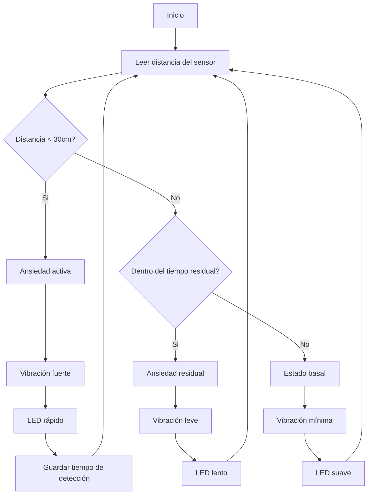
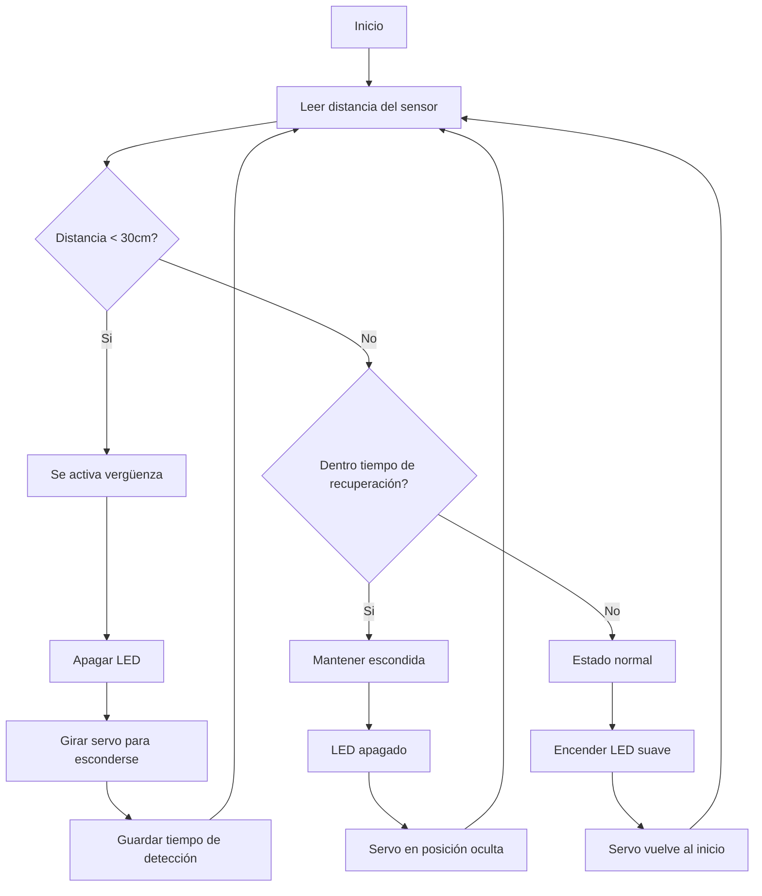

# grupo-02 - Gatolate ₊˚⊹ᰔ

**Integrantes:**  
- 01-antokiaraa
- 16-javieramoraga-rgb
- 18-ppia97

## Introducción .☘︎ ݁˖

Este proyecto surge desde la idea de crear **máquinas emocionales**, es decir, dispositivos que no buscan cumplir una función práctica, sino expresar una emoción a través del comportamiento físico: movimiento, luz, ritmo y tiempo.

Durante el taller, experimentamos con la idea de transformar emociones en acciones corporales de una máquina. En lugar de explicarlas con palabras, exploramos cómo una emoción puede **manifestarse físicamente**, como ocurre en una máquina que saluda, o un poema que reacciona al entorno.

Siguiendo esa lógica, diseñamos dos pequeñas máquinas que reaccionan a la presencia del usuario como si **sintieran algo**, sin hablar, solo comportándose.

Elegimos dos emociones silenciosas, difíciles de verbalizar, pero muy evidentes cuando se observan en un cuerpo: **Ansiedad** y **Vergüenza.**


## Significado de emociones .☘︎ ݁˖

### ⤷ Ansiedad:
> Es un estado de **anticipación y alerta constante**. No siempre ocurre algo, pero el cuerpo actúa como si algo estuviera por pasar. Se manifiesta en forma de tensión, latido rápido, vibración o inquietud permanente. No descansa del todo.

### ⤷ Vergüenza:
> Es el sentimiento que aparece cuando uno **se siente observado**. El cuerpo solo quiere esconderse, apagarse o evitar la mirada. No busca llamar la atención, sino desaparecer.


Estas emociones casi nunca se explican hablando; se expresan **con gestos, posturas y reacciones corporales**. Por eso, nuestras máquinas **no hablan, se comportan.**


### Máquina de la Ansiedad ᵎᵎ

Representa un cuerpo que **nunca consigue estar completamente quieto**.

- Vibra constantemente, incluso cuando no hay nadie cerca (motor N20 controlado con MOSFET).
- Cuando detecta aproximación (sensor ultrasónico), la vibración aumenta y el LED late más rápido, simulando un corazón nervioso.
- Al alejarse la persona, no vuelve inmediatamente a la calma: mantiene vibraciones leves, simulando el *residuo de tensión*.


──── ୨୧ ────


### Máquina de la Vergüenza ᵎᵎ
Representa un cuerpo que **prefiere no ser observado**.

- Cuando no hay nadie cerca, permanece encendida con luz suave y movimientos muy leves.
- Si alguien se acerca, la máquina apaga su LED y gira repentinamente con el servomotor, como un gesto de evasión.
- No vuelve a activarse inmediatamente. Espera antes de volver a mostrarse, como quien necesita tiempo para recuperarse después de sentirse observado.


### Relación emocional entre ambas .☘︎ ݁˖

Aunque funcionan por separado, comparten una lógica emocional:

| Situación | Reacción esperada |
|-----------|--------------------|
| La vergüenza se esconde | La ansiedad aumenta |
| La ansiedad se agita | La vergüenza se intensifica |

> No conversan entre sí, pero **se afectan emocionalmente**, igual que las personas.


## Planificación y proceso previo 𓏲 ๋࣭ ࣪ ˖🎐

Durante el proyecto, utilizamos una planificación modular por etapas. Aunque la Carta Gantt fue diseñada inicialmente, el cronograma fue ajustándose, ya que algunas decisiones técnicas (como el cambio de motor y uso de MOSFET) surgieron en etapas avanzadas.


### Etapas de trabajo

**1. Exploración conceptual**
- Investigación sobre emociones y cómo se manifiestan físicamente.
- Selección de Ansiedad y Vergüenza como emociones principales.
- Primeras ideas sobre cómo traducirlas en gestos mecánicos (temblor, giro, luz).

**2. Definición de componentes y posibles comportamientos**
- Búsqueda de actuadores que representaran físicamente cada emoción.
- Vergüenza → servomotor (giro evasivo) y LED que se apaga.
- Ansiedad → motor vibrador (luego reemplazado por motor N20 con MOSFET) y LED con pulso irregular.

**3. Primer prototipo técnico**
- Pruebas individuales de cada componente: sensor ultrasónico, servo, LED, motor vibrador.
- Primera programación básica de reacción a distancia.
- Problemas con la intensidad del motor vibrador → se detecta que no es suficiente.

**4. Redefinición técnica y compra de componentes**
- Se decide reemplazar el motor vibrador por un **micromotor N20** más potente.
- Se integra **MOSFET IRF520** (o equivalente) para controlar el motor con PWM.
- Ajustes en el diseño del código y reorganización del circuito.

**5. Integración de comportamientos emocionales**
- Ansiedad: implementación de vibración basal y vibración errática según cercanía.
- Vergüenza: programar apagado de color y giro evasivo.
- Se incorpora “residuo emocional”: tiempo de espera antes de calmarse.

**6. Montaje físico**
- Impresión 3D de piezas y pruebas de ensamblaje (cabeza de gatito para el ultrasónico).
- Consideración de caja como escondite emocional.
- Problemas iniciales con medidas y material (resina vs filamento).

**7. Pruebas de interacción y ajustes**
- Ajustes manuales de ángulos del servo.
- Ajuste de distancias mínimas y máximas para que cada máquina reaccione como se espera.
- Verificación de respuesta emocional (tiempo de reacción, intensidad, latencia).

**8. Documentación y preparación de entrega**
- Organización de bitácoras individuales.
- Redacción del informe final (este documento).
- Preparación de exposición.


──── ୨୧ ────


### Decisiones clave que modificaron el proyecto

| Problema | Cambio realizado |
|----------|------------------|
| Motor vibrador no tenía fuerza | Se reemplaza por motor N20 + MOSFET |
| Biblioteca NewPing incompatibilidad | Se decide usar lógica estándar de duración de pulso |
| Carcasa en resina rígida sin movilidad | Se decide pasar a impresión en filamento |
| Intensidad de gir muy brusca | Se ajusta PWM y delay para suavizar la respuesta |


──── ୨୧ ────


## Pseudocódigo Explicado ₊˚⊹ᰔ

### Componentes utilizados 

| Máquina   | Componentes principales | Función emocional                         |
|-----------|------------------------|-------------------------------------------|
| Ansiedad  | Sensor ultrasónico, motor DC N20 con MOSFET, LED RGB | Detecta cercanía, vibra, simula ritmo cardíaco |
| Vergüenza | Sensor ultrasónico, servomotor SG90, LED RGB | Detecta observación, se gira y apaga |


### Pseudocódigo — Máquina Ansiedad ⚡︎

```plaintext
INICIO

Definir pinSensorTrig = 2
Definir pinSensorEcho = 3
Definir pinLED = 9
Definir pinMotor = 5

Configurar pines como entrada o salida

Mientras la máquina está encendida:

  Leer distancia usando sensor ultrasónico

  Si distancia < 30 cm:
      // Ansiedad activa
      Aumentar PWM del motor (vibración fuerte)
      Aumentar velocidad de parpadeo del LED
      Guardar último tiempo en que se detectó presencia
  
  Sino si distancia >= 30 cm Y (tiempo desde la última detección < tiempo de residuo):
      // Ansiedad residual
      Mantener vibración leve (PWM medio-bajo)
      LED parpadea lento
  
  Sino:
      // Estado basal
      Vibración muy leve
      LED mantiene pulso lento

Fin

```


### Pseudocódigo — Máquina Vergüenza ⚡︎

```plaintext
INICIO

Definir pinSensorTrig = 2
Definir pinSensorEcho = 3
Definir pinServo = 6
Definir pinLED = 9

Configurar pines

Mientras la máquina está encendida:

  Leer distancia desde sensor ultrasónico

  Si distancia < 30 cm:
      // Se siente observada → se esconde
      Apagar LED
      Servo gira a posición de ocultamiento (ej. 120°)
      Guardar último tiempo de detección
  
  Sino si distancia >= 30 cm Y (tiempo desde la última detección < tiempo de recuperación):
      // Sigue escondida aunque ya no la miren
      Mantener LED apagado
      Mantener servo girado
  
  Sino:
      // Nadie la observa → tímida pero presente
      Encender LED con brillo suave
      Servo vuelve lentamente a posición inicial (ej. 0°)

Fin
```

────୨ৎ────


### Explicación del comportamiento emocional 𓏲 ๋࣭ ࣪ ˖🎐

| Estado del entorno | Máquina Ansiedad | Máquina Vergüenza |
|--------------------|------------------|-------------------|
| No hay nadie cerca | Vibra muy poco, LED lento (estado basal) | Luz tenue, servo centrado |
| Persona se acerca  | Vibra fuerte y LED acelera (alerta) | Apaga LED y se gira para esconderse |
| Persona se aleja   | Disminuye vibración lentamente (residuo emocional) | Espera antes de volver a mostrarse (recuperación emocional) |


### Idea central ๋ ࣭ ⭑

> Estas máquinas no cambian de estado inmediatamente.  
> Imitan el comportamiento emocional humano:  
> **las emociones tienen latencia, residuo y recuperación.**


────୨ৎ────


## Diagrama de Flujo — Máquina Ansiedad ⚡︎




## Diagrama de Flujo — Máquina Vergüenza ⚡︎



────୨ৎ────

## Bill of Materials (BOM) ๋ ࣭ ⭑

## Máquina Ansiedad — Componentes ⋆ 𐙚 ̊.

| Componente | Cantidad | Uso técnico | Rol emocional |
|-----------|----------|-------------|----------------|
| Arduino UNO / Nano | 1 | Microcontrolador principal | Gestiona los estados de ansiedad |
| Sensor ultrasónico HC-SR04 | 1 | Detección de distancia | Detecta cercanía como “alerta” |
| Motor DC N20 | 1 | Genera vibración | Representa temblor/agitamiento |
| Módulo MOSFET | 1 | Control de potencia del motor mediante PWM | Intensidad del “temblor emocional” |
| LED RGB | 1 | Señal luminosa | Representa latido ansioso |
| Resistencias 220–330Ω | 2–3 | Protegen el LED | — |
| Cables MM - MH | varios | Conexión | — |
| Protoboard | 1 | Ensamble | — |


## Máquina Vergüenza — Componentes ⋆ 𐙚 ̊.

| Componente | Cantidad | Uso técnico | Rol emocional |
|-----------|----------|-------------|----------------|
| Arduino UNO / Nano | 1 | Microcontrolador | Controla estados de vergüenza |
| Sensor ultrasónico HC-SR04 | 1 | Detecta presencia | “Se siente observada” |
| Servo SG90 | 1 | Movimiento rotacional | Se gira para esconderse |
| LED RGB | 1 | Iluminación | Se apaga en vergüenza |
| Resistencias | varias | Protegen LEDs | — |
| Cables MM - MH | varios | Conexión | — |
| Protoboard | 1 | Ensamble | — |


## Tabla de costos del proyecto ༘⋆


| Componente                          | Cantidad | Precio unitario | Subtotal | Nota |
|-------------------------------------|----------|------------------|----------|------|
| Módulo MOSFET                       | 1        | $1.200           | $1.200   | Comprado |
| Sensor ultrasónico HC-SR04         | 2        | $1.500           | $3.000   | Comprado |
| Motor vibrador (no usado)          | 1        | $2.000           | $2.000   | Comprado pero no utilizado |
| Micro motor N20 DC                 | 1        | $0               | $0       | Pedido al laboratorio |
| LED RGB (pack de 15)               | 15       | $100             | $1.500   | Comprado (pack completo) |
| Cables hembra–hembra (set)         | 1        | $1.000           | $1.000   | Comprado |
| Arduino UNO                         | 2        | $0               | $0       | Ya los tenían |
| Protoboard                          | 1        | $0               | $0       | Ya la tenían |
| Cable USB                           | 1        | $0               | $0       | Ya lo tenían |
| Servo SG90                          | 1        | $0               | $0       | Laboratorio |
| Resistencias                        | varias   | $0               | $0       | Laboratorio |
| Material de impresión 3D           | —        | $0               | $0       | Laboratorio |
| Silicona y fijación                 | —        | $0               | $0       | Ya lo tenían |


## **Total gastado realmente:** **$8.700**

> Este total corresponde únicamente al gasto real del grupo.  
> Muchos componentes fueron aportados por el laboratorio o ya estaban en posesión del equipo.

──── ୨୧ ────

## Instrucciones de uso ૮₍ ´ ꒳ `₎ა

Las máquinas están diseñadas para interactuar **entre ellas**, como dos gatitos hermanos que reaccionan a la presencia del otro. No requieren intervención humana más allá de colocarlas correctamente.

## Preparación inicial

1. Conecta ambas máquinas a su fuente de alimentación (USB o 5V).
2. Enciéndelas simultáneamente.
3. Ubícalas **una frente a la otra**, a una distancia aproximada de **20–40 cm**.
4. Ajusta su posición hasta que **sus sensores ultrasónicos se apunten directamente**, como si “se miraran”.


## Máquina Ansiedad — Comportamiento ≽^- ˕ -^≼

1. **Cuando la máquina Vergüenza se acerca**, la Ansiedad lo interpreta como una activación emocional.  
   - Aumenta su vibración.  
   - El LED acelera su ritmo.  

2. **Si la máquina Vergüenza se esconde o gira**, la Ansiedad incrementa su estado nervioso.  
   Reacciona con:  
   - Vibración más intensa,  
   - Cambios rápidos en el LED,  
   - Un “temblor” que tarda en calmarse.

3. **Cuando Vergüenza se aleja**, la Ansiedad no se calma de inmediato:  
   - Mantiene vibraciones residuales.  
   - Su LED sigue agitado unos segundos.

---

## Máquina Vergüenza — Comportamiento ≽^- ˕ -^≼

1. **Cuando la máquina Ansiedad se acerca**, Vergüenza reacciona como un gatito tímido:  
   - Se apaga el LED.  
   - El servo gira de forma abrupta para “esconderse”.

2. **Si Ansiedad está muy agitada**, Vergüenza se retrae aún más.  
   - Mantiene el servo en posición de ocultamiento.  
   - No vuelve a mostrarse hasta que la otra máquina se calme.

3. **Cuando Ansiedad reduce su vibración**, Vergüenza entra en un periodo de “recuperación”:  
   - No enciende su LED inmediatamente  
   - No vuelve a girar a su posición original enseguida  
   - Espera unos segundos antes de mostrar señales de calma


## Observación de la interacción ૮₍´˶• . • ⑅ ₎ა

- Las máquinas funcionan como “cuerpos emocionales”: **no responden al humano**, sino **a la presencia del otro**.  
- Puedes acercar o alejar una de la otra **como si fueran dos gatitos interactuando**.  
- No necesitan fuerza manual ni intervención directa: su lenguaje es gestual y sutil.


## Recomendaciones ‼

- Evita que los sensores ultrasónicos queden muy desalineados.  
- No manipular manualmente el servo o motor.  
- Mantener sobre una superficie estable.  
- Las máquinas no deben tener obstáculos entre ellas.


──── ୨୧ ────

## Contexto de uso ๋ ࣭ ⭑

Las máquinas fueron diseñadas como **dos criaturas emocionales**, inspiradas en el comportamiento de dos gatitos hermanos. No buscan resolver problemas prácticos ni cumplir funciones utilitarias: su propósito es **mostrar un vínculo emocional** construido únicamente a través de gestos mecánicos y distancia.


## Relación entre las máquinas ๋ ࣭ ⭑

Cada máquina encarna una emoción distinta:

- **Ansiedad:** se activa, tiembla, reacciona de manera intensa.
- **Vergüenza:** se esconde, se repliega, evita la mirada directa.

Aunque son diferentes, están conectadas por un mismo lenguaje corporal:  
**la distancia**.

Ambas dependen de la presencia de la otra para expresar su comportamiento.  
Sin la otra máquina, quedan en estado neutro, casi “sin identidad emocional”.


## Cómo se da la interacción ๋ ࣭ ⭑

Las máquinas deben estar **una frente a la otra**, como dos animales reconociéndose.  
Su “mirada” no es visual, sino digital: los sensores ultrasónicos detectan la proximidad y, a partir de eso, cada máquina interpreta la presencia de su compañera.

- Cuando **Ansiedad** se acerca con energía, provoca que **Vergüenza** se retraiga.  
- Cuando **Vergüenza** se esconde, Ansiedad se inquieta más.  
- Si Ansiedad se calma, Vergüenza lentamente vuelve a mostrarse.  

Este intercambio genera un pequeño ecosistema emocional:  
una relación donde **una afecta directamente el estado corporal de la otra**.


> El proyecto no busca imitar la vida, sino capturar un fragmento sencillo de ella:
> la manera en que dos seres pueden alterarse mutuamente, incluso sin tocarse.

──── ୨୧ ────

## Desarrollo del circuito ⊹ ࣪ ˖

Cada máquina utiliza un Arduino como controlador principal y un conjunto reducido de componentes que permiten traducir la proximidad en un gesto emocional. Aunque ambas comparten la misma estructura básica, cada una expresa su emoción con mecanismos diferentes.


## Estructura general del sistema ⊹ ࣪ ˖

Cada máquina incluye:

- 1 Arduino UNO R4 MINIMA
- 1 Sensor ultrasónico HC-SR04  
- 1 elemento actuador (motor o servo)  
- 1 LED RGB  
- Resistencias y cables de conexión  

Ambas máquinas funcionan de manera independiente, pero se comunican al *leer la distancia de la otra*.  
No existe comunicación digital entre ellas: **su interacción nace únicamente de la lectura del espacio compartido**.


## Circuito Máquina Ansiedad ⊹ ࣪ ˖

La máquina Ansiedad utiliza:

- **Motor DC N20** como actuador principal  
- **Módulo MOSFET** para controlar la potencia del motor  
- **LED RGB** que simula un “latido acelerado”  
- **Sensor HC-SR04** para medir cercanía de la otra máquina  

### Conexiones principales ⊹ ࣪ ˖

#### Sensor ultrasónico
- VCC → 5V  
- GND → GND  
- TRIG → Pin digital 9  
- ECHO → Pin digital 10  

#### Motor N20 + MOSFET
- Motor → Terminales OUT del MOSFET  
- MOSFET IN → Pin PWM 5  
- MOSFET VCC → 5V  
- MOSFET GND → GND  

El MOSFET permite regular la intensidad de vibración según la distancia detectada.

#### LED RGB
- R → Pin PWM 3  
- G → Pin PWM 6  
- B → Pin PWM 11  
- Cada canal con resistencia de 220–330Ω


## Circuito Máquina Vergüenza ⊹ ࣪ ˖

La máquina Vergüenza utiliza:

- **Servo SG90** como actuador principal  
- **LED RGB** que se apaga cuando se siente observada  
- **Sensor HC-SR04** como “mirada” digital  

### Conexiones principales ⊹ ࣪ ˖

#### Sensor ultrasónico
- VCC → 5V  
- GND → GND  
- TRIG → Pin digital 8  
- ECHO → Pin digital 7  

#### Servomotor SG90
- Señal → Pin 5  
- VCC → 5V  
- GND → GND  

El servo gira entre dos posiciones:
- “Normal”: LED encendido suave  
- “Oculta”: LED apagado, servo girado  

#### LED RGB
- R → Pin PWM 3  
- G → Pin PWM 6  
- B → Pin PWM 11  
- Cada canal con resistencia 220–330Ω

────୨ৎ────


## Links de compra ๋ ࣭ ⭑

A continuación se incluyen los enlaces de compra mencionados en el proceso del taller y presentes en los documentos del proyecto.

### Módulo MOSFET 15A / 400W PWM  
https://afel.cl/products/modulo-mosfet-15a-400w-pwm

### Motor vibrador 
https://afel.cl/products/motor-vibrador-pwm-switch-dc

### Cables HH
https://afel.cl/products/pack-20-cables-de-conexion-hembra-hembra?_pos=2&_sid=79ff9b6a9&_ss=r

### Sensores ultrasónicos HC-SR04  
https://afel.cl/products/sensor-de-ultrasonico-hc-sr04

### LED RGB 5mm  
https://afel.cl/products/diodo-led-rgb-5mm


## Código fuente completo ๋ ࣭ ⭑

A continuación se deja un espacio para incluir los códigos completos de ambas máquinas.

## Código Máquina Ansiedad 
```cpp
/*
  Máquina de la Ansiedad 
  ---------------------------------------------------------
  Esta máquina representa un estado de "ansiedad" usando un 
  motor N20 y un LED RGB. Percibe la distancia con un sensor 
  ultrasónico HC-SR04 y reacciona según qué tan cerca esté 
  un objeto o la otra máquina.

  Mientras más lejos está algo → vibración suave y luz morada tenue.  
  Mientras más se acerca → los movimientos y el parpadeo se vuelven 
  más rápidos e intensos.  
  A muy poca distancia (≤ 5 cm) → entra en un estado de caos total.

  No se comunica con otras placas: todas las reacciones dependen 
  únicamente de la distancia.

  Comportamientos:
  - LED RGB Ánodo Común → SIEMPRE morado (solo R+B).
  - A más distancia → calma, “latido” lento.
  - A medida que te acercas (<50 cm) → vibración + parpadeo aumentan.
  - A menos de 5 cm → caos total.

  Hardware:
  - HC-SR04:
      TRIG = D2
      ECHO = D3
  - Motor N20 con MOSFET → PWM en D5
  - LED RGB Ánodo Común:
      R = D9
      G = D10 (no se usa)
      B = D11

  Importante:
  - LED ánodo común → 255 = apagado / 0 = brillo máximo.
*/
// Biblioteca base de Arduino con funciones esenciales
#include <Arduino.h>

// Pin TRIG del sensor ultrasónico HC-SR04
#define TRIG 2
// Pin ECHO del sensor ultrasónico HC-SR04
#define ECHO 3
// Pin PWM donde está conectado el motor N20 mediante MOSFET
#define MOTOR 5

// Canal rojo del LED RGB (ánodo común)
#define LED_R 9
// Canal verde del LED RGB (no se usa)
#define LED_V 10
// Canal azul del LED RGB
#define LED_A 11

// Distancia límite donde empieza el comportamiento reactivo (50 cm)
const int DIST_MAX = 50;
// Valor inicial del filtro suavizado de distancia
long distanciaFiltrada = 50;

// -----------------------------------------------------------
// Función que mide la distancia usando el HC-SR04

long medirDistancia() {
  // Asegura el TRIG en LOW antes de enviar el pulso
  digitalWrite(TRIG, LOW);
  // Pausa muy corta para estabilizar
  delayMicroseconds(2);
  // Envía pulso HIGH para activar el disparo del sensor
  digitalWrite(TRIG, HIGH);
  // Mantiene el pulso 10 us, obligatorio para el HC-SR04
  delayMicroseconds(10);
  // Termina el pulso regresándolo a LOW
  digitalWrite(TRIG, LOW);

  // Mide cuánto tiempo el pin ECHO permanece HIGH
  long duracion = pulseIn(ECHO, HIGH, 30000);
  // Si no hay lectura, devuelve -1 como error
  if (duracion == 0) return -1;

  // Convierte duración a distancia en cm (velocidad del sonido)
  long distancia = duracion * 0.0343 / 2;
  // Si la lectura no es realista, la descarta
  if (distancia < 2 || distancia > 400) return -1;

 // Devuelve finalmente la distancia válida
  return distancia;
}

// -----------------------------------------------------------
// Filtro de suavizado

long filtrar(long nueva) {
  // Si el valor es inválido, conserva el último bueno
  if (nueva < 0) return distanciaFiltrada;
  // Mezcla 70% vieja + 30% nueva
  distanciaFiltrada = (0.7 * distanciaFiltrada) + (0.3 * nueva); 
  // Devuelve la distancia ya suavizada
  return distanciaFiltrada;
}

// -----------------------------------------------------------
// Función para controlar la vibración del motor con jitter 
   // Se usa jitter (variación aleatoria controlada) para evitar que el movimiento sea mecánico
   // y repetitivo. Esto simula temblores naturales, evita patrones rígidos y hace que el
   // comportamiento se sienta más orgánico, especialmente cuando la distancia varía cerca
   // de los límites del sensor.

void vibrar(int intensidad, int tiempo) {
  // Asegura que esté dentro del rango válido PWM
  intensidad = constrain(intensidad, 0, 255);

  // Genera ruido aleatorio para que la vibración no sea perfecta
  int jitter = random(-15, 15);
  // Aplica el jitter dentro de límites permitidos   
  int power = constrain(intensidad + jitter, 0, 255);

// Enciende el motor con la intensidad seleccionada
  analogWrite(MOTOR, power);
  // Mantiene la vibración el tiempo indicado
  delay(tiempo);
  // Apaga el motor después del pulso
  analogWrite(MOTOR, 0); 
}

// -----------------------------------------------------------
// Función que hace parpadear el LED en color morado

void parpadeoLED(int intensidad, int tiempo) {
  // Inversión necesaria en LEDs de ánodo común
  int brightness = 255 - intensidad;

  // Enciende canal rojo con intensidad invertida
  analogWrite(LED_R, brightness);
  // Enciende canal azul con intensidad invertida
  analogWrite(LED_A, brightness);
  // Mantiene el verde apagado siempre (morado = rojo + azul)
  analogWrite(LED_V, 255);

  // Mantiene el LED prendido el tiempo indicado
  delay(tiempo);

  // Apaga el canal rojo (255 en ánodo común = apagado)
  analogWrite(LED_R, 255);
  // Apaga canal azul
  analogWrite(LED_A, 255);
  // Pequeña pausa para simular parpadeo
  delay(tiempo * 0.6);
}

// -----------------------------------------------------------
// Configuración inicial

void setup() {
  // TRIG como salida
  pinMode(TRIG, OUTPUT);
  // ECHO como entrada
  pinMode(ECHO, INPUT);

  // Pin del motor como salida PWM
  pinMode(MOTOR, OUTPUT);

  // Canales del LED RGB como salida
  pinMode(LED_R, OUTPUT);
  pinMode(LED_V, OUTPUT);
  pinMode(LED_A, OUTPUT);

  // Semilla de números aleatorios usando ruido del pin analógico
  // Usamos el ruido eléctrico del pin analógico como semilla para random(), así la secuencia
  // de números aleatorios cambia realmente cada vez que se enciende el Arduino.
  randomSeed(analogRead(A0));
}

// -----------------------------------------------------------
// Bucle principal: reacciona según la distancia medida

void loop() {
  // Mide distancia actual
  long lectura = medirDistancia();
  // Suaviza esa distancia con el filtro
  long d = filtrar(lectura);
  // Si hay error de lectura
  if (lectura < 0) {
  // Apaga motor por seguridad
    analogWrite(MOTOR, 0);
  // LED indica estado de error con parpadeo suave
    parpadeoLED(30, 150);
  // Reinicia ciclo
    return;
  }

  // ---------------------------------------------------------
  // CASO 1: OBJETO LEJOS

  if (d > DIST_MAX) {
    // Vibración suave
    vibrar(20, 60);
    // Parpadeo lento
    parpadeoLED(40, 120);

    // A veces hace un pico aleatorio
    if (random(0, 10) == 0) {
      vibrar(40, 20);
      parpadeoLED(80, 40);
    }
    // Pequeña pausa
    delay(80);
    // Termina ciclo
    return;
  }

  // ---------------------------------------------------------
  // CASO 2: DISTANCIA INTERMEDIA (30–50 cm)

  if (d > 30 && d <= DIST_MAX) {
    // Más cerca → más intensidad
    int intensidad = map(d, DIST_MAX, 30, 60, 150);
    // Más cerca → menos pausa
    int pausa = map(d, DIST_MAX, 30, 200, 80);

    // Vibración principal
    vibrar(intensidad, 40);
    // Parpadeo sincronizado
    parpadeoLED(intensidad, 50);

    // Segundo pulso más caótico
    vibrar(intensidad + random(-20, 30), 25);
    parpadeoLED(intensidad + random(-30, 40), 30);

    // Pausa total del ciclo
    delay(pausa);
    return;
  }

  // ---------------------------------------------------------
  // CASO 3: DISTANCIA CERCANA (5–30 cm)

  if (d > 5 && d <= 30) {
    // Intensidad crece al acercarse
    int intensidad = map(d, 30, 5, 100, 255);
    // Ciclo se vuelve más rápido
    int rapidez = map(d, 30, 5, 80, 20);

    // Vibración principal
    vibrar(intensidad, 30);
    // Parpadeo acorde
    parpadeoLED(intensidad, 25);

    // Variaciones caóticas
    vibrar(intensidad - random(0, 60), random(10, 40));
    parpadeoLED(intensidad - random(0, 70), random(15, 40));

    // Ciclo acelerado
    delay(rapidez);
    return;
  }

  // ---------------------------------------------------------
  // CASO 4: CAOS TOTAL (≤ 5 cm)

  if (d <= 5) {
    // Vibración máxima
    vibrar(255, 20);
    // Parpadeo máximo
    parpadeoLED(255, 20);

    // Pulso irregular
    vibrar(180 + random(-40, 40), 15);
    // Luz muy inestable
    parpadeoLED(200 + random(-50, 50), 15);

    // Remate final
    vibrar(255, 10);
    parpadeoLED(255, 10);
    return;
  }
}

```

## Código Máquina Vergüenza
```cpp
/*
  Máquina de la Vergüenza
  ---------------------------------------------------------
  Esta máquina representa un estado de “vergüenza” usando 
  un servo SG90 y un LED RGB. Percibe la distancia mediante 
  un sensor ultrasónico HC-SR04 y reacciona dependiendo de 
  qué tan cerca esté un objeto o la otra máquina.

  A mayor distancia → parpadeo lento y servo quieto.  
  A medida que te acercas (< 50 cm) → el parpadeo acelera y 
  el servo oscila con mayor amplitud.  
  A muy poca distancia (≤ 5 cm) → entra en un estado de caos.

  No se comunica con otras placas: todas las reacciones dependen
  solo de la distancia.

  Comportamientos:
  // LED cian (verde + azul)
  // LED RGB Ánodo Común → SIEMPRE cian (solo V+B).

  - Lejos → calma, parpadeo lento.
  - Cercanía → servo inquieto + parpadeo rápido.
  - Muy cerca (≤ 5 cm) → caos total.

  Hardware:
  - HC-SR04:
      TRIG = D2
      ECHO = D3
  - LED RGB Ánodo Común:
      R = D9
      G = D10
      B = D11
  - Servo SG90 → D6

  Importante:
  - LED ánodo común → LOW = encendido / HIGH = apagado.
*/

#include <Servo.h> // Biblioteca para controlar el servo SG90

// Pin TRIG del sensor ultrasónico HC-SR04
#define TRIG 2
// Pin ECHO del sensor ultrasónico HC-SR04
#define ECHO 3

// Canal rojo del LED RGB (ánodo común)
#define LED_R 9
// Canal verde del LED RGB
#define LED_V 10
// Canal azul del LED RGB
#define LED_A 11

// Pin donde está conectado el servo SG90
#define SERVO_PIN 6

// Distancia donde empieza a reaccionar (50 cm)
const int DIST_MAX = 50;
// Distancia mínima real válida (5 cm)
const int DIST_MIN = 5;

// Objeto que controla el servo
Servo servoVerguenza;

// Variables internas del movimiento del servo
int centro = 90;        // Punto neutro del servo
int angulo = 90;        // Ángulo actual del servo
int direccion = 1;      // Hacia dónde se mueve el servo (1 o -1)


// -----------------------------------------------------------
// Configuración inicial

void setup() {
  // TRIG como salida
  pinMode(TRIG, OUTPUT);
  // ECHO como entrada
  pinMode(ECHO, INPUT);

  // LED RGB como salida
  pinMode(LED_R, OUTPUT);
  pinMode(LED_V, OUTPUT);
  pinMode(LED_A, OUTPUT);

  // El LED se encenderá con verde + azul → color cian.
  
  digitalWrite(LED_R, HIGH); // Rojo siempre apagado (no participa en el color)
  digitalWrite(LED_V, HIGH); // Verde apagado hasta parpadeo (LOW = encendido)
  digitalWrite(LED_A, HIGH); // Azul apagado hasta parpadeo

  // Inicializa el servo y lo centra
  servoVerguenza.attach(SERVO_PIN);
  servoVerguenza.write(90);

  // Serial para depuración opcional
  Serial.begin(9600);
}


// -----------------------------------------------------------
// Mide distancia usando el HC-SR04

long medirDistancia() {
  // Asegura TRIG en LOW antes del pulso
  digitalWrite(TRIG, LOW);
  delayMicroseconds(2);

  // Pulso HIGH de 10 us (activación del HC-SR04)
  digitalWrite(TRIG, HIGH);
  delayMicroseconds(10);
  digitalWrite(TRIG, LOW);

  // Duración del pulso en ECHO
  long duracion = pulseIn(ECHO, HIGH, 30000);

  // Si no hay lectura → error
  if (duracion == 0) return -1;

  // Conversión a centímetros
  long distancia = duracion * 0.0343 / 2;

  // Filtra lecturas irreales
  if (distancia < 2 || distancia > 400) return -1;

  return distancia;
}


// -----------------------------------------------------------
// Parpadeo del LED en color cian (verde + azul)

void parpadeoLED(int tiempo) {
  //verde + azul encendidos → cian

  digitalWrite(LED_V, LOW); // Enciende verde (LOW = encendido)
  digitalWrite(LED_A, LOW); // Enciende azul  (LOW = encendido)

  // Mantiene encendido el tiempo indicado
  delay(tiempo);

  // Apaga los canales (HIGH = apagado)
  digitalWrite(LED_V, HIGH);
  digitalWrite(LED_A, HIGH);

  // Pausa antes del siguiente ciclo
  delay(tiempo * 0.6);
}


// -----------------------------------------------------------
// Movimiento del servo según amplitud y velocidad

void moverServo(int amplitud, int velocidad) {
  // Aumenta o disminuye ángulo según dirección
  angulo += direccion;

  // Invierte dirección cuando llega a los límites
  if (angulo >= centro + amplitud) direccion = -1;
  if (angulo <= centro - amplitud) direccion = 1;

  // Envía posición al servo
  servoVerguenza.write(angulo);

  // Pausa que define velocidad del movimiento
  delay(velocidad);
}


// -----------------------------------------------------------
// Bucle principal

void loop() {
  // Mide la distancia actual
  long d = medirDistancia();

  // Si la lectura es inválida
  if (d < 0) {
    // LED indica error con parpadeo suave
    parpadeoLED(150);
    // Servo queda quieto
    servoVerguenza.write(90);
    return;
  }

  // ---------------------------------------------------------
  // CASO 1: OBJETO LEJOS (distancia > 50 cm)

  if (d > DIST_MAX) {
    // Parpadeo lento → calma
    parpadeoLED(200);
    // Servo en posición neutra
    servoVerguenza.write(90);
    return;
  }

  // ---------------------------------------------------------
  // CASO 2: DISTANCIA INTERMEDIA (5–50 cm)

  if (d > DIST_MIN && d <= DIST_MAX) {
    // A menor distancia → parpadeo más rápido
    int tLed = map(d, DIST_MAX, DIST_MIN, 300, 20);
    tLed = constrain(tLed, 20, 300);

    // Parpadeo cian
    parpadeoLED(tLed);

    // A menor distancia → mayor amplitud
    int amplitud = map(d, DIST_MAX, DIST_MIN, 5, 50);
    amplitud = constrain(amplitud, 5, 50);

    // A menor distancia → más velocidad
    int velocidad = map(d, DIST_MAX, DIST_MIN, 40, 5);
    velocidad = constrain(velocidad, 5, 40);

    // Mueve el servo según cercanía
    moverServo(amplitud, velocidad);
    return;
  }

  // ---------------------------------------------------------
  // CASO 3: CAOS TOTAL (≤ 5 cm)

  if (d <= DIST_MIN) {
    // Movimiento aleatorio entre 60° y 120°
    int ang = random(60, 120);
    servoVerguenza.write(ang);

    // LED parpadea muy rápido (cian)
    parpadeoLED(20);

    // Pequeña pausa
    delay(5);
    return;
  }
}

```
