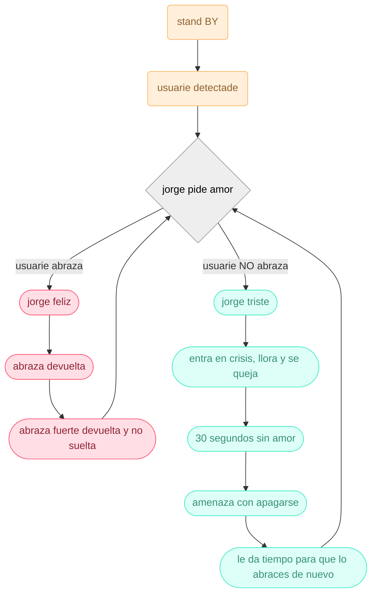

# grupo-03

## GEE: Grupo Emocionalmente Estable - Integrantes

- [Aileen D’Espessailles Rojas](https://github.com/aileendespessailles-design) 
- [Santiago Gaete Fernández](https://github.com/santiagoClifford)
- [José Morales Berríos](https://github.com/jotamorales-romulus)
- [Carla Pino Barrios](https://github.com/Coff4)
- [Francisco Stephens González](https://github.com/FranUDP) 

--- 
### Presentacion textual

El dispositivo, un muñeco con forma de mono, solicita un abrazo y se muestra amable al inicio. Una vez que abraza al usuario, se niega a soltarlo y se aferra fuertemente, haciendo que el mono desarrolle un apego ansioso. Al ser dejado en la mesa, el muñeco comienza a gritar y amenaza con autolesionarse, lo que obliga al usuario a tomarlo de nuevo. Esto genera una sensación de incomodidad al crear un bucle interminable. El concepto expone la dependencia patológica que desarrollan los animales salvajes cuando los humanos los domestican. Toda la situación se habría evitado si el usuario nunca lo hubiese tomado.

### Metafora

En este proyecto queremos transmitir como la responsabilidad humana puede ponerse en disposicion de una respuesta mecanica, generando pena, culpa y un posible intento de manipulacion, ante lo que seria la recreacion de un mono que imita ser uno verdadero. Esta respuesta mecanica deja a la persona en un bucle de apego constante que terminara siempre en tragedia sin importar que tanto cariño se le pueda dar

En varios casos, cuando se genera un vinculo afectivo con un animal, la union emocional es tan fuerte, que cuando hay un cambio en esta relacion, por ejemplo: estar fuera unos meses alejados de la mascota, provocamos una dependencia emocional en donde una de las 2 partes llega a sufrir mas, en este caso jorge. 

### carta gantt 

| Tareas / Sesión                                       | 14a | 14b | 15a | 15b | 16a | 16b | 17a | 17b |
|---------------------------------------------------------|:---:|:---:|:---:|:---:|:---:|:---:|:---:|:---:|
| Definir Proyecto                                        |  x  |  x  |     |     |     |     |     |     |
| Redacción narrativa proyecto                            |  x  |     |     |     |     |     |     |     |
| Mapa de comportamiento (flowchart emocional)            |  x  |     |     |     |     |     |     |     |
| Pruebas de sensores (ultrasonido / presión)             |     |     |  x  |  x  |     |     |     |     |
| Pruebas de motores/servos                               |     |     |  x  |  x  |     |     |     |     |
| Módulo MP3 y audios                                     |     |     |  x  |  x  |     |     |     |     |
| Definición de interacciones físicas (cómo abraza / fuerza) | x | x  |     |     |     |     |     |     |
| Diseño de prototipo (bocetos + ergonomía)              |  x  |  x  |  x   |     |     |     |     |     |
| Prototipado para distribución interna                  |     |     |  x  |  x  |     |     |     |     |
| Integración de sensores con arduino                     |    |     |  x  |  x  |     |     |     |     |
| Modelado 3D                                             |     |  x  |  x  |  x  |  x  |  x  |  x  |     |
| Pseudocódigo                                            |  x  |  x  |     |     |     |     |     |     |
| Desarrollo de código                                    |     |  x  |  x  |  x  |  x  |  x  |  x  |  x  |
| Montaje interno versión 1 (cables, servos, sensor)      |     |     |  x  |  x  |     |     |     |     |
| Prototipado parte exterior (patrones de Jorge)          |     |     |  x  |  x  |  x  |  x  |     |     |
| Elección y compra de materiales (felpa, relleno)        |     |     |     |     |  x  |  x  |     |     |
| Costura / carcasa                                       |     |     |     |  x  |  x  |  x  |  x  |  x  |
| Pruebas de interacción real con usuario                 |     |     |     |  x  |  x  |  x  |  x  |  x  |
| Ajustes de comportamiento (tolerancia, intensidad, frases) |     |     |  x  |  x  |  x   |  x  |  x  |  x  |
| Confección prototipo final                              |     |     |     |     |  x  |  x  |  x  |  x  |
| Montaje final                                           |     |     |     |     |     |     |     |     |
| Documentación Proyecto                                  |  x  |  x  |  x  |  x  |  x  |  x  |  x  |  x  |
| Redacción README                                        |  x  |  x  |  x  |  x  |  x  |  x  |  x  |  x  |

### Bill of Materials 

| Componente            | Cantidad | Valores  | Links                    | Valor                                       |        | 
|-----------------------|----------|----------|--------------------------|---------------------------------------------|--------|
| Parlante              | 1        |    3w    |https://afel.cl/products/mini-parlante-altavoz-de-3w?_pos=1&_sid=2792063ab&_ss=r|$3.000| 
| Servo motor           | 2        |   SG90   |https://afel.cl/products/micro-servomotor-sg90?_pos=2&_sid=fe0b59026&_ss=r|      |
| Sensor ultrasónico    | 1        |    5V    |https://afel.cl/products/sensor-de-ultrasonico-hc-sr04|
| Módulo MP3            | 1        |3.2 a 5 v |https://afel.cl/products/modulo-reproductor-mp3-dfplayer-mini?_pos=1&_sid=c29ea442a&_ss=r|  
| Sensor de presión     | 1        |  FSR402  |https://afel.cl/products/sensor-de-fuerza-presion-fsr402?_pos=1&_sid=3e7f88f5f&_ss=r| 
| Motor DC              | 1        |    5v    |https://afel.cl/products/3v-0-2a-12000rpm-65gcm-mini-micro-dc-motor-for|
| Mosfet                | 1        |  BS170   |https://a.aliexpress.com/_mt52yRB|

---

### Mapa de flujo:

Jorge es un robot cuya único sentido en la "vida" es ser amado. Al ser un robot, no entiende sobre sentimientos, por lo que la única forma en que es capaz de entender el amor es a través del contacto físico. Jorge pide amor amablemente, pero tiene una tolerancia a la frustración tan leve, que prefiere dejar de existir antes que asumir que dejará de ser amado. Cuando dejas de entregarle amor, jorge entrará en crisis. En primer lugar, comenzará a llorar y quejarse, cada vez más intensamente. Pasado 30 segundos sin recibir amor, se activa la alarma de seguridad que cuida a jorge del dolor por falta de amor. Se emite una alarma y una voz proclama: el mecanismo de autodestrucción se ha activado, por favor dale amor a jorge para evitar su muerte".

### Pseudocódigo

### Código

### Prototipado

### Contexto de uso 

Esta maquina esta pensada para generar incomodidad en el usuario a traves de estimulos programados para exponer una problematica.

### Instrucciones de uso:

- El usuario se acerca a Jorge (rango: 10 a 45 cm).
- Jorge detecta al usuario.
. Se reproduce uno de los 3 audios preparados invitando al usuario a acercarse.
- El usuario se aproxima y extiende su brazo a una distancia de entre 3 y 7 cm frente a Jorge.
- En ese momento, Jorge cierra sus brazos y abraza al usuario.
- La persona puede forzar su liberación del abrazo en cualquier momento.
- Tras esto, el usuario decide si volver a ofrecer su brazo o esperar un minuto (tiempo estimado entre frases) sin entrar al rango de 3 a 7 cm.
- Alternativamente, al ser invitado, el usuario puede optar por no acercarse y observar las etapas de Jorge desde la distancia.
- Al finalizar, Jorge vuelve a su posición original; el usuario puede reiniciar el ciclo o alejarse para salir del rango de detección.
