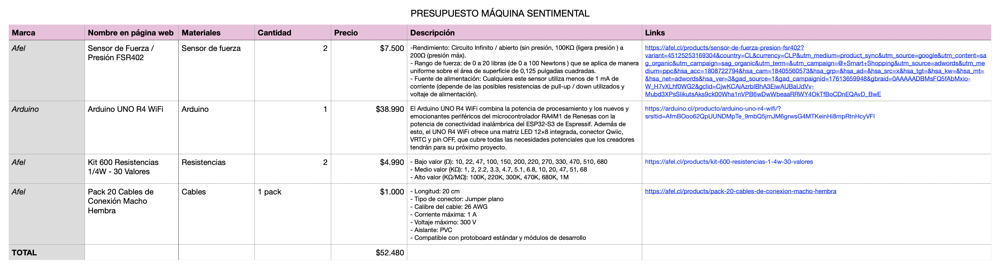
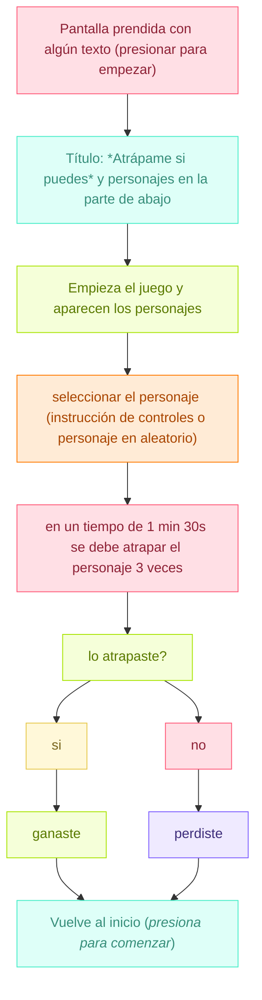

# grupo-04 - Cachureos

INTEGRANTES
- Yamna Carrión / [yamna-bit](https://github.com/yamna-bit)
- Valentina Chávez / [valechavezalb](https://github.com/valechavezalb)
- Antonia Fuentealba / [AntFuentealba](https://github.com/AntFuentealba)
- Millaray Millar / [mmillar95](https://github.com/mmillar95)
- Sofía Pérez / [sofia-perezm](https://github.com/sofia-perezm)
- Valentina Ruz / [vxlentiinaa](https://github.com/vxlentiinaa)

---

## Presentación Textual

`"Atrápame si puedes"` máquina interactiva que funciona con dos sensores de fuerza/presión. El usuario presiona los sensores para controlar una red "atrapahadas". El objetivo del juego es atrapar a las hadas.

En el juego, atrapar al personaje es totalmente posible, pero la dificultad surge del propio sistema; que sabotea al jugador con controles que funcionan al revés. La desorientación provoca una frustración cómica que pone al jugador en el límite entre el control y el caos.

La máquina representa el desajuste: el usuario quiere atrapar un objetivo claro, pero la interfaz responde de forma particular. Aparece el humor, la frustración y el esfuerzo por alcanzar una meta, donde puede torcerse por detalles ridículos y aun así seguimos intentándolo.

## Metáfora

- La máquina es una representación tecnológica del logro frustrado, esa sensación que parece estar a punto de alcanzarse, pero que se rompe por un detalle absurdo. Representa esa experiencia humana de perseguir algo que siempre se escapa (movimiento involuntario, un error, un control invertido). Una máquina que te hace sentir querer algo y perderlo por un gesto mínimo.

`Sentimientos`

- Sensación de descontrol o confusión
- Frustración cómica
- Producto del control invertido, genera: sorpresa, desorientación.
- El juego provoca risa, molestia, esfuerzo y competencia.

## Inputs y Outputs

`Inputs (entradas)`

La máquina recibe la presión aplicada por el usuario sobre los dos sensores de fuerza. Cada sensor entrega un valor analógico que indica intensidad de la presión, interpretándose como comandos de movimiento para la red atrapahadas. El sistema también recibe la intención de dirección del usuario, que se traduce en patrones de presión en dos diferentes direcciones.

1. Presión del usuario sobre los sensores FSR
   - El jugador presiona los sensores de fuerza (botones) para mover al personaje.
   - La cantidad de fuerza aplicada se traduce en velocidad o dirección.
   - Selección inicial del personaje
   - Antes de jugar, el usuario elige qué personaje quiere intentar atrapar.

La máquina toma como input la descoordinación, el error o la insistencia del jugador, todo eso afecta en cómo la red "atrapahadas" se mueve.

`Outputs (salidas)`

La máquina genera movimientos invertidos o desviados de la red según los valores recibidos, entregando desplazamientos que no coinciden con la dirección esperada por el usuario. También produce evasiones automáticas del personaje cuando detecta una presión que coincide con un intento de atrape. El resultado final son respuestas erróneas, escapes programados y un control que no deja precisión del usuario.

2. Movimiento del personaje en pantalla
   - El personaje se escapa cuando el jugador está cerca.

3. Movimiento de la red atrapahadas en pantalla
   - Red que se maneja mediante los sensores de fuerza.

4. Cambios en dirección, velocidad o animaciones del personaje.

### Bill of materials

|Nombre componente|Características|Cantidad|Especificaciones|
|---|---|---|---|
|Sensor de fuerza|FSR402|2|una resistencia que cambia su valor (en ohmios Ω) dependiendo de la cantidad que se presiona.|
|Arduino Uno|R4 minima o |1|Arduino UNO R4 Minima está armado con un potente microcontrolador de 32 bits|
|Pantalla Dell|14 pulgadas|1|pantalla de vale ruz|
|Carcasa|Impresión 3D|1|Filamento: |
|Plinto| | | |
|Cables| | | |

---

## Planificación

Como grupo planificamos que haremos en cada semana del trabajo mediante una carta gantt, vimos el presupuesto de los materiales que necesitabamos (algunos ya estaban, pero decidimos dejarlos) y por último, hicimos un diagrama de flujo del proyecto en [mermaid](https://mermaid.js.org/)

### Carta Gantt

### Presupuesto



### Diagrama de Flujo



---

## Proceso y bocetos

- Primero, teníamos esta idea de máquina sentimental, donde decidimos como grupo cambiar la propuesta ya que no nos llamaba la atención y no estabamos satisfechas con el proyecto
  - El proyecto consiste en un objeto inerte que responde al contacto directo mediante las manos, dependiendo de la intensidad de fuerza, la acción con la cual se manipule el objeto, como respuesta de este tacto, en la pantalla que esta en frente de la persona, la grafica que se proyecta (describir la gráfica) cambia justo con sonidos (describir sonidos), los cuales en conjunto generan un momento en el cual el usuario queda inmerso en el proyecto por un momento (definir cuanto tiempo).

### Ideas nuevas para proyecto

- Segundo, trabajamos el fin de semana para llegar con nuevas propuestas el día domingo 16 y definir con cual nos quedaremos.

`PROPUESTAS:`

- **Marea:** es una máquina sentimental creada para ir en contra del ritmo con el que el mundo insiste en arrastrarnos. Vivimos dentro de un movimiento constante: ruido, velocidad, exigencias que no dan espacio para sentir nada con honestidad. Esta máquina nace justamente para suspender ese flujo, para ofrecer un minuto seguro donde la persona pueda bajar la intensidad, respirar y encontrarse consigo misma sin presión.
- **La** **Máquina** **que** **Se** **Ofende** **Fácilmente:** una máquina cuyo “carácter” es extremadamente sensible. Si te acercas demasiado o la tocas con brusquedad, se “ofende”, apaga sus luces y muestra mensajes pasivo-agresivos del estilo “Ah, ok… veo que no te importo”.
  - Lejos: te “mira” con curiosidad (luces suaves, postura tranquila).
  - Normal: si te acercas con calma, la máquina se anima (cambia color, vibra levemente).
  - Ofendida: si detecta un movimiento brusco o toque fuerte, se cierra emocionalmente (luces apagadas, pantalla mostrando mensajes dramáticos). Luego de unos segundos, vuelve lentamente a su estado normal.
- **La** **Máquina** **sentimental** **que** **no** **quiere** **jugar** **contigo:** es un personaje que invita entusiastamente a jugar, pero cuando tomas su “control” activa un error intencional y se retracta. Utiliza un sensor ultrasónico para detectar cercanía y un sensor FSR en el control para identificar cuándo alguien lo toma y así gatillar la broma. Cuando la persona se aleja, el personaje vuelve a su actitud amistosa y reinicia el ciclo.

`PROPUESTA ELEGIDA`

- Máquina sentimental "Atrápame si puedes"
"BOCETOS FÍSICOS" ✅

---

## Etapas del código

- Primero, hicimos un pseudocódigo de lo que queríamos que hiciera el sensor de fuerza.

`PSEUDOCÓDIGO`

```cpp
Iniciar variables:
    estados del sensor = presion / sin presion
    objetivo = posicion inicial

Cuando el arduino esté encendido:
    
    Usuario presionar los sensores y el arduino leerá los datos de los sensores

    SI hay presion == sensor 1 leido
        mostrar_mensaje: Valor

    NO hay presion == sensor 1 leido
        mostrar_mensaje: Valor

    SI hay presion == sensor 2 leido
        mostrar_mensaje: Valor

    NO hay presion == sensor 2 leido
        mostrar_mensaje: Valor

Arduino lee los valores
    Mandar datos a p5.js
    enviar valores a p5.js

enviar valor ejeX.valorCrudo
luego enviar ejeY.valorCrudo
```

- Segundo, partimos haciendo un código en Arduino Ide, el cual lee los valores de presión de los sensores, para que después mande los datos a P5.js (Nos ayudó Aarón a ordenar el código)

### `AtrapameSiPuedes.ino`

```cpp
// incluir 1 clase para recibir datos de sensores
// incluir 1 clase para emitir datos segun eso

#include "SensorFuerza.h" // incluye las clases SensorFuerza y Puntito

SensorFuerza ejeX;
SensorFuerza ejeY;
// Puntito puntito;

void setup() {
  Serial.begin(9600);
  ejeX.configurar(A0);   // se asigna un sensor al pinA0
  ejeY.configurar(A1);   // se asigna un sensor al pinA1
}

void loop() {   // se actualiza el valor del sensor del eje X y del eje Y
  ejeX.leer();
  ejeY.leer();

  Serial.println(ejeX.valorCrudo);  // manda al serial monitor el valor crudo del sensor X
  Serial.println(ejeY.valorCrudo);

  Serial.print("valorX");
  Serial.print(",");
  Serial.println("valorY");

  delay(40);
  // enviar valores a p5
  // enviar valor ejeX.valorCrudo
  // luego enviar ejeY.valorCrudo
  // Serial.write(ejeX.valorCrudo, ejeY.valorCrudo);
}
```

### `SensorFuerza.cpp`

```cpp
#include "SensorFuerza.h"
// incluye el .h de SensorFuerza

SensorFuerza::SensorFuerza() {} //constructor

SensorFuerza::~SensorFuerza() {} // destructor

void SensorFuerza::configurar(int nuevaPatita) { // aqui se configura el sensor
  SensorFuerza::patita = nuevaPatita;
  pinMode(SensorFuerza::patita, INPUT);  // pin donde se encuentra el sensor
}

void SensorFuerza::leer() {   // funcion para leer el sensor
  SensorFuerza::valorCrudo = analogRead(SensorFuerza::patita);  // guarda el valor de la presion del sensor
                                                                // y cada vez que se llama .leer, se actualiza el valor
}
```

### `SensorFuerza.h`

```
#ifndef SENSOR_FUERZA_H // si no esta Sensor fuerza definido
#define SENSOR_FUERZA_H // aqui lo definimos 

#include <Arduino.h>  // incluimos las funciones basicas de arduino

class SensorFuerza {     // definimos la clase sensor fuerza
public:
  SensorFuerza();  // constructor
  ~SensorFuerza(); // destructor

  void configurar(int nuevaPatita); // guarda en que pin se encuentra el sensor
  void leer();  // declara la funcion para leer el sensor

  int patita;       // guarda el numero del pin (A0,A1)
  int valorCrudo;   // guarda el numero del sensor, entre 0 a 1023 (segun presion)
  int valorMapeado; 
};

#endif
```

- Tercero, cuando logramos que arduino leyera los valores de presión del sensor, comenzamos a realizar la conexión entre arduino y p5.js.
- El sketch fue con ayuda de la librería de Gohai
  
```p5.js
const BAUDRATE = 9600;  //velocidad del puerto
let port;               //variable del puerto
let connectBtn;         //boton

let sensorX = 0;        //izquierda-derecha
let sensorY = 0;        //arriba-abajo

// 0 = esperamos X, 1 = esperamos Y
let lecturaEstado = 0;

//imagenes 
let img; //imagen en png de la red atrapa mosquitos
let backImg; //imagen de misaa

//aqui es donde se cargan las imagenes y todos los recursos que utilizaremos
function preload() {
  img = loadImage("atrapar.png");
  backImg = loadImage("misaa.png");
  
}

//configuracion del lienzo
function setup() {
  createCanvas(1920, 1080); //tamaño del lienzo
  background(20); //color de fondo

  port = createSerial(); //creamos el puerto serial para la conexión
  port.bufferSize(1024); //buffer que nos permitirá leer con una velocidad adecuada los datos que entrega arduino

  //botón para conectar el arduino
  connectBtn = createButton('Conectar Arduino'); //texto para el boton
  connectBtn.position(10, 10); //posición del boton
  connectBtn.mousePressed(connectBtnClick); //al hacer clic se activa
}

function draw() {
  background(200);
  
  image(backImg, 400, 400, 200, 200); //aqui se llama a la imagen para que se pueda dibujar 

  
  //lee los valores de arduino en el formato correspondiente a p5
  let line = port.readUntil("\n"); 
  while (line && line.length > 0) {
    line = trim(line);

    // si la línea no es solo números (tiene letras, comas, etc.), la ignoramos
    if (/^\d+$/.test(line)) {
      let v = int(line);

      if (lecturaEstado === 0) {
        sensorX = v;
        lecturaEstado = 1; // la próxima numérica será Y
      } else {
        sensorY = v;
        lecturaEstado = 0; // volvemos a esperar X
      }
    }

    // leer siguiente línea del buffer (los datos)
    line = port.readUntil("\n"); //salto de linea 
  }

  // Mapear a la pantalla
  let posX = map(sensorX, 0, 1023, 0, width);
  let posY = map(sensorY, 0, 1023, height, 0); // invertido

  let imgSize = 120; // tamaño de la imagen
  imageMode(CENTER); //posicion de la imagen al centro, (CORNER) tambien funciona
  image(img, posX, posY, imgSize, imgSize); //posicion y tamaño de la imagen
  
  // tamaño, color y texto de los valores que recibe el sensor en p5, esto puede modificarse para agregar las vidas y el conteo de puntos.
  fill(180);
  textSize(14);
  text(`X: ${sensorX}`, 10, height - 30);
  text(`Y: ${sensorY}`, 10, height - 10);
  
  //agregamos la otra imagen, en este caso la de misaa
  let misaaSize = 220; // tamaño de la imagen (puedes cambiarlo)
  imageMode(CENTER);
  image(backImg);
}

//funcion para que el boton de conectar el arduino a p5 funcione al hacer clic y lea la placa
function connectBtnClick() {
  if (!port.opened()) {
    port.open(BAUDRATE);
  } else {
    port.close();
  }
}
```

### ¿Cómo conectamos Arduino con P5.js?

- Primero, vimos estos videos para entender la conexión entre Arduino y p5.js  [
Connecting p5 & Arduino through the serial port](https://www.youtube.com/watch?v=MtO1nDoM41Y) y [p5.js and Arduino serial communication - Send a digital sensor to a p5.js sketch](https://www.youtube.com/watch?v=feL_-clJQMs&t=1142s) 

- Luego, debemos probar la conexión serial. Pero antes, hay que descargar un programa intermediario que hace que pueda leer el puerto serial desde una página web, que por motivos de seguridad están bloqueados. Este es el link de descarga: (https://github.com/p5-serial/p5.serialcontrol/releases/tag/0.1.2).

`P5.serialcontrol`

- Esta aplicación ejecuta p5.serialserver, que permite la conectividad entre dispositivos serie locales y aplicaciones web mediante la biblioteca p5.serialport de p5.js.
- Nos dimos cuenta que esta aplicación no funcionaba, no encontraba el puerto serial, por lo que no se podía hacer la conexión.

INSERTAR IMAGEN

- Le pedimos ayuda a Aarón con respecto a la aplicación, nos recomendó usar otra biblioteca para poder conectar Arduino con p5.js

### `p5.webserial.js de Gohai`

(https://github.com/gohai/p5.webserial?tab=readme-ov-file#getting-started)

Esta es una biblioteca para p5.js que añade compatibilidad para interactuar con dispositivos serie mediante la API Web Serial, que actualmente está compatible con Chrome y Edge.

### ¿Cómo hacer la conexión?

- Primero hay que descargar este archivo:(https://github.com/gohai/p5.webserial/blob/main/libraries/p5.webserial.js) o pegarlo en la head del html, debajo de la línea que carga p5 en p5.js.

```cpp
<script src="https://unpkg.com/@gohai/p5.webserial@^1/libraries/p5.webserial.js"></script>
```

- Segundo crear una variable global y asignarle un nuevo puerto de serie dentro de la configuración.

```cpp
let port;

function setup() {
  port = createSerial();
  // ...
```

IMPORTANTE: los datos deben ser ordenados para que `p5.js` los entienda. Un formato recomendado es 123,456\n (dos valores separados por una coma y un salto de línea).

- p5.js escucha el puerto usando la librería:

```cpp
<script src="https://unpkg.com/@gohai/p5.webserial@^1/libraries/p5.webserial.js"></script>
```

- `p5.js` lee cada línea y actualiza las variables.
- `p5.js` usa esos valores para mover esos gráficos, como una imagen, particulas, formas, etc.
- Para que arduino envíe los datos correctos a p5 se debe utilizar el siguiente formato:

```cpp
#include "SensorFuerza.h"

SensorFuerza ejeX;
SensorFuerza ejeY;

void setup() {
  Serial.begin(9600); //puerto serial, debe coincidir con el de p5
  ejeX.configurar(A0); //pin que lee los datod del eje x
  ejeY.configurar(A1); //pin que lee los datos del eje y 
}

void loop() {
  ejeX.leer();
  ejeY.leer();

//valores crudos del sensor 
  int x = ejeX.valorCrudo;
  int y = ejeY.valorCrudo;

//lee los valores en la consola
  Serial.print(x);
  Serial.print(",");
  Serial.println(y);

  delay(40);
}
```

- lo que se imprime se ve así en el Serial Monitor:

```cpp
12,30
14,45
20,50
...
```

---

## Etapas de prototipo

## Fotografías del proyecto terminado

## Roles de equipo

## Bibliografía
