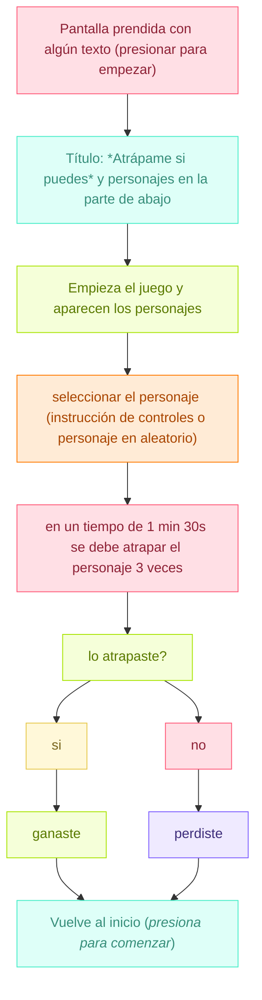

# grupo-04 - Cachureos

INTEGRANTES
- Yamna Carrión / [yamna-bit](https://github.com/yamna-bit)
- Valentina Chávez / [valechavezalb](https://github.com/valechavezalb)
- Antonia Fuentealba / [AntFuentealba](https://github.com/AntFuentealba)
- Millaray Millar / [mmillar95](https://github.com/mmillar95)
- Sofía Pérez / [sofia-perezm](https://github.com/sofia-perezm)
- Valentina Ruz / [vxlentiinaa](https://github.com/vxlentiinaa)

---

## Presentación Textual

`"Atrápame si puedes"` máquina interactiva que funciona con dos sensores de fuerza/presión. El usuario presiona los sensores para controlar una red "atrapahadas". El objetivo del juego es atrapar a las hadas.

En el juego, atrapar al personaje es totalmente posible, pero la dificultad surge del propio sistema; que sabotea al jugador con controles que funcionan al revés. La desorientación provoca una frustración cómica que pone al jugador en el límite entre el control y el caos.

La máquina representa el desajuste: el usuario quiere atrapar un objetivo claro, pero la interfaz responde de forma particular. Aparece el humor, la frustración y el esfuerzo por alcanzar una meta, donde puede torcerse por detalles ridículos y aun así seguimos intentándolo.

## Metáfora

- La máquina es una representación tecnológica del logro frustrado, esa sensación que parece estar a punto de alcanzarse, pero que se rompe por un detalle absurdo. Representa esa experiencia humana de perseguir algo que siempre se escapa (movimiento involuntario, un error, un control invertido). Una máquina que te hace sentir querer algo y perderlo por un gesto mínimo.

`Sentimientos`

- Sensación de descontrol o confusión
- Frustración cómica
- Producto del control invertido, genera: sorpresa, desorientación.
- El juego provoca risa, molestia, esfuerzo y competencia.

## Inputs y Outputs

`Inputs (entradas)`

La máquina recibe la presión aplicada por el usuario sobre los dos sensores de fuerza. Cada sensor entrega un valor analógico que indica intensidad de la presión, interpretándose como comandos de movimiento para la red atrapahadas. El sistema también recibe la intención de dirección del usuario, que se traduce en patrones de presión en dos diferentes direcciones.

1. Presión del usuario sobre los sensores FSR
   - El jugador presiona los sensores de fuerza (botones) para mover al personaje.
   - La cantidad de fuerza aplicada se traduce en velocidad o dirección.
   - Selección inicial del personaje
   - Antes de jugar, el usuario elige qué personaje quiere intentar atrapar.

La máquina toma como input la descoordinación, el error o la insistencia del jugador, todo eso afecta en cómo la red "atrapahadas" se mueve.

`Outputs (salidas)`

La máquina genera movimientos invertidos o desviados de la red según los valores recibidos, entregando desplazamientos que no coinciden con la dirección esperada por el usuario. También produce evasiones automáticas del personaje cuando detecta una presión que coincide con un intento de atrape. El resultado final son respuestas erróneas, escapes programados y un control que no deja precisión del usuario.

2. Movimiento del personaje en pantalla
   - El personaje se escapa cuando el jugador está cerca.

3. Movimiento de la red atrapahadas en pantalla
   - Red que se maneja mediante los sensores de fuerza.

4. Cambios en dirección, velocidad o animaciones del personaje.

---

## Planificación

Como grupo planificamos que haremos en cada semana del trabajo mediante una carta gantt, vimos el presupuesto de los materiales que necesitabamos (algunos ya estaban, pero decidimos dejarlos) y por último, hicimos un diagrama de flujo del proyecto en [mermaid](https://mermaid.js.org/)

### Carta Gantt

### Diagrama de Flujo

### Presupuesto

---

## Proceso y bocetos

- Primero, teníamos esta idea de máquina sentimental, donde decidimos como grupo cambiar la propuesta ya que no nos llamaba la atención y no estabamos satisfechas con el proyecto
  - El proyecto consiste en un objeto inerte que responde al contacto directo mediante las manos, dependiendo de la intensidad de fuerza, la acción con la cual se manipule el objeto, como respuesta de este tacto, en la pantalla que esta en frente de la persona, la grafica que se proyecta (describir la gráfica) cambia justo con sonidos (describir sonidos), los cuales en conjunto generan un momento en el cual el usuario queda inmerso en el proyecto por un momento (definir cuanto tiempo).

### Ideas nuevas para proyecto

- Segundo, trabajamos el fin de semana para llegar con nuevas propuestas el día domingo 16 y definir con cual nos quedaremos.

`PROPUESTAS:`

- **Marea:** es una máquina sentimental creada para ir en contra del ritmo con el que el mundo insiste en arrastrarnos. Vivimos dentro de un movimiento constante: ruido, velocidad, exigencias que no dan espacio para sentir nada con honestidad. Esta máquina nace justamente para suspender ese flujo, para ofrecer un minuto seguro donde la persona pueda bajar la intensidad, respirar y encontrarse consigo misma sin presión.
- **La** **Máquina** **que** **Se** **Ofende** **Fácilmente:** una máquina cuyo “carácter” es extremadamente sensible. Si te acercas demasiado o la tocas con brusquedad, se “ofende”, apaga sus luces y muestra mensajes pasivo-agresivos del estilo “Ah, ok… veo que no te importo”.
  - Lejos: te “mira” con curiosidad (luces suaves, postura tranquila).
  - Normal: si te acercas con calma, la máquina se anima (cambia color, vibra levemente).
  - Ofendida: si detecta un movimiento brusco o toque fuerte, se cierra emocionalmente (luces apagadas, pantalla mostrando mensajes dramáticos). Luego de unos segundos, vuelve lentamente a su estado normal.
- **La** **Máquina** **sentimental** **que** **no** **quiere** **jugar** **contigo:** es un personaje que invita entusiastamente a jugar, pero cuando tomas su “control” activa un error intencional y se retracta. Utiliza un sensor ultrasónico para detectar cercanía y un sensor FSR en el control para identificar cuándo alguien lo toma y así gatillar la broma. Cuando la persona se aleja, el personaje vuelve a su actitud amistosa y reinicia el ciclo.

`PROPUESTA ELEGIDA`

"BOCETOS FÍSICOS" ✅

---

## Etapas del código

## Etapas de prototipo

## Fotografías del proyecto terminado

## Roles de equipo

## Bibliografía
