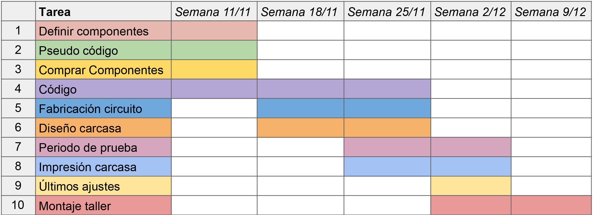

# * ༄˖°. Máquina asombrosa - Grupo 05݁ .ೃ ࿔ * 

## Integrantes del equipo

- [Braulio Figueroa](https://github.com/brauliofigueroa2001) - Investigador y redactor
- [Camila Parada](https://github.com/Camila-Parada) - Diseño gráfico y registro
- [Félix Rodríguez](https://github.com/felix-rg416) - Modelado e impresión 3D
- [Miguel Vera](https://github.com/MiguelVera23) - Códigos y circuito

***
## Introducción

***

## Cuerpo de la obre: sentimiento y metáfora

***

## Planificación

Texto

### ⋅⋯⋯⋅ Carta Gant ⋅⋯⋯⋅

Para poder programar de forma más estratégica el avance y desarrollo del proyecto en cuestión es que se creó la siguente carta.

### ⋅⋯⋯⋅ Pseudocódigo ⋅⋯⋯⋅

Texto

### ⋅⋯⋯⋅ Diagrama de flujo ⋅⋯⋯⋅

Texto

### ⋅⋯⋯⋅ Bill of Materials ⋅⋯⋯⋅

| Componentes | Tipo | Qty | Valor/tipo | Precio | Link |
|-------------|------|-----|------------|--------|------|
| Arduino UNO R4 Mínima | Tarjetas de Desarrollo | 1 | 5V | $24.990 | https://mcielectronics.cl/shop/product/arduino-uno-r4-minima |
| Mini Protoboard 400 Puntos | Conexión | 1 | 10.000 inserciones | $1.500 | https://afel.cl/products/mini-protoboard-400-puntos |
| Pack 60 Cables Dupont | Conexión | Varios | 300 V | $2.500 | https://afel.cl/products/pack-60-cables-de-conexion |
| Encoder rotatorio KY-040 360 grados | Sensor | 1 | 5V | $2.000  | https://afel.cl/products/encoder-rotatorio-ky-040-360-grados |
| Modulo reproductor MP3 | Actuador | 1 | 3.2 a 5V | $2.990 | https://afel.cl/products/modulo-reproductor-mp3-dfplayer-mini |
| Motor vibrador PWM Switch DC | Actuador | 1 | 3 a 5.3 VDC | $2.000 | https://afel.cl/products/motor-vibrador-pwm-switch-dc |
| Mini humidificador USB tipo C de 5V | Actuador | 1 | 5V | $ 5.900 | https://www.tienda8.cl/mas-productos/humidificador-aire-domestico-generador-de-niebla-usb-5v-diy |
| Micro Servomotor SG90 | Actuador | 1 |  3 a 7.2 V | $1.990 | https://afel.cl/products/micro-servomotor-sg90 |
| Mini Parlante Altavoz de 3w | Salida audio | 1 | 3 VDC | $3.000 | https://afel.cl/products/mini-parlante-altavoz-de-3w |
| Pack Led 10mm (5) | Actuador | Varios | 1.9 a 3.2 V | $3.033 a $3.156 | https://www.electroart.cl/3376/5x-pack-led-10mm |

#### Materiales y herramientas extra

- Cautín
- Estaño
- Pasta de soldar
- Cinta aislante
- Destornillador
- Tornillos
- Cable USB C

### ⋅⋯⋯⋅ Instrucciones ⋅⋯⋯⋅

Antes de hacer funcionar el aparato hay que corroborar que este se encuentre conectado a una fuente de alimentación de 5V aprox. con un cable tipo USB C  (computador o corriente con un adaptador). Para saber si está encendido basta con ver si se enciende un led.

1. Ponerse frente a la máquina y sujetar la manibela.
2. Girar la manivela en sentido horario.
3. Ver cómo las luces se encienden progresivamente y escuchar el sonido que indica haber avanzado 1 nivel.
4. Seguir girando de forma continua. 

### ⋅⋯⋯⋅ Contexto de uso ⋅⋯⋯⋅

Esta máquina está para ser pensada como un "Artículo de broma". 

***

## Desarrollo circuito

Texto

### ⋅⋯⋯⋅ Construcción ⋅⋯⋯⋅

Texto

### ⋅⋯⋯⋅ Código ⋅⋯⋯⋅

Texto

***
/
⚡︎ ⋆.˚
