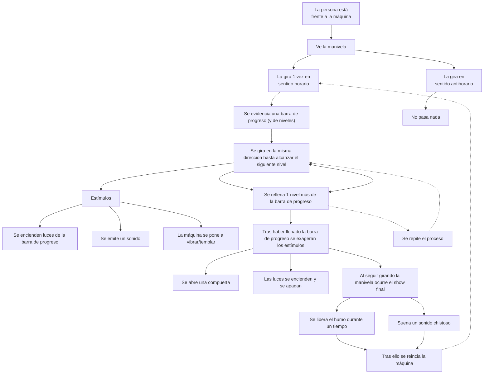

# * ༄˖°. Máquina asombrosa - Grupo 05݁ .ೃ ࿔ * 

## Integrantes del equipo

- [Braulio Figueroa](https://github.com/brauliofigueroa2001) - Investigador y redactor
- [Camila Parada](https://github.com/Camila-Parada) - Diseño gráfico y registro
- [Félix Rodríguez](https://github.com/felix-rg416) - Modelado e impresión 3D
- [Miguel Vera](https://github.com/MiguelVera23) - Códigos y circuito

***
## Introducción

Para la última etapa del año es que se enfocó en la producción de una “máquina sentimental”. 

Esta idea es un constructo que combina los conocimientos vistos a lo largo del semestre (referente al desarrollo de mecanismos fabricados con la tecnología de Arduino, actuadores y sensores) en conjunto con rasgos y reacciones psicofisiológicas como lo son las emociones. Esta última se define como [“Alteración del ánimo intensa y pasajera (agradable o penosa) que va acompañada de cierta conmoción somática (relacionado con el cuerpo)”](https://dle.rae.es/emoci%C3%B3n).  

El eje de todo el proyecto se centra conseguir un resultado que involucre al usuario y genere una respuesta en torno a la interacción entre ambas partes (objeto/máquina – emoción; acción – reacción; causa - efecto).

Al tener libertad acerca de la propuesta es que como equipo se llegó al objetivo de crear una experiencia que tenga como efecto el generar decepción al usuario, trabajando mediante la metáfora de "vender humo".  

***

## Cuerpo de la obra: sentimiento y metáfora

La expresión coloquial “Vendehúmos” se refiere una persona que ofrece un objeto de nulo o escaso valor (con promesas difíciles de cumplir) con mala fe, usualmente buscando sacar ventaja frente a los incautos. 

El contexto de nuestro proyecto se centra trabajar con esta metáfora del engaño de una forma literal. Esperamos generar *decepción* por parte de nuestros usuarios tras pasar por una serie de procesos para activar los distintos mecanismos presentes en la máquina, los cuales tras estimular de forma continua los distintos sentidos (vista, audición y tacto) se desactiven para dar paso a un falso humo (concentrado seguro). Para ello es fundamental el poder crear un “gancho” (elemento atractivo) que mantenga al usuario constantemente manipulado la máquina.
La *decepción* viene tras traicionar la *expectativa* del usuario frente la incertidumbre de la función real de la máquina y posterior uso para descubrirlo, por lo que no podemos tener una sin la otra. 

El primer paso para ello es hacer que el usuario “espere algo” de la máquina, poniendo especial énfasis en las características físicas del objeto para generar una primera buena impresión, ya que sin la expectativa del resultado no se producirán los efectos esperados. A la par, es importante el mantener un incentivo a cambio del esfuerzo invertido por hacer funcionar la máquina mediante una manivela. Para ello se establecerá una “deuda visual” a través de un “medidor de progreso”, el cual tras ir completando los niveles irá aumentando y activando “recompensas” (sonido y vibración). 

El usuario puede evidenciar que en un corto plazo sus acciones tienen efectos en la máquina, cuyas pistas dirigen las expectativas hacia un gran clímax tras completar la secuencia:

1. Usuario aprenderá que al girar la manivela en sentido horario se encienden luces y suena un sonido para denotar el progreso.
2. Más luces se irán encendiendo según el “nivel” a medida que más giros de la manivela haya. Al haber una cantidad limitada indica que hay un final.
3. Se añadirán elementos al alcanzar *milestones*(hitos) de progreso como vibración, compuertas que se abren o sonidos cambiantes.
4. Al completar la cantidad de vueltas las luces harán un juego visual (algunas se encienden, mientras unas se apagan) para preparar al usuario para una “sorpresa inminente”.
5. El tiempo y esfuerzo del usuario se verá traducido en un evento final de la máquina, la cual libera un poco de humo y reproduce un sonido patético.
6. Tras ello la máquina se reinicia junto con el contador. Ello deja al usuario confundido, frustrado o decepcionado tras darse cuenta que la máquina te vendió humo (literal).

La emoción resultante (variante según la persona) no será devastadora, puesto que la estructura de la interacción en conjunto con el final se asemeja a un mal chiste. Nuestra misión se habrá cumplido si el usuario llega al final de la interacción, ya que significa que logramos hacer que "compre el humo" de una máquina estática, sin leyenda y demandante. Queremos aprovechar rasgos de las personas como la curiosidad y la energía para "desperdiciar" el esfuerzo/tiempo ya invertido (esto último queda a criterio del usuario).

***

## Planificación y procesos previos

Para poder trabajar en el proyecto de forma más estratégica y ordenada es que se denomina esta sección en la que existen una serie de pasos previos para planificar, redefinir y hacer converger las ideas de nuestro equipo.

### ⋅⋯⋯⋅ Carta Gant ⋅⋯⋯⋅

Documento que expone el cronograma semanal y las etapas de trabajo a la que se asigna cada semana.

### ⋅⋯⋯⋅ Pseudocódigo ⋅⋯⋯⋅

Los componentes definidos para nuestra máquina son los siguientes:

- A) Manivela/encoder
- B) MP3 y parlante
- C) Luces LEDs
- D) Humidificador
- E) Motor vibrador
- F) Servomotor/compuerta

#### A) Manivela/encoder
1. Definir valores que indiquen que se dió una vuelta.
2. Vueltas de manivela alimentan un contador.
3. Vueltas horarias suman y antihorarias restan.
4. Establecer hitos (cantidad de vueltas) que activan actuadores e indican progreso.
5. Cantidad suficiente de vueltas de la manivela activan el humo.
6. Ejemplo: 15%, 30%, 60%, 80%, 100%. Porcentaje de avance de giros necesarios para llegar a climax.

#### B) MP3 y parlante
1. Ligar a número de vueltas de la palanca.
2. Asociar volumen o audio variable según cantidad de vueltas.
3. Establecer audio cuando se complete la interacción. Enuncia salida del humo.
4. Establecer instancia en la que suena cada audio. En este caso cuando se pasa por el punto superior de la manivela suena el audio (0,5 seg).
5. Audio cambia dependiendo del paso en el que se encuantra
6. Siempre se reproduce el audio correspondiente al estado de avance actual. Si se gira la manivela de manera antihoraria se regresa al sonido anterior.
7. Al llegar al climax se reproduce audio distinto más largo (5 seg mínimo)
8. Se reinicia

#### C) Luces LEDs
1. Instalar todas las led en fuente de energía
2. Establecer cuando se enciende cada led y cuánto se mantiene encendida
3. Establecer pasos según valores de manivela
4. Se prende una luz al alcanzar el paso siguiente
5. Al llegar al final las luces titilan 
6. Interacción inicia con una luz prendida
7. Vuelve a una luz prendida al completar interacción

#### D) Humidificador
1. Asociar a último paso (100%)
2. Definir cantidad de vapor/tiempo de activación
3. Suelta vapor al alcanzar suficiente cantidad de vueltas.
4. Se reinicia

#### E) Motor vibrador
1. Asociar a valores de pasos determinados alcanzados por manivela
2. En un punto medio de progreso (60%) se activa y aumenta su intensidad a medida que avanza
3. Se desactiva nuevamente al completar la interacción
4. Se reinicia

#### F) Servomotor/compuerta
1. Asociar a bomba de agua y completar los giros de manivela.
2. Abre una compuerta para dejar salir el humo
3. Queda abierta brevemente y se vuelve a cerrar
4. Se resetea

#### Requisitos de código

- Valores de la manivela (almacenados en int) dictan lo que ocurre con los actuadores. Se ordenan con rangos de valor según avance.
- Giros horarios suman, giros antihorarios restan.
- Sonidos se activan y se reproducen
- Luces se activan y se mantienen activados
- Humidificador suelta humo de manera rápida y certera

### ⋅⋯⋯⋅ Diagrama de flujo ⋅⋯⋯⋅

### ⋅⋯⋯⋅ Bill of Materials ⋅⋯⋯⋅

| Componentes | Tipo | Qty | Valor/tipo | Precio | Link |
|-------------|------|-----|------------|--------|------|
| Arduino UNO R4 Mínima | Tarjetas de Desarrollo | 1 | 5V | $24.990 | https://mcielectronics.cl/shop/product/arduino-uno-r4-minima |
| Mini Protoboard 400 Puntos | Conexión | 1 | 10.000 inserciones | $1.500 | https://afel.cl/products/mini-protoboard-400-puntos |
| Pack 60 Cables Dupont | Conexión | Varios | 300 V | $2.500 | https://afel.cl/products/pack-60-cables-de-conexion |
| Encoder rotatorio KY-040 360 grados | Sensor | 1 | 5V | $2.000  | https://afel.cl/products/encoder-rotatorio-ky-040-360-grados |
| Modulo reproductor MP3 | Actuador | 1 | 3.2 a 5V | $2.990 | https://afel.cl/products/modulo-reproductor-mp3-dfplayer-mini |
| Motor vibrador PWM Switch DC | Actuador | 1 | 3 a 5.3 VDC | $2.000 | https://afel.cl/products/motor-vibrador-pwm-switch-dc |
| Mini humidificador USB tipo C de 5V | Actuador | 1 | 5V | $ 5.900 | https://www.tienda8.cl/mas-productos/humidificador-aire-domestico-generador-de-niebla-usb-5v-diy |
| Micro Servomotor SG90 | Actuador | 1 |  3 a 7.2 V | $1.990 | https://afel.cl/products/micro-servomotor-sg90 |
| Mini Parlante Altavoz de 3w | Salida audio | 1 | 3 VDC | $3.000 | https://afel.cl/products/mini-parlante-altavoz-de-3w |
| Pack Led 10mm (5) | Actuador | Varios | 1.9 a 3.2 V | $3.033 a $3.156 | https://www.electroart.cl/3376/5x-pack-led-10mm |

#### Materiales y herramientas extra

- Cautín
- Estaño
- Pasta de soldar
- Cinta aislante
- Destornillador
- Tornillos
- Cable USB C

### ⋅⋯⋯⋅ Instrucciones ⋅⋯⋯⋅

Antes de hacer funcionar el aparato hay que corroborar que este se encuentre conectado a una fuente de alimentación de 5V aprox. con un cable tipo USB C  (computador o corriente con un adaptador). Para saber si está encendido basta con ver si se enciende un led.

1. Ponerse frente a la máquina y sujetar la manibela.
2. Girar la manivela en sentido horario.
3. Ver cómo las luces se encienden y escuchar el sonido que indica haber avanzado 1 nivel.
4. Seguir girando de forma continua hasta avanzar al siguiente nivel.
5. Tras a la mitad de todos los niveles, la máquina comienza a vibrar y emitir sonidos distontos.
6. Seguir girando la manivela sin parar, independiente de las cosas que ocurran.
7. Girar hasta que se rellene la barra de progreso y se habra la compuerta secreta.
8. Admirar el humo que emana.
9. Comenzar todo otra vez.

### ⋅⋯⋯⋅ Contexto de uso ⋅⋯⋯⋅

El artefacto no ha sido planificado para utilizarlo en un entorno preciso (o situación en particular), sin embargo, al momento de ahondar y reflexionar sobre el contexto en el que podría funcionar serán en espacios libres de formalidad en los que se pueda presentar como una *sorpresa* sin generar efectos adversos en los usuarios. Por ejemplo, emociones como la ira, tristeza, entre otros.

Si bien la intención principal es ocasionar decepción, no es con intenciones malintencionadas ni perversas, puesto que se explora lo *irónico* y chistoso ante la experiencia: ir creando e incrementado una expectativa ante el misterio de la funcionalidad de la máquina cuyo desenlace se activa tras el intercambio entre esfuerzo físico para liberar humo.

***

## Desarrollo circuito

Texto

### ⋅⋯⋯⋅ Construcción ⋅⋯⋯⋅

Texto

### ⋅⋯⋯⋅ Código ⋅⋯⋯⋅

Texto

***
/
⚡︎ ⋆.˚
