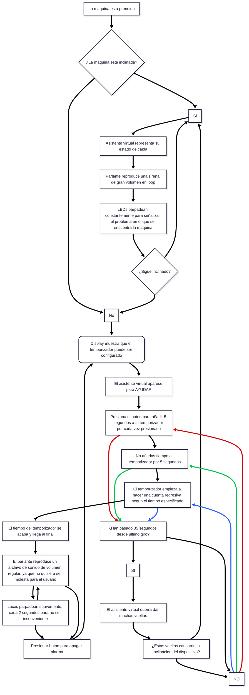
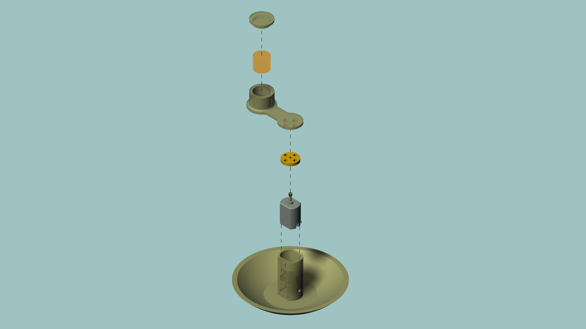
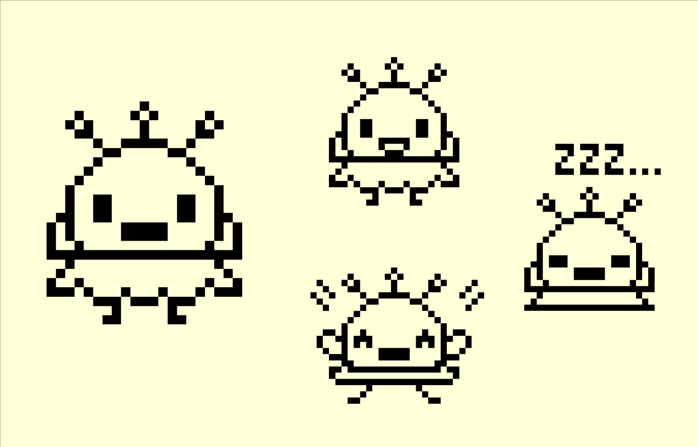

# Grupo-06 Waos

## Proyecto-03

**Integrantes**

- Bernardita Jesús / [Bernardita-Jesus](https://github.com/Bernardita-Jesus)

- Sebastian Saez / [SebastianSaez1003](https://github.com/SebastianSaez1003)

- Morgan Aravena / [Mosswhosmoss](https://github.com/Mosswhosmoss)

- Angela O'Ryan / [Hiinalia](https://github.com/Hiinalia)

- Camila Delgado / [notcaamila](https://github.com/notcaamila)

- Josefa Quape / [Joquape](https://github.com/Joquape)

## Presentación textual

### Descripción general

“Weona Entidad de Balance Ovoide”

WEBO es un temporizador inconveniente.

Está pensado para una persona que necesita temporizar intervalos cortos o variables, desde 5 segundos en adelante, según la demanda de su actividad.

WEBO funciona gracias a Ava, el ave del paraíso en su interior, ella se encargará de recordar el tiempo en el que debería sonar la alarma que es manejada por el temporizador.

Pero, Ava se aburre simplemente realizando la cuenta regresiva del temporizador, así que cada cierto tiempo, se pondrá a bailar, haciendo piruetas de una manera tan intensa que… WEBO se puede caer de lado, esto es muy malo, porque Ava detesta estar en esa posición, por lo que hará sonar una alarma de alto volumen, para avisarle al usuario que algo malo ocurrió.

### Sentimiento

El sentimiento central del proyecto es **la frustración.**

Esto se evidencia durante toda la interacción que tenga el usuario con WEBO, porque desde el momento que se enciende, no sólo activa un temporizador, lo hace responsable de Ava, lo que implica **estar pendiente, observando y ansioso de que se pueda caer.**

En cambio en un temporizador común, el usuario activa el conteo y confía en no tener que estar pendiente del paso del tiempo ya que le avisará a uno en el momento justo.

Con WEBO esa lógica no funciona porque también pone en juego la capacidad de estar atento. Hace que el usuario esté consciente del tiempo al punto de la frustración.

Esto surge porque la alarma se convierte en una acusación de que el usuario falló , ya no se trata de que pasen los 5 segundos, sino que no ocurra otra caída.

WEBO transforma una acción simple en una experiencia molesta, mostrando cómo la frustración puede hacer que un **objeto útil se vuelva una carga.**

## Inputs y Outputs

### Inputs

- Sensor de inclinación tilt
- Botón

### Outputs

- Display LCD Nokia 5110
- Mini parlante altavoz
- Mini motor DC alta velocidad
- Modulo reproductor mp3
- Luces LED

## Carta Gantt

| Objetivo / Sesión                          | 14a - 11nov | 14b - 14 nov | 15a - 18 nov | 15b - 21 nov | 16a - 25 nov | 16b - 28 nov | 17a - 02 dic | 17b - 05 dic |
|--------------------------------------------|:-----------:|:------------:|:------------:|:------------:|:------------:|:------------:|:------------:|:------------:|
| Conceptualización clara y escrita          |      ✅️      |              |              |              |              |              |              |              |
| Diagrama de flujo usuario                  |      ✅️      |       ✅️      |              |              |              |              |              |              |
| Investigación de uso de componentes        |      ✅️      |       ✅️      |              |              |              |              |              |              |
| Estudio referentes gráficos                |      ✅️      |       ✅️      |              |              |              |              |              |              |
| Comprobar funcionalidad componentes        |             |       ✅️      |              |              |              |              |              |              |
| Definición y boceteado de Pantallas        |             |       ✅️      |       ✅️      |              |              |              |              |              |
| Investigación materialidad carcasa         |             |       ✅️      |       ✅️      |              |              |              |              |              |
| Medir componentes para diagramar           |             |       ✅️      |       ✅️      |              |              |              |              |              |
| Maqueteo de la propuesta de carcasa        |             |       ✅️      |       ✅️      |       ✅️      |              |              |              |              |
| Integración componentes a código           |             |       ✅️      |       ✅️      |       ✅️      |              |              |              |              |
| Correcciones ortográficas comentarios      |             |              |       ✅️      |       ✅️      |              |              |       ✅️      |       ✅️      |
| Discurso Proyecto 03                       |             |              |       ✅️      |       ✅️      |              |              |              |              |
| Exploración material                       |             |              |       ✅️      |       ✅️      |       ✅️      |              |              |              |
| Programación de uso simultáneo componentes |             |              |       ✅️      |       ✅️      |       ✅️      |              |              |              |
| Prototipado Carcasa                        |             |              |       ✅️      |       ✅️      |       ✅️      |              |              |              |
| 30% de gráficas en estado final            |             |              |              |       ✅️      |       ✅️      |              |              |              |
| Implementación de Millis                   |             |              |              |       ✅️      |       ✅️      |       ✅️      |       ✅️      |              |
| 60% de gráficas en estado final            |             |              |              |              |       ✅️      |       ✅️      |              |              |
| 90% de gráficas en estado final            |             |              |              |              |              |              |       ✅️      |              |
| 100% de gráficas en estado final           |             |              |              |              |              |              |              |       ✅️      |
| Fabricación de las carcasa Final           |             |              |              |              |              |              |       ✅️      |       ✅️      |
| Discurso Examen                            |             |              |              |              |              |              |       ✅️      |       ✅️      |
| Entrega proyecto 03                        |             |              |              |       ✅️      |              |              |              |              |
| Documentación fotográfica y audiovisual    |      ✅️      |       ✅️      |       ✅️      |       ✅️      |       ✅️      |       ✅️      |       ✅️      |       ✅️      |
| Documentación en GitHub                    |      ✅️      |       ✅️      |       ✅️      |       ✅️      |       ✅️      |       ✅️      |       ✅️      |       ✅️      |


## Diagrama de Flujo



## Presupuesto

| Componente                        | Cantidad | Precio | Proveedor                                                               |
|-----------------------------------|----------|--------|-------------------------------------------------------------------------|
| Módulo sensor de inclinación tilt | 1        | $1496  | https://altronics.cl/switch-inclinacion-sw520                           |
| Módulo reproductor MP3            | 1        | $2990  | https://afel.cl/products/modulo-reproductor-mp3-dfplayer-mini           |
| Pantalla display LCD Nokia 5110   | 1        | $5000  | https://afel.cl/products/pantalla-display-lcd-nokia-5110                |
| Mini parlante altavoz 3w          | 1        | $3000  | https://afel.cl/products/mini-parlante-altavoz-de-3w                    |
| Botón táctil 12x12x7.3            | 1        | $100   | https://afel.cl/products/boton-tactil-tapa-12x12x7-3-interruptor        |
| Motor DC alta velocidad           | 1        | $500   | https://afel.cl/products/3v-0-2a-12000rpm-65gcm-mini-micro-dc-motor-for |
| Cables dupont                     |          | $2500  | https://afel.cl/products/pack-60-cables-de-conexion                     |
| Cables dupont entrada salida      |          | $1000  | https://afel.cl/products/pack-20-cables-de-conexion-macho-hembra        |
| Resistencia 10k                   | 7        | $4990  | https://afel.cl/products/kit-600-resistencias-1-4w-30-valores           |
| Diodo Rectificador 1N4007         | 1        | $100   | https://www.electroardu.cl/diodo-rectificador-1n4007                    |
| MOSFET BS170 tipo N TO92          | 1        | $200   | https://depaquete.cl/index.php                                          |

**Presupuesto estimado total – 21.876**

Gasto real del equipo – 6.400

## Código

Para empezar con el pseudocódigo lo dimos todo, escribiendo todos los sensores que íbamos a utilizar, como también un archivo de créditos y archivo para establecer el cableado.

Este pseudocódigo se puede encontrar en el WEBO_EMPOLLANDO

A continuación se realizó una prueba de cada uno de los componentes:

Empezando por el sensor tilt, el cual era relativamente simple de utilizar ya que solo necesitaba alimentación de 5V, conexión a ground y un pin hacia el arduino donde se pueda recibir el estado de si está inclinado o no.

 ```cpp

// establecer el pin que será conectado
// el sensor para obtener su dato
int pinSensor = 8;
// crear una variable booleana para establecer
// si hay inclinación o no presente
bool parado;

// lo que es necesario para los funcionamientos en void loop
void setup()
{
// establecer que el pin llamado pinSensor va a ser un input
  pinMode(pinSensor,INPUT);
// comenzar la comunicación serial
  Serial.begin(9600);
}

// aqui ocurre todos los funcionamientos del código
void loop()
{
  // si se recibe una señal desde el pinSensor
  if(digitalRead(pinSensor))
  {
    // significa que esta de lado
    parado = false;
     }
      else {
      // sino significa que está parado
      parado = true;
       }

// si es que está parado
if (parado){
  Serial.println("estoy hacia arriba");
  Serial.println(parado);
  delay(1000);
}
// si es que no está parado
else if (!parado){
  Serial.println("estoy de lado");
  Serial.println(parado);
  delay(1000);
  }
}

```


El siguiente componente fue el motor, el cual necesitaba un circuito pwm para su uso correcto, después conectarlo a la alimentación y con un pin se enviará una señal que realizará su giro.

 ```cpp
// pin al que será conectado el motor para ser controlado
int motorPin = 9;

void setup() {
  //establecer que el pin que va a mandar una señal
  // será el que fue declarado antes
  pinMode(motorPin, OUTPUT);
}

void loop() {
  // manda una señal de encendido
  digitalWrite(motorPin, HIGH);  
  // cada 2 segundos
  delay(2000);                  

  //apaga la señal
  digitalWrite(motorPin, LOW);  
  // cada 2 segundos
  delay(2000);                  
}

 ```

Después fue el display, que causó unos problemas iniciales debido a la manera en la que estaba soldada a unos pines, pero luego funcionó de la manera correcta, teniendo en cuenta que para todos los pines, excepto los de alimentación, eran necesarias resistencias de 10k ohm, donde pudimos hacer display del ejemplo de la biblioteca de adafruit.

 ```cpp

#ifndef ACTUADOR_DISPLAY_H
#define ACTUADOR_DISPLAY_H

// INCLUIR BIBLIOTECAS DE USO PARA SENSOR/ACTUADOR

#include <SPI.h>
#include <Adafruit_GFX.h>
#include <Adafruit_PCD8544.h>
#include <Arduino.h>

// CREAR LA CLASE DE NUESTRO SENSOR/ACTUADOR
  class ActuadorDisplay {
  public:
  ActuadorDisplay();

   // especificar todos los voids que serán utilizados en el archivo.cpp
      void configuracionDisplay();
     
      void funcionaDisplay();

   // si es que se necesitas especificar variables, deberían ir aqui
   // ya sean bool int, ect.
   
  // Declarar objeto "LCD" para el software SPI
     Adafruit_PCD8544 display = Adafruit_PCD8544(8, 7, 6, 5, 4);

  // Definir la variable de "rotatetext" en "1" que hace que la pantalla muestre el texto en un ángulo de 90° a la derecha
     int rotatetext = 1;

   int waoses = 10;

 ```

El botón fue lo que seguía, que realmente como era probablemente el componente más simple, fue integrado directamente en el código principal donde se le aplicó alimentación y 
se le asignó un pin específico para que el arduino recibiera la señal.

```cpp

#ifndef SENSOR_BOTON_H
#define SENSOR_BOTON_H


// INCLUIR BIBLIOTECAS DE USO PARA SENSOR/ACTUADOR
 #include <arduino.h>

// CREAR LA CLASE DE NUESTRO SENSOR/ACTUADOR
  class SensorBoton {
  public:
  SensorBoton();
// especificar todos los voids que seran utilizados en el archivo.cpp
  void configuracionBoton();
  void funcionaBoton();

// si es que se necesitas especificar variables, deberian ir aqui
// ya sean bool int, ect.

  bool estadoBoton = false;

  int botonPin = 11;

  int segundos = 0;

  int minutos = 0;

 ```

Lo último fue el reproductor mp3 que nos causó la mayor cantidad de problemas, eventualmente funcionando al ser conectado en los pines 2 y 3 del arduino, teniendo los archivos de sonido en un formato específico de 0001.mo3 haber formateado la tarjeta SD montoneras de veces, pero con el siguiente codigo funciono:

 ```cpp

#include <SoftwareSerial.h>
#include <DFRobotDFPlayerMini.h>

SoftwareSerial dfSerial(2, 3); // RX, TX
DFRobotDFPlayerMini player;

void setup() {
  Serial.begin(115200);
  dfSerial.begin(9600);

  Serial.println("Initializing DFPlayer...");

  if (!player.begin(dfSerial)) {
    Serial.println("Unable to begin. Check:");
    Serial.println("1. Wiring");
    Serial.println("2. SD card FAT32");
    Serial.println("3. Voltage divider on RX");
    while (true);
  }

  Serial.println("DFPlayer online!");
  player.volume(3);
}

void loop() {
player.play(1);
delay(4000);

}

 ```

## Registro de funcionamiento 

[](https://www.youtube.com/watch?v=F-Iz8zrodOM)

[](https://www.youtube.com/watch?v=Xz0-hmiEhX4)

## Prototipo

Para el prototipo planteamos una carcasa con **morfología ovoide**, generada a partir de un volumen continuo y sin aristas para favorecer el **movimiento pendular**. En la base incorporamos un corte leve que actúa como punto de **apoyo inestable**, permitiendo que el objeto se mantenga de pie solo por un momento antes de perder el equilibrio.

En la superficie frontal se integrará la **pantalla que muestra a Ava**, funcionando como interfaz visual principal. A un costado se ubicará el **botón destinado a sumar tiempo al temporizador**, considerando ergonomía mínima y acceso directo.

En la parte superior se incorporará una serie de **aberturas pequeñas, dimensionadas para que el sonido del speaker** salga con claridad sin interferir con la estructura interna ni comprometer la rigidez de la carcasa.

## Carcasa en etapa *Caja de Cereal*





## Gráfica Ava





## Bibliografía
