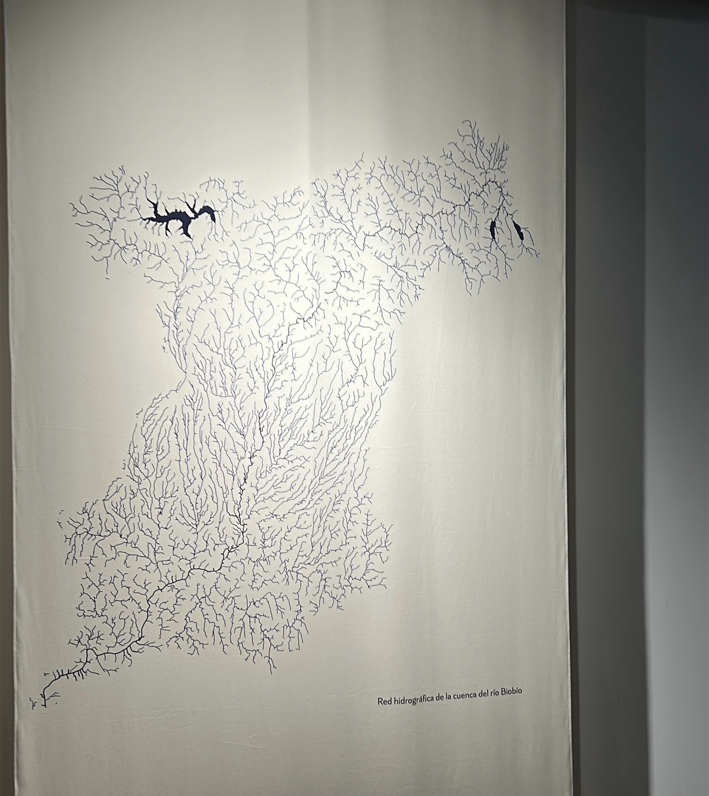
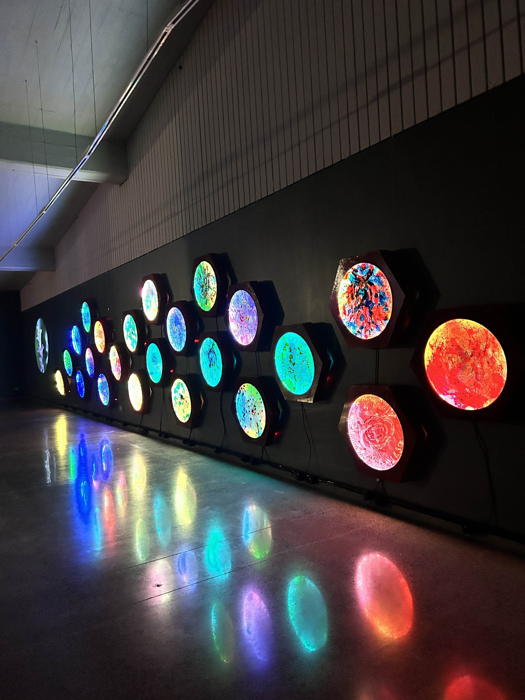

# sesion-11b - Viernes 24 de octubre

## Encargos

### Encargo 17:

"cada persona debe subir una investigación detallada de la obra artística de Claudia González Godoy, con énfasis en su investigación sobre ríos, incluyendo información sobre premios, exposiciones, colaboradores, estudios y referencias en su obra."

Claudia González Godoy (Chile, 1983) es una artista medial independiente, sus obras se centran en la materialidad tecnológica, naturaleza, sonido y agua. Su metodología vincula arte, ciencia y tecnología para investigar los ríos y el territorio acuático.

Su investigación parte de la idea del agua como material, del sonido del cauce como archivo y del impacto de la intervención humana en estos ecosistemas.

Ha participado en la Bienal de Artes Mediales, en ZKM Karlsruhe, ifa Gallery, en festivales como Tsonami, FILE (Brasil).

Su formación aborda artes visuales y mediales, con interés en la tecnología, electrónica sonora, el vínculo entre naturaleza y técnica.

En su obra más reciente: Decantaciones y Resonancias: ¿Dónde nace y termina el rumor del río? (2025) presentada en la Galería Gabriela Mistral, investiga de modo profundo el cauce del Río Biobío, sus transformaciones, los silencios generados por los embalses y los efectos socioculturales de su intervención humana. Realizó una investigación de aproximadamente dos años sobre el cauce, su historia, los embalses (Ralco, Pangue, Angostura) y los procesos de decantación tanto físicos como simbólicos del río. La instalación transforma los espacios expositivos en una topografía que simula una zona embalsada, invitando al visitante a reflexionar sobre cómo el flujo libre de agua deviene en silencio.

### Encargo 18:

"cada persona debe subir taxonomía detallada de sensores, actuadores, software y hardware utilizado en 1 obra exhibida en la Bienal de Artes Mediales 2025, citando correctamente a las fuentes."

~~ desde la raíz ~~~ Yto Aranda

Instalación inmersiva presentada en la 17ª Bienal de Artes Mediales en Santiago, que explora el bosque esclerófilo chileno mediante tecnología, luz, sonido, sensores y materiales textiles.

Sensores:

- Sensores táctiles integrados en módulos textiles que al ser activados generan sonidos de aves o del bosque. 
- Sensores de proximidad/contacto que permiten al público interactuar con las estructuras y activar respuestas lumínicas u sonoras
- Grabadoras/micrófonos de campo para capturar flora, fauna, sonidos de raíz, paisaje subterráneo del bosque.

Actuadores:

- Iluminación LED programable en los módulos textiles que responde a la interacción.
- Sistema de sonido ambiental (parlantes) que reproduce los registros del bosque y raíces.
- Video proyección que integra imágenes del bosque, raíces y terreno, funcionando como salida visual.

Software y hardware:

- Herramientas de edición sonora (DAW) para procesamiento de grabaciones de campo.
- Programación de interacción: software que conecta pulsadores/sensores con luz/sonido/respuesta en tiempo real. (no se especifica)

- Microcontroladores / placas electrónicas.
- Estructura física tejido de yute/sisal que integra cableado, sensores, luz y sonido.
- Equipamiento de audio, video y control para sala de exposición (parlantes, LED, proyector).

### Referencias:

- González Godoy, C. (s. f.). Claudia González Godoy. <https://www.claudiagonzalez.cl/cgg/>
- Artishock Revista. (2021). Claudia González Godoy: Materialidad, tecnología y territorio. <https://artishockrevista.com/>
- Galería Gabriela Mistral. (2025). Galería Gabriela Mistral presenta Decantaciones y Resonancias ¿Dónde nace y termina el rumor del río?, Ministerio de las Culturas, las Artes y el Patrimonio. <https://www.cultura.gob.cl/agendacultural/galeria-gabriela-mistral-presenta-decantaciones-y-resonaciones-donde-nace-y-termina-el-rumor-del-rio-de-claudia-gonzalez-godoy/>
- Aranda, Y. (2023). ~~~ desde la raíz~~~. Aproximación al bosque esclerófilo. <https://www.yto.cl/desdelaraiz/>
- Biblioteca Cultura Municipalidad de Santiago. (2025). Yto Aranda presenta ~~~ desde la raíz~~~ en la 17ª Bienal de Artes Mediales. <https://www.santiagocultura.cl/events/yto-aranda-presenta-%E2%88%BC%E2%88%BC%E2%88%BCdesde-la-raiz%E2%88%BC%E2%88%BC%E2%88%BC-en-la-17a-bienal-de-artes-mediales/>
- Vilches, M. J. (2025). El bosque esclerófilo bajo la mirada de Yto Aranda, Mediales art. <https://www.mediales.art/articulos/yto-aranda-entrevista>
- Montero, V. (2025). Yto Aranda ∼∼∼desde la raíz∼∼∼. Plataforma Arte y Medios. <https://www.arteymedios.org/yto-aranda-%E2%88%BC%E2%88%BC%E2%88%BCdesde-la-raiz%E2%88%BC%E2%88%BC%E2%88%BC-17a-bienal-de-artes-mediales/>
