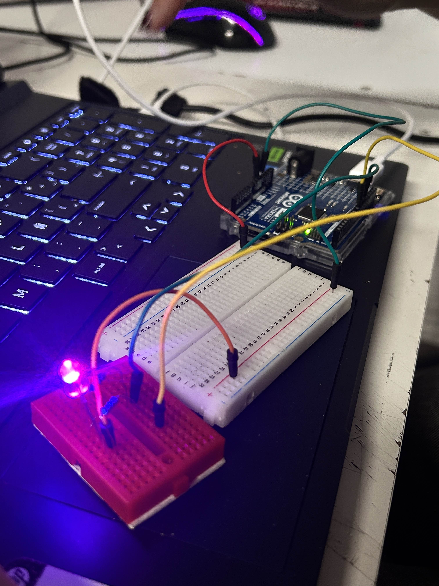
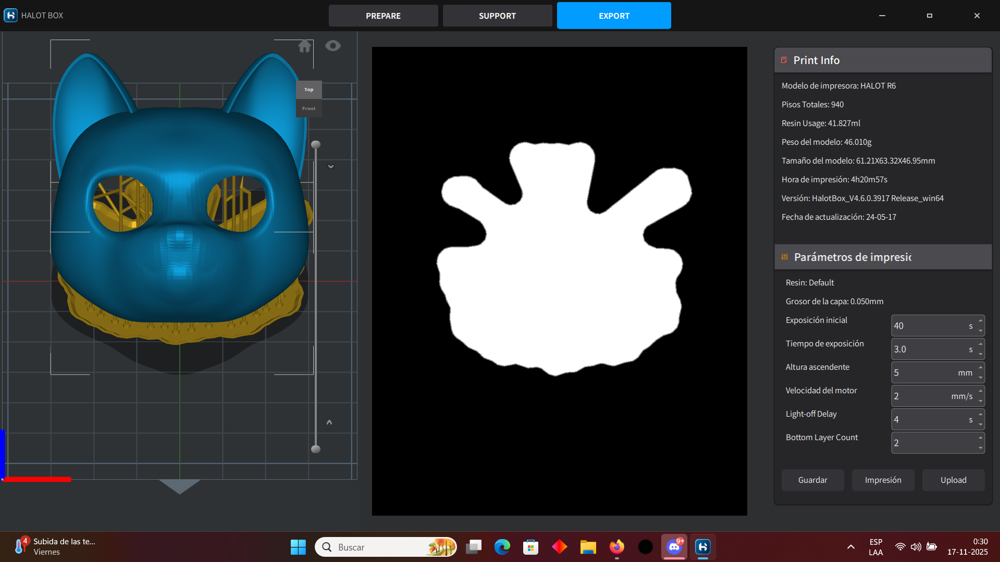

# sesion-14b

### Avance proyecto robotcitos gatitos emocionales

- Teniendo los sensores y actuadores los fuimos probando por separado
- Armamos primero una maquinita y ver que estuviesen bien las conexiones y luego armamos la otra
- Primeras pruebas de todos los componentes juntos
- Fuimos regulando a tiempo real 
  - la distancia mínima y máxima a la que reaccionan y cuánto vibra o cuánto se mueve en el “peak" de cada una
 

 
### Búsqueda de modelos para la carcasa y montaje

Modelo de gatito en una caja, similar a nuestra idea:

<https://www.printables.com/model/408411-cardboard-box>

Archivo de caja por separado (descartada por temas de medida y encaje con los componentes)

<https://www.printables.com/model/1193858-cardboard-box-for-bocchi>

Archivo 3D de gatito hecho para un ultrasónico:

<https://www.printables.com/model/993292-servo-mounted-cat-head-with-distance-sensor/files>

- Tomamos la pieza de la cabeza del gatito para el ultrasónico y la imprimimos como prototipo

