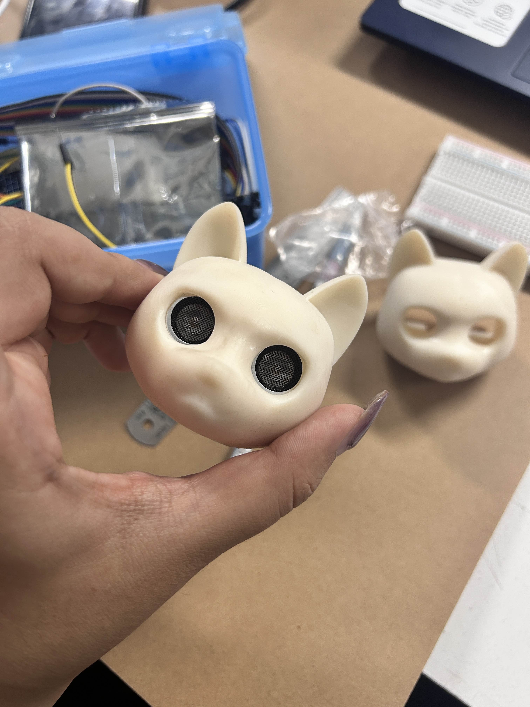
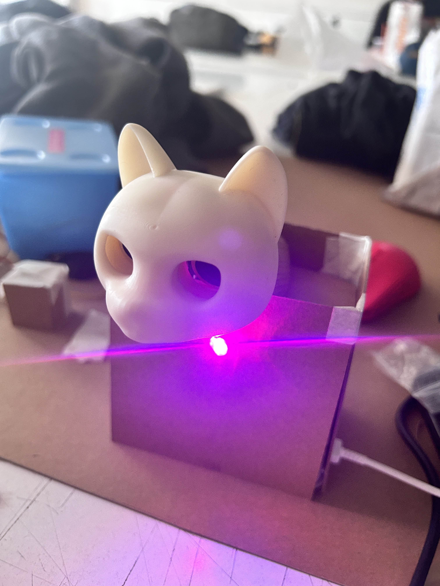
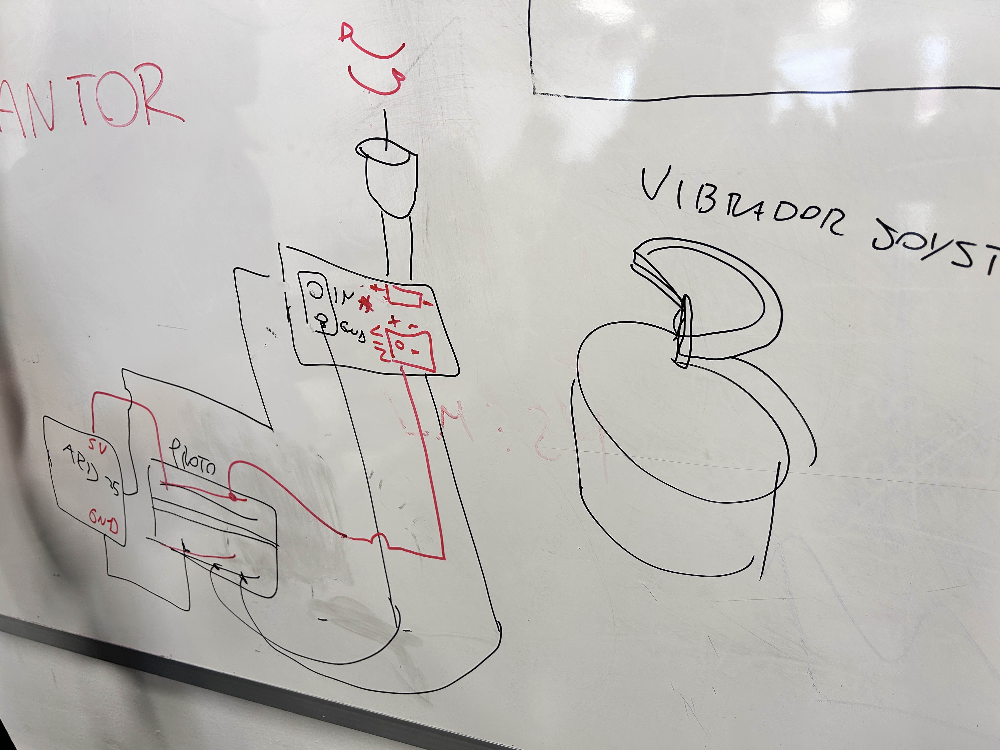
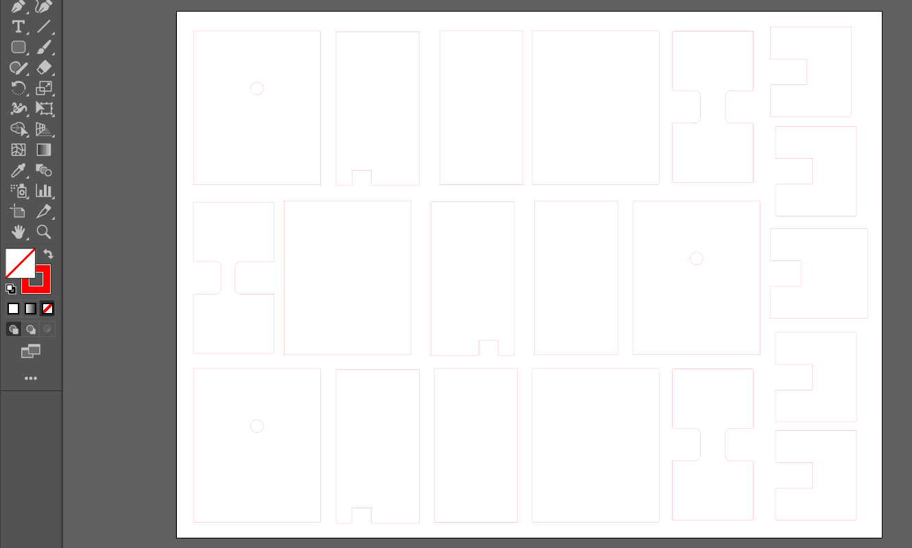
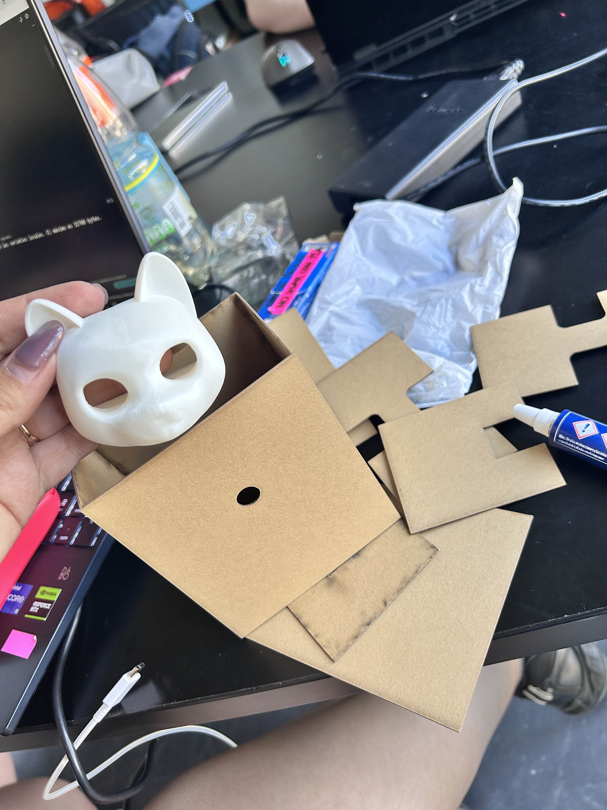

# sesion-15a

### Avance proyecto 03

- Momento de ver el montaje y prototipos de armado

### La impresión se realizó en resina pero como necesitamos que se note el movimiento consideramos imprimirlos en filamento

## Prototipo de la caja armado en cartón:

### Ataos

- El motor vibrador no es lo suficientemente potente para hacer mover visiblemente un objeto aunque sea liviano
- Volver al mosfet y usarlo con otro motor más potente (simular el funcionamiento de un joystick)

- Boceto de cómo deberiamos armarlo e implementarlo:

- Idea de piezas para el amrado de la cajita de cada gatito, que contiene los componentes en su interior:

- Pieza nuevamente imprea pero en filamento + piezas de la caja en corte láser:

- Se modificó el tema del motor y lo estamso probando!

