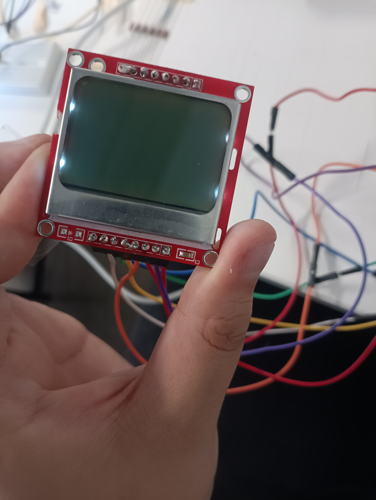
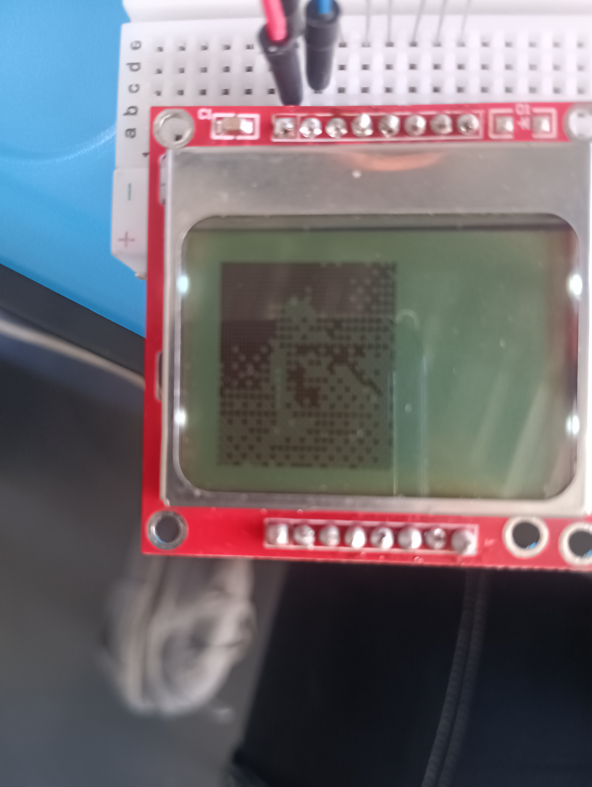
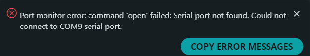

# sesion-15a

## Avances y logros

Se logro, la pantalla pantallea resulta que solde dos pines juntos



El seba lo logro, yo ya estaba perdiendo la cordura 



Ahora empezare a hacer el codigo para integrar a ava (nuestra asistente virtual) que viene incluida en W.E.B.O.

## Avance código

Logre que mostrara "hello world!", ahora me puse a jugar y dice "change da world, my final message, goodb ye"

Le agregue imagenes, todo funciona!!!!!!

Intente hacer el temporizador, no entendi nada, nuevamente las matematicas y los numeros mis mayores haters 

Links que sirven pero que no logro comprender.

https://www.flyrobo.in/blog/countdown-timer-arduino?srsltid=AfmBOoqsjQ5Jys_Vykrd6liBXKexQhSGXNF0SoEkk03kzSeWN1_7u8m5

https://arduino.stackexchange.com/questions/66626/arduino-timer-with-increase-time-button

## Código clases

El seba logro hacer funcionar el codigo de el reproductor mp3, yo como una vil rata solo pase el codigo a las clases, debido a que era un gran logro decidi que WEBO_0_4_0 pasara a la version 0_4_2 porque era un gran logro.

Acá estaria el archivo .h del sensorSD al traspasarlo a las clases.

Acá abrimos y cerramos la definición del archivo .h
```cpp

#ifndef SENSOR_SD_H
#define SENSOR_SD_H

#endif
```

Acá se incluyen las bibliotecas para que funcione el reproductor
```cpp
#include <Arduino.h>
#include <SoftwareSerial.h>
#include <DFRobotDFPlayerMini.h>
```
Creamos la clase y los void's a ocupar
```cpp
  class SensorSD {

  public:

  SensorSD();

  void configuracionSD();
  void funcionaSDAlarmaFuerte();
  void funcionaSDAlarmaDebil();

};
```
Aca estaria lo que nos fallo asi que lo traspasamos como medida provisional en el archivo .cpp debajo de la inclusion de las bibliotecas y archivos .h
No sabemos si debe ir antes de la definicion de clase o debajo (de igual manera lo intentamos de ambas formas y no funciono .-.)
```cpp
SoftwareSerial dfSerial(2, 3); // RX, TX
DFRobotDFPlayerMini player;
```
En el archivo .cpp luego de incluir las bibliotecas, archivos . h y variables provisionales comenzamos con el codigo dentro de la clase y en el void de configuración para definir la comunicacion serial general entre el compu y el arduino, y del reproductor mp3 que seria entre el arduino y el reproductor.
```cpp
Serial.begin(115200);

dfSerial.begin(9600);
```

Aca seria lo que deberia comunicarme el arduino en el monitor serial si funciona o no la coneccion entre reproductor y arduino
```cpp
  if (!player.begin(dfSerial)) {
    Serial.println("Unable to begin. Check:");
    while (true)
      ;
  }

  Serial.println("DFPlayer online!");
 ```

Aca se configura el void del funcionamiento alarma fuerte (vamos a usar dos alarmas, va a ser mas simple de comprender en el archivo .ino si usa dos voids que los diferencie)
```cpp
player.volume(20);

player.play(2);

delay(4000);

```
Se configura el void del funcionamiento alarma debil
```cpp
player.volume(20);

player.play(1);

delay(4000);
```
La unica diferencia hasta el mmomento entre funcionamiento fuerte y debil es el "player.play" que la configuracion numerica definiria el audio a sonar.

Luego de hacer esta explicacion se hicieron unas minimas correcciones (mostradas en la difinicion) que nos llevo a la version 0_4_3

## Error :-(

El seba hizo la versión 0_4_4 y la 0_4_5

Descubrimos que ninguna de estas versiones funcionan correctamente por el reproductor SD

ahora dia jueves 20 a las 17 hrs, no logramos solucionarlo correctamente.

a las 17:10  sospechamos que rompimos el arduino 

vamos a probar con otro para confirmar que sea el código y no el arduino

el error que nos sale al cargar el sketch es el **LIBUSB_ERROR_TIMEOUT**

En base a lo que investigue del error se supone que pasa cuando esta funcionando otro sketch al enviar el nuevo, y el sketch corriendo produce un gran volumen de serial output y eso causaria que no se puedise enviar el nuevo sketch.

para solucionarlo hay que reiniciar el arduino.

Al volver a cargar el sketch sigue con el error

Ahora vamos a probar en otro arduino 

y rezar para que funcione.

Luego de probar en el otro arduino, nos dio otro error y es que falla la comunicación serial



El error se soluciono porque soy tonto y elimine el if que iniciaba el funcionamiento del reproductor :b 
```cpp
  //if (!player.begin(dfSerial)) {
    // esto que esta comentado se elimina en la proxima version 
    //(no es necesario tenerlo y nos complica el funcionamiento completo del WEBO)
    //si no funciona te saldra este mensaje
  // Serial.println("Unable to begin. Check:");
  // while (true);
 }
```

y para que funcionara tenia que eliminar solo esto
```cpp
 Serial.println("Unable to begin. Check:");
 while (true);
```
Ahora tenemos que ver que falla del reproductor al integrarlo al codigo madre.

Lo hice funcionar por un milisegundo, no lo alcance a grabar :-(((((

Lo que hice en el código fue mover el Serial.println("DFPlayer online"); en el if statement
```cpp
  // esta funcion if esta para verificar en el monitor serial si el reproductor funciona o no
  if (!player.begin(dfSerial)) {

    //si funciona saldra este mensaje
  Serial.println("DFPlayer online!");

  }
```
Despues de que funciono por un rato dejo de funcionar el temporizador .-. y nuevamente dejo de funcionar el audio

Le paso el mando nuevamente al seba, no se que hice :-(


