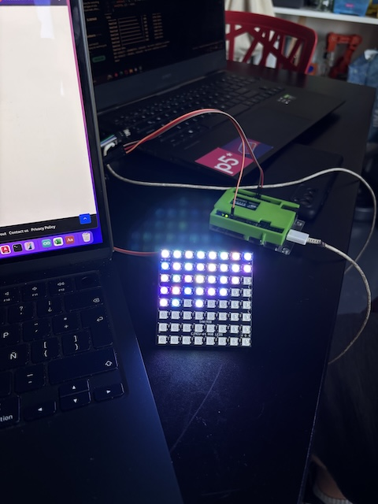

# sesion-14b

## Apuntes clase

- A MAC (Medium Access Control)  expone su dirección mac. cuando hay una dirección ip siempre cambia dependiendo el lugar.
- SCH entrar en el computador via internet.
- while true mientras sea verdadero
- fi ahi termina el if (lenguaje bash, es para controlar terminales)
  
### Avance proyecto

No está hecha para ganar.

- Está compuesta por una pantalla de 8x8 píxeles, un joystick, dos botones y un potenciómetro. En la pantalla LCD muestra de "Acércate y juega" mientras que en la pantalla neopixel aparece una figura perfectamente formada: Un cuadrado. Pero al apretar inicio el juego, algo se rompe. Un píxel se mueve, y la figura deja de ser perfecta. Desde ese momento, el usuario intenta repararla… aunque la máquina nunca lo permitirá.

#### Controles

- **Joystick:** Mueve los píxeles, pero en dirección contraria a la que intentas. (aariba es abajo, izquierda es derecha)
- **Botón del joystick:*** Desarma todo, se reparten los pixeles por toda la pantalla.
- **Botón de inicio:** Le da inicio al juego moviendo un pixel de su lugar cuando la figura está perfecta.
- **Botón 1:** Inútil, no hace nada.
- **Botón 2:** Cambia el color del LED que no está en sun lugar hasta 5 veces, a la 6ta vez la pantalla se invierten los colores (la figura queda sin color y el fondo con color)
- **Botón 3:** Música, cada click aumenta la velocidad del audio (hasta 3 veces).
- **Botón 4:** Desplaza 2 pixeles de su lugar a uno aleatorio.

#### Concepto

**Game over** es una experiencia interactiva que explora la frustración y la imposibilidad de alcanzar la perfección.

