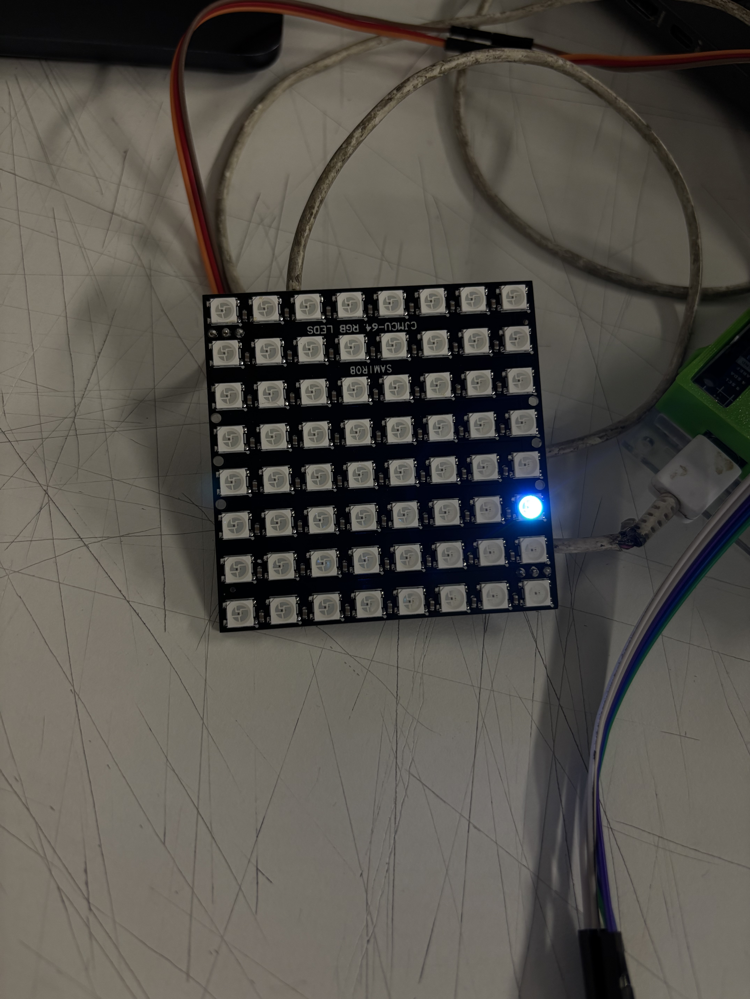

# sesion-15a 18/11

## Avance proyecto 03

`Logros en clases:`

 - Bajarle el brillo a la pantalla, esta puede llegar a los 255, lo dejamos en 50.
 - Botón que va al pin 3 que va eliminando más pixeles.
 - Elegir canción sin ter problemas de derecho de autor.[darker-waves](https://opengameart.org/content/darker-waves)
 - Que vuelva al inicio del juego a los 15 segundos después de jugar con el botón del pin 3.
---

Código modificado

```cpp
#include <Adafruit_NeoPixel.h>

// ===================== CONFIG ======================
#define PIN_MATRIZ 6
#define NUM_PIXELES 64

#define PIN_JOYSTICK_X A0
#define PIN_JOYSTICK_Y A1
#define PIN_JOYSTICK_BOTON 2

#define PIN_BOTON_MOV 3   // rompe un pixel al azar del cuadrado
#define PIN_BOTON_VEL 4   // velocidad música (solo trigger)
#define PIN_BOTON_EXTRA 5 // no hace nada

#define PIN_COLOR 9
#define PIN_INICIO 8

Adafruit_NeoPixel matriz = Adafruit_NeoPixel(NUM_PIXELES, PIN_MATRIZ, NEO_GRB + NEO_KHZ800);

// ===================== VARIABLES ======================
bool formaBase[64] = {
 0,0,0,0,0,0,0,0,
 0,1,1,1,1,1,1,0,
 0,1,0,0,0,0,1,0,
 0,1,0,0,0,0,1,0,
 0,1,0,0,0,0,1,0,
 0,1,0,0,0,0,1,0,
 0,1,1,1,1,1,1,0,
 0,0,0,0,0,0,0,0
};

bool formaBaseOriginal[64];

int pixelBloqueado = -1;
int pixelEscapado = -1;

uint32_t colorPixelEscapado = 0x00FFFF;
bool modoDisco = false;

unsigned long tiempoUltimoMovimiento = 0;
const unsigned long retrasoMovimiento = 200;

const unsigned long retrasoDisco = 80;

// TIMER DE INACTIVIDAD
unsigned long tiempoUltimaActividad = 0;
const unsigned long tiempoReparacion = 30000; // 30 segundos

// ===================== UTILES ======================
int obtenerX(int i){ return i % 8; }
int obtenerY(int i){ return i / 8; }
int obtenerIndice(int x,int y){ return y * 8 + x; }

uint32_t generarColorNoRojo(){
  while(true){
    int r=random(0,256);
    int g=random(0,256);
    int b=random(0,256);
    if(!(r>200 && g<80 && b<80)) return matriz.Color(r,g,b);
  }
}

// ===================== DIBUJO ======================
void dibujarMatrizNormal(){
  matriz.clear();

  for(int i=0;i<64;i++){
    if(formaBase[i]==1) matriz.setPixelColor(i, matriz.Color(255,0,0));
  }

  if(pixelBloqueado>=0) matriz.setPixelColor(pixelBloqueado, 0);
  if(pixelEscapado>=0) matriz.setPixelColor(pixelEscapado, colorPixelEscapado);

  matriz.show();
}

void dibujarMatrizDisco(){
  for(int i=0;i<64;i++){
    matriz.setPixelColor(i, generarColorNoRojo());
  }

  if(pixelEscapado>=0)
    matriz.setPixelColor(pixelEscapado, colorPixelEscapado);

  matriz.show();
}

// ===================== REPARAR CUADRADO ======================
void repararCuadrado(){
  for(int i=0;i<64;i++){
    formaBase[i] = formaBaseOriginal[i];
  }
  pixelBloqueado = -1;
  pixelEscapado = -1;
  dibujarMatrizNormal();
}

// ===================== SETUP ======================
void setup(){
  matriz.begin();
  matriz.setBrightness(50);
  matriz.show();
  randomSeed(analogRead(A3));

  pinMode(PIN_JOYSTICK_BOTON, INPUT_PULLUP);
  pinMode(PIN_INICIO, INPUT_PULLUP);
  pinMode(PIN_COLOR, INPUT_PULLUP);
  pinMode(PIN_BOTON_MOV, INPUT_PULLUP);
  pinMode(PIN_BOTON_VEL, INPUT_PULLUP);
  pinMode(PIN_BOTON_EXTRA, INPUT_PULLUP);

  for(int i=0;i<64;i++){
    formaBaseOriginal[i] = formaBase[i];
  }

  tiempoUltimaActividad = millis();
  dibujarMatrizNormal();
}

// ===================== LOOP ======================
void loop(){

  // ========== REPARACIÓN POR INACTIVIDAD ==========
  if (!modoDisco && millis() - tiempoUltimaActividad > tiempoReparacion){
    repararCuadrado();
  }

  // ========== A LOS 15 SEG DESPUÉS DE USAR EL BOTÓN DEL PIN 3 ==========
  // igual que antes de iniciar un juego
  if(pixelEscapado < 0 && pixelBloqueado < 0 &&
     (millis() - tiempoUltimaActividad > 15000)) {   // 15seg

    tiempoUltimaActividad = millis(); // reinicia timer

    int lados[64];
    int total = 0;

    // mismos bordes que tu botón PIN_INICIO
    for(int i=0;i<64;i++){
      if(formaBase[i]==1)
        lados[total++] = i;
    }

    if(total > 0){
      int elegido = lados[random(total)];
      pixelBloqueado = elegido;
      formaBase[pixelBloqueado] = 0;

      int x = obtenerX(elegido);
      int y = obtenerY(elegido);

      if(x < 7) pixelEscapado = obtenerIndice(x+1,y);
      else if(x > 0) pixelEscapado = obtenerIndice(x-1,y);
      else if(y < 7) pixelEscapado = obtenerIndice(x,y+1);
      else pixelEscapado = obtenerIndice(x,y-1);

      dibujarMatrizNormal();
    }
  }

  // ================== BOTÓN INICIO ==================
  if(pixelEscapado < 0 && digitalRead(PIN_INICIO)==LOW){

    tiempoUltimaActividad = millis();

    int lados[64];
    int total = 0;

    for(int i=0;i<64;i++){
      if(formaBase[i]==1)
        lados[total++] = i;
    }

    int elegido = lados[random(total)];
    pixelBloqueado = elegido;
    formaBase[pixelBloqueado] = 0;

    int x = obtenerX(elegido);
    int y = obtenerY(elegido);

    if(x < 7) pixelEscapado = obtenerIndice(x+1,y);
    else if(x > 0) pixelEscapado = obtenerIndice(x-1,y);
    else if(y < 7) pixelEscapado = obtenerIndice(x,y+1);
    else pixelEscapado = obtenerIndice(x,y-1);

    dibujarMatrizNormal();
    delay(250);
  }

  // ================== BOTÓN COLOR ==================
  if (pixelEscapado>=0 && digitalRead(PIN_COLOR)==LOW){
    tiempoUltimaActividad = millis();
    colorPixelEscapado = generarColorNoRojo();
    dibujarMatrizNormal();
    delay(200);
  }

  // ================== BOTÓN 3: ROMPER CUALQUIER PIXEL ==================
  if (digitalRead(PIN_BOTON_MOV)==LOW){

    tiempoUltimaActividad = millis();

    int lados[64];
    int total = 0;

    for(int i=0;i<64;i++){
      if(formaBase[i]==1)
        lados[total++] = i;
    }

    if(total > 0){

      int elegido = lados[random(total)];
      pixelBloqueado = elegido;
      formaBase[pixelBloqueado] = 0;

      int x = obtenerX(elegido);
      int y = obtenerY(elegido);

      if(x < 7) pixelEscapado = obtenerIndice(x+1,y);
      else if(x > 0) pixelEscapado = obtenerIndice(x-1,y);
      else if(y < 7) pixelEscapado = obtenerIndice(x,y+1);
      else pixelEscapado = obtenerIndice(x,y-1);

      dibujarMatrizNormal();
      delay(250);
    }
  }

  // ================== BOTÓN 4 (velocidad música) ==================
  if(digitalRead(PIN_BOTON_VEL)==LOW){
    tiempoUltimaActividad = millis();
    delay(200);
  }

  // ================== MODO DISCO ==================
  static int ultimo = HIGH;
  int ahora = digitalRead(PIN_JOYSTICK_BOTON);

  if(ultimo==HIGH && ahora==LOW){
    modoDisco = !modoDisco;
    tiempoUltimaActividad = millis();
    delay(200);
  }
  ultimo = ahora;

  if(modoDisco){
    tiempoUltimaActividad = millis();
    dibujarMatrizDisco();
    delay(retrasoDisco);
    return;
  }

  // ================== MOVER PIXEL ESCAPADO ==================
  if(pixelEscapado >= 0){

    int valorX = analogRead(PIN_JOYSTICK_X);
    int valorY = analogRead(PIN_JOYSTICK_Y);

    if(millis() - tiempoUltimoMovimiento >= retrasoMovimiento){

      int x = obtenerX(pixelEscapado);
      int y = obtenerY(pixelEscapado);

      int xOriginal = x;
      int yOriginal = y;

      if(valorX > 800 && x>0) x--;
      else if(valorX < 200 && x<7) x++;

      if(valorY > 800 && y>0) y--;
      else if(valorY < 200 && y<7) y++;

      if(x != xOriginal || y != yOriginal){
        tiempoUltimaActividad = millis();
      }

      int nueva = obtenerIndice(x,y);

      if(nueva != pixelBloqueado)
        pixelEscapado = nueva;

      dibujarMatrizNormal();
      tiempoUltimoMovimiento = millis();
    }
  }
}
```
### BOM

|Componente|Cantidad|Valor|Link|
|---|---|---|---|
|Botones|5|-|[boton-tactil-tapa](https://afel.cl/products/boton-tactil-tapa-12x12x7-3-interruptor?_pos=1&_sid=433c4d5a9&_ss=r)|
|Joystick|1|-|[joystick](https://afel.cl/products/joystick-palanca-de-mando?srsltid=AfmBOopSseOjbBU2wAQgNmAwmkg3E93k1qXa3xfHCyL3NsIaDLuQZYwu)|
|Pantalla LCD Azul|1|-|[pantallaLCD](https://afel.cl/products/pantalla-lcd-verde-20x04-2004-con-i2c?_pos=5&_sid=8686c6746&_ss=r)|
|Matriz LED RGB 8x8|1|-|[matrizLED](https://afel.cl/products/matriz-led-rgb-neopixel-8x8-ws2812-cjmcu64?_pos=2&_sid=c81d7044e&_ss=r)|
|Resistencias|4|1k|[resistencias](https://www.mercadolibre.cl/resistencias-de-1k-ohm-e-projects-100ep5121k00-12-w-10/p/MLC2022310489)|
|Módulo reproductor MP3|1|-|[dfplayer](https://afel.cl/products/modulo-reproductor-mp3-dfplayer-mini?_pos=1&_psq=modulo+re&_ss=e&_v=1.0)|
|Tarjeta SD|1|-|[TarjetaSD](https://www.aliexpress.com/p/tesla-landing/index.html?scenario=c_ppc_item_bridge&productId=1005009438158083&_immersiveMode=true&withMainCard=true&src=google&aff_platform=true&isdl=yhttps://www.aliexpress.com/p/tesla-landing/index.html?scenario=c_ppc_item_bridge&productId=1005009438158083&_immersiveMode=true&withMainCard=true&src=google&aff_platform=true&isdl=y&src=google&albch=shopping&acnt=615-992-9880&isdl=y&slnk=&plac=&mtctp=&albbt=Google_7_shopping&aff_platform=google&aff_short_key=_oFgTQeV&gclsrc=aw.ds&&albagn=888888&&ds_e_adid=&ds_e_matchtype=&ds_e_device=c&ds_e_network=x&ds_e_product_group_id=&ds_e_product_id=es1005009438158083&ds_e_product_merchant_id=5523996361&ds_e_product_country=CL&ds_e_product_language=es&ds_e_product_channel=online&ds_e_product_store_id=&ds_url_v=2&albcp=22559110785&albag=&isSmbAutoCall=false&needSmbHouyi=false&gad_source=1&gad_campaignid=22559111214&gbraid=0AAAAA_TvRHpyuC1aar4AHJzTQpX4pEXqK&gclid=CjwKCAiAz_DIBhBJEiwAVH2XwBpQR-g-tJI2F1t_vl_lkwwxRq5aTwlWy3lLB_DKKLXoFjXZoIwFuBoCusYQAvD_BwE)|
|Speaker|1|3w|[parlanteAltavoz](https://afel.cl/products/mini-parlante-altavoz-de-3w)|

### Registro




`¡No olvidar! `

- Botón al pin 3 hará que se vaya eliminando poco a poco cada pixel del cuadrado y al esperar 15 segundos, se vuelve al cuadrado con el primer pixel corrido.
- Botón que acelera el tiempo de la música. 
- Botón  de inicio.
- Botón inútil
- Botón que cambia el pixel de color.
  
