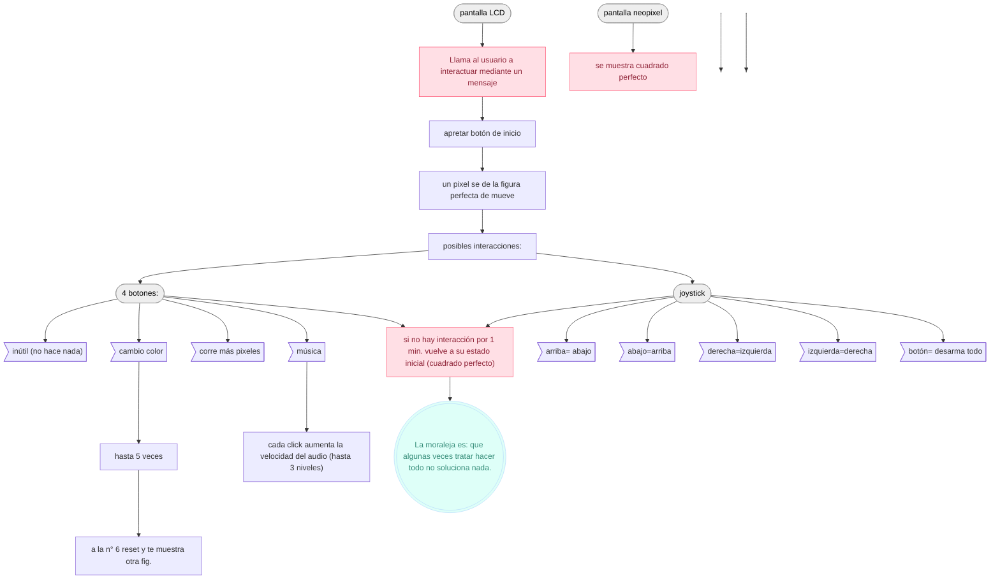

# sesion-13b

Viernes 07 de Noviembre, 2025

Nota: buen fin de semana para la persona que lo lea. 

## Apuntes generales

- Los profes dijeron que hay que darle misiones al usuario, como por ejemplo que tomen un led y lo conecten en alguna parte o que el mismo usuario explote un condensador
- **Encoder:** Es un dispositivo que convierte el movimiento, ya sea rotatorio o lineal, en señales eléctricas que un sistema de control puede leer. Una manibela que gira sin límite y solo te indica hacia que lado giraste la perilla.
- **Sobre el proyecto 03:** No se debe humanizar a la máquina (no atribuirles objetos o caracteristicas humanos), debe haber una explorar materiales: explorar sensores, no esforzar las emociones, abrir la mente. Hay que saber defender la complejidad del proyecto. 

## Qué hice hoy 

### Definir proyecto 03

- Máquina arcade "mala"; "Game over"

Parece una máquina arcade, pero tiene un pequeño problema: no está hecha para ganar. Está compuesta por una pantalla de 8x8 píxeles, un joystick, dos botones y un potenciómetro. Cuando el sensor ultrasónico detecta que alguien se acerca, deja de mostrar el mensaje S.O.S y aparece una figura perfectamente formada: un triángulo, una X o un cuadrado. Pero al acercarte lo suficiente, algo se rompe. Un píxel se mueve, y la figura deja de ser perfecta.
Desde ese momento, el usuario intenta repararla… aunque la máquina nunca lo permitirá.

Controles:

- **Joystick:** mueve los píxeles, pero en dirección contraria a la que intentas.
- **Botón del joystick:** reinicia la figura al punto de error inicial.
- **Botón principal:** cambia el color del LED y desplaza el píxel roto a un lugar aleatorio.
- **Potenciómetro:** activa el modo autodestrucción, desarmando toda la figura.
- **Botón 2:** reinicia y muestra una nueva figura.
  
Concepto:

Game over es una experiencia interactiva que explora la frustración y la imposibilidad de alcanzar la perfección.
Cada intento por “arreglarla” solo genera más caos, convirtiendo el juego en una metáfora del error humano: inevitable, persistente y, de alguna forma, hermoso.

### Referentes 

- <https://cl.pinterest.com/pin/2111131072355407/feedback/> - This project is made with arduino UNO, the LSM303 accelerometer and an LED matrix (LOL Shield). This is created by ig: @david_proyectos
- **Electronic Circuit** <https://cl.pinterest.com/pin/616641374021531854/feedback/>
- **Pong Game on the Arduino UNO R4 LED Matrix** <https://www.reddit.com/r/arduino/comments/15zxefj/pong_game_on_the_arduino_uno_r4_led_matrix/>
- **Using the Arduino UNO R4 LED Matrix to Build the Pong Arcade Game** <https://dumblebots.com/blog/arduino-uno-r4-led-matrix-pong-video-game>
- **Led matrix editor for arduino** <https://ledmatrix-editor.arduino.cc/>
- **Snake LED 16x16 matrix game** <https://projecthub.arduino.cc/vasiljevalentin/snake-led-16x16-matrix-game-15a475>
- **Arduino Connect4 Game- Human vs Microcontroller** <https://www.hackster.io/mircemk/arduino-connect4-game-human-vs-microcontroller-e5c8ea>
- **Tutorial: Luz RGB de Relleno con Arduino, un Panel WS2812B y 1 Potenciómetro** <https://www.mimundogadget.com/2023/03/tutorial-luz-rgb-de-relleno-con-arduino.html>

Nota: mateo dice que le pongamos sonido a la máquina (nos encantó la ideaa). 

## Encargo

Hacer presupuesto, carta gantt macro (semana a semana), bocetos físicos, diagramas de flujo y pseudocódigo del proyecto 03.

### Presupuesto:

| Componente| Cantidad | valor| Link | Anotaciones|
|---|---|---|---|---|
|Resistencias 220|x|x|x|x|
|Sensor ultrasónico|1|$1.500|[Ultrasonico-hc](https://afel.cl/products/sensor-de-ultrasonico-hc-sr04)|x|
|Potenciómetro|1|$500|[potenciómetro](https://afel.cl/products/potenciometro-10k-ohm)|
|Matriz LED RGB 8x8|1|$9990|[matrizLEDrgbNeopixel](https://afel.cl/products/matriz-led-rgb-neopixel-8x8-ws2812-cjmcu64)|x|
|Botones|3|$100|[botonTactil](https://afel.cl/products/boton-tactil-tapa-12x12x7-3-interruptor)|x|
|Joystick|x|$2000|[Joystick](https://afel.cl/products/joystick-palanca-de-mando)|x|
|Clables macho macho y macho hembra|x|x|[MachoMacho](https://afel.cl/products/pack-20-cables-de-conexion-macho-macho) [conexionMachoHembra](https://afel.cl/products/pack-20-cables-de-conexion-macho-hembra)|x|
|Pantalla LCD verde|1|$2400|[pantallaLCDverde](https://afel.cl/products/pantalla-lcd-verde-20x04-2004-con-i2c)|x|

### Diagrama de flujo:



### Pseudocódigo: 

```cpp
INICIO

// --- DECLARACIÓN DE COMPONENTES ---
Definir PantallaPixeles[8][8]
Definir PantallaLCD(20x4, i2c)
Definir SensorUltrasonico
Definir Joystick (X, Y, Botón)
Definir BotónPrincipal
Definir BotónSecundario
Definir Potenciómetro
Definir LED_RGB

Definir FiguraActual
Definir PixelRoto
Definir Distancia

// --- ESTADO INICIAL ---
MostrarLCD("S.O.S")
ApagarPantallaPixeles()
LED_RGB = ColorInicial

// --- BUCLE PRINCIPAL ---
Mientras (VERDADERO)
    Distancia = Leer(SensorUltrasonico)
    
    Si (Distancia < UMBRAL_DETECCIÓN)
        MostrarFiguraPerfecta()
    FinSi
    
    Si (Distancia < UMBRAL_ERROR)
        RomperFigura()
    FinSi

    LeerControles()
    
    ActualizarPantallaPixeles()
    ActualizarLCD()
FinMientras

// --- FUNCIONES PRINCIPALES ---

Función MostrarFiguraPerfecta()
    Si (FiguraActual == NULO)
        FiguraActual = GenerarFiguraAleatoria()   // Triángulo, X o Cuadrado
    FinSi
    Dibujar(FiguraActual)
    MostrarLCD("Figura detectada")
FinFunción

Función RomperFigura()
    PixelRoto = SeleccionarPixelAleatorio(FiguraActual)
    MoverPixel(PixelRoto, desplazamientoPequeño)
    MostrarLCD("Algo se rompió...")
FinFunción

Función LeerControles()
    // --- JOYSTICK ---
    Dirección = Leer(Joystick)
    Si (Dirección ≠ CENTRO)
        MoverPixel(PixelRoto, DirecciónContraria(Dirección))
    FinSi
    
    Si (BotónJoystickPresionado)
        RestaurarFiguraAlPuntoDeError()
    FinSi
    
    // --- BOTÓN PRINCIPAL ---
    Si (BotónPrincipalPresionado)
        CambiarColorLED(LED_RGB)
        PixelRoto = MoverPixelAleatoriamente(FiguraActual)
    FinSi
    
    // --- POTENCIÓMETRO ---
    Nivel = Leer(Potenciómetro)
    Si (Nivel > UMBRAL_AUTODESTRUCCIÓN)
        AutodestruirFigura()
    FinSi
    
    // --- BOTÓN SECUNDARIO ---
    Si (BotónSecundarioPresionado)
        ReiniciarTodo()
    FinSi
FinFunción

// --- FUNCIONES AUXILIARES ---

Función RestaurarFiguraAlPuntoDeError()
    Restaurar(FiguraActual, estadoConPixelRoto)
    MostrarLCD("Intento de reparación...")
FinFunción

Función AutodestruirFigura()
    DesarmarTodosLosPixeles()
    MostrarLCD("AUTODESTRUCCIÓN ACTIVADA")
FinFunción

Función ReiniciarTodo()
    FiguraActual = NULO
    PixelRoto = NULO
    MostrarLCD("S.O.S")
    ApagarPantallaPixeles()
FinFunción
```
