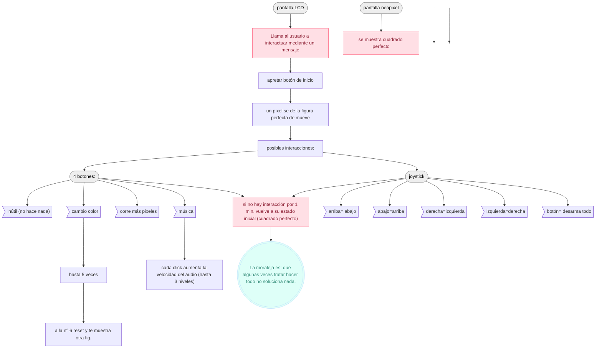
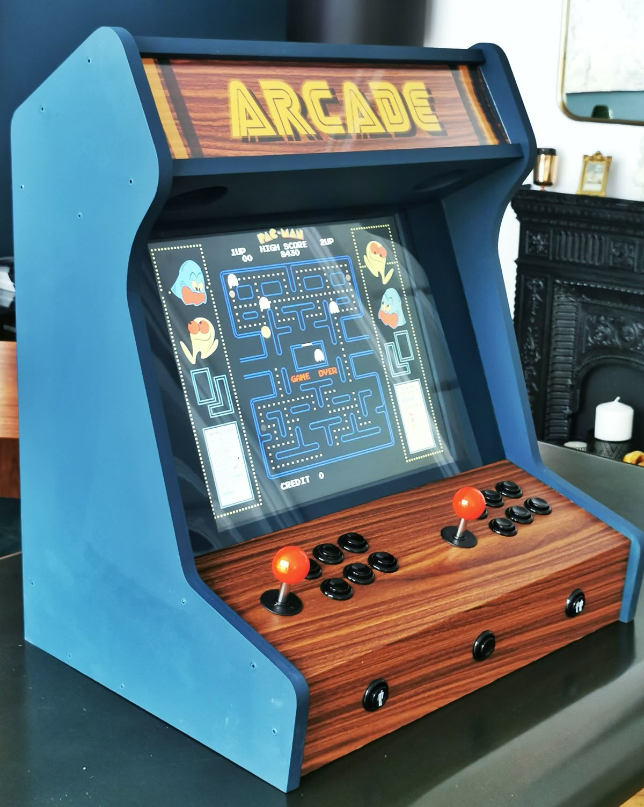

# sesion-14a

Martes 11 de Noviembre, 2025 

Nota del día: 

## Qué hice hoy 

Anotación sobre la entrega del 21/11:

- La entrega formal de ese día es un prototipo, que funcione a nivel "básico" (más que básico no es necesario que, por ejemplo, esté la carcasa, sino más bien es importante esta entrega para defender la idea y ver cómo vamos avanzando; por lo tanto, interacción y el relato son los aspectos importantes para la evaluación, que sea coherente, no preocuparse tanto de la carcasa por ahora); para el examen, bajarlo y maquillarlo para que quede lindo y funcional (ahí si debe estar completo).

Interacción y el relato, que sea coherente; no preocuparse tanto de la carcasa por ahora. 

Nota general del día: La verdad hoy como grupo no pudimos avanzar mucho en temas de códigos o aspectos parecidos ya que no contamos todavía con los componentes que vamos a utilizar. De todas formas, la clase nos sirvió para especificar más el funcionamiento de la máquina, qué es lo que queremos lograr y ver que aspectos realmente nos sirven y cuáles no son tan necesarios de utilizar. 

### Explicación del proyecto: 

Game over es una experiencia interactiva que explora la frustración y la imposibilidad de alcanzar la perfección. Cada intento por “arreglarla” solo genera más caos - No está hecha para ganar.

Está compuesta por una pantalla de 8x8 píxeles, una pantalla LDC, un joystick, 5 botones + 1 reproductor mp3.

Componentes generales:

- **Pantalla LCD:** Al principio muestra un mensaje como "Acércate y juega". Es lo que invita a la persona a interactuar con la máquina. 
- **Pantalla LED 8x8 pixeles:** Al principio muestra una figura perfectamente formada: Un cuadrado. Al apretar el botón de inicio un píxel se mueve, y la figura deja de ser perfecta. La idea general del juego es volver a posicionar el píxel que se movió en el espacio que iba (aunque la máquina nunca lo permitirá). 
- **Reproductor mp3:** Reproduce música tipica de juegos arcade para darle más ambientación mientras la persona juega. 

Controles:

- **Joystick:** Mueve el píxel corrido, pero en dirección contraria a la que intentas. (ariba es abajo, izquierda es derecha, etc)
- **Botón del joystick:** Desarma todo, se reparten los pixeles por toda la pantalla (se vuelve loquito durante unos segundos y después vuelve a la normalidad).
- **Botón de inicio:** Le da inicio al juego moviendo un pixel de su lugar cuando la figura está perfecta.
- **Botón 1:** Inútil, no hace nada (distracción).
- **Botón 2:** Cambia el color del LED que no está en su lugar hasta 5 veces, a la 6ta vez la pantalla se invierten los colores (la figura queda sin color y el fondo con color)
- **Botón 3:** Música, cada click aumenta la velocidad del audio (hasta 3 veces).
- **Botón 4:** Desplaza 2 pixeles de su lugar a uno aleatorio.

Los botones (del 1 al 4) no tienen especificaciones; por lo tanto, cada uno será una sorpresa para la persona que interactúe con ellos. 

Concepto: 

La máquina es una experiencia interactiva que explora la frustración y la imposibilidad de alcanzar la perfección. Cada intento por “arreglarla” solo genera más caos. La enseñanza es que haciendo nada las cosas se solucionan; ya que cuando uno deja de apretar los botones y el joystick (es decir deja de interactuar con la máquina - deja de arruinar más el problema, generar más caos) por 30 segundos volverá a reproducirse la figura perfecta.  

### Diagrama

### Bosquejos y referentes de forma 

