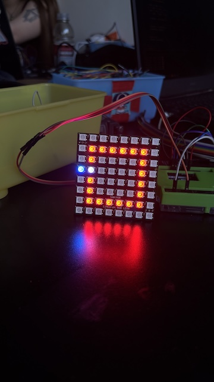

# sesion-14b

Viernes 14 de Noviembre, 2025 

Nota del día: al fin llegaron los materialees yeiih.

## Qué hice hoy 

### Sobre el proyecto 03

Algunos cambios o cosas que se agregaron a la interacción/funcionamiento de la máquina: 

Ahora cuando uno apreta el joystick ya no se vuelve "loquito" porque sí, lo cambiamos a un modo disco: donde cada píxel se prende con colores al azar y parpadean/se mueven, generando esta sensación divertida como de luces disco. 

También, se cambio que ya no va ser solo un mensaje para la pantalla lDC, este va cambiar a medida que la persona apreta/interactua con los dsitintos botones que tiene la máquina. 

Mensajes en pantalla LCD en base a interacción:

- estado inicial, sin haber apretado nada - mensaje te invita a jugar. “VEN VEN, ACÉRCATE… PODRIAS DIVERTIRTE”.
- Cuando persona apreta botones de inicio el mensaje cambia a: “… o no” (respondiendo el mensaje anterior, el o no es como una expresión de que no debío haber apretado ese botón la persona).
- Cuando se comienza a mover el joystick (solo 1 vez) el mensaje cambia a “No debiste hacer eso”.
- En modo disco no dice nada. o dice algo referente a que no debería estar divirtiéndose. “NO ES MOMENTO DE DIVERTIRSE”,
- En base a casa boton restante cambia a cosas como “upps, deberias pensarlo mejor” o “ese boton no parece ser el mas adecuado”. 

Ya que por fin tenemos los materiales para trabajar con mi grupo nos pusimos full a avanzar con código y conexiones. Nos dividimos en dos grupos: El nico, la sofi y la vania por un lado y yo por el otro. Ellos se preocuparon de la pantalla LED de 8x8 píxeles, mientras que por mi parte estuve full con la pantalla LCD. Trabajamos toda la clase en el lab. 

### Funcionamiento pantalla LCD 

la pantalla LCD 20x4 con backlight azul permite mostrar información alfanumérica con buena nitidez, ideal para depurar, monitorear sensores y visualizar datos en proyectos electrónicos. Utiliza el controlador HD44780, ampliamente compatible y fácil de programar. Funciona mediante comunicación paralela en modo de 4 u 8 bits y puede incorporar un adaptador I2C para ahorrar pines (no incluido). Opera a 5V, muestra texto negro sobre fondo azul y ofrece 4 filas por 20 columnas para mayor capacidad de información.

Link de compra: 

- Afel: $5.600 <https://afel.cl/products/pantalla-lcd-azul-20x04-2004>

Conexiones: 

Para las conexiones me guié por este video: **Arduino: Cómo Usar una Pantalla o Display LCD 16x2 Paso a Paso desde Cero** <https://www.youtube.com/watch?v=zUGuOolVC8A&t=659s>

Nota: me parece raro/loco que sí o sí se deba utilizar un potenciómetro para hacer funcionar la pantalla. 

Referentes de funcionamiento: 

- Character LCD - Wiring up a character LCD to an Arduino, adafruit2 by lady ada <https://learn.adafruit.com/character-lcds/overview>
- Tutorial LCD, conectando tu arduino a un LCD1602 y LCD2004 de NayLamp Mechathonics <https://naylampmechatronics.com/blog/34_tutorial-lcd-conectando-tu-arduino-a-un-lcd1602-y-lcd2004.html>
- El bus I2C de Prometec <https://www.prometec.net/bus-i2c/>

#### Códigos que utilice: 

Código general: 

```cpp
#include <LiquidCrystal.h>

// RS, E, D4, D5, D6, D7
LiquidCrystal lcd(12, 11, 5, 4, 3, 2);

void setup() {
  lcd.begin(16, 2);  // Inicializa el LCD 16x2
}

void loop() {
  lcd.clear();             // Borra el contenido del LCD
  lcd.setCursor(0, 0);     // Coloca el cursor en la primera fila
  lcd.print("Hola Mundo"); // Muestra el mensaje
  delay(1000);             // Espera 1 segundo
}
```

Letras que se desplazan a la izquierda:

```cpp
#include <LiquidCrystal.h>

// RS, E, D4, D5, D6, D7
LiquidCrystal lcd(12, 11, 5, 4, 3, 2);

void setup() {
  lcd.begin(16, 2);  // Cambia a (20, 4) si usas LCD 20x4
  lcd.print("Hola Mundo"); // Escribe el texto
  delay(1000);
}

void loop() {
  // Desplaza todo el contenido hacia la izquierda
  lcd.scrollDisplayLeft();
  delay(300); // Velocidad del deslizamiento (más pequeño = más rápido)
}
```

Letras ordenadas en la fila de abajo o en la fila de arriba:

```cpp
#include <LiquidCrystal.h>

LiquidCrystal lcd(12, 11, 5, 4, 3, 2);

void setup() {
  lcd.begin(16, 2);  // Cambia a (20, 4) si tu LCD es 20x4

  lcd.setCursor(0, 0);  // Fila de arriba
  lcd.print("Hola arriba!");

  lcd.setCursor(0, 1);  // Fila de abajo
  lcd.print("Hola abajo!");
}

void loop() {
}
```

Mensaje cambia en base a distintos casos (en este caso númericos pero cuando este todo conectado sería en base a los botones que se apreten):

```cpp
#include <LiquidCrystal.h>

// LCD
LiquidCrystal lcd(12, 11, 5, 4, 3, 2);
const int LCD_COLS = 16;
const int LCD_ROWS = 2;

String mensajeActual = "VEN VEN, ACERCATE... PODRIAS DIVERTIRTE";

void scrollMensaje(String texto) {
  lcd.clear();
  lcd.setCursor(LCD_COLS, 0);    // siempre fila superior
  lcd.print(texto);

  int pasos = LCD_COLS + texto.length();
  for (int i = 0; i < pasos; i++) {
    lcd.scrollDisplayLeft();
    delay(200);
  }
}

void setup() {
  lcd.begin(LCD_COLS, LCD_ROWS);
  Serial.begin(9600);
  // Mensaje inicial (muestra una vez antes del loop)
  scrollMensaje(mensajeActual);
}

void loop() {
  // Si hay datos en serial, leemos el primer caracter
  if (Serial.available() > 0) {
    char c = Serial.read();
    // Ignorar caracteres de control (newline/carriage return)
    if (c == '\n' || c == '\r') {
      // nada
    } else {
      switch (c) {
        case '1':
          mensajeActual = "... o no";
          break;
        case '2':
          mensajeActual = "No debiste hacer eso";
          break;
        case '3':
          mensajeActual = "NO ES MOMENTO DE DIVERTIRSE";
          break;
        case '4':
          mensajeActual = "upps, deberias pensarlo mejor";
          break;
        case '6':
          mensajeActual = "ese boton no parece ser el mas adecuado";
          break;
        default:
          // si escribes otra cosa, vuelve al mensaje inicial
          mensajeActual = "VEN VEN, ACERCATE... PODRIAS DIVERTIRTE";
          break;
      }
      // Mostrar inmediatamente el nuevo mensaje
      scrollMensaje(mensajeActual);
    }
  }

  // Si no hay input, se repite el mensaje actual cada cierto tiempo
  delay(100);
}
```

Aquí me di cuenta de que no se ve muy ordenado si el mensaje siempre va deslizándose hacia la izquierda, así que va a quedar estático mientras sea la respuesta a un botón. Solo el primer mensaje se va mover. 

Además, acorté los mensajes para que por caracteres cayera bien en la pantalla; se especificó qué va en la fila de arriba y qué va en la fila de abajo para que el mensaje se entienda mejor. Este fue el último cambio de código que hice ese día. 

```cpp
#include <LiquidCrystal.h>

LiquidCrystal lcd(12, 11, 5, 4, 3, 2);

// Mensajes divididos en dos líneas (máx 16 caracteres)
String linea1 = "VEN VEN, ACERCATE";
String linea2 = "PODRIAS DIVERTIRTE";

bool modoParpadeo = true; 
unsigned long lastBlink = 0;
unsigned long blinkInterval = 800;  // Parpadeo más natural
bool visible = true;

void setup() {
  lcd.begin(16, 2);
  Serial.begin(9600);
}

void loop() {
  leerSerial();

  if (modoParpadeo) {
    parpadearSuave();
  } else {
    mostrarEstatico();
  }
}

void leerSerial() {
  if (Serial.available() > 0) {
    char entrada = Serial.read();

    switch (entrada) {
      case 'a':
        linea1 = "... O NO";
        linea2 = "";
        modoParpadeo = false;
        break;

      case 'b':
        linea1 = "NO DEBISTE";
        linea2 = "HACER ESO";
        modoParpadeo = false;
        break;

      case 'c':
        linea1 = "NO ES MOMENTO";
        linea2 = "DE DIVERTIRSE";
        modoParpadeo = false;
        break;

      case 'd':
        linea1 = "UPPS, DEBERIAS";
        linea2 = "PENSARLO MEJOR";
        modoParpadeo = false;
        break;

      case 'e':
        linea1 = "ESE BOTON NO";
        linea2 = "ES ADECUADO";
        modoParpadeo = false;
        break;
    }
  }
}

void parpadearSuave() {
  if (millis() - lastBlink >= blinkInterval) {
    lastBlink = millis();
    visible = !visible;
  }

  lcd.clear();
  lcd.setCursor(0, 0);

  if (visible) {
    lcd.print(linea1.substring(0, 16));
    lcd.setCursor(0, 1);
    lcd.print(linea2.substring(0, 16));
  }
}

void mostrarEstatico() {
  lcd.clear();
  lcd.setCursor(0, 0);
  lcd.print(linea1.substring(0, 16));
  lcd.setCursor(0, 1);
  lcd.print(linea2.substring(0, 16));
  delay(150);  // evita "parpadeo" por refresco
}
:beverage_box:
Haz clic para reaccionar
:zap:
Haz clic para reaccionar
:open_mouth:
Haz clic para reaccionar
Añadir reacción
Editar
Reenviar
Más
[12:20]viernes, 14 de noviembre de 2025 12:20
#include <LiquidCrystal.h>

LiquidCrystal lcd(12, 11, 5, 4, 3, 2);

String mensaje = "VEN VEN, ACERCATE... PODRIAS DIVERTIRTE";
bool estadoInicial = true;   // true = parpadeo, false = mensaje estático
unsigned long lastBlink = 0;
unsigned long blinkSpeed = 600;
bool visible = true;

void setup() {
  lcd.begin(20, 4);
  Serial.begin(9600);
}

void loop() {
  leerSerial();

  if (estadoInicial) {
    parpadearMensaje();
  } else {
    mostrarEstatico();
  }
}

void leerSerial() {
  if (Serial.available() > 0) {
    char entrada = Serial.read();

    switch (entrada) {
      case 'a':
        mensaje = "... O NO";
        estadoInicial = false;
        break;
      case 'b':
        mensaje = "NO DEBISTE HACER ESO";
        estadoInicial = false;
        break;
      case 'c':
        mensaje = "NO ES MOMENTO DE DIVERTIRSE";
        estadoInicial = false;
        break;
      case 'd':
        mensaje = "UPPS, DEBERIAS PENSARLO MEJOR";
        estadoInicial = false;
        break;
      case 'e':
        mensaje = "ESE BOTON NO PARECE SER EL MAS ADECUADO";
        estadoInicial = false;
        break;
    }
  }
}

void parpadearMensaje() {
  if (millis() - lastBlink >= blinkSpeed) {
    lastBlink = millis();
    visible = !visible;
  }

  lcd.clear();
  lcd.setCursor(0, 0);

  if (visible) {
    lcd.print(mensaje);
  }
}

void mostrarEstatico() {
  lcd.clear();
  lcd.setCursor(0, 0);
  lcd.print(mensaje);
  delay(200);  // para evitar parpadeo por refresco
}
```

## Fotos generales del proceso 





