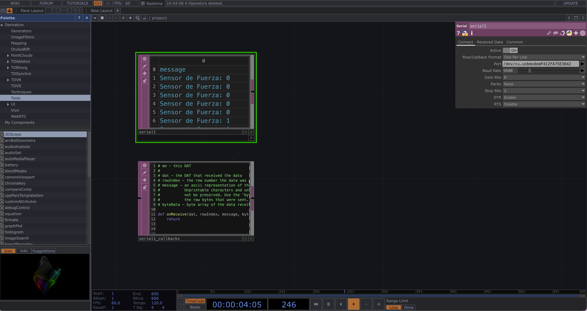
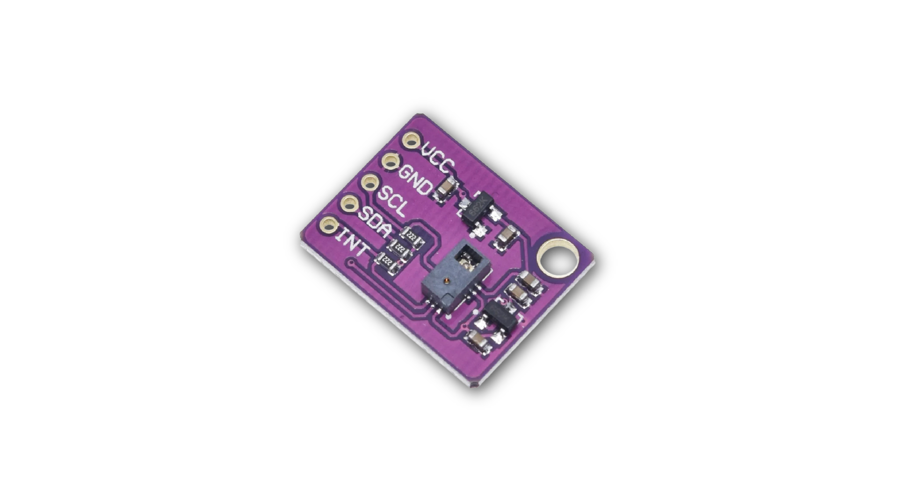
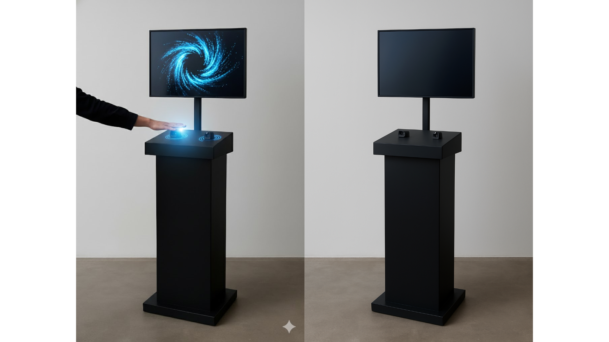

# 🌷 sesion-14b
Viernes 14 de noviembre de 2025 

## 🪩 Apuntes de la clase 
- Lenguajes que se usan en las terminales se llama bash

## ⚡️ Avance del proyecto 3

### 📌 Explicación del proyecto
La máquina sentimental es un organismo artificial que responde al tacto humano como si tuviera emociones propias. Representa el intento de traducir afectos en datos; de convertir gestos en lenguaje digital.

Su cuerpo, hecho de una materialidad blanda y orgánica, invita al acercamiento, pero también despierta la curiosidad por lo desconocido que habita en lo artificial.

Esa mezcla de suavidad y extrañeza genera un momento de duda: el usuario no sabe si enfrentarse a un objeto inerte o a una presencia viva. En ese instante, la tecnología deja de ser solo herramienta y se vuelve territorio sensible, un espacio de descubrimiento donde lo mecánico parece respirar.

La máquina no busca imitar lo humano, sino evocar emociones a través de la interacción.

Cada gesto (apretar, estirar o acariciar) es un lenguaje que el cuerpo humano ofrece y la máquina interpreta, devolviendo una respuesta sonora y visual que traduce ese impulso en un paisaje emocional.

## ⚙️ Conexión con el sensor de fuerza 

### 🧲 Funcionamiento del sensor de fuerza

### 💾 Conexión datos de Arduino con Touchdesigner 
Primero se debe elegir el protocolo de comunicación adecuado, este puede ser:
- **Comunicación serial:** para comunicaciones DAT seriales de TD.
- **OSC (Open Sound Control):** ideal para arte generativo en tiempo real. Baja latencia.
- **MIDI:** ideal para proyectos con música o sonidos.
- **Websocket:** protocolo de comunicación bidireccional, ideal para proyectos conectados a internet como una página web.

Una vez elegido, en este caso usaré OSC ya que es especial para animaciones generativas y arduino.

### ⚙️ Código de Arduino para el sensor de fuerza
Este código fue sacado del siguiente video, donde explicaban paso a paso el funcionamiento y programación del sensor (https://www.youtube.com/watch?v=U-N7nR5EEHs)

```cpp
const int Sensor_Fuerza = A0;  // Pin del sensor de fuerza 

void setup() {
    Serial.begin(9600);
    pinMode(Sensor_Fuerza, INPUT);
}

void loop() {
    int valorFuerza = analogRead(Sensor_Fuerza);  // Leer el valor del sensor
    Serial.print("Sensor de Fuerza: ");
    Serial.println(valorFuerza);
    
    delay(500);  
}
```

### 🔗 Conectando datos entre arduino y TD
1. crear un nodo **DAT Serial - Serial1_Callbacks**.
2. active: **on**.
3. port: **usbmodem...** que es el nombre del Arduino que está conecatdo a nuestro computador.
4. **baud rate**: 9600 este debe coincidir con el puerto serial que configuramos en arduino.

Aquí es donde el DAT lee el sensor y sus valores para luego jugar con los parámetros de las visuales.




### 🔗 Asignación de entradas de Arduino a elementos visuales de Touchdesigner 
1. configurar **DAT serial**, mencionado y explicado en el apartado anterior.
2. crear un **DAT in CHOP** para convertir los datos en canales y poder crear las animaciones.
3. agregar un **CHOP Math** para escalar los datos a un rango utilizable. En este caso el sensor de fuerza va de 0 a 1000.
4. conectar la salida del **Math a una Sphere**para que controle parámetros como radio, posición o color con los datos del sensor de fuerza.

# 💭 Nuevas propuestas
Luego de hablar y darle un sentido a este proyecto, no nos lograba gustar, o había algo que nos entrampaba y no nos convencía. Es por eso que abrimos un abanico de propuestas que exploraban distintos sensores, materialidades y metáforas.

## 🧩 Propuestas 
1. **Marea** es una máquina sentimental diseñada para suspender el ritmo acelerado del día y ofrecer un espacio de pausa emocional. A través de un sensor gestual, responde a movimientos suaves de la mano generando ondas de luz que acompañan la respiración y la presencia del usuario. Su objetivo no es impresionar, sino brindar un instante íntimo de calma en un mundo que no deja descansar.
2. La **Máquina que Se Ofende Fácilmente** es un dispositivo con “personalidad” hipersensible que reacciona emocionalmente según cómo te acerques o la toques. Usa sensores de distancia, vibración y toque para interpretar si la interacción es suave o brusca, cambiando su luz, postura y mensajes. Cuando se siente “maltratada”, apaga sus luces, se cierra y muestra frases pasivo-agresivas antes de volver gradualmente a la normalidad.
3. La **Máquina sentimental que no quiere jugar contigo** es un personaje que invita entusiastamente a jugar, pero cuando tomas su “control” activa un error intencional y se retracta. Utiliza un sensor ultrasónico para detectar cercanía y un sensor FSR en el control para identificar cuándo alguien lo toma y así gatillar la broma. Cuando la persona se aleja, el personaje vuelve a su actitud amistosa y reinicia el ciclo.

## 🔮 Propuesta final
**“Atrápame si puedes”** es una máquina interactiva que **funciona con gestos de la mano**. El usuario mueve su mano frente a un sensor, y ese gesto controla un punto en una pantalla. El objetivo del juego es alcanzar un objeto que aparece en la pantalla.

Pero la máquina está **diseñada para escaparse justo cuando estás a punto de atrapar el objetivo**. Detecta tu cercanía y activa una especie de “glitch” o falla visual que hace que el objetivo huya. Esto provoca una mezcla de frustración y risa, porque el error no es real: la máquina te está troleando a propósito.

A veces te deja sumar puntos, otras veces te engaña, y te invita a seguir intentando con mensajes provocativos. La interacción crea una especie de competencia emocional entre el usuario y la máquina.

En resumen: es un juego que reconoce tus gestos, **te hace creer que vas a ganar y luego se escapa**, generando una experiencia divertida, frustrante y muy humana.

## 🖖🏻 Sensor de Reconocimiento Gestual PAJ7620
Es un sensor que reconoce gestos sin contacto y puede detectar 9 gestos principales:
- arriba
- abajo
- izquierda
- derecha
- adelante (push)
- atrás (pull)
- reloj (circular CW)
- antireloj (circular CCW)
- movimiento ondulante (wave)

También reconoce gestos continuos manteniendo la mano en una dirección. Trabaja por I2C, así que solo se necesitan 4 cables. 

### ⚡️ Conexión del sensor con arduino

| Sensor PAJ7620 | Arduino         |
|----------------|-----------------|
| VCC            | 3.3V            |
| GND            | GND             |
| SDA            | SDA (A4 en UNO  |
| SCL            | SCL (A5 en UNO  |

Como este sensor funciona cn una lógica de 3.3V, se necesitará un PAJ7620 o un PAJ7620 para que se pueda utilizar de manera correcta al arduino de 5V.



### 📚 Librería necesaria

La más usada y estable es: **PAJ7620 de OYMotion**.

### ⚙️ Código básico para leer los gestos 
```cpp
#include <Wire.h>
#include "PAJ7620.h"

void setup() {
  Wire.begin();
  Serial.begin(9600);

  uint8_t error = paj7620Init();
  if (error) {
    Serial.print("Error inicializando sensor: ");
    Serial.println(error);
  } else {
    Serial.println("PAJ7620 listo!");
  }
}

void loop() {
  uint8_t gesture = paj7620ReadGesture();
  
  switch (gesture) {
    case GES_UP_FLAG:
      Serial.println("Arriba");
      break;
    case GES_DOWN_FLAG:
      Serial.println("Abajo");
      break;
    case GES_LEFT_FLAG:
      Serial.println("Izquierda");
      break;
    case GES_RIGHT_FLAG:
      Serial.println("Derecha");
      break;
    case GES_FORWARD_FLAG:
      Serial.println("Adelante");
      break;
    case GES_BACKWARD_FLAG:
      Serial.println("Atras");
      break;
    case GES_CLOCKWISE_FLAG:
      Serial.println("Circular CW");
      break;
    case GES_ANTICLOCKWISE_FLAG:
      Serial.println("Circular CCW");
      break;
    case GES_WAVE_FLAG:
      Serial.println("Wave / Saludo");
      break;
  }

  delay(100);
}
```

### ‼️ Importante
- Distancia optima: 2 a 10 cm sobre el sensor.
- Evitar luz directa, ya sea solar o led muy fuerte.
- Es más preciso con movimientos firmes.

### ⚡️ Conexión del sensor con Touchdesigner 
Funciona de igual manera que con cualquier sensor, enviando los datos por:
1. Serial usb.
2. OSC por wifi ➜ con arduino uno r4 wifi se hace de manera inalámbrica.

Luego en touchdesigner se usa un Serial DAT u OSC In DAT para capturar el gesto y activar una animación.

### 💻 Estructura del patch de touchdesigner 
La idea es:
1. Serial DAT lee lo que manda Arduino.
2. DAT Execute detecta el último gesto y lo traduce a un número (0,1,2,3...).
3. Un Constant CHOP guarda ese número.
4. Un Switch TOP cambia la gráfica según ese número.

----------------------------------------------------------------------

Visualmete tendríamos:

- serial1 (Serial DAT) → select1 (Select/Tail DAT) → dat_execute1 (DAT Execute)

- dat_execute1 → modifica constant1 (CHOP) → controla switch1 (TOP)

Y al switch1 le conectas varias gráficas, por ejemplo:

- moviefilein1 (gráfica 0)

- noise1 (gráfica 1)

- ramp1 (gráfica 2)

- circle1 (gráfica 3)

Y así con las gráficas que sean necesarias.

----------------------------------------------------------------------

### 🌄 Para cambiar la gráfica
- PAJ7620 detecta gesto.

- Arduino manda por Serial: UP, DOWN, LEFT…

- TouchDesigner lo lee con serial1.

- tail1 se queda con el último.

- dat_execute1 traduce texto a número.

- constant1 guarda ese número.

- switch1 muestra la gráfica correspondiente.

### 🎛️ Para cambiar los parámetros de la gráfica
Para cambiar la intensidad, color, velocidad, etc.

En vez de un Constant CHOP con 1 canal para índice, ahora serán **tres canales:**

| Nombre del canal | Valor inicial | Significado                      |
|------------------|---------------|----------------------------------|
| _intensity_      | 0.8           | intensidad/ brillo               |
| _color_          | 0             | índice de color, 0-3 por ejemplo |
| _speed_          | 1.0           | velocidad de la animación        |

Quedaría algo así:
- chan1: hay que renombrarlo a _intensity_
- chan2: _color_
- chan3: _speed_

_continuará..._

## ✏︎ Bocetos e imagenes de referencia




### 🏞️ Referentes de instalación/interacción


### 🔺 Diagrama de flujo
1- Pantalla prendida con algún texto (SALUDA PARA COMENZAR👋🏻)
2- Título: "Atrápame si puedes"  monito: Mosquito Abstracto (gráfica sofi)
3- Empieza el juego y el punto se estará moviendo todo el rato
4- Tratar de atrapar el punto- tiene 3 vidas -
4a- lo atrapé: 2 vidas
4b- lo atrapé: 1 vida
4c- Tratar de atraparlo por última vez, la máquina te trollea
5- Cuando te trollea aparece el glitch
6- "ingresar texto gracioso" o "imagen chistosa"
7- vuelve al inicio (saluda para comenzar)

### 🔺 Pesudocódigo
```cpp
INICIAR variables:
    estado = "espera"
    puntaje = 0
    objetivo = posición_inicial

MIENTRAS el sistema esté encendido:
    leer gestos y distancia del usuario

    SI estado == "espera" Y el usuario se acerca:
        mostrar_mensaje("¿Vienes a perder?")
        estado = "invitación"

    SI estado == "invitación" Y el usuario hace el gesto de empezar:
        calibrar_controles()
        estado = "jugando"

    SI estado == "jugando":
        mover_cursor_segun_gestos()
        mover_objetivo_con_su_logica()

        SI el usuario está muy cerca de atrapar:
            decidir_si_trollear()

        SI el jugador atrapa el objetivo:
            SI hay_trolleo:
                hacer_glitch_y_huir()
                burlarse_del_usuario()
            SINO:
                sumar_puntos()
                mostrar_feedback_positivo()

                SI puntaje alcanza el mínimo para ganar:
                    estado = "victoria"

    SI estado == "victoria":
        SI hay_trolleo:
            hacer_glitch_y_huir()
            mostrar_mensaje("¿Pensaste que te dejaría ganar?")
            estado = "jugando"
        SINO:
            celebrar()
            reiniciar_juego()

    esperar_pequeño_momento()
```


### 🔺 Bill of materials
- Sensor de gestualidad PAJ7620       
- Conversor de nivel lógico 5V a 3.3V 
- Arduino UNO R4 WIFI               
- Pantalla 
- Carcasa
- Plinto
- Cables 
### 🔺 Carta Gantt
