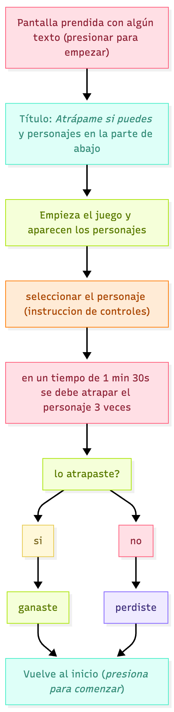
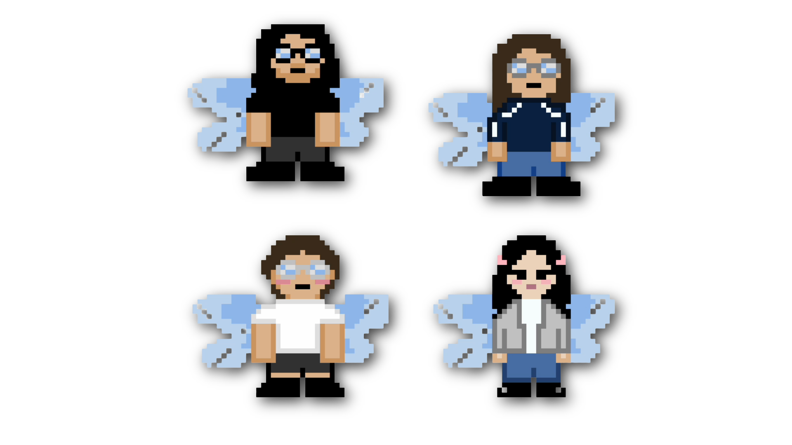
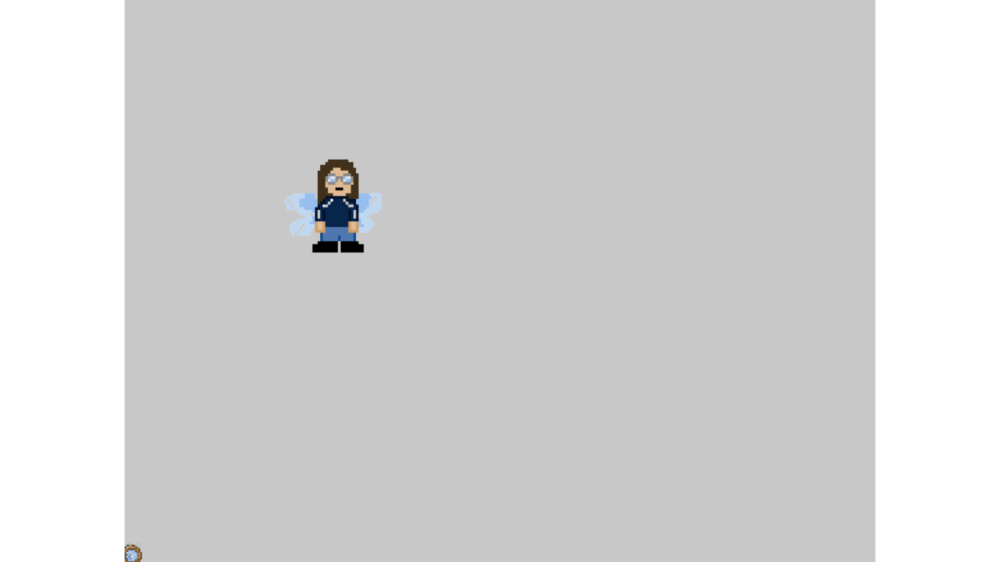

# 🌷 sesion-15a
Martes 18 de noviembre 

## 🪩 Apuntes de clase 
Martes **25 de noviembre**
- 09:30 Metro Salvador
- 11:00 MAC Parque Forestal

## 🔮 Avance del proyecto

### 💭 Explicación del proyecto
Es una máquina interactiva que se controla con gestos de la mano. El usuario mueve su mano frente a un sensor, y ese movimiento controla un punto en la pantalla. El objetivo parece sencillo: mover ese punto y atrapar un objeto que aparece frente a ti.

Pero la máquina está programada para escaparse justo cuando estás por ganar. Cuando detecta que estás demasiado cerca, activa un “glitch”, mueve el objetivo rápidamente y te deja con las ganas. Lo hace una y otra vez, de una forma que parece casi personal, como si te estuviera leyendo y respondiendo a tu intención.

Este punto, se reemplazará por las gráficas que aparecerán más adeñante.
### ⚙️ Pseudocódigo
```cpp
cpp 
INICIAR variables:
    estado = "espera"
    puntaje = 0
    objetivo = posición_inicial

MIENTRAS el sistema esté encendido:
    
    leer gestos y distancia del usuario

    SI estado == "espera" Y el usuario se acerca:
        mostrar_mensaje("¿Vienes a perder?")
        estado = "invitación"

    SI estado == "invitación" Y el usuario hace el gesto de empezar:
        calibrar_controles()
        estado = "jugando"

    SI estado == "jugando":
        mover_cursor_segun_gestos()
        mover_objetivo_con_su_logica()

        SI el usuario está muy cerca de atrapar:
            decidir_si_trollear()

        SI el jugador atrapa el objetivo:
            SI hay_trolleo:
                hacer_glitch_y_huir()
                burlarse_del_usuario()
            SINO:
                sumar_puntos()
                mostrar_feedback_positivo()

                SI puntaje alcanza el mínimo para ganar:
                    estado = "victoria"

    SI estado == "victoria":
        SI hay_trolleo:
            hacer_glitch_y_huir()
            mostrar_mensaje("¿Pensaste que te dejaría ganar?")
            estado = "jugando"
        SINO:
            celebrar()
            reiniciar_juego()

    esperar_pequeño_momento()
```

### 📌 Diagrama de flujo


### 🔄 Devolviéndonos al sensor de fuerza
Después de probar el sensor gestual, nos dimos cuenta de que era muy difícil que reconociera los gestos que queríamos reconocer, es por eso que nos quedamos con el sensor de fuerza, que ya lo habíamos investigando mucho más que el de gestualidad.

La idea es que para nuestro proyecto fuera como un control joystick pero en vez de botones, estos estuvieran reemplazados por los sensores de fuerza. Estos sensores tendrían las siguientes direcciones `arriba-abajo` `izquierda-derecha` esto haría que se moviera el puntito en toda la pantalla y permitiera la interacción.

➡️ El día lunes 17 de noviembre logramos que el punto subiera y bajara con los siguientes códigos:

### ↔️ Izquierda-derecha
```cpp
#include <Wire.h>
#include <Adafruit_GFX.h>
#include <Adafruit_SSD1306.h>

#define ANCHO 128
#define ALTO 64

// Crear display OLED
Adafruit_SSD1306 display(ANCHO, ALTO, &Wire, -1);

const int Sensor_Fuerza = A0;  // Pin del sensor de fuerza

void setup() {
    Serial.begin(9600);
    pinMode(Sensor_Fuerza, INPUT);

    // Inicializar pantalla OLED
    if (!display.begin(SSD1306_SWITCHCAPVCC, 0x3C)) {
        Serial.println("ERROR: Pantalla OLED no encontrada");
        while (true);  
    }

    display.clearDisplay();
    display.setTextSize(1);
    display.setTextColor(SSD1306_WHITE);
    display.setCursor(10, 10);
    display.println("FSR + OLED OK");
    display.display();
    delay(1000);
}

void loop() {
    int valorFuerza = analogRead(Sensor_Fuerza);

    Serial.print("Sensor de Fuerza: ");
    Serial.println(valorFuerza);

    // Convertir presión en posición HORIZONTAL
    // 0 -> izquierda (x=5)
    // 1023 -> derecha (x=120)
    int posicionX = map(valorFuerza, 0, 1023, 5, 120);

    // Limitar movimientos
    if (posicionX < 0) posicionX = 0;
    if (posicionX > 127) posicionX = 127;

    // Dibujar puntito
    display.clearDisplay();
    display.fillCircle(posicionX, 32, 3, SSD1306_WHITE);  // y=32 (centro vertical)
    display.display();

    delay(50);
}
```

### ➡️ Derecha
```cpp
#include <Wire.h>
#include <Adafruit_GFX.h>
#include <Adafruit_SSD1306.h>

#define ANCHO 128
#define ALTO 64

// Crear display OLED
Adafruit_SSD1306 display(ANCHO, ALTO, &Wire, -1);

const int Sensor_Fuerza = A0;  // Pin del sensor de fuerza

void setup() {
    Serial.begin(9600);
    pinMode(Sensor_Fuerza, INPUT);

    // Inicializar pantalla OLED
    if (!display.begin(SSD1306_SWITCHCAPVCC, 0x3C)) {
        Serial.println("ERROR: Pantalla OLED no encontrada");
        while (true);  
    }

    display.clearDisplay();
    display.setTextSize(1);
    display.setTextColor(SSD1306_WHITE);
    display.setCursor(10, 10);
    display.println("FSR + OLED OK");
    display.display();
    delay(1000);
}

void loop() {
    int valorFuerza = analogRead(Sensor_Fuerza);

    Serial.print("Sensor de Fuerza: ");
    Serial.println(valorFuerza);

    // Convertir presión en posición vertical
    // 0 -> abajo (y=60)
    // 1023 -> arriba (y=5)
    int posicionY = map(valorFuerza, 0, 1023, 60, 5);

    // Limitar movimientos
    if (posicionY < 0) posicionY = 0;
    if (posicionY > 63) posicionY = 63;

    // Dibujar puntito
    display.clearDisplay();
    display.fillCircle(64, posicionY, 3, SSD1306_WHITE);
    display.display();

    delay(50);
}
```

### 🧚🏻 Para las animaciones
Al final decidimos usar pixel art para nuestras gráficas, para esto se crearon ilustraciones que serán cargadas en p5 que es donde estará la interfaz del juego.


### 👾 Código de las animaciones en p5
```java
PS5.JS —-> mosquitos código

let colors = {};   // Se inicializan vacío
let sprite4;       // Se declara antes, pero se llena en setup()

function setup() {
  createCanvas(370, 330);
  noStroke();

  // Definición de colores
  colors = {
    0: color(0, 0, 0, 0),        // transparente
    1: color(0),                 // negro
    2: color(255,224,189),       // piel
    3: color(200),               // gris polera
    4: color(130,200,255),       // celeste alas
    5: color(40,90,200),         // azul pantalón
    6: color(255,120,180),       // rosa
    7: color(255,255,255),       // blanco
    8: color(220),               // gris claro
    9: color(180,230,255)       // celeste claro
  };

  // Se inicia el sprite
  sprite4 = [
    [0,0,0,0,0,0,0,0,0,0,0,0,0,0,0,0,0,1,1,1,1,1,1,0,0,0,0,0,0,0,0,0,0,0,0,0,0],
    [0,0,0,0,0,0,0,0,0,0,0,0,0,0,0,1,1,1,1,1,1,1,1,1,1,0,0,0,0,0,0,0,0,0,0,0,0],
    [0,0,0,0,0,0,0,0,0,0,0,0,0,0,1,1,1,1,1,1,1,1,1,1,1,0,0,0,0,0,0,0,0,0,0,0,0],
    [0,0,0,0,0,0,0,0,0,0,0,0,0,0,1,1,1,1,1,2,2,1,1,1,1,1,0,0,0,0,0,0,0,0,0,0,0],
    [0,0,0,0,0,0,0,0,0,0,0,0,0,6,1,1,1,1,2,2,2,2,2,1,1,1,6,0,0,0,0,0,0,0,0,0,0],
    [0,0,0,0,0,0,0,0,0,0,0,0,0,6,6,1,1,2,2,2,2,2,2,1,1,6,6,0,0,0,0,0,0,0,0,0,0],
    [0,0,0,0,0,0,0,0,0,0,0,0,0,1,1,1,2,2,2,2,2,2,2,2,1,1,1,0,0,0,0,0,0,0,0,0,0],
    [0,0,0,0,0,0,0,0,0,0,0,0,0,1,1,1,1,1,1,2,2,1,1,1,1,1,1,0,0,0,0,0,0,0,0,0,0],
    [0,0,0,0,0,0,0,0,0,0,0,0,1,1,1,2,2,1,1,2,2,1,1,2,2,1,1,1,0,0,0,0,0,0,0,0,0],
    [0,0,0,0,0,0,0,0,0,0,0,0,1,1,1,2,6,6,2,2,2,2,6,6,2,1,1,1,0,0,0,0,0,0,0,0,0],
    [0,0,0,0,0,0,0,0,0,0,0,0,1,1,1,1,2,2,2,6,6,2,2,2,1,1,1,1,0,0,0,0,0,0,0,0,0],
    [0,0,0,0,0,0,0,0,0,0,0,0,1,1,1,1,1,2,2,2,2,2,2,1,1,1,1,1,0,0,0,0,0,0,0,0,0],
    [0,0,0,9,9,9,9,9,4,4,4,4,1,1,1,1,1,1,2,2,2,2,1,1,1,1,1,1,4,4,4,4,9,9,9,9,0],
    [0,9,9,9,9,9,9,9,4,4,4,4,1,1,1,1,3,3,7,7,7,7,3,3,1,1,1,1,4,4,4,4,4,9,7,9,9],
    [9,7,9,9,9,9,4,4,4,4,4,4,1,1,1,3,8,3,7,7,7,7,3,8,3,1,1,4,4,4,4,4,9,7,9,9,9],
    [9,9,7,9,9,9,4,4,4,4,4,4,4,1,3,8,8,3,7,7,7,7,3,8,8,3,1,1,4,4,4,4,7,9,9,9,9],
    [0,9,9,7,9,9,4,4,4,4,4,4,1,3,8,8,8,3,7,7,7,7,3,8,8,8,3,1,4,4,4,4,9,9,9,9,0],
    [0,9,9,9,9,9,9,9,4,4,4,4,3,8,8,8,8,3,7,7,7,7,3,8,8,8,8,3,4,4,4,9,9,9,9,9,0],
    [0,0,0,0,0,9,9,9,9,9,9,4,3,8,8,8,8,3,3,7,7,3,3,8,8,8,8,3,4,4,9,9,9,9,9,0,0],
    [0,0,0,0,0,0,9,9,9,9,7,4,3,8,3,8,8,8,3,7,7,3,8,8,8,3,8,3,4,9,9,9,9,0,0,0,0],
    [0,0,0,0,0,0,0,0,9,9,9,4,3,8,3,8,8,8,3,7,7,3,8,8,8,3,8,3,9,9,9,9,0,0,0,0,0],
    [0,0,0,0,0,9,9,9,9,9,9,4,3,8,3,8,8,8,3,7,7,3,8,8,8,3,8,3,4,9,9,9,9,0,0,0,0],
    [0,0,0,9,9,9,9,9,9,9,4,4,3,8,3,8,8,8,3,7,7,3,8,8,8,3,8,3,4,9,9,9,9,9,0,0,0],
    [0,0,9,9,9,9,9,7,9,9,9,9,3,3,3,3,3,3,3,7,7,3,3,3,3,3,3,3,4,4,9,9,9,9,0,0,0],
    [0,0,9,9,9,9,7,9,9,9,9,7,2,2,2,5,5,5,5,5,5,5,5,5,5,2,2,2,9,9,9,9,9,0,0,0,0],
    [0,0,9,9,9,7,9,9,9,9,9,7,2,2,2,5,5,5,5,5,5,5,5,5,5,2,2,2,9,9,9,9,0,0,0,0,0],
    [0,0,0,9,7,9,9,9,9,9,0,0,0,0,5,5,5,5,5,5,5,5,5,5,5,5,0,0,9,9,9,0,0,0,0,0,0],
    [0,0,0,0,0,0,0,0,0,0,0,0,0,0,5,5,5,5,5,5,5,5,5,5,5,5,0,0,0,0,0,0,0,0,0,0,0],
    [0,0,0,0,0,0,0,0,0,0,0,0,0,0,5,5,5,5,5,5,5,5,5,5,5,5,0,0,0,0,0,0,0,0,0,0,0],
    [0,0,0,0,0,0,0,0,0,0,0,0,0,0,5,5,5,5,5,5,0,5,5,5,5,5,0,0,0,0,0,0,0,0,0,0,0],
    [0,0,0,0,0,0,0,0,0,0,0,0,0,0,1,1,1,1,1,1,0,1,1,1,1,1,0,0,0,0,0,0,0,0,0,0,0],
    [0,0,0,0,0,0,0,0,0,0,0,0,0,1,7,1,1,1,1,1,0,1,1,1,1,7,1,0,0,0,0,0,0,0,0,0,0],
    [0,0,0,0,0,0,0,0,0,0,0,0,0,1,1,1,1,1,1,1,0,1,1,1,1,1,1,0,0,0,0,0,0,0,0,0,0],
    
  ];
}

function draw() {
  background(0);
  let pixelSize = 10;

  for (let y = 0; y < sprite4.length; y++) {
    for (let x = 0; x < sprite4[y].length; x++) {
      fill(colors[sprite4[y][x]]);
      rect(x * pixelSize, y * pixelSize, pixelSize, pixelSize);
    }
  }
```

## ⚡️ Conexión Arduino con P5.js
Primero vi estos videos para entender la conexión.
(https://www.youtube.com/watch?v=MtO1nDoM41Y)

Primero probaremos la conexión serial. Pero antes de esto hay que descargar un programa intermediario que hace que pueda leer el puerto serial desde una página web, que por motivos de seguridad están bloqueados. **Este es el link de descarga**: (https://github.com/p5-serial/p5.serialcontrol/releases/tag/0.1.2).

### ➡️ P5.serialcontrol
Esta aplicación ejecuta p5.serialserver, que permite la conectividad entre dispositivos serie locales y aplicaciones web mediante la biblioteca p5.serialport de p5.js.

Probando, me di cuenta de que esta aplicación no funcionaba como corresponde, no encontraba el puerto serial y no lograba hacer la conexión, es por eso que le pedimos ayuda a Aarón, y nos guió con la biblioteca para poder usar el arduino con p5.


### ➡️ p5.webserial.js de Gohai
(https://github.com/gohai/p5.webserial?tab=readme-ov-file#getting-started)

Esta es una biblioteca para p5 que añade compatbilidad para interactuar con dispositivos serie mediante la API Web Serial, que actualmente está compatible con Chrome y Edge.

### ⚡️ Para comenzar la conexión
1. Primero hay que descargar este archivo: (https://github.com/gohai/p5.webserial/blob/main/libraries/p5.webserial.js) o pegarlo en la head del html, debajo de la línea que carga p5 en p5.js.

```java
<script src="https://unpkg.com/@gohai/p5.webserial@^1/libraries/p5.webserial.js"></script>
```
1. Segundo, crear una variable global y asignarle un nuevo puerto de serie dentro de la configuración. 
```java
let port;

function setup() {
  port = createSerial();
  // ...
```
Luego me confundí un poco con los códigos y el orden, por lo que tuve que recurrir a chatgpt para poder discernir las dudas que tenía. Es por eso que le subí el respositorio que estaba utilizando y le hice la pedida tal cual: 

`"necesito hacer una conexión entre arduino y p5. el arduino está conectado a dos sensores de fuerza FSR402. por lo que necesito hacer la conexión para que se mueva un puntito en la pantalla mediante los sensores de fuerza. A continuación cargo el código de arduino que hace que se mueva esta animación. Me podrías además hacer un sketch en p5 para que se pueda mostrar la puntito moviéndose mediante los sensores de fuerza? (cabe destacar que un sensor hace un movimiento de derecha a izquierda y el otro hace un movimiento de arriba a abajo). Además tengo esto de referencia: https://github.com/gohai/p5.webserial?tab=readme-ov-file#getting-started`

A esto le subí el código completo de arduino, incluido los .h. y me ayudo 

### 🔄 Recapitulando la conexión, con ayuda de chatgpt
IMPORTANTE: los datos deben ser ordnados para que p5 los entienda. Un formato recomendado es 123,456\n (dos valores separados por una coma y un salto de línea).

- p5 escucha el puerto usando la librería:
```java
<script src="https://unpkg.com/@gohai/p5.webserial@^1/libraries/p5.webserial.js"></script>
```
- p5 lee cada línea y actualiza las variables.
- p5 usa esos valores para mover esos gráficos, como una imagen, particulas, formas, etc.
- para que arduino envíe los datos correctos a p5 se debe utilizar el siguiente formato:
```cpp
#include "SensorFuerza.h"

SensorFuerza ejeX;
SensorFuerza ejeY;

void setup() {
  Serial.begin(9600); //puerto serial, debe coincidir con el de p5
  ejeX.configurar(A0); //pin que lee los datod del eje x
  ejeY.configurar(A1); //pin que lee los datos del eje y 
}

void loop() {
  ejeX.leer();
  ejeY.leer();

//valores crudos del sensor 
  int x = ejeX.valorCrudo;
  int y = ejeY.valorCrudo;

//lee los valores en la consola
  Serial.print(x);
  Serial.print(",");
  Serial.println(y);

  delay(40);
}
```
- lo que se **imprime se ve así en el Serial Monitor**:
```cpp
12,30
14,45
20,50
...
```
➡️ Ahora viene la **estructura del sketch de p5**, una carpeta. Esta debe contener:
- index.html
- sketch.js
- demás archivos que queremos utilizar, como audio, imagenes, etc.

Como mencioné anteriormente, la librería a utilizar se pega en el html del sketch de p5.

### ▶️ Botón para conectar el arduino del navegador
Chrome y Edge exigen que el usuario haga clic para acceder al puerto. Es por eso que se "dibujará" un botón para conectarlo manualmente.
```java
connectBtn = createButton('Conectar Arduino');
connectBtn.mousePressed(() => port.open(9600));
```
### 🔎 Lectura Serial en p5
Para que p5 lea los valores de la consola de arduino.
```java
let line = port.readUntil("\n");
  while (line && line.length > 0) {
    line = trim(line);
```
### 🏞️ Para mostrar imágenes en p5 
1. Primero se define la imagen.
2. Se crea `function preload ()` para cargar esta imagen para que sea dibujada en el sketch.
3. se llama la imagen ya definida y con su nombre tal cual como se subió en la carpeta del proyecto de p5 para que se dibuje correctamente en el sketch.
```java
let img;
function preload() {
  img = loadImage("imagen.png");
}
```
4. Para mostrar la imagen la pantalla:
```java
imageMode(CENTER); // (CORNER) para ajustarla desde la esquina del sketch
image(img, posX, posY, 120, 120); // posición de la imagen y tamaño
```
### 🕹️ Posición de los sensores de fuerza
```java
let posX = map(sensorX, 0, 1023, 0, width); //para el movimiento de izquierda a derecha
let posY = map(sensorY, 0, 1023, height, 0); //para el movimiento de arriba a abajo
```
Esto transofrma la lectura del sensor a la pantalla.

### ✅ Para que funcione sí o sí
- Arduino debe mandar los datos consistentes en el mismo formato.
- p5 deber leer las líneas completas de datos con `readUntil("\n")`
- Chrome y Edge obligan a usar un botón para abrir el puerto y permitir la conexión.
- NO ABRIR Serial Monitor mientras p5 lo usa. Esto interrumpe la conexión.
- Usar servidor local, como vs code con liver server para visualizar el html.
- Cerrar ventanas p5 repetidas, sólo accede a un puerto.

### 📌 Resultados preliminares 
La idea es ambientar un poco más el fondo para que se vea más completo el juego. Pero por el momento se ve así



### 👾 Sketch de p5
(https://editor.p5js.org/valentina.chavez1/sketches/_DhKZKhwd)

```java
//este sketch fue hecho con ayuda de la librería de Gohai
//se encuentra en ek siguiente link //https://editor.p5js.org/valentina.chavez1/sketches/_DhKZKhwd
//conexión de datos de arduino hacia p5 utilizando un sensor de fuerza
//este sensor lee parametros como izquierda-derecha, arriba-abajo
//proyecto de juego realizado para el taller de diseño de maquinas computacionales 
//proyecto examen taller vertical noviembre-diciembre 2025
//por Valentina Chavez 

const BAUDRATE = 9600;  //velocidad del puerto
let port;               //variable del puerto
let connectBtn;         //boton

let sensorX = 0;        //izquierda-derecha
let sensorY = 0;        //arriba-abajo

// 0 = esperamos X, 1 = esperamos Y
let lecturaEstado = 0;

//imagenes 
let img; //imagen en png de la red atrapa mosquitos
let backImg; //imagen de misaa

//aqui es donde se cargan las imagenes y todos los recursos que utilizaremos
function preload() {
  img = loadImage("atrapar.png");
  backImg = loadImage("misaa.png");
  
}

//configuracion del lienzo
function setup() {
  createCanvas(1920, 1080); //tamaño del lienzo
  background(20); //color de fondo

  port = createSerial(); //creamos el puerto serial para la conexión
  port.bufferSize(1024); //buffer que nos permitirá leer con una velocidad adecuada los datos que entrega arduino

  //botón para conectar el arduino
  connectBtn = createButton('Conectar Arduino'); //texto para el boton
  connectBtn.position(10, 10); //posición del boton
  connectBtn.mousePressed(connectBtnClick); //al hacer clic se activa
}

function draw() {
  background(200);
  
  image(backImg, 400, 400, 200, 200); //aqui se llama a la imagen para que se pueda dibujar 

  
  //lee los valores de arduino en el formato correspondiente a p5
  let line = port.readUntil("\n"); 
  while (line && line.length > 0) {
    line = trim(line);

    // si la línea no es solo números (tiene letras, comas, etc.), la ignoramos
    if (/^\d+$/.test(line)) {
      let v = int(line);

      if (lecturaEstado === 0) {
        sensorX = v;
        lecturaEstado = 1; // la próxima numérica será Y
      } else {
        sensorY = v;
        lecturaEstado = 0; // volvemos a esperar X
      }
    }

    // leer siguiente línea del buffer (los datos)
    line = port.readUntil("\n"); //salto de linea 
  }

  // Mapear a la pantalla
  let posX = map(sensorX, 0, 1023, 0, width);
  let posY = map(sensorY, 0, 1023, height, 0); // invertido

  let imgSize = 120; // tamaño de la imagen
  imageMode(CENTER); //posicion de la imagen al centro, (CORNER) tambien funciona
  image(img, posX, posY, imgSize, imgSize); //posicion y tamaño de la imagen
  
  // tamaño, color y texto de los valores que recibe el sensor en p5, esto puede modificarse para agregar las vidas y el conteo de puntos.
  fill(180);
  textSize(14);
  text(`X: ${sensorX}`, 10, height - 30);
  text(`Y: ${sensorY}`, 10, height - 10);
  
  //agregamos la otra imagen, en este caso la de misaa
  let misaaSize = 220; // tamaño de la imagen (puedes cambiarlo)
  imageMode(CENTER);
  image(backImg);
}

//funcion para que el boton de conectar el arduino a p5 funcione al hacer clic y lea la placa
function connectBtnClick() {
  if (!port.opened()) {
    port.open(BAUDRATE);
  } else {
    port.close();
  }
}
```
