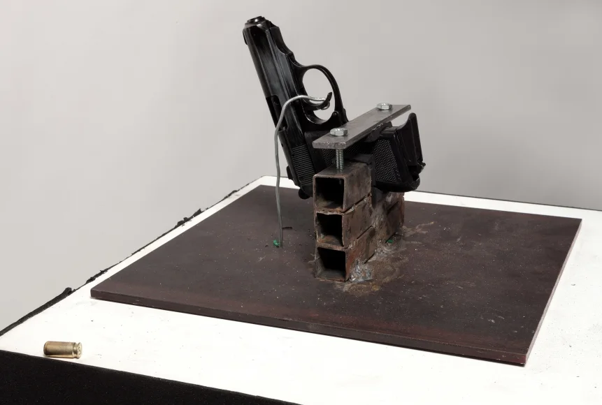
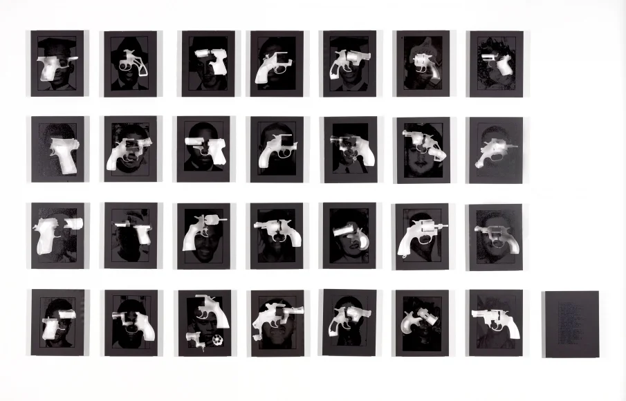
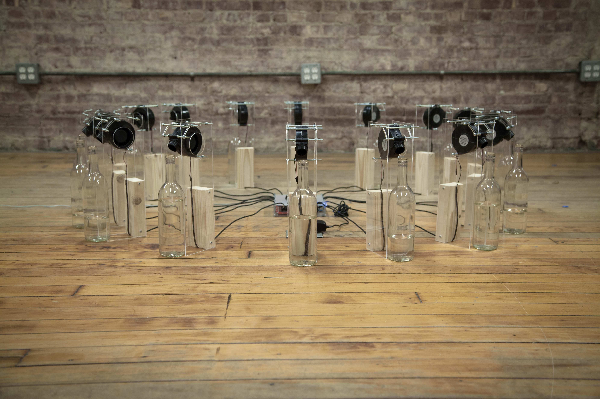
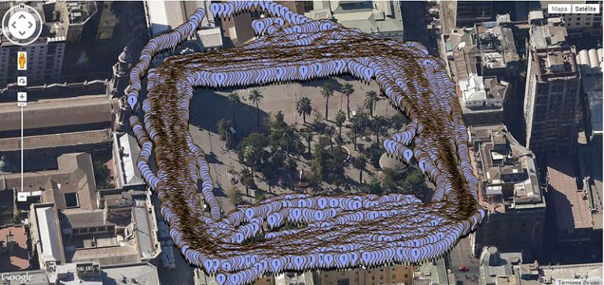
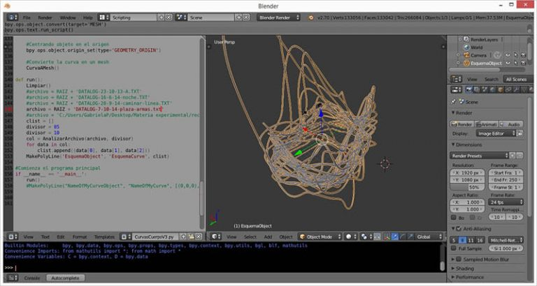
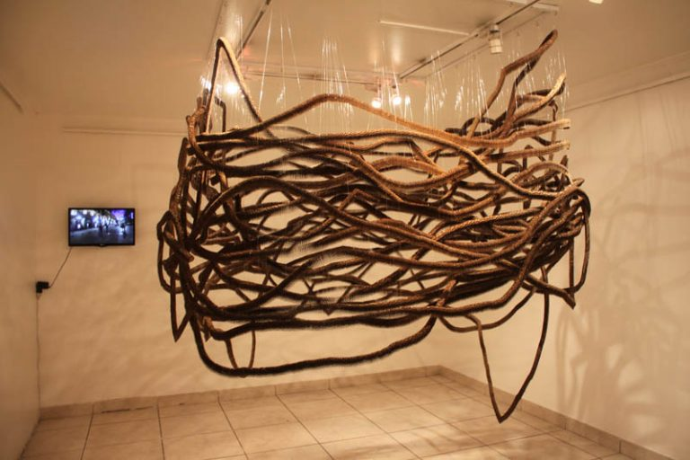

# sesion-11a

## martes 21 de octubre

## primer bloque de clases

Esta fue la primera clase después de la entrega del proyecto 02.

Durante los primeros momentos de la sesión reflexiones sobre la evaluación pasada: cómo nos sentimos, cómo fue el proceso, si estamos satisfechos co la entrega, etc.

Hablamos sobre lo que se viene: la tercera evaluación antes del examen y las posibilidades que traerá diseño abierto.

La tercera entrega será el 21 de noviembre *(sesión 15b)*, donde se evaluará un primer avance significativo del proyecto 03.

Discutimos sobre cómo podemos organizarnos para los nuevos grupos de la tercera evaluación y qué clase de proyecto nos gustaría realizar.

## inspiración para siguiente proyecto

### [Useless Press](http://uselesspress.org/things/call-to-wait/) por Aaron Arntz, 2015.

*Call to Wait* es un proyecto del músico Aaron Arntz que consiste en una línea telefónica donde las personas pueden permanecer en espera durante siete años, escuchando contenidos variados y experimentales que cambian con el tiempo. El sistema reconoce a cada llamante, le informa del tiempo restante y requiere llamadas periódicas para que el número no sea desactivado. El proyecto busca mantener un flujo de audio impredecible y prescindible, en contraste con el consumo cultural inmediato y bajo demanda, y Arntz se ha comprometido a sostenerlo hasta que alguien complete los siete años de espera. *Traducción y resumen de la información de la página web con asistencia de Chat GPT.*

### [Take a Bullet For This City](https://www.lukedubois.com/projects-2/takeabullet) por R. Luke DuBois, 2014.

 

*Take a Bullet for This City* es una instalación de R. Luke DuBois que utiliza una pistola real conectada a un sistema informático que dispara balas de fogueo cada vez que, según los datos de llamadas al 911 en Nueva Orleans, se registra un disparo en la ciudad; los cartuchos vacíos se acumulan como recordatorio físico de la violencia armada. La obra convierte datos reales en una experiencia sensorial y perturbadora, funcionando como un “pregonero” moderno que alerta, no tranquiliza, y subraya que la violencia cotidiana no debe quedar reducida a estadísticas abstractas. Al desplazar temporalmente el disparo y convertir los datos en impacto sonoro y visual, DuBois obliga al público a enfrentarse a la realidad de la violencia y sugiere que el silencio final del arma solo llegará cuando desaparezca la causa que la activa. *Traducción y resumen de la información de la página web con asistencia de Chat GPT.*

### [Wind](https://vimeo.com/114414122) por João Costa, 2014.

*And the wind was like the regret for what is no more, like the anxiety of creatures not yet formed, laden with memories, swollen with forebodings, made up of wounded souls and useless wings.*

El viento exterior es la fuente del sonido; es el susurro que interrumpe el silencio. Esta obra consiste en un conjunto de dieciséis botellas, cada una con un soplador de aire acoplado, y una veleta. La veleta está fijada en el exterior de una ventana y detecta la dirección en la que sopla el viento. Dentro de la sala, el motor comienza a soplar aire en la botella que corresponde a esa dirección concreta. Este evento genera un sonido suave, y cada dirección posee su propio tono. Las botellas están dispuestas en círculo, de forma similar a una rosa de los vientos, representando los ocho vientos principales y los ocho vientos intermedios.

La obra explora la interacción de dos factores invisibles: el sonido y el viento. Se trata de la dialéctica entre coeficientes dispersos y amorfos que no pueden verse, pero que tienen una necesidad intrínseca de existir, de ser, y nada más. Articular estos elementos es enfrentarse a lo desconocido, a lo impredecible. Es un intento fallido de domarlos, pues tienen un impulso inevitable hacia la expresión. *Traducción y resumen de la información de la página web con asistencia de Chat GPT.*

## segundo bloque de clases

Matías tomó el mando en este bloque y nos habló sobre la *programación orientada a objetos* y *la ontología orientada a objetos*. Sobre la OOO, Ian Bogost dice: *La ontología es el estudio filosófico de la existencia. La ontología orientada a objetos (OOO, por sus siglas en inglés) sitúa las cosas en el centro de este estudio. Sus defensores sostienen que nada tiene un estatus especial, sino que todo existe por igual: los fontaneros, los reproductores de DVD, el algodón, los bonobos, la arenisca y Harry Potter, por ejemplo. En particular, la OOO rechaza las afirmaciones de que la experiencia humana se encuentra en el centro de la filosofía y de que las cosas pueden comprenderse por cómo se nos presentan. En lugar de la mera ciencia, la OOO utiliza la especulación para caracterizar cómo existen e interactúan los objetos.* Saqué lo anterior desde su [blog](https://bogost.com/writing/blog/what_is_objectoriented_ontolog/).

### [Caminar es un objeto](https://revistaentorno.cl/caminar-es-un-objeto/), exposición de Gabriela Pérez, 2015.

La obra se basa en la representación de un recorrido de cuatro horas alrededor de la Plaza de Armas de Santiago de Chile y un recorrido por el Cerro Santa Lucia, a través de un GPS Arduino y representaciones escultóricas en módulos de cartón de 3 centímetros cuadrados. Esto cambia tanto la forma de crear una determinada representación como también de intervenir el espacio, desde el caminar, hasta cuando llega su representación en museos. Esto supone un volver al museo, pero asociado a un camino. La idea de red, empieza a emerger, y la escultura no se queda anclada solo en el lugar de su montaje. Finalmente surge la pregunta ¿Cuándo empieza y cuando termina una obra? ¿Cuál es el frame de una instalación?

### [Juan Downey](https://historia-arte.com/artistas/juan-downey), 1940 - 1993.

Juan Downey Alvarado fue un artista chileno que trabajó en diferentes formatos, destacando sobre todo en videoarte, del que fue un pionero. Nacido en Santiago de Chile, Downey estudió arquitectura y durante esa época se fue a Europa y a Norteamérica a completar su formación. Viajó en Barcelona y después en París (ahí conocería a Roberto Matta, otro artista chileno) y más tarde en Washington D. C. y Nueva York donde decidió quedarse a vivir, al parecer por amor.

Juan Downey hacía *arte interactivo*, mezclando escultura con video, mierdas electrónicas y otras tecnologías. Hoy eso puede parecer lo más habitual del mundo, pero en los años 60 y 70 utilizar el vídeo como medio artístico (y político) era la hostia de innovador. Y lo era: experimental y emocionante. Lo que hoy es un aburrimiento mil veces visto antes era un soplo de aire fresco, más aún viniendo de un artista de origen sudamericano. Downey se juntó con la gentuza de Radical Software y Raindance collective.

Pero además de videoarte, Juan Downey trabajó la *performance*, la instalación, la fotografía, la pintura y el dibujo. De hecho sus dibujos acompañaron a casi todas sus obras, que nos hablan de política, historia del arte, *lo occidental* y *lo latinoamericano*.

agregar más links de lo último que vimos
