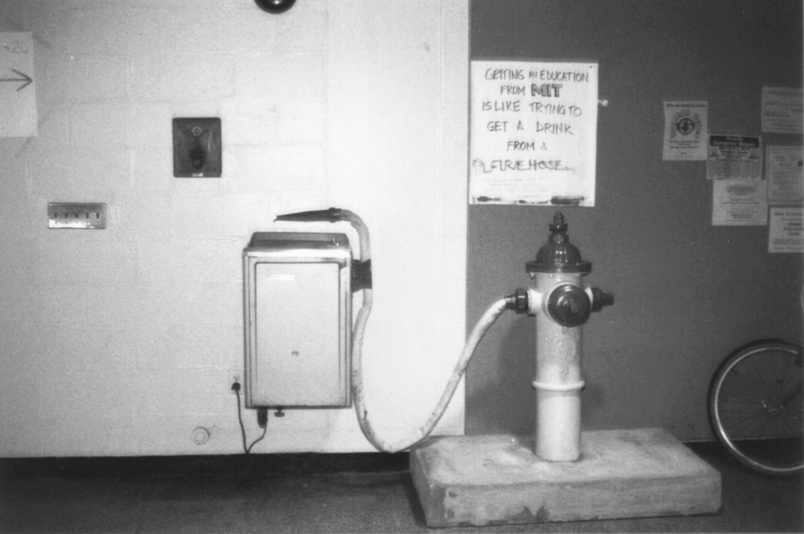

# sesion-12a

## martes 28 de octubre

"Getting an education at MIT is like trying to get a drink of water from a fire hose" - Jerome Wiesner, ex presidente del MIT. 

## Encargo nº 19: *“Definir 2 objetos (según la referencia dada en el libro de Harman publicada en discord). Sacar 15 cualidades de cada uno. Mientras más raras, mejor”*

## Encargo nº 20: *“⁠Junto al grupo, hacer una lluvia de ideas de máquinas sentimentales (máquinas que trabajan con emociones/sensaciones/afectos específicos), y decidir entre ustedes las más interesantes. No pensar en sensores o actuadores específicos aún.”

