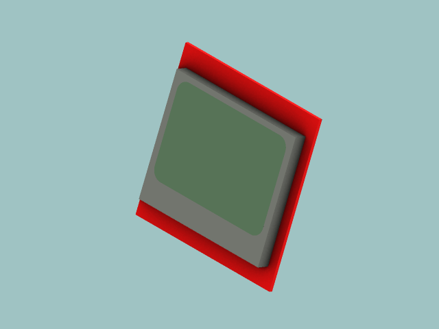
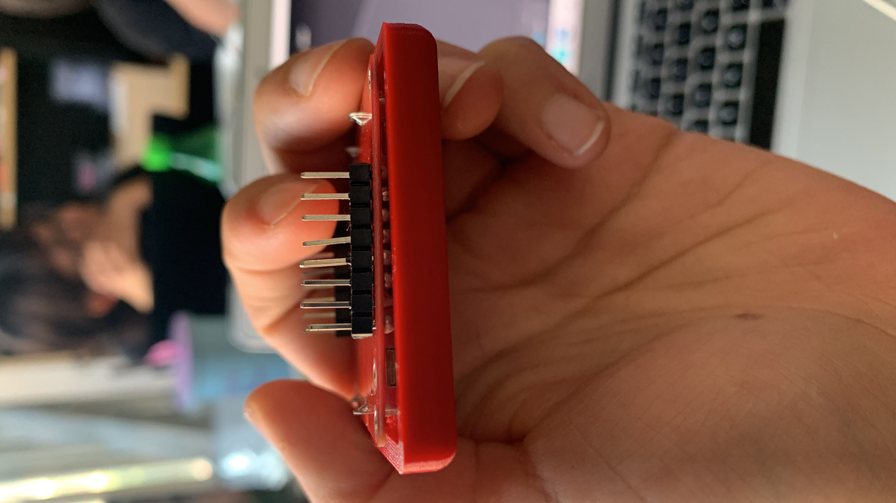
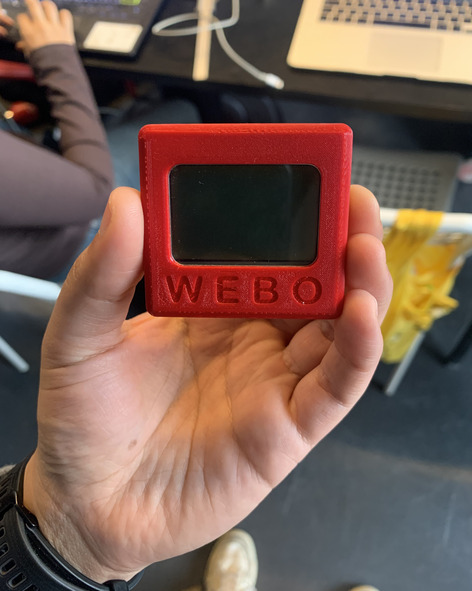
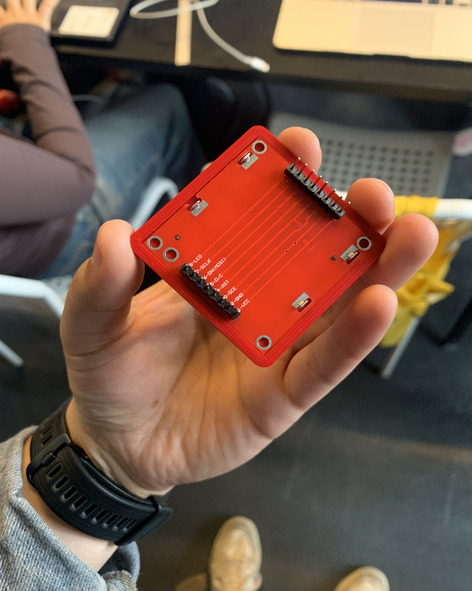
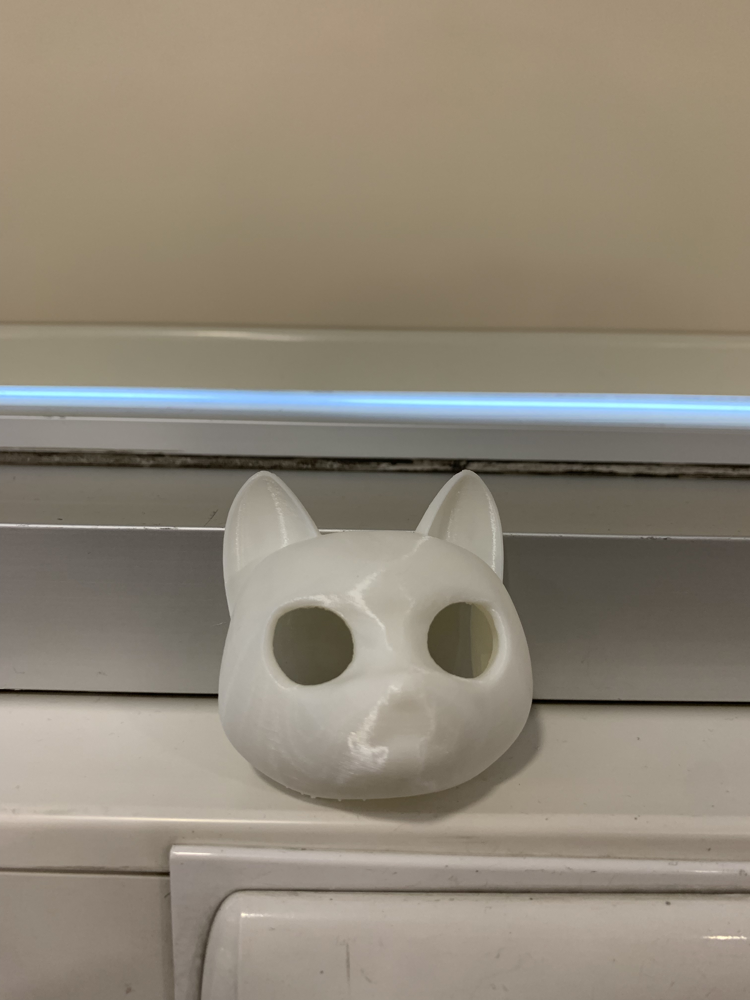

# sesion-15a

## martes 18 de noviembre

### avanzando en proyecto 03

Estoy enfocándome en desarrollar la carcasa de nuestro proyecto. Hoy modelé en 3D el display LCD Nokia 5110 para poder construir la carcasa alrededor. 

A partir de lo anterior modelé una carcasa específicamente para el display, ya que mi proceso para llegar a la carcasa final parte desde modelar parte por parte los lugares donde irán los componentes del proyecto. Hice dos versiones de la carcasa, ya que para la primera no consideré el relieve de los pines del display. 

En la imagen se puede ver que los pines impiden que el display entre por completo al case. En base a este error desarrollé un nuevo modelado.

 

### labores como integrante del grupo 0

Anto Kiara y su grupo me pidió si les podía imprimir en 3D una de las partes de su proyecto, ya que ellas habían impreso la pieza en resina y les quedó muy pesada

Me mandaron el archivo STL y lo laminé para posteriormente imprimirlo durante la noche en mi casa. 

A continuación el resultado.

