# sesion-11b

## taller viernes 24 de octubre

### primera parte

- llegué a las 9
- iremos a una expo (no me acuerdo bien cuál) y después caminaremos atrás de la u de chile a una bienal de artes mediales
- el aspecto técnico en los proyectos no preocupa, ahora nos centraremos en desarrollar la parte metafórica y filosófica/conceptual de los proyectos que es la parte más débil
- máquinas de lenguaje, máquinas de felicidad, máquinas tra(ns)ductoras
- traducción es lo mismo que transducción?
- "la metáfora es una solución al problema de la traducción"?, la frase no da abasto con todo lo que queremos expresar, las palabras no son suficientes. Esto me hace mucho sentido con cómo me he sentido últimamente, las palabras no han sido suficientes para poder explicarme por lo tanto estoy escribiendo mucho sobre eso para poder comprenderlo mejor, ¿tienen estas palabras algún momento en el cuál se comprenden completamente? creo que no existe eso
- "chewing the apple of your eye" la quinta canción del séptimo álbum de ???

#### diseño orientado a objetos

- graham harman, dice que la realidad existe
- le interesaba la cosmología, estudio del cosmos, lo de afuera, el universo
- realidad > lenguaje, el lenguaje no puede abarcar todo lo que la realidad es, ejemplo que dio Aarón: " yo no te puedo hacer sentir con palabras lo que te hace sentir el extreme fall"
- "la tercera mesa texto"
- cómo describir una mesa, ¿qué es una mesa?
- superficie para colocar cosas, interfaz de altura, paralela al suelo, serían las "relaciones"
- 4 patas, fierro, madera, lisa, cualidades físicas
- ¿no se parece esto a lo que acabamos de programar?
- "de lo que está hecho y para qué sirven"
- la mesa científica es denominada por harman cuando hablas solamente de una mesa a nivel físico, material
- cuando diseñas estás pensando en ambos tipos de mesas: mesa científica y mesa humanista
- "quiero hacerme cargo de la realidad de esta manera" el tipo de diseño que es para evitar las crisis, esconderlas, en eeuu está muy desarrollado este tipo de diseño. Por ejemplo las bancas que están diseñadas de forma incómoda o con espinas para que las personas que viven en la calle no duerman en ellas
- undermining, degranar las cosas hacia abajo, overmining, degranar las cosas hacia arriba
- heidegger "la mesa real aparece cuando fallan" ¿qué falla?
- asíntota, se puede diagramar en 2 lineas que pasan muy cerca pero que nunca se tocan
- "escribir efectivamente como se habla"
- filosofía = amor por el conocimiento
- la cámara fotográfica liberó a la pintura de ser representativa, la cámara podía retratar la realidad, ahora puedes pintar cualquier cosa
- Aarón recitando poemas de parra en clases, épico, los que leyó no los he leído aún
- uno puede pensar en algo con otras palabras para llegar a lo mismo
- cualidades no esenciales: Aarón utiliza lentes, pero si se los saca sigue haciendo Aarón
- las cualidades esenciales son las que hacen ser a Aarón sí mismo
- caminar es empujar el mundo hacia atrás, que bello
- qué sería el diseño orientado a objeto?
-
- "la metáfora es la interrelación entre las cualidades no esenciales de 2 objetos distintos"
- "vivir del mundo de las metáforas, vida poco mainstream y poder defender el por qué"
- máquinas sentimentales
- todo es un objeto
- pendiente rellenar apuntes salida a terreno y encargos

#### encargo 17, cada persona debe subir una investigación detallada de la obra artística de Claudia González Godoy, con énfasis en su investigación sobre ríos, incluyendo información sobre premios, exposiciones, colaboradores, estudios y referencias en su obra.

#### encargo 18, cada persona debe subir taxonomía detallada de sensores, actuadores, software y hardware utilizado en 1 obra exhibida en la Bienal de Artes Mediales 2025, citando correctamente a las fuentes.

#### Robot Tongas

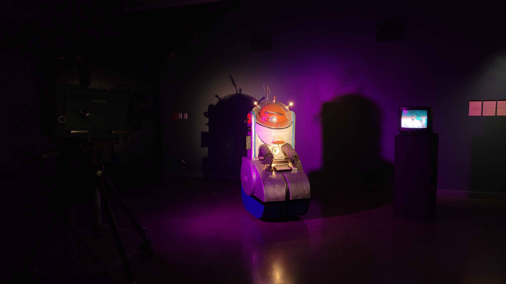

foto cortesía de: [sebastiansaez](https://github.com/brauliofigueroa2001/dis8645-2025-02-procesos/tree/main/27-SebastianSaez1003) en la 17 bienal de artes mediales

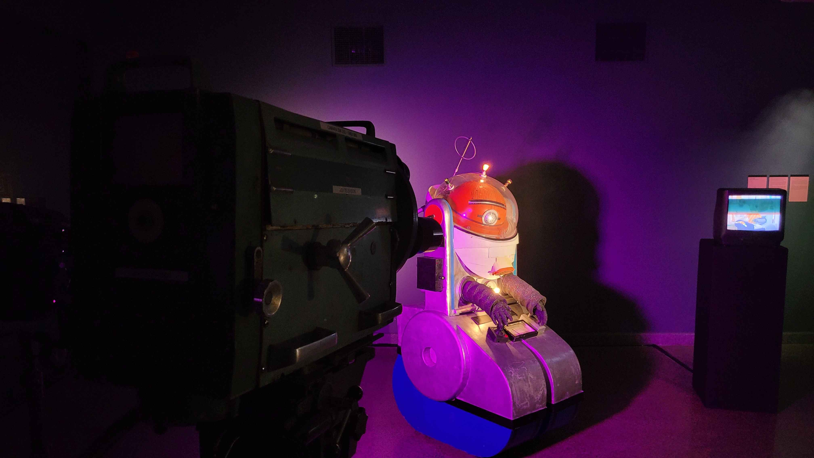

foto cortesía de: [sebastiansaez](https://github.com/brauliofigueroa2001/dis8645-2025-02-procesos/tree/main/27-SebastianSaez1003)

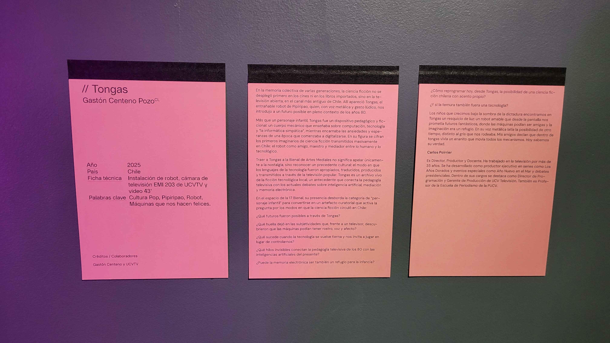

foto cortesía de: [sebastiansaez](https://github.com/brauliofigueroa2001/dis8645-2025-02-procesos/tree/main/27-SebastianSaez1003)

- Tongas fue el entrañable robot del programa infantil chileno “Pipiripao”, creado e interpretado por Gastón Centeno Pozo a fines de los años 80. Con su carisma y aspecto futurista, protagonizaba el segmento “La informática simpática”, donde junto a Roberto Nicolini acercaba a los niños al mundo de la computación de manera divertida usando computadores Atari. Con el tiempo se transformó en un ícono de la infancia ochentera y noventera, recordado con cariño por varias generaciones, y recientemente volvió a la televisión como conductor principal en el reestreno de Pipiripao, confirmando su lugar en la memoria colectiva. Texto extraído de: [Bienal de Artes Mediales](https://17.bienaldeartesmediales.cl/obra/tongas/)

- elegí a Tongas porque me llamó muchísimo la atención desde el primer momento en que lo ví, nunca había visto un robot antiguo y tan grande, sentí un hormigueo por dentro y la sensación de "me gustaría alguna vez en mi vida ser capaz de hacer algo así".

- encontré en el blog [tongas pipiripao](https://tongaspipiripao.blogspot.com/p/tongas.html) información sobre Tongas y su historia, además de palabras de Gastón Centeno, su creador

- la cabeza de Tongas se mueve mediante la pulsación de una palanca, como se muestra en la siguiente foto:

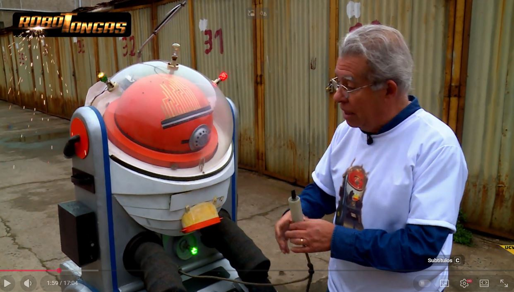

foto sacada del video [robotongas capítulo 01](https://www.youtube.com/watch?v=_Xr8meV2ICg&t=175s)

- en esta parte del video, Gastón acciona una especie de interruptor el cuál permite girar la cabeza de Tongas, relata que "todos los niños querían apretar esto", no alcanzo a distinguir bien lo que dice, algo sobre un control "estroboscópico"

- también muestra que tongas tiene integrado un joystick de Atari

- de lo que entendí es que la voz la hacían ellos pero la pasaban por alguna especie de filtro, le pregunté a chatgpt sobre cómo podría estar hecha la voz y me dijo lo siguiente:

 El actor o locutor (en este caso la voz era hecha por Roberto Nicolini mismo o un actor del equipo) grababa las líneas normales, hablando con tono robótico o entrecortado.

Luego, en postproducción o en vivo:

Se aplicaba un efecto de “ring modulator” (modulador de anillo), muy usado en la época para crear voces robóticas.

También se combinaba con un pitch shifter o eco metálico para dar esa resonancia mecánica.

En algunos casos usaban un vocoder analógico, que mezcla la voz con una señal de sintetizador, dándole ese timbre electrónico característico.

Finalmente, el resultado se regrababa o se emitía directo en el programa con una leve compresión y filtrado para sonar como un “robot simpático” más que uno intimidante.

- en estos videos que son 6, nos enseñan sobre la historia de tongas y también sobre robótica y arduino, de la mano de Gastón Centeno

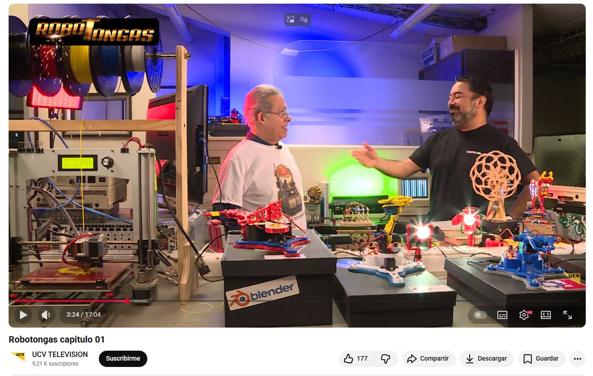

- aquí muestran parte del taller, algunos robots que se mueven con servos y otras cosas, lo encontré genial y tengo pendiente ver 5 videos que me quedan de la serie aún

- en el bloque en el cuál enseñaban computación con Tongas dentro del programa, utilizaban una "Atari XL-800" y un "Atari 1400 ST" para el sistema de imágenes de "ucevito"

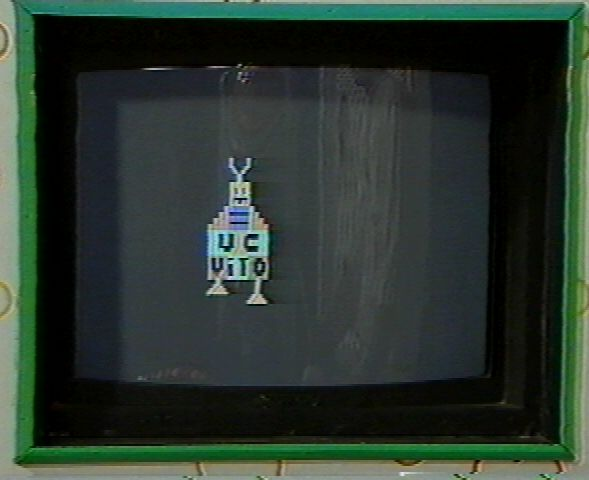

foto sacada de: [blog tongas pipiripao](https://tongaspipiripao.blogspot.com/p/tongas.html), robot "ucevito" creado en un Atari XL-800

- un bonus que encontré mientras investigaba, es una página web del año 1995 sobre Tongas y otras cosas hechas por Gastón Centeno, llegué a ella por el siguiente link: [tongas.cl](https://tongas.cl/index.php)

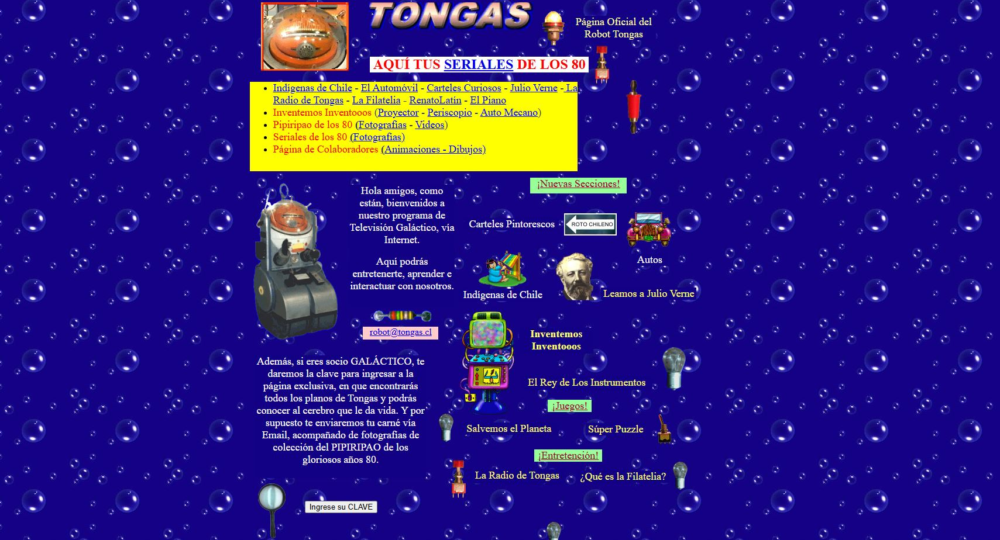

- dentro de esta página, hay un enlace secreto mediante una clave la cuál se encuentra en uno de los blog hechos por Gastón que estuve investigando

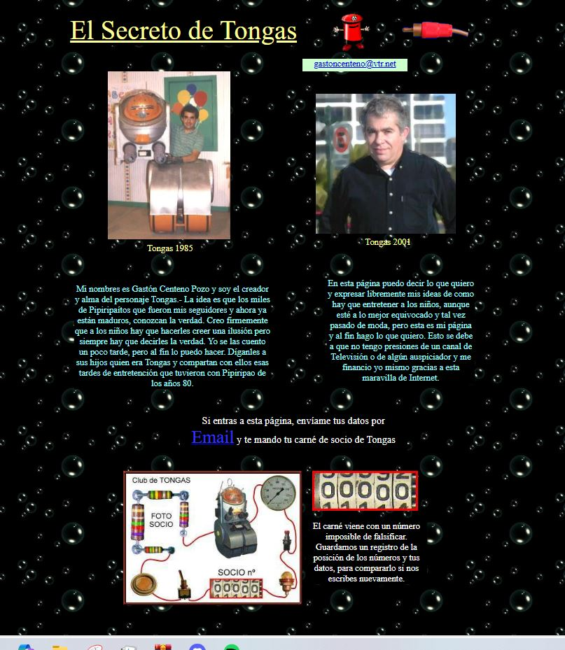

- acá nos permitía o permite ser socios de Tongas, no sé si Gastón revise los correos que se le mandan a este mail aún pero lo intenté por si acaso, para poder ser socio de tongas y tener mi carnet jejejej

- también encontré otro blog en el cuál nos muestran la restauración de Tongas [restauracion tongas](https://robottongas.blogspot.com/p/6.html), dejo algunas fotos y texto del blog

"El Robot Tongas estuvo casi 20 años guardado en el techo de un baño de un garage en Valparaíso, hasta que recibí un llamado de Jorge Ramíres Varas que me contó de la feria Hobbycon y me invita a participar con el robot. "

" Entusiasmado por la idea le cuento que está en estado deplorable, pero me ofrece una solución inmediata, ellos lo reparan. Más tarde se comunica conmigo Andrés Carbone que viene en su auto junto a su señora Pamela Lange y se llevan desarmado al Tongas en la parte del maletero."

" Después de casi un mes de trabajo de Andrés Carbone y Roberto Catalá logran dejarlo como nuevo pero conservando las características originales de Tongas. Andrés cuenta; “que cuando llegaba del trabajo en la tarde trabajaba hasta altas horas de la madrugada. Tongas tiene varios colores, buscamos los más representativos, el pecho blanco y líneas azules. Las líneas de la cabeza, que eran doradas y representaban a los circuitos eran difíciles de lograr, pero viendo materiales encontré lo más básico y simple, cinta de regalo dorada de doble contacto, las líneas quedaban perfectas. Las ampolletas agregadas son de refrigerador teñidas con tinta para impresora y tinta para lapicera, Un amigo, Leonel Rivas, que es ingeniero electrónico, cuando le conté me dijo: TONGAS TONGAS NOOOOOOOOOOOO, YO AYUDO, YO SE DE ROBÓTICA !!!!!!

"A lo que le respondí: Won, tiene un motor de tocadisco.  Mi amigo compró el Joystick de Atari que tiene en las piernas, que es el mismo que tenía en los años 80. Otro dato: el amperímetro..... uf un suplicio, hasta que lo fabriqué con una caja de VHS y tiene un texto en la parte inferior que "es descifrable" para que se entretengan”. Extraído de [restauración tongas](https://robottongas.blogspot.com/p/6.html)

- todas las fotos a continuación son de [restauración tongas](https://robottongas.blogspot.com/p/6.html)

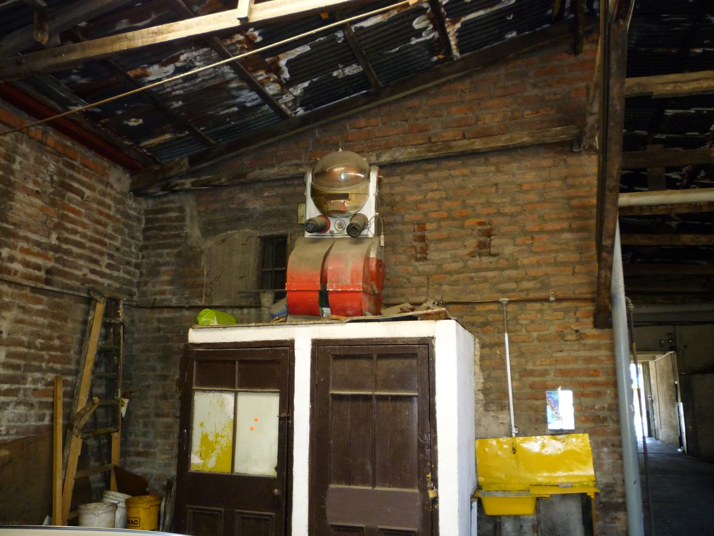

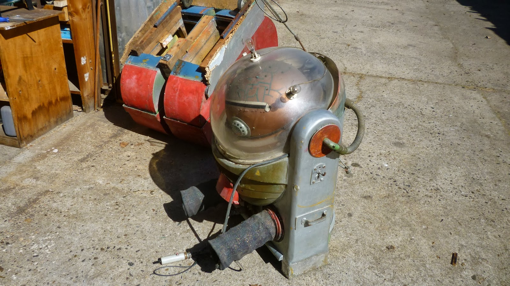

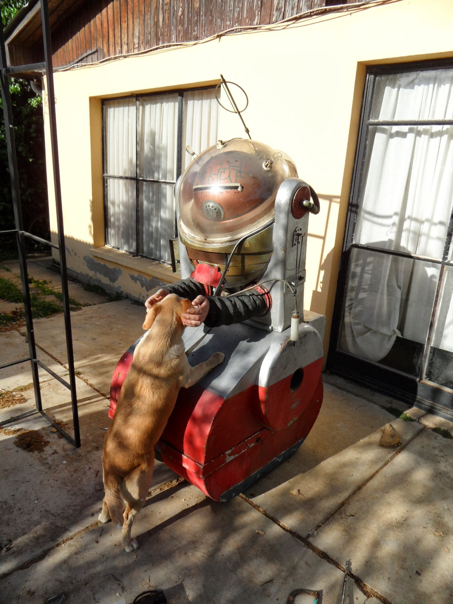

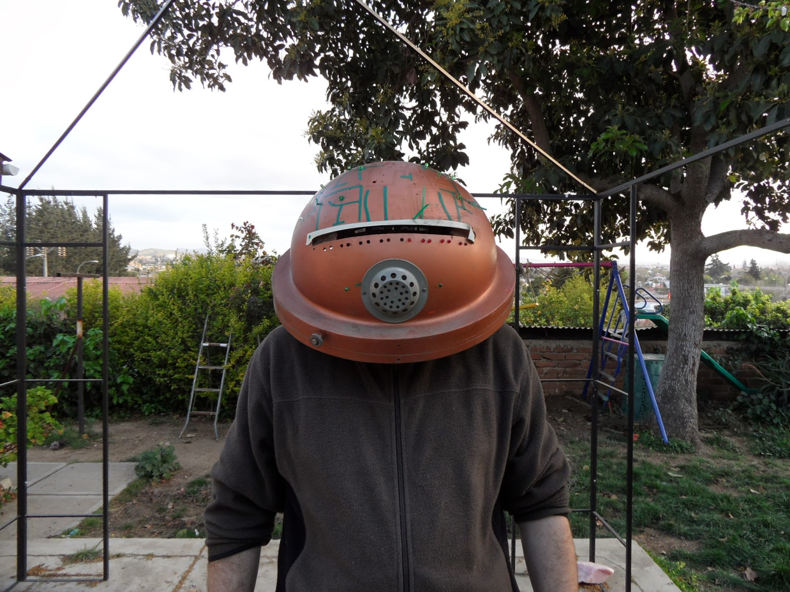

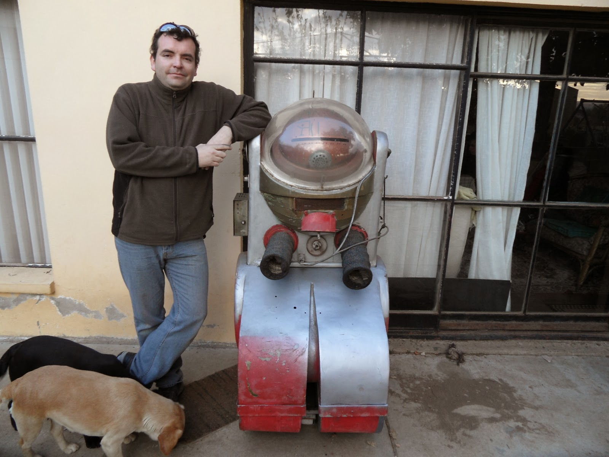

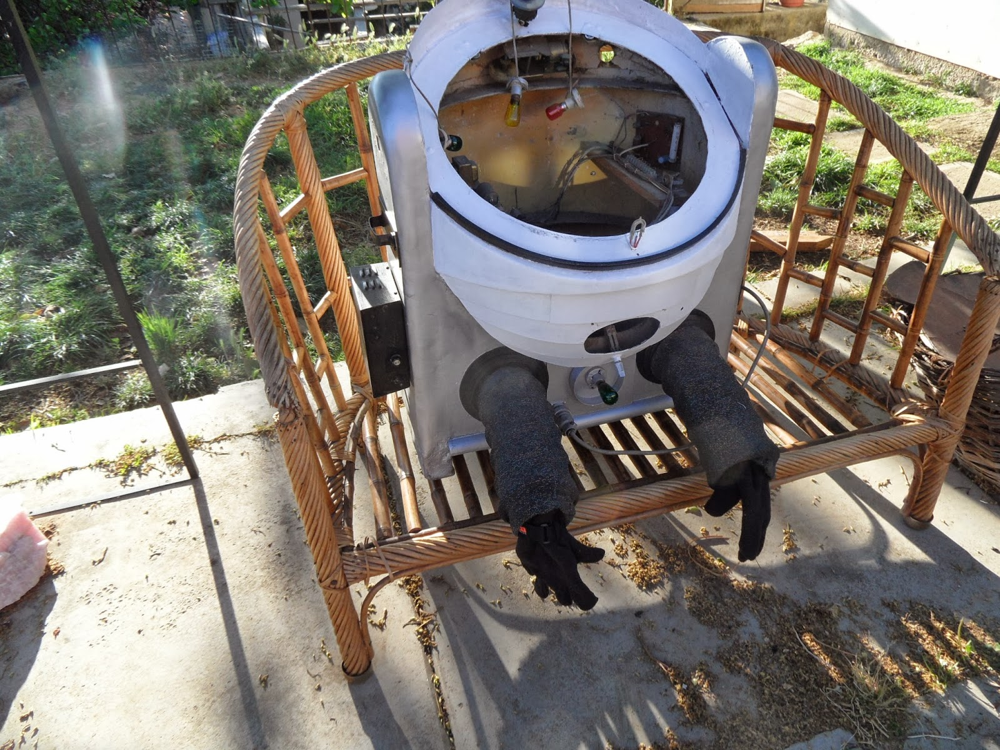

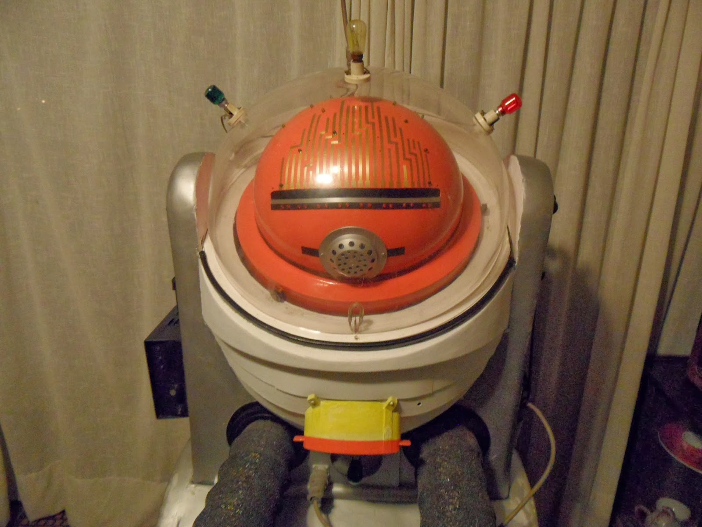

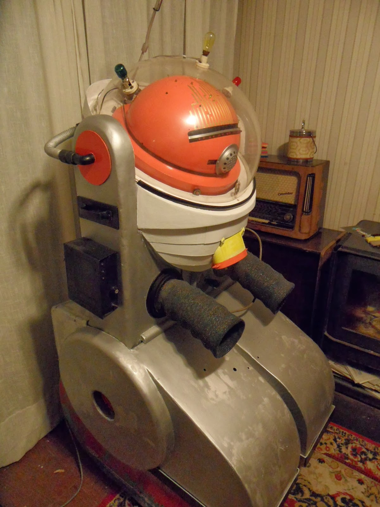

- siento que me desvié un poco harto en este encargo pero quería documentar lo que encontré

