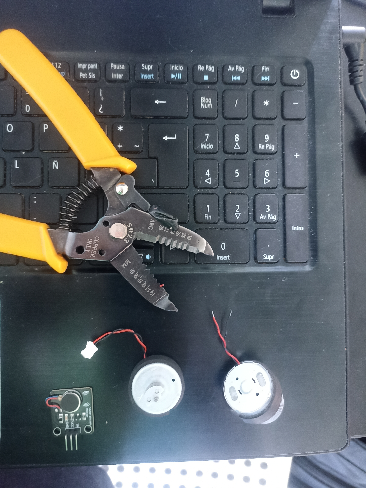
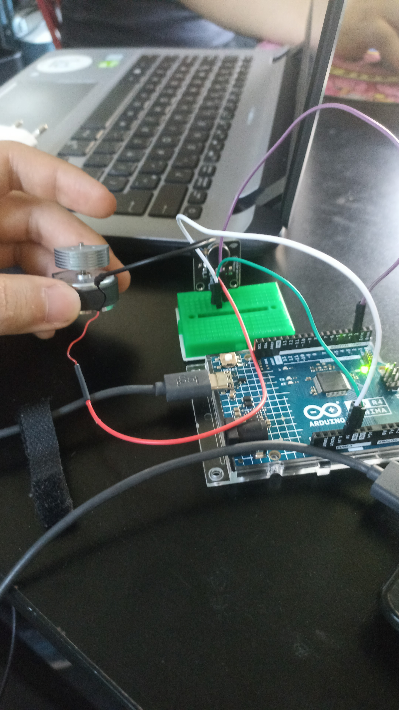

# sesion-15a

## taller clase martes 18 de noviembre

### último día de avance en clases antes del proyecto 3

#### módulo motor vibrador 


- logré hacer que vibrara mediante el uso del siguiente código que encontré en una página [caferobot](https://thecaferobot.com/learn/interfacing-a-vibration-motor-module-with-arduino/)

```cpp
    /*
  modified on Sep 8, 2020
  Modified by MohammedDamirchi from Arduino Examples
  Home<iframe class="wp-embedded-content" sandbox="allow-scripts" security="restricted" style="position: absolute; clip: rect(1px, 1px, 1px, 1px);" title="&#8220;Home&#8221; &#8212; Electropeak" src="https://electropeak.com/learn/embed/#?secret=lI8B17CnPA" data-secret="lI8B17CnPA" width="600" height="338" frameborder="0" marginwidth="0" marginheight="0" scrolling="no"></iframe>
*/


// the setup routine runs once when you press reset:
void setup() {
  pinMode(2, OUTPUT);
}

// the loop routine runs over and over again forever:
void loop() {
  digitalWrite(2, HIGH);
  delay(500);
  digitalWrite(2, LOW);
  delay(1000);
 
}
```

- este código hace que el motor vibre y se apague constantemente como high y low, cada 1 segundo aprox se emite una vibración
- necesito ver si puede vibrar más fuerte o si está en su límite, desconozco esto
- debo probar un circuito pwm para ver si puedo hacer que la vibración sea más fuerte y la pueda controlar mediante un potenciómetro/encoder, la idea es que al pasar cierto umbral/parámetro de la rotación de la manivela encoder se active el motor
- después de hablar con misaaa sobre el módulo me dijo que en estos módulos no puedo hacer que la vibración sea más fuerte
- lo que tengo que hacer es una "operación" al módulo en la cuál debo cortar los cables que están direccionados al motor y soldarlos a un vibrador de joystick, este vibrador es más fuerte y lo puedo controlar con un PWM


#### jornada de avance, miércoles 19 de noviembre

- se soldó el módulo vibrador al vibrador del joystick, reemplazando el vibrador pequeño que tenía el módulo por el del joystick para tener un vibrador más potente



- se pelaron los cables para poder soldar hacia el módulo vibrador




- se conectó el módulo al arduino y funcionó con el nuevo vibrador, ahora vibra notoriamente más fuerte


#### jornada de avance jueves 20 de noviembre

- en vez de establecer un rango continuo de vibración ej: (rango 1, vibración 1 continua) (rango 2, vibración continua 2), como aumentarle la velocidad con un potenciómetro cuando se hace con un circuito pwm y un motor

- en vez de que sea un aumento continuo por así decirlo, puede ser
- rango 1: motor vibra de forma intermitente, se enciende 2 segundos y se apaga 2 segundos
- rango 2: motor vibra de forma intermitente, se enciende 1 segundo y se apaga 1 segundo    
- rango 3: motor vibra de forma continua y se detiene cuando llega al último nivel que sería el clímax en el que se expulsa el humo 
- esto se puede ver en el monitor serial, esto me puede mostrar en qué rango está y ver que se activa
- descubrí que al conectar el motor al pin de 3.3v tiene una diferencia notoria de vibración con el de 5v, no sé si habrá una forma mediante el arduino de darle más voltaje en un momento determinado después de pasar un rango, que es lo que se quería lograr inicialmente

#### avance nocturno madrugada del 21 de noviembre

- venía pensando en la micro mientras llegaba a mi casa, que quizá una forma de mostrar una especie de selector de velocidades por mientras podría ser un botón, al apretarlo comienza velocidad 1, apreto otra vez velocidad 2 y por último al apretar otra vez, velocidad 3.
- estaba probando a ver cuáles podían ser las respectivas velocidades, cuánto tiempo estaba en pausa el motor y cuánto tiempo estaba activo
- definí 3 velocidades a través de un loop
- velocidad 1 o de inicio: 2 segundos encendido y 2 segundos apagado
- velocidad 2 o intermedia: 3 segundos encendido y 0,5 segundos apagado
- velocidad 3 o final: motor activado todo el tiempo hasta que se apague
- esto lo hice a través del siguiente código que se basa en un loop en el cuál muestro las velocidades
- el código lo saqué de un video de youtube y lo fui modificando respecto a lo que necesitaba, [videocodigo](https://www.youtube.com/watch?v=t6191Z2oxMQ)

```cpp
#define vibrador 2
void setup() {
pinMode(vibrador, OUTPUT);
}

void loop() {
  digitalWrite(vibrador, HIGH);
  delay(2000);
  digitalWrite(vibrador, LOW);
  delay(2000);
  digitalWrite(vibrador, HIGH);
  delay(2000);
  digitalWrite(vibrador, LOW);
  delay(2000);
  digitalWrite(vibrador, HIGH);
  delay(2000);
  digitalWrite(vibrador, LOW);
  delay(2000);
  digitalWrite(vibrador, HIGH);
  delay(3000);
  digitalWrite(vibrador, LOW);
  delay(500);
  digitalWrite(vibrador, HIGH);
  delay(3000);
  digitalWrite(vibrador, LOW);
  delay(500);
  digitalWrite(vibrador, HIGH);
  delay(3000);
  digitalWrite(vibrador, LOW);
  delay(500);
  digitalWrite(vibrador, HIGH);
  delay(3000);
  digitalWrite(vibrador, LOW);
  delay(0);
  digitalWrite(vibrador, HIGH);
  delay(3000);
  digitalWrite(vibrador, LOW);
  delay(0);
}
```

- no sé si está excesivamente largo o tiene cosas de más, intenté dejar un HIGH y LOW de cada velocidad, esto hacía que el loop fuera mucho más corto y que la velocidad 2 fuera casi imperceptible dentro de este
- la misión ahora es poder seleccionar cada velocidad por medio de un botón o un potenciómetro, esto posteriormente se uniría al código del encoder en donde la idea sería que al pasar cierto número de vueltas y rango, se active la velocidad 1, luego otro rango velocidad 2 y en el último rango casi al final la velocidad 3 que se apagaría al completar todo el rango de vueltas del encoder, que es en donde saldría el humo y se prenderían luces aleatorias para hacerte saber que llegaste al final
- debo tener una especie de parámetro que permita ligar por ejemplo: velocidad 1 y que sepa cuál es y cuántos segundos dura y se apaga el motor
- como especies de categorías por velocidades, clasificarlas y poder invocarlas
  

  
