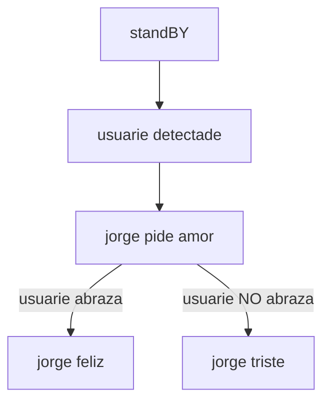
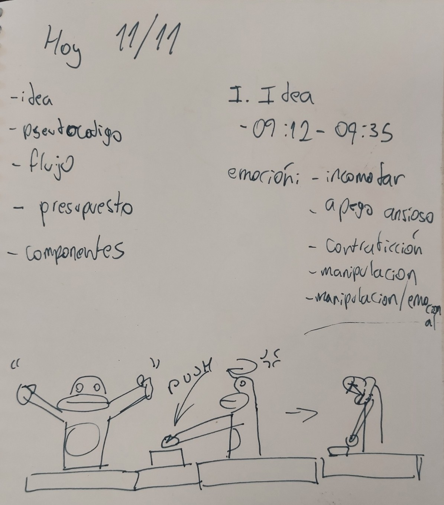
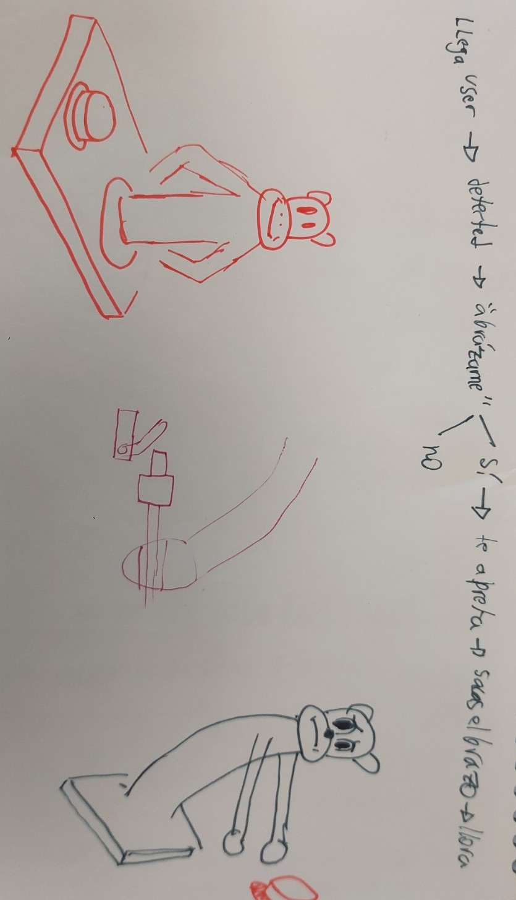
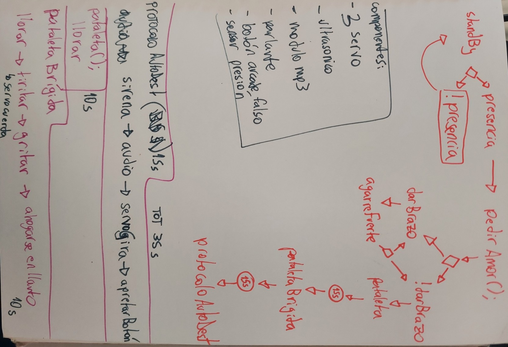
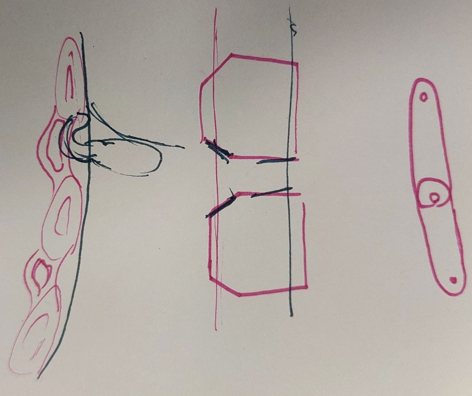
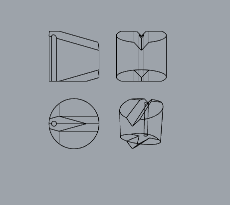
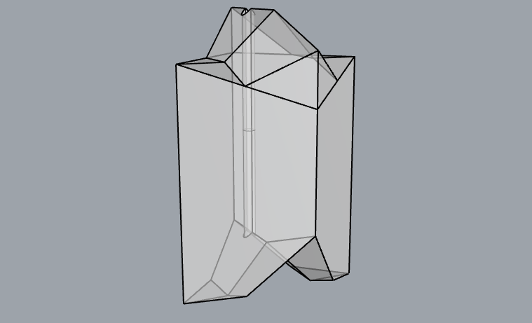
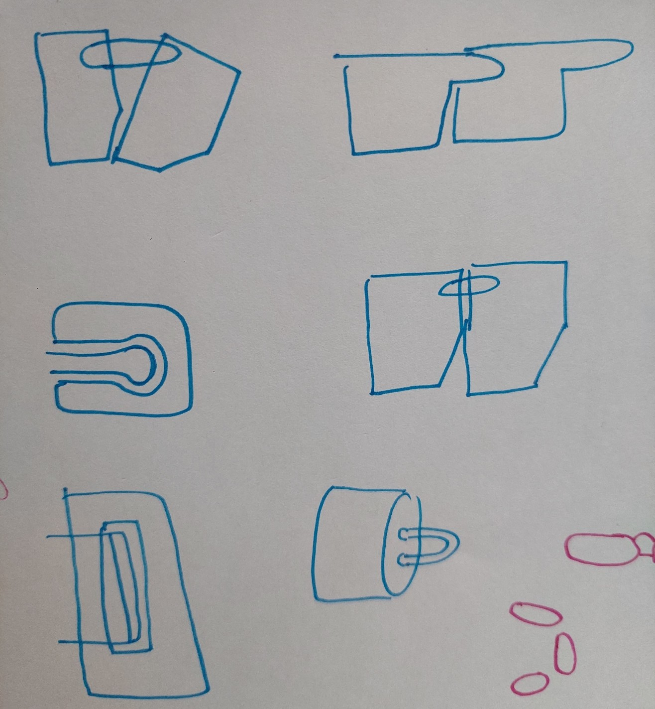
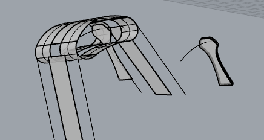

# sesion-14a

## 2025-nov-11

hoydía tenemos que ponernos al día como grupo, pq estamos super al margen.

- amenaza

situaciones de manipulación emocional:

- "yo soy la peor xxxx del mundo"

- "estar en una conversación, cuando sucede algo que te incomoda, amurrarse e irse a pararse a la esquina"

### jorge el vicioso

Jorge es un robot cuyo único sentido en la "vida" es ser amado. Al ser un robot, no entiende sobre sentimientos, por lo que la única forma en que es capaz de entender el amor es a través del contacto físico. Jorge pide amor amablemente, pero tiene una tendencia a la frustración, tan leve, que prefiere dejar de existir antes que asumir que dejará de ser amado. Cuando dejas de entregarle amor, Jorge entrará en crisis. En primer lugar, comenzará a llorar y quejarse, cada vez más intensamente. Pasados 30 segundos sin recibir amor, se activa la alarma de seguridad que cuida a Jorge del dolor por falta de amor. Se emite una alarma y una voz proclama: el mecanismo de autodestrucción se ha activado, por favor, dale amor a Jorge para evitar su muerte.

flujo en proceso



pseudocódigo en proceso

```cpp
/*const int servoBody;
const int servoGarra;
const int pinSensorPresencia;
const int sensorBrazo;
const int rangoDeteccion = 60;
int cercania;

bool usuarioPresente = false;

cercania = digitalRead(pinSensorPresencia);*/

if(pinSensorPresencia >= rangoDeteccion){
 pedirAmor();
}

if(pinSensorBrazo){
 amorRecibido;
}else{
 !amorRecibido;
}

if(amorRecibido){
 garra.cerrar
}else if (!amorRecibido){
 pataleta();
}

void pataleta(){
 llorar();
}

void pataletaBrigida(){
 llorar();
 gritar();
 tiritar();
}

void protocoloAutodestruccion(){
 audioAutodestruccion();
 audioCuentaRegresiva();
 
 if(tiempoTranscurrido>30000){
    girar();
    cabezazoAlBoton();
}
}
```

## avance en cuaderno


planificación de hoy. Estábamos muy atrasados así que anoté todo lo pendiente y establecimos tiempos limitados para cada actividad


plataforma del robot y estado de ánimo


planificación flujo y flujo detallado de las funciones


ideas de cómo diseñar la vértebra

### avance post clase

comencé a diseñar un sistema que controle la posición de jorgito, para que pueda transicionar entre sus 2 estados, erguido y caído.




la idea sería encadenar varios de estos módulos, y conectarlos con un hilo. Y que la tensión del hilo permita que la espina se "estire".


aquí jotamorales me ayudó, e imprimió 2 de estas piezas. Y las probé como encajaban.


aquí me dí cuenta que este modelo era muy inestable, así que hice una 2da prueba.



imrpimí 4 de estos y lo probé. (imprimí 4 pq con la probeta anterior aprendí que mientras más altura, más inestable, por lo que con 4 era más fiel a como sería la versión final).


aquí lo probé y sruge el problema de que mientras más lejano es el módulo al origen de la cuerda, menos peso tiene, y por lo tanto, le cuesta más "caer".





este modelo no dio fruto, finalmente osaremos un modelo que diseñó Francisco.
