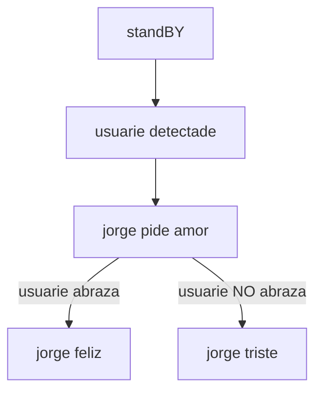

# sesion-14a

## 2025-nov-11

hoydía tenemos que ponernos al día como grupo, pq estamos super al margen.

- amenaza

situaciones de manipulación emocional:

- "yo soy la peor xxxx del mundo"

- "estar en una conversación, cuando sucede algo que te incomoda, amurrarse e irse a pararse a la esquina"

### jorge el vicioso
Jorge es un robot cuyo único sentido en la "vida" es ser amado. Al ser un robot, no entiende sobre sentimientos, por lo que la única forma en que es capaz de entender el amor es a través del contacto físico. Jorge pide amor amablemente, pero tiene una tendencia a la frustración, tan leve, que prefiere dejar de existir antes que asumir que dejará de ser amado. Cuando dejas de entregarle amor, Jorge entrará en crisis. En primer lugar, comenzará a llorar y quejarse, cada vez más intensamente. Pasados 30 segundos sin recibir amor, se activa la alarma de seguridad que cuida a Jorge del dolor por falta de amor. Se emite una alarma y una voz proclama: el mecanismo de autodestrucción se ha activado, por favor, dale amor a Jorge para evitar su muerte.

flujo en proceso


pseudocódigo en proceso
```cpp
/*const int servoBody;
const int servoGarra;
const int pinSensorPresencia;
const int sensorBrazo;
const int rangoDeteccion = 60;
int cercania;

bool usuarioPresente = false;

cercania = digitalRead(pinSensorPresencia);*/

if(pinSensorPresencia >= rangoDeteccion){
 pedirAmor();
}

if(pinSensorBrazo){
 amorRecibido;
}else{
 !amorRecibido;
}

if(amorRecibido){
 garra.cerrar
}else if (!amorRecibido){
 pataleta();
}

void pataleta(){
 llorar();
}

void pataletaBrigida(){
 llorar();
 gritar();
 tiritar();
}

void protocoloAutodestruccion(){
 audioAutodestruccion();
 audioCuentaRegresiva();
 
 if(tiempoTranscurrido>30000){
    girar();
    cabezazoAlBoton();
}
}
```