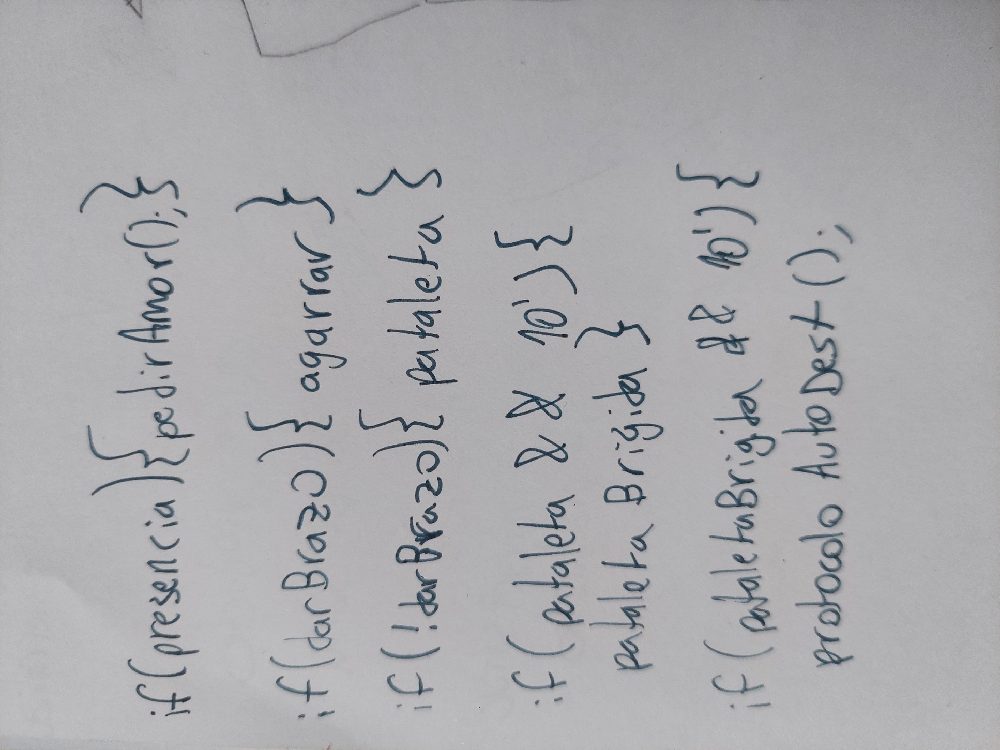
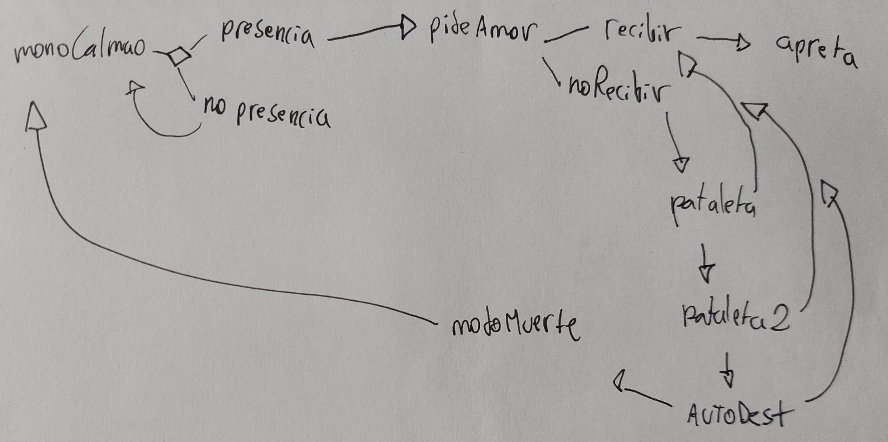

# sesion-14b

- [rafel lozano hemmer](https://www.lozano-hemmer.com)
- [wayland raspi](https://forums.raspberrypi.com/viewtopic.php?t=342600)
- [x1 raspi](https://www.luisllamas.es/x11-port-forwarding-raspberry-pi)

## roles equipo

franUDP: mecánica columna y brazos
stgoClifford: código
din0_latte: confección
jothric: modelado 3d
aileendespessailles-design: confección

```cpp
int tiempoTrancurrido;
bool siendoAmado;

siendoAmado= false;

if(presenciaDetectada){
    pedirAmor();
}else{
    standBy();
}

void pedirAmor(){
    if(amorRecibido){
        agarrar();
    }else{
        pataleta();
    }
}

void pataleta(){
if(siendoAmado){
}
else if(tiempoTrancurrido>0000 && tiempoTrancurrido<10000){
    pataletaLeve();
}else if(tiempoTrancurrido>10000 && tiempoTrancurrido<20000){
}else if(tiempoTrancurrido>20000){
    autoDestruccion();
}
}

```

```cpp
bool standBy;
bool userDetected;
int cercaniaUser;
int presionDetected;

int tiempoTranscurrido;

void setup(){
standBy = true;
}

void loop(){

if (standBy==true){
    modoStandBy();
}
if(userDetected==true){
convencer();
}}

void modoStandBy(){
cercaniaUser = analogRead(pinSensorUltraS);
if(cercaniaUser<10cm){
userDetected = true;
standBy = false;
}}

void convencer(){
 play.audio;
 servo.apretar;
    
 presionDetected = analogRead(pinSensorPresion);
 if(presionDetected<1){
 pataleta();
 }else{
 servo.apretar;
 }
}

void pataleta(){
    servo.soltar;
if(tiempoTranscurrido<10000){
    pataletaLeve();
}else if(tiempoTrancurrido>10000 && tiempoTrancurrido<20000){
    pataletaBrigida();
}else{
    autoDestruccion();
}
}

```

versión mágica criminalística

```cpp
bool standBy = true;
bool userDetected = false;
int cercaniaUser = -1;
int presionDetected = -1;

int tiempoTranscurrido;

void setup(){

}

void loop(){

cercaniaUser = analogRead(pinSensorUltraS);
if(cercaniaUser < 10){
    brazoAbrazable = true;
}
else{
    brazoAbrazable = false;
}

if (userDetected==false){
 modoStandBy();
} else if(userDetected==true){
 pedirAmor();

  if(brazoAbrazable==true) {
    servo.apretar;
}else if(brazoAbrazable== false){
    pataletaLeve();
if(tiempoTranscurrido>10000 && tiempoTranscurrido<20000){
    pataletaBrigida();
}else if(tiempoTranscurrido>20000){
    autoDestruccion();
}
} 
}
}

void pedirAmor(){
    play.audio;
}

```

se puede corregir desde la 11a

### avance

hoydía nos esforzamos mucho con ailén y carla en avanzar en el psudocódigo, para ello nos ayudamos de diagramas y "pensar en voz alta".





Gracias a esto pudimos llegar al siguiente resultado:

pseucódigo esta vez si es pseudo

```cpp
//mono está calmao de pana
//si no se detecta presencia, se mantiene calmao de pana
//si una persona está a menos de 20cm del mono, pide amor
//pide amor: audio, una voz que dice "dame un abrazo"

//si se detecta un objeto a menos de 10cm, los brazos se cierran
//si no se detecta un objeto comienza la pataletaLeve
//pataletaLeve: audio
//si se detecta el brazo se interrumpe la pataleta
//si pasan 10 segundos sin detección, comienza la pataleta brígida
//pataletaBrigida: audio, vibrar, gritar, ahogarse en llanto
//si se detecta el brazo se interrumpe la pataleta
//si pasan 10 segundos sin detección, comienza la autodestrucción
//autodestrucción: el mono gira hasta posicionarse frente al botón de autodestrucción y luego lo presiona con la cabeza
//si se detecta el brazo se interrumpe la autoDestrucción
//si pasan 15 segundos sin detección, el mono se mata(teatralmente)

//pasados 30 segundos vuelve al estado standBy 
```
