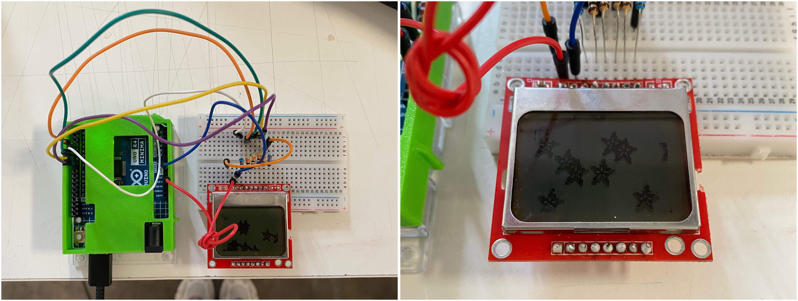

# Sesión-15a

Martes 18 de noviembre, 2025

## Trabajo en clase

### Cosas que hablamos en la mañana

- Prácticamente comenzamos a trabajar al tiro en el proyecto-03. Hablamos de lo que nos iban a pedir para el viernes, cuando se muestra el proyecto-03. En el fondo, quieren que fundamentemos súper bien nuestros proyectos para que queden listos en teoría para el examen de taller con las comisiones, y que solo nos quede seguir desarrollando carcasas y discurso.

- Además, hablamos un poco de los eventos que va a tener la universidad, como una exposición de textil y una charla de Mateo para el otro miércoles.

---

## Proyecto-03

### Revisión de avances del proyecto

Conversamos un poco de lo que llevábamos listo. Le conté a Angie mejor la idea que teníamos sobre el ave del paraíso, ya que ella tenía que hacer la ilustración en pixel art.

Mientras tanto, Seba avanzaba con lo de los millis. Moss estuvo revisando el funcionamiento de la pantalla, porque en la clase anterior pensamos que se había quemado y no funcionaba ni con un código de prueba.

Luego Seba se dio cuenta de que algunos pines estaban soldados juntos, los desoldaron y se resolvió.

### Carcasa

Jose trajo unas pruebas de alginato para la parte inferior de la carcasa, ya que va a recibir constantemente golpes y este material ayudaría al rebote. Podría decirse que esa, por ahora, es nuestra primera opción, si no funciona, vamos a probar con silicona, porque yo logré conseguir silicona para hacer testeos.

Cami estuvo modelando un molde base para volver a probar con alginato.

Yo estuve ordenando los componentes para que queden bien distribuidos y funcionen según sus movimientos y requerimientos, porque hay que almacenar muchas cosas dentro de una forma más orgánica, y la verdad me complicó un poco solo imaginar cómo distribuir todo. En eso fue en lo que más avancé hoy.

**Dentro hay que almacenar:**

- Batería portátil

- Arduino

- Motor

- Sensor

- Protoboard

- Espacio para los cables

**Y dejar expuesto:**

- Speaker

- Pantalla display

- Botones

### Referentes

-

-

### Palabras importantes

alginato
