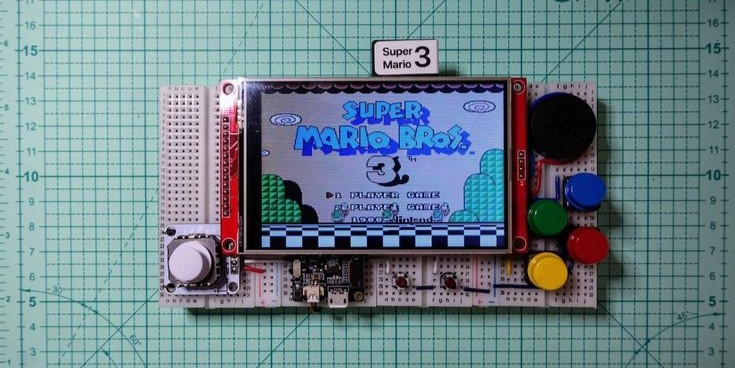

# sesion-11a 21.10.2025

## Primera parte 

- Hablar sobre notas del Proyecto 02.
- ¿Qué mejorar al momento de realizar un proyecto?
- Tomar decisiones como equipo.
- De cuantas personas seran los equipos
- Proyecto 03
- [Pagina que celebra cosas inutiles](http://uselesspress.org/)
- [Chino Kim](https://chino.kim/)
- [Yeseul Song](https://yeseul.com/)
- [Proyecto viento](https://vimeo.com/114414122)

## Grizzly Bear

Instagram: [Grizzly Bear](https://www.instagram.com/grizzlybear/?hl=es)

Formada originalmente en 2002 por Ed Droste como proyecto en solitario, Grizzly Bear es una banda estadounidense de rock/indie oriunda de Brooklyn (Nueva York).

` Miembros `

- Ed Droste
- Daniel Rossen
- Chris Taylor
- Christopher Bear

Su música privilegia armonías vocales, texturas y espacios sonoros amplios: puede inspirar ambientes para diseño, visualización de producto o instalacion sonora.

### Entrega 03 

- Mini Diseño Abierto 2025.
- ¿Proyecto 03 solo 3 grupos gigantes?
- Hacer 2 proyectos (copias).
- Entrega técnica / Entrega comunicacional

### HID

Human Interface Device) es un tipo de periférico informático diseñado para permitir la interacción entre un operador humano y una computadora. Estos dispositivos facilitan la entrada de datos por parte del usuario y, a menudo, proporcionan retroalimentación (salida).

Elemplos:

- Teclados: Permiten la entrada de pulsaciones de teclas y reciben salida para indicadores LED (como Bloq Mayús).
- Dispositivos de Juego: Joysticks, mandos (gamepads) y controladores de realidad virtual.
- Dispositivos Señaladores: Ratones, trackballs, touchpads y pantallas táctiles, que controlan un cursor o permiten la interacción directa con la pantalla.

#### Ideas

- Vestibles
- Mascota 
- Asistente experimental
- Objetos contemplativo
- Music Player

### Ontología orientada a objetos / tecnología orientada a objetos

` Ontología orientada a objetos `

Según Gemini: La Ontología Orientada a Objetos (OOO) es una corriente dentro de la filosofía contemporánea, específicamente dentro del Realismo Especulativo.

El principal exponente de esta corriente es el filósofo estadounidense Graham Harman. Su trabajo busca desplazar la centralidad que la filosofía tradicional le ha dado a la conciencia humana (correlacionismo).

` Tecnología Orientada a Objetos (TOO) `

La Tecnología Orientada a Objetos (TOO) es un enfoque de la ingeniería de software que busca organizar el desarrollo de sistemas informáticos alrededor de la idea de objetos que combinan datos y comportamiento.

### Manifiesto

 ` ¿Que es un manifiesto? `

 Un manifiesto es una declaración escrita de las intenciones, motivos o puntos de vista de su emisor, ya sea un individuo, un grupo, un partido político o un gobierno.
 
 - Sus ideas principales
- Sus intenciones
- Sus valores
- Sus posiciones frente a un problema o tema
- Lo que propone cambiar o defender

### Referentes Proyecto 03

