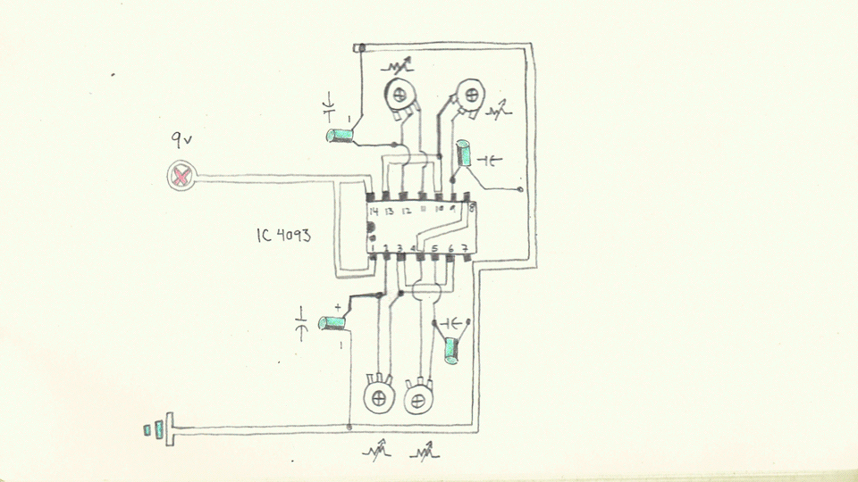
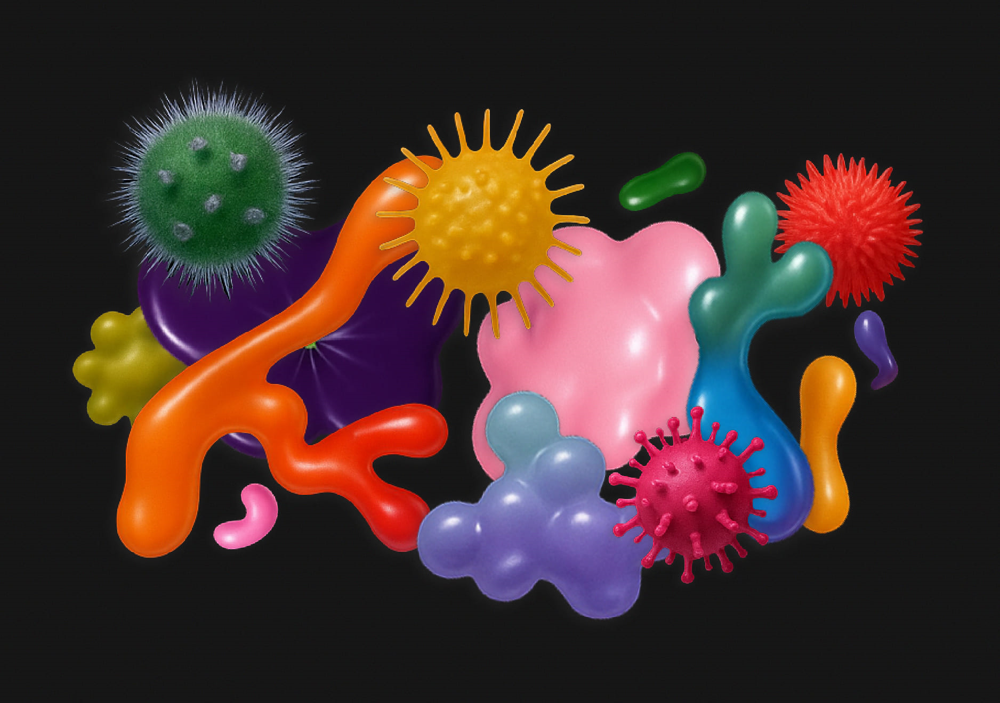

# sesion-11b
## primera parte 

- hablaron de que tenemos 2 encargos que hacer y también tendremos que ir al centro a unos museos, obras de artes mediales
- casi siempre los buenos diseños pasan desapercibidos, por eso tenemos que prestar atención a todo lo que veremos en las obras (sensores, actuadores, como funciona, donde se conecta, etc)
- existen diseños de máquinas de diferentes características: de felicidad, del lenguaje, sentimentales, transductoras (convertir E° en otra), etc.

---

` ¿Qué son las artes mediales?` 
- Según los artistas, las artes mediales se definen por su uso de tecnologías digitales y su enfoque en la cultura de los medios contemporáneos, utilizando y cuestionando artefactos tecnológicos en su realización. Los artistas mediales a menudo colaboran con profesionales de diversas disciplinas, como programadores, diseñadores y audiovisuales, ya que su práctica se considera interdisciplinaria y poco común como un trabajo solitario. 

` Filosofía correlacionista: Pienso luego existo (Decartes)` 
- No caché niuna pero segun google o gemini:  no es una filosofía correlacionista, sino la base de su racionalismo y del inicio de la filosofía moderna.

`¿Qué es una metáfora?` 
- Comparación implícita: No utiliza palabras como "como", a diferencia del símil.
- Transferencia de significado: Las cualidades de una cosa se trasladan a otra, como la calidad de "un corazón de piedra" para indicar frialdad o dureza.
- Dos partes: Generalmente se compone del tenor (la cosa real que se describe) y el vehículo (la cosa que se usa para describirla figurativamente).

ejemplos:
- "Mandarse un condoro": Cometer un error grave. Por ejemplo, "Se mandó un condoro al olvidar la presentación en la reunión".
- "Pasarlo chancho": Pasarlo muy bien. Por ejemplo, "Lo pasamos chancho en el carrete del sábado".
- "Estar pato": No tener dinero, estar en la quiebra. Por ejemplo, "Después de los gastos del fin de semana, quedé pato".

Diseño orientado a objetos, ¿cómo lo interpreta Matías? diseñar pensando que la interacción con los objetos es una metáfora.

¿Qué similitudes tiene con lo que hicimos en el proyecto 02?

- Cuando diseñamos pensamos en estas ambas dimensiones, factura y materialidad/escenciales y no escenciales
- Cómo resolver el diseño

## segunda parte 
- salimos a terreno

## Encargos

### Encargo 17: 

"cada persona debe subir una investigación detallada de la obra artística de Claudia González Godoy, con énfasis en su investigación sobre ríos, incluyendo información sobre premios, exposiciones, colaboradores, estudios y referencias en su obra."

` Claudia González Godoy `

Artista visual. Magíster en Artes Mediales por la Universidad de Chile, diplomada en Lutería Electrónica por la Pontificia Universidad Católica de Chile y licenciada en Bellas Artes con mención en Gráfica por ARCIS. Ha participado en numerosas muestras, tanto individuales como colectivas, en Chile y en el extranjero.

`  Estudios `  

- Licenciada en Bellas Artes con mención en Gráfica en la Universidad ARCIS (Chile) . 
- Magíster en Artes Mediales en la Universidad de Chile. 
- Diplomada en Lutería Electrónica en la Pontificia Universidad Católica de Chile.

`  Exposiciones y participaciones `  

- Bienal de Artes Mediales de Chile (BAM) – varias ediciones.
- Hidroscopia / Loa (Cu) – Bienal de Artes Mediales 2019.
- Exposiciones en el Museo de Arte Contemporáneo (MAC).
- Presentaciones y muestras en el Centro Cultural La Moneda.
- Participación en proyectos de investigación artística ligados a agua, territorio y sonido.
- Instalaciones y exhibiciones en instituciones y galerías en Chile y el extranjero (incluyendo Alemania).
- Residencias y laboratorios de arte electrónico, hardware abierto y experimentación sonora.

` Decantaciones y resonaciones. ¿Dónde nace y termina el rumor del río? `

La instalación invita a pensar en las transformaciones del Río Biobío y su memoria a través de una experiencia sonora. Este proyecto multidisciplinario reflexiona sobre la agencia del río y las consecuencias de la intervención humana.

La muestra Decantaciones y Resonaciones de Claudia González Godoy en la Galería Gabriela Mistral examina cómo la intervención humana ha transformado el Río Biobío. A través de grabaciones sonoras del cauce libre y del silencio de las aguas embalsadas, la artista crea una instalación que refleja estos cambios, resultado de una investigación realizada a lo largo del río desde su origen hasta su desembocadura.

> «Me gustaría que las y los visitantes puedan encontrar un momento de calma en este espacio. Si bien la obra demuestra una realidad artificiosa y te sitúa en una topografía que simula un embalse, en contraste con eso la invitación es a pensar en el río como un órgano geográfico vital».

` Participantes de la obra `

- Claudia González Godoy: Artista creadora de la instalación.
- Carolina Castro Jorquera: Curadora de la exposición.

Fuente: [Ministerio de las Culturas, las Artes y el Patrimonio](https://www.cultura.gob.cl/coleccionarte/claudia-gonzalez-godoy/)

   
### Encargo 18: 

"cada persona debe subir taxonomía detallada de sensores, actuadores, software y hardware utilizado en 1 obra exhibida en la Bienal de Artes Mediales 2025, citando correctamente a las fuentes."

` Qué es la Bienal `

La Bienal de Artes Mediales de Santiago (BAM) es un evento bienal organizado por la Corporación Chilena de Video y Artes Electrónicas (CChV) desde 1993, que reúne exposiciones, performances, instalaciones, talleres e investigaciones en torno al cruce de artes, ciencias, tecnologías y sociedad.

17 Bienal de Artes Mediales de Santiago – Hiperrealidades

Bajo la curaduría del artista transdisciplinario Nicolás Oyarce Carrión, esta edición parte de la idea de que el “arte electrónico se despliega desde lo cotidiano, expandiendo su alcance de la casa a la calle” y que máquinas, robots domésticos y juguetes mecanizados trascienden su función para convertirse en obras de simulacro.

Fuente: [Bienal de Artes Mediales de Santiago](https://17.bienaldeartesmediales.cl/)

` ANOMALÍA X3M `

- Artistas: 93 Studio (Uruguay: Mathías Chumino + Leticia Almeida) 
- Título: ANOMALÍA X3M 
- Exposición: en la Bienal de Santiago, en la sala LAITEC UC de la Facultad de Artes (Universidad Católica), del 17 al 22 de octubre de 2025. 

Es una instalación audiovisual inmersiva que combina proyecciones de video en tres canales y paisajes sonoros creados a partir de frecuencias electromagnéticas del entorno. La obra transforma estas señales invisibles en imágenes y sonidos que envuelven al espectador, revelando fenómenos normalmente imperceptibles y convirtiendo el espacio en un ambiente sensorial que explora la relación entre tecnología, percepción y el paisaje electromagnético que nos rodea.

` Tecnologías implicadas `

` Sensores ` 
- Sensor EMF (Electromagnetic Field Sensor)
- Antena + Receptor SDR (Software Defined Radio)
- Bobina de inducción
- Sensor de campo eléctrico (E-Field Sensor)
  
` Actuadores `

- Sistema de sonido multicanal
- Proyectores de video
- Interfaz de audio (DAC / amplificadores)
- Servidores o computadores de reproducción AV

` Software `
- Software de reproducción audiovisual multicanal, como: [TouchDesigner](https://derivative.ca/) o [Resolume](https://www.resolume.com/)
- Software de generación de sonido a partir de frecuencias electromagnéticas: Max/MSP o Pure Data
  
` Hardware `
- Proyectores de video
- Sistema de sonido inmersivo
- Procesador/máquina de reproducción
- Interfaces de audio/visual con conversión de frecuencia electromagnética, sensores de campo o dispositivos que captan señales electromagnéticas

Fuente: [Escuela de Arte](https://escuelaarte.uc.cl/noticias/laitec-recibe-destacada-obra-inmersiva-de-la-17a-bienal-de-artes-mediales-de-santiago/?utm_source=chatgpt.com)
