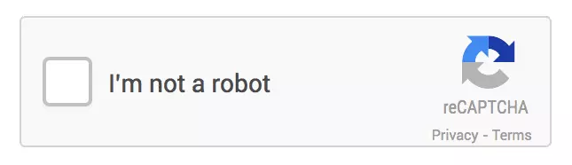
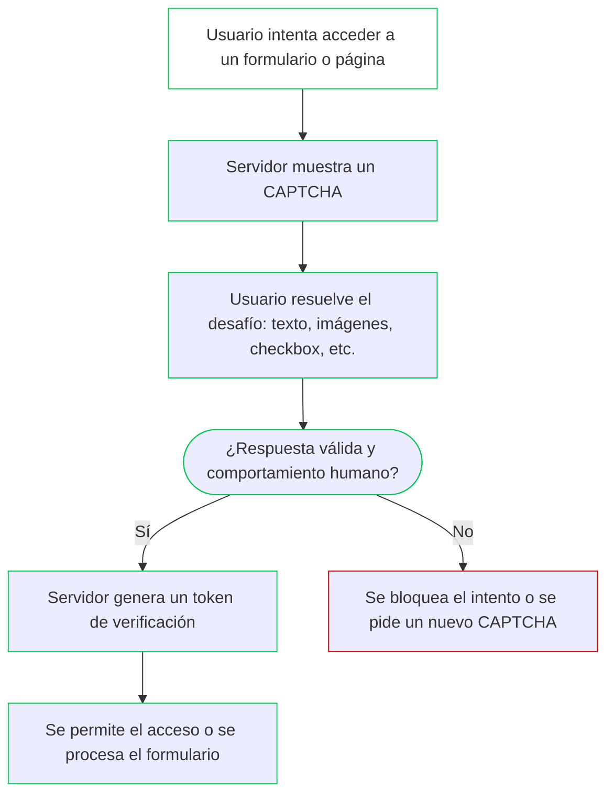

# sesion-13a 04.11.2025

## Mañana

El repositorio de datos que estábamos utilizando se saturó debido a la gran cantidad de información. 

Nuevo repositorio para alojar el material y los recursos necesarios para el resto de las clases.

## Proyecto Mateo

Mateo creó una IA la cual genera letras nuevas que modifican las letras originales.

Proyecto que modifica las letras de afiches políticos.

Tipográfica Propagandística es un proyecto de investigación, archivo y exhibición digital desarrollado por Mateo Arce.

Explora la historia de las letras y tipografías en la propaganda política y cultural de Chile y América Latina desde 1930 hasta la actualidad.

El proyecto combina curaduría visual, análisis tipográfico y herramientas digitales para construir una lectura crítica del diseño como lenguaje político.

[Repositorio de Mateo](https://github.com/matbutom/typo-grafica-propagandistica)

## Inicio de clase 

### ¿Cómo funciona la inteligencia artificial?

La inteligencia artificial (IA) funciona imitando ciertas capacidades humanas como aprender, razonar, reconocer patrones o tomar decisiones pero usando matemáticas, datos y algoritmos.

- las imágenes funcionan bajo una matriz de números
- le entrega valores númericos, que se modifican según como entrenamos esta imágen

### ¿Cómo funciona la IA generativa?

- el uso del captcha para asociar palabras a imágenes.
- **TPU** (Tensor Processing Unit): es un chip especial creado por Google para que las inteligencias artificiales aprendan y trabajen más rápido. Muchos de los macbook actuales vienen con tpu.
- **CPU**: el cerebro normal del computador, hace de todo, pero más lento en tareas de IA.
- **GPU**: muy buena para cálculos en paralelo, como los de videojuegos o redes neuronales.
- **TPU**: una “GPU especializada” diseñada exclusivamente para IA.
- **RNN** (Red Nuronal Recurrente): es un tipo de inteligencia artificial que sirve para trabajar con información que viene en secuencia. Como trabaja con datos, siempre se puede equivocar ya que juega con probabilidades.

Información sacada de [05-sofiacartes](https://github.com/mmillar95/dis8645-2025-2-proyectos/edit/main/05-sofiacartes/sesion-13a/README.md)

### CAPTCHA

(Completely Automated Public Turing test to tell Computers and Humans Apart: test de Turing público y automático para distinguir a los ordenadores de los humanos) 

La prueba de un CAPTCHA consta de dos partes simples: una secuencia de letras o números generada aleatoriamente que aparece como una imagen distorsionada y un cuadro de texto. 

## Diagrama de cómo funciona CAPTCHAT 

### Google Colaboratory

Google Colaboratory es un servicio que te permite usar un computador en la nube, aprovechando servidores de Google desde cualquier lugar del mundo. Cualquier persona con una cuenta de Google puede acceder a este entorno, que actualmente es muy utilizado para trabajar con Inteligencia Artificial. Además, ofrece acceso a GPU y TPU, lo que permite ejecutar modelos avanzados incluso si tu propio equipo no cuenta con este tipo de hardware.

### Homebrew

Homebrew es una herramienta que facilita la instalación de software en tu computador, especialmente en macOS (aunque también funciona en Linux). La utilizaremos para poder trabajar con GitHub directamente desde la terminal.

Instalación:

1. Ir a la página: (https://brew.sh/).
2. Copiar el link que aparece en la página.
3. Abrir la terminal del computador.
4. Pegar lo copiado.
5. Hacer enter y seguir los pasos.

### Ideas para el Proyecto 03 (Grupo 04)

- Máquina que siente diferente: le pegas y se calma.
- Máquina que cambia una gráfica según la intensidad con la cual la tratas.
- Experimentar con materialidades.
- Hilo conductor, ver si funciona.
- Graficas.
- Sensor de fuerza.
- Sensor touch.
- Reacción de fluidos con la presión.
- Cómo medir el impacto/velocidad de la fuerza.

### Materiales 

Lista de materiales para comprar/recolectar y poder definir nuestro proyecto

- Sensor de fuerza.
- Hilo conductor.
- Lana, tela, algodon, etc.
- Arduino Wifi (nos presto la Janis<3)
- Sensor Touch

