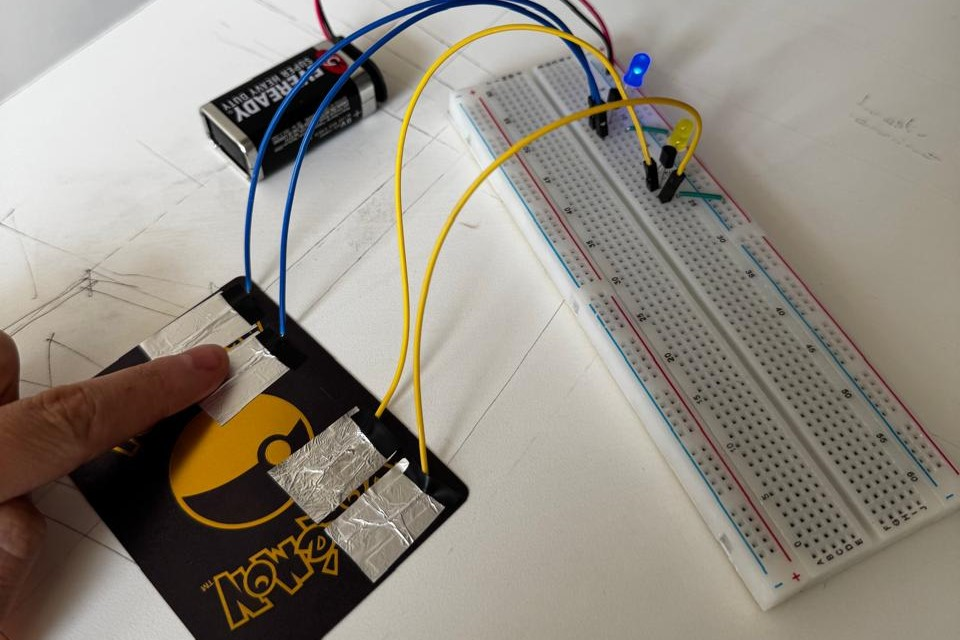

# sesion-13b 07.11.2025

## Inicio de clases

### Sugerencias de Aarón para nuestro proyecto 

- No debemos tratar a la máquina como si fuera humana.
- Revisaron nuestra descripción del proyecto.
- Nos recomendaron probar distintos materiales y sensores, no forzar emociones en la máquina y mantener la mente abierta.
- Y que debemos estar preparados para defender la complejidad de la propuesta.

### Sensores para investigar 

[Sensor Capacitivo Touch TTP223B](https://afel.cl/products/sensor-capacitivo-touch-ttp223b?variant=45125236228248&country=CL&currency=CLP&utm_medium=product_sync&utm_source=google&utm_content=sag_organic&utm_campaign=sag_organic&srsltid=AfmBOorzuC7nfPVe_wCodv_wdMEYg45dr_KOCh5tIoOs6YkDODuBCIy8I28)

- Este módulo utiliza el circuito integrado TTP223B que es un sensor touch capacitivo. En su estado normal la salida del módulo se encuentra en cero lógico y baja consumo de corriente, cuando un dedo toca la posición correspondiente la salido del módulo se activa en uno lógico, sino se toca el modulo en 13 segundos vuelve a modo de bajo consumo.
- Voltaje de entrada: 2 ~ 5.5 VCD
- Salida alta: 0.8 VCD
- Salida baja: 0.3 VCD
- Tiempo de respuesta: 60 ms
- Tiempo de respuesta modo ahorro: 220 ms
- Dimensiones: 24 x 24 x 7.2 mm
- Peso: 2 g


[Sensor Piezoelectrico](https://ardumotica.cl/producto/sensor-piezoelectrico/)

- Los piezoeléctricos son útiles cuando se necesita detectar vibraciones o golpes. Usted puede utilizar esto para grifos o sensores de impacto muy fácilmente mediante la lectura de la tensión en la salida. También se puede utilizar para un transductor de audio muy pequeña tal como un zumbador.
  
[Sensor de Fuerza / Presión FSR402](https://afel.cl/products/sensor-de-fuerza-presion-fsr402?variant=45125253169304&country=CL&currency=CLP&utm_medium=product_sync&utm_source=google&utm_content=sag_organic&utm_campaign=sag_organic&utm_term=&utm_campaign=@+Smart+Shopping+2&utm_source=adwords&utm_medium=ppc&hsa_acc=1808722794&hsa_cam=19569174895&hsa_grp=&hsa_ad=&hsa_src=x&hsa_tgt=&hsa_kw=&hsa_mt=&hsa_net=adwords&hsa_ver=3&gad_source=1&gad_campaignid=19560974580&gbraid=0AAAAADBMsFRH-tlYxMSNeqD7oQ6WdC_mG&gclid=CjwKCAiA8vXIBhAtEiwAf3B-g8U5Awopy6dLkNEb-Dc0-OED6yLIYNyclrqikE994Ok3wyFxx2WBERoCOmUQAvD_BwE)

- Los FSR’S son, básicamente, una resistencia que cambia su valor (en ohmios Ω) dependiendo de la cantidad que se presiona. Estos sensores son de bajo costo y fácil de usar pero son poco precisos. Sin embargo, para la mayoría de las aplicaciones sensibles al tacto; el FSR ha sido explotado porque es fácil de usar y barato.
- Rango de fuerza: de 0 a 20 libras
- Fuente de alimentación: Cualquiera este sensor utiliza menos de 1 mA de corriente

### Proyecto 03 

Máquina Reactiva: En su estado de reposo, su formas y materialidad atraen. "La curiosidad mato al gato y al usuario a interactuar con la máquina y descubrir su reacción". Al apretar, estirar o acariciar, la máquina despierta y responde proyectando gráficas y sonido en sincronía con cada acción. Cuando se deja la interacción, retorna a su quietud original, como un organismo que exhala y se repliega en sí mismo.

` Discurso (modificar) `

El proyecto propone la creación de una máquina sentimental, un artefacto interactivo capaz de reaccionar sensiblemente al entorno especialmente al ruido, la voz o el tacto y de expresar esas emociones a través de visuales luminosos y patrones en movimiento.

La máquina funciona como una especie de organismo emocional. Su cuerpo, hecho con materiales suaves y cálidos como lana, fieltro o telas táctiles, invita al contacto humano y sugiere vulnerabilidad o afecto. En su interior, un Arduino junto con sensores de sonido y tacto (micrófono, sensor piezoeléctrico o capacitivo) registran los estímulos externos. Estos datos son traducidos en tiempo real a respuestas visuales por ejemplo, luces que cambian de color, intensidad o ritmo, representando lo que ocurre en su interior emocional.

La máquina no busca ser útil, sino sensible. Exagera la relación entre el cuerpo y la emoción, entre la materia y la respuesta, funcionando como un espejo de nuestra propia necesidad de conexión. Puede reaccionar de manera impredecible: a veces se ilumina suavemente ante una caricia, otras se sobresalta con un ruido brusco.

El objetivo del proyecto es explorar la idea de afectividad en los objetos tecnológicos y cuestionar los límites entre lo vivo y lo mecánico. ¿Puede una máquina sentir? ¿O simplemente imitar nuestras formas de sentir? A través de su diseño táctil y sus respuestas lumínicas, la máquina sentimental busca generar una experiencia empática y poética entre el espectador y el objeto, donde la interacción se vuelve una forma de comunicación emocional. Funcionamiento

El proyecto propone la creación de una máquina sentimental, un artefacto interactivo capaz de reaccionar sensiblemente al entorno especialmente al ruido, la voz o el tacto y de expresar esas emociones a través de visuales luminosos y patrones en movimiento.

## Investigación de sensores 

### Sensor de Fuerza / Presión FSR402

```cpp
const int Sensor_Fuerza = A0;  // Pin del sensor de fuerza 

void setup() {
    Serial.begin(9600);
    pinMode(Sensor_Fuerza, INPUT);
}

void loop() {
    int valorFuerza = analogRead(Sensor_Fuerza);  // Leer el valor del sensor
    Serial.print("Sensor de Fuerza: ");
    Serial.println(valorFuerza);
    
    delay(500);  
}
```


### Sensor de capacitivo

Recuerdo que en un curso de profundizacion de tecnologias interactivas vimos este tema, sobre hilo conductivo y como la energia del cuerpo de puede utilizar para encender un led 



Video de referencia: [Sensor Capacitivo](https://www.youtube.com/watch?v=MK8pjkNvcKo)


