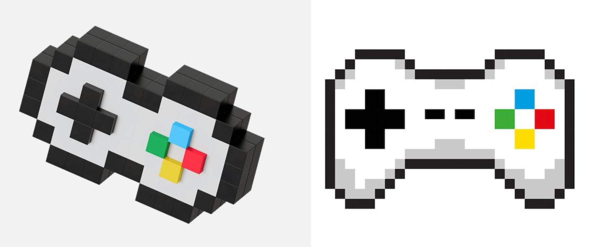

# sesion-15a 18.11.2025

## Inicio de clases

Trabajo autonomo 

` ¿Cómo conectar p5.js con Arduino? `

Para vincular p5.js con Arduino se necesita un programa intermedio que haga de “puente”, como p5.serialcontrol o un servidor creado con Node.js. Estos permiten que p5.js lea y envíe datos a través del puerto serial usando la librería p5.serialport.

Si lo que se busca es conectar directamente un controlador de p5.js al Arduino y luego volver a comunicarlo con p5.js, es necesario usar una placa con capacidad USB host y la biblioteca USB Host Library 2.0.

## Proyecto "Atrápame si puedes"

`Metáfora`

La máquina es una representación tecnológica del logro frustrado, esa sensación que parece estar a punto de alcanzarse, pero que se rompe por un detalle absurdo. Representa esa experiencia humana de perseguir algo que siempre se escapa (movimiento involuntario, un error, un control invertido). Una máquina que te hace sentir querer algo y perderlo por un gesto mínimo. 

`Presentación Textual`

"Atrápame si puedes" máquina interactiva que funciona con dos sensores de fuerza/presión. El usuario presiona los sensores para controlar una red "atrapahadas". El objetivo del juego es atrapar a las hadas.

En el juego, atrapar al personaje es totalmente posible, pero la dificultad surge del propio sistema; que sabotea al jugador con controles que funcionan al revés. La desorientación provoca una frustración cómica que pone al jugador en el límite entre el control y el caos.

La máquina representa el desajuste: el usuario quiere atrapar un objetivo claro, pero la interfaz responde de forma particular. Aparece el humor, la frustración y el esfuerzo por alcanzar una meta, donde puede torcerse por detalles ridículos y aun así seguimos intentándolo.

`Sentimientos`

- Frustración
- Dominar (tener el control)
- Dirigir
- Competitividad

## Ideas de carcasa 

La ideas es que el control de la máquina se diseña intencionalmente como un objeto incómodo y contradictorio. No busca facilitar la interacción, sino amplificar la metáfora del logro frustrado. Al ser pesado, con botones invertidos pero con una ergonomia intuitiva (que lo hace ver como un control igual que los demas), se convierte en una extensión física del desajuste que propone la obra.

