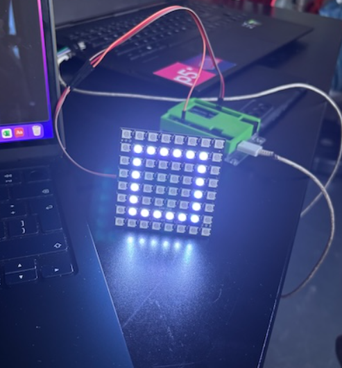
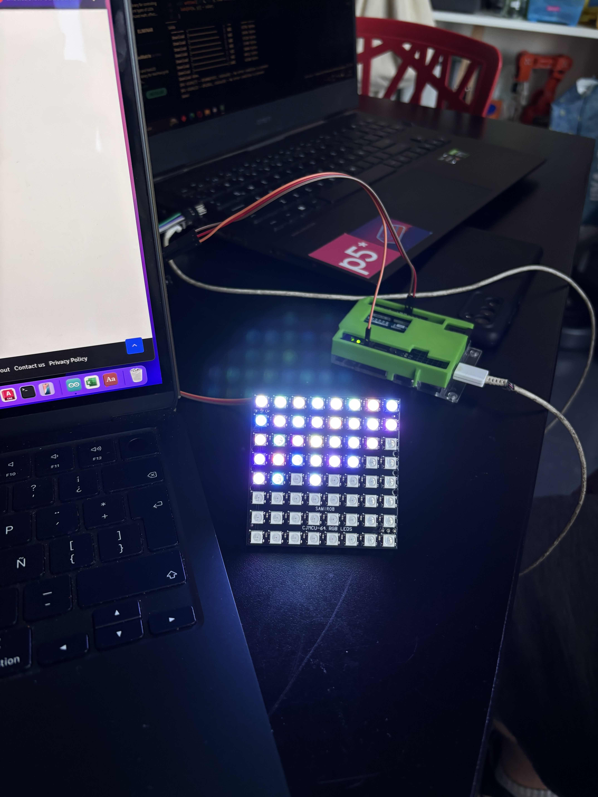

# sesion-14b

-14-11-2025

## Avance código matriz 8x8



```cpp
#include <Adafruit_NeoPixel.h>   // Librería para controlar LEDs NeoPixel (WS2812B)

// --- Configuración básica ---
#define PIN_MATRIX 6            // Pin donde está conectada la matriz LED
#define NUMPIXELS 64            // Total de LEDs (matriz 8x8 = 64 LEDs)

// Crear el objeto que controla la matriz
Adafruit_NeoPixel matrix = Adafruit_NeoPixel(NUMPIXELS, PIN_MATRIX, NEO_GRB + NEO_KHZ800);

// --- Forma base: un cuadrado dibujado en una matriz 8x8 ---
// 1 = LED encendido, 0 = LED apagado
bool baseShape[64] = {
  0,0,0,0,0,0,0,0,
  0,1,1,1,1,1,1,0,
  0,1,0,0,0,0,1,0,
  0,1,0,0,0,0,1,0,
  0,1,0,0,0,0,1,0,
  0,1,0,0,0,0,1,0,
  0,1,1,1,1,1,1,0,
  0,0,0,0,0,0,0,0
};

// --- Dibuja la matriz según los valores de baseShape[] ---
void drawMatrix() {
  matrix.clear();  // Limpia todos los LEDs antes de dibujar

  for (int i = 0; i < 64; i++) {   // Recorre cada LED de la matriz
    if (baseShape[i] == 1) {       // Si el valor es 1 → prender LED
      matrix.setPixelColor(i, matrix.Color(255, 255, 255)); // Color blanco
    } else {                       // Si el valor es 0 → apagar LED
      matrix.setPixelColor(i, matrix.Color(0, 0, 0));       // Apagado
    }
  }

  matrix.show();   // Actualiza la matriz para mostrar los cambios
}
void setup() {
  matrix.begin();  // Inicializa la matriz
  matrix.show();   // Asegura que empiece apagada
  drawMatrix();    // Dibuja el cuadrado inicial
}
void loop() {
}
```

---

Luego probamos el inicio: primero se ve el cuadrado correctamente formado y, cuando se presiona “1” en el puerto serial, el cuadrado se desarma.


```cpp
#include <Adafruit_NeoPixel.h>   // Librería para controlar LEDs WS2812B (NeoPixel)

// --- Configuración de la matriz ---
#define PIN_MATRIX 6            // Pin donde está conectada la matriz LED
#define NUMPIXELS 64            // Total de LEDs (8x8)

Adafruit_NeoPixel matrix = Adafruit_NeoPixel(NUMPIXELS, PIN_MATRIX, NEO_GRB + NEO_KHZ800);

// --- Forma base: un cuadrado con borde brillante ---
bool baseShape[64] = {
  0,0,0,0,0,0,0,0,
  0,1,1,1,1,1,1,0,
  0,1,0,0,0,0,1,0,
  0,1,0,0,0,0,1,0,
  0,1,0,0,0,0,1,0,
  0,1,0,0,0,0,1,0,
  0,1,1,1,1,1,1,0,
  0,0,0,0,0,0,0,0
};

int escapedPixel = -1;  // Guarda el pixel que se "escapa" hacia la derecha (-1 = ninguno)

// --- Convierte coordenadas (x,y) a índice dentro del arreglo baseShape ---
int coordToIndex(int x, int y) {
  return y * 8 + x;   // Fórmula estándar en matrices 8x8 lineales
}

// --- Dibuja la matriz completa ---
void drawMatrix() {
  matrix.clear();   // Borra todos los LEDs

  // Recorre los 64 píxeles del cuadrado
  for (int i = 0; i < 64; i++) {
    if (baseShape[i] == 1) {
      matrix.setPixelColor(i, matrix.Color(255, 255, 255)); // Color blanco
    }
  }

  // Si un pixel escapó, pintarlo en celeste
  if (escapedPixel >= 0) {
    matrix.setPixelColor(escapedPixel, matrix.Color(0, 150, 255));
  }

  matrix.show();   // Actualiza la matriz para mostrar cambios
}

// --- Setup ---
void setup() {
  Serial.begin(9600);      // Iniciar comunicación serial
  matrix.begin();          // Inicializa la matriz LED
  matrix.show();           
  randomSeed(analogRead(A0)); // Semilla para generar números aleatorios

  drawMatrix();            // Mostrar figura inicial

  Serial.println("Escribe 1 y presiona ENTER para romper el cuadrado");
}

// --- Loop ---
void loop() {
  if (Serial.available()) {        // Si llega un dato desde Serial...
    char c = Serial.read();       // Leer el caracter

    if (c == '1') {               // Si el usuario escribió "1"
      
      // Lista de los píxeles del borde derecho del cuadrado
      int candidates[] = {
        coordToIndex(6,1), coordToIndex(6,2), coordToIndex(6,3),
        coordToIndex(6,4), coordToIndex(6,5), coordToIndex(6,6)
      };

      int choice = random(6);              // Elegir uno al azar
      int original = candidates[choice];   // Pixel seleccionado

      baseShape[original] = 0;      // Quitar pixel del borde del cuadrado
      escapedPixel = original + 1;  // Moverlo un espacio hacia la derecha

      drawMatrix();                 // Actualizar la matriz

      Serial.println("Pixel escapado");
    }
  }
}
```

---

Luego cambiamos los colores: el cuadrado quedó en rojo y el píxel que se desplaza pasó a blanco. También agregamos el joystick y reemplazamos el “1” del monitor serial por un botón físico para iniciar. Además, incorporamos otro botón para cambiar el color del píxel que se salió. Por accidente, al presionar el botón del joystick apareció un “modo disco”, y nos gustó tanto que decidimos implementarlo como parte del proyecto.

 

```cpp
#include <Adafruit_NeoPixel.h>   // Librería para controlar LEDs NeoPixel (WS2812B)

// ================= CONFIGURACIÓN GENERAL =================
#define PIN_MATRIZ 6            // Pin donde está conectada la matriz LED
#define NUM_PIXELES 64          // Total de LEDs en la matriz 8x8

// Pines del joystick y botones extras
#define PIN_JOYSTICK_X A0
#define PIN_JOYSTICK_Y A1
#define PIN_JOYSTICK_BOTON 2    // Botón del joystick: activa/desactiva modo disco

#define PIN_INICIO 8            // Botón que libera el pixel escapado desde el cuadrado
#define PIN_COLOR  9            // Botón que cambia el color del pixel escapado

// Objeto NeoPixel que controla la matriz
Adafruit_NeoPixel matriz = Adafruit_NeoPixel(NUM_PIXELES, PIN_MATRIZ, NEO_GRB + NEO_KHZ800);

// ================= VARIABLES DEL JUEGO ==================

// Forma base: un cuadrado de bordes rojos
bool formaBase[64] = {
 0,0,0,0,0,0,0,0,
 0,1,1,1,1,1,1,0,
 0,1,0,0,0,0,1,0,
 0,1,0,0,0,0,1,0,
 0,1,0,0,0,0,1,0,
 0,1,0,0,0,0,1,0,
 0,1,1,1,1,1,1,0,
 0,0,0,0,0,0,0,0
};

int pixelBloqueado = -1;        // El pixel que se retira del cuadrado
int pixelEscapado = -1;         // Pixel suelto fuera del cuadrado

uint32_t colorPixelEscapado = 0x00FFFF;   // Color inicial del pixel escapado (celeste)

// Estados del juego
bool modoDisco = false;                    // Alterna el modo discoteca
unsigned long tiempoUltimoMovimiento = 0;  
const unsigned long retrasoMovimiento = 200;   // Tiempo entre movimientos del pixel

const unsigned long retrasoDisco = 80;         // Velocidad del modo disco

// ================= FUNCIONES UTILES ==================

// Conversión de índice <-> coordenadas
int obtenerX(int indice) { return indice % 8; }
int obtenerY(int indice) { return indice / 8; }
int obtenerIndice(int x, int y) { return y * 8 + x; }

// Genera colores aleatorios, evitando tonos rojizos fuertes
uint32_t generarColorNoRojo() {
  while (true) {
    int r = random(0,256);
    int g = random(0,256);
    int b = random(0,256);

    // Evita rojos fuertes (dominancia de R)
    if (!(r > 200 && g < 80 && b < 80)) {
      return matriz.Color(r,g,b);
    }
  }
}

// Dibuja la matriz en modo normal (cuadrado + pixel escapado)
void dibujarMatrizNormal() {
  matriz.clear();

  // Dibuja el cuadrado rojo
  for (int i = 0; i < NUM_PIXELES; i++) {
    if (formaBase[i] == 1)
      matriz.setPixelColor(i, matriz.Color(255,0,0));   // Rojo
  }

  // Pixel eliminado del cuadrado queda apagado
  if (pixelBloqueado >= 0)
    matriz.setPixelColor(pixelBloqueado, 0);

  // Pixel escapado con su color actual
  if (pixelEscapado >= 0)
    matriz.setPixelColor(pixelEscapado, colorPixelEscapado);

  matriz.show();
}

// Frame del modo DISCO (todos colores aleatorios)
void dibujarMatrizDisco() {
  for (int i = 0; i < NUM_PIXELES; i++) {
    matriz.setPixelColor(i, generarColorNoRojo());
  }

  // Pixel escapado se mantiene por encima del efecto
  if (pixelEscapado >= 0)
    matriz.setPixelColor(pixelEscapado, colorPixelEscapado);

  matriz.show();
}

// =================== SETUP ======================
void setup() {
  matriz.begin();
  matriz.show();
  randomSeed(analogRead(A3));   // Semilla aleatoria

  // Configurar botones con resistencias pull-up internas
  pinMode(PIN_INICIO, INPUT_PULLUP);
  pinMode(PIN_COLOR, INPUT_PULLUP);
  pinMode(PIN_JOYSTICK_BOTON, INPUT_PULLUP);

  dibujarMatrizNormal();         // Mostrar cuadrado inicial
}

// =================== LOOP ======================
void loop() {

  // ---- BOTÓN DE INICIO (libera pixel escapado) ----
  if (pixelEscapado < 0 && digitalRead(PIN_INICIO) == LOW) {

    // Bordes del lado derecho del cuadrado
    int candidatos[6] = {
      obtenerIndice(6,1), obtenerIndice(6,2), obtenerIndice(6,3),
      obtenerIndice(6,4), obtenerIndice(6,5), obtenerIndice(6,6)
    };

    int elegido = random(6);         // Seleccionar uno al azar
    pixelBloqueado = candidatos[elegido];
    formaBase[pixelBloqueado] = 0;   // Sacar el pixel del cuadrado

    pixelEscapado = pixelBloqueado + 1;   // Se mueve un paso a la derecha

    dibujarMatrizNormal();
    delay(250);
  }

  // ---- BOTÓN DE CAMBIO DE COLOR ----
  if (pixelEscapado >= 0 && digitalRead(PIN_COLOR) == LOW) {
    colorPixelEscapado = generarColorNoRojo();
    dibujarMatrizNormal();
    delay(200);
  }

  // ---- BOTÓN DEL JOYSTICK → MODO DISCO ----
  static int ultimoEstadoBoton = HIGH;
  int estadoActualBoton = digitalRead(PIN_JOYSTICK_BOTON);

  // Detecta transición de HIGH -> LOW (pulsación)
  if (ultimoEstadoBoton == HIGH && estadoActualBoton == LOW) {
    modoDisco = !modoDisco;    // alternar
    delay(200);
  }
  ultimoEstadoBoton = estadoActualBoton;

  // ---- ANIMACIÓN DEL MODO DISCO ----
  if (modoDisco) {
    dibujarMatrizDisco();
    delay(retrasoDisco);
    return;     // saltar todo el movimiento del pixel
  }

  // ---- MOVIMIENTO DEL PIXEL ESCAPADO CON JOYSTICK ----
  if (pixelEscapado >= 0) {

    // Leer joystick
    int valorX = analogRead(PIN_JOYSTICK_X);
    int valorY = analogRead(PIN_JOYSTICK_Y);

    // Limitar movimiento por tiempo (suaviza el joystick)
    if (millis() - tiempoUltimoMovimiento >= retrasoMovimiento) {

      int x = obtenerX(pixelEscapado);
      int y = obtenerY(pixelEscapado);

      // Movimiento horizontal
      if (valorX > 800 && x > 0) x--;        // Joystick izquierda
      else if (valorX < 200 && x < 7) x++;   // Joystick derecha

      // Movimiento vertical
      if (valorY > 800 && y > 0) y--;        // Joystick arriba
      else if (valorY < 200 && y < 7) y++;   // Joystick abajo

      int nuevaPosicion = obtenerIndice(x,y);

      // Evitar pisar el pixel bloqueado del cuadrado
      if (nuevaPosicion != pixelBloqueado) {
        pixelEscapado = nuevaPosicion;
      }

      dibujarMatrizNormal();
      tiempoUltimoMovimiento = millis();
    }
  }
}
```
