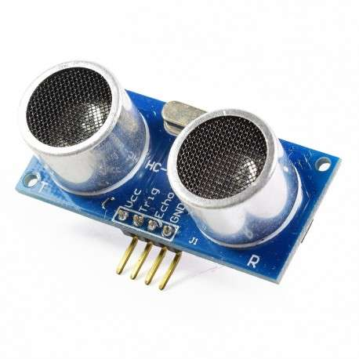

# sesion-13b ✶⋆.˚

## Apuntes — 07.11.25 𓆩♡𓆪

**Recordatorio**
- **Examen:** miércoles **10 de diciembre**, 09:00 hrs.  
- **Entrega del proyecto:** viernes **21 de noviembre**.

────୨ৎ────

## Notas sobre el proyecto

- Se sugiere que la instalación requiera algún tipo de **acción del usuario** (ej: girar una manivela).  
  - *Duda:* ¿también cuenta que el usuario tenga que **acercarse o alejarse**?

- **Primera propuesta:** rompe la linealidad sensor–actuador; el mapping es más complejo.  
- **Segunda propuesta:** fue bien recibida.  
- **Tercera propuesta:** no funcionó tan bien.

- Idea general: posible **trilogía** o variaciones de una misma idea.  
  - Más económico, usando los **mismos sensores** con **comportamientos distintos**.  
  - Referente: **Zimoun** — <http://zimoun.net/>  
  - Concepto: estudio de máquinas sobre presencia (irónico, porque no somos fan de la presencia).

- Siguientes pasos:
  - Ordenar el **hilo conductor**.
  - Tomar decisiones: ¿hacer tres máquinas?  
  - Considerar un **vibrador más grande**, tipo el de los mandos de PlayStation.

- Para la entrega del 21 realizaremos **dos máquinas**:  
  - **Máquina de la Ansiedad**  
  - **Máquina de la Vergüenza**

────୨ৎ────

## Presupuesto (para ambas máquinas)

- Arduino Uno + cable ×2 ✔  
- Protoboard grande ×2 ✔  
- Cables macho-macho ×2 — $1.000 c/u → **$2.000**  
- Sensor ultrasónico ×2 — **$3.000**

- Motor vibrador PWM Switch DC (1) — **$2.000**

- Módulo Mosfet IRF520 (1) — **$2.000**  
- Micro Servomotor SG90 (1) — **$1.990**

- Diodo LED RGB ×15 — **$1.500**

- Resistencias 220Ω (kit 600 und.) — **$4.990**

**Total: $17.480**

────୨ৎ────

## Pendiente
- Definir si las **dos máquinas pueden interactuar** entre sí.
