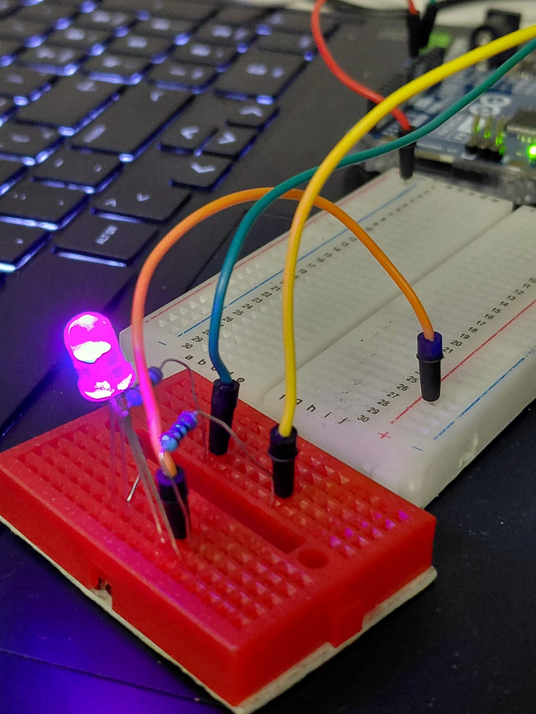
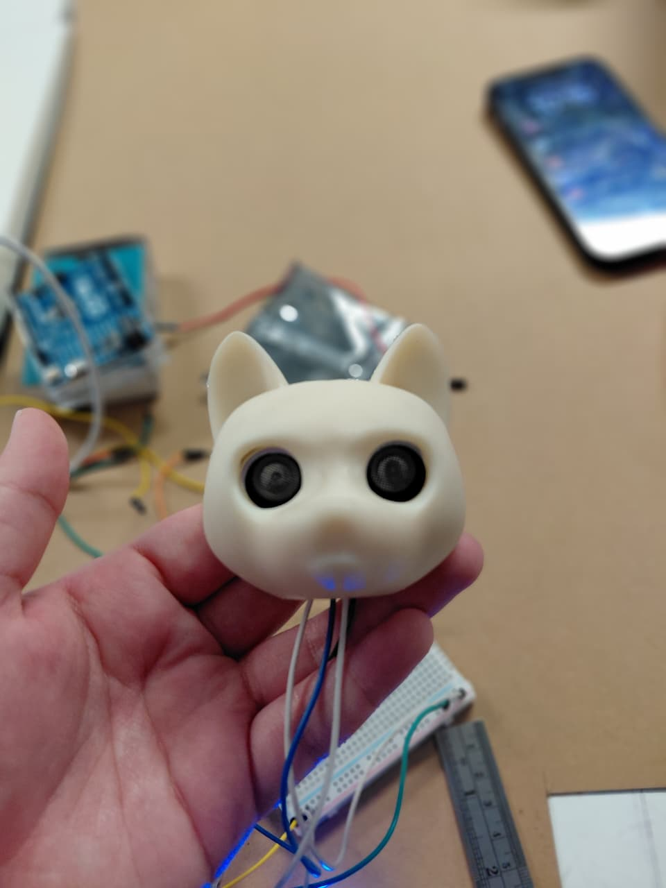

# sesion-14a ✶⋆.˚
 
## Clase 11.11.25 ₊˚⊹ᰔ

### Compra pendiente
- **Motor vibrador PWM Switch DC**  
  *Nota:* Gracias a su diseño con un transistor MOSFET de activación por nivel alto, puede controlarse fácilmente mediante una señal digital o PWM.

────୨ৎ────

## Notas sobre el pseudocódigo

- Los pines **10 (SS_RX)** y **11 (SS_TX)** se utilizarán para que la placa Arduino de la **“Máquina de la Ansiedad”** pueda comunicarse con la placa de la **“Máquina de la Vergüenza”**.

────୨ৎ────

## Conexión física

- Ambas placas deben compartir **GND común** para que la comunicación funcione correctamente.

