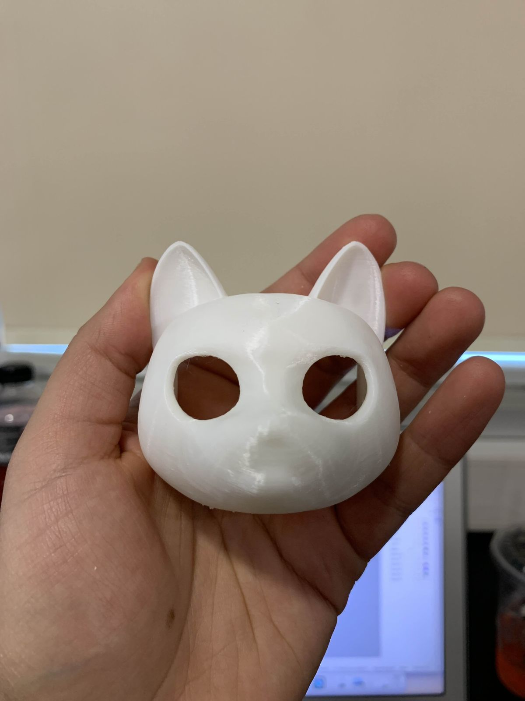
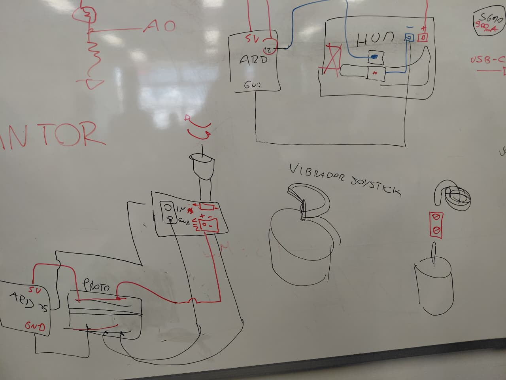

# sesion-15a ✶⋆.˚

Clase del 18.11.25 ₊˚⊹ᰔ

🦭 Hoy trabajamos intensamente en el proyecto durante toda la clase.

Avances y dificultades del día

Al intentar implementar la biblioteca NewPing en el código, descubrimos que no es compatible con la versión de Arduino que usamos. Forzarla podría generar errores, así que se lo comentamos a Misa. Nos dijo que investigaría alternativas, aunque es poco probable que pueda integrarse. Por ahora seguiremos usando el sensor tal como está.

Noté que tengo bastante desorden en los códigos, así que necesito reorganizarlos pronto.

La máquina de la vergüenza avanza bien: el servomotor tiene un movimiento brusco que, según creemos, será suficiente para mover la carcasa.

En cambio, la máquina de la ansiedad presenta problemas. El motor actual no tiene la fuerza necesaria para generar la vibración y el temblor que buscamos. Al comentarlo con Misa, nos recomendó probar un motor de joystick junto con un MOSFET, ya que eso podría darnos el efecto esperado.

Nos coordinamos para dividir tareas y compramos el MOSFET. Aún no hemos podido probar el nuevo motor porque falta montarlo con todas sus piezas.

El motor que nos facilitaron en el laboratorio resultó estar dañado, así que tendremos que conseguir otro.

Los LEDs y los sensores funcionan sin inconvenientes hasta el momento.

Seguimos muy nerviosas por el tema de la carcasa, pero los profesores nos dijeron que no es lo más urgente para el viernes. Lo prioritario ahora es avanzar con el README y las bitácoras individuales.

────୨ৎ────

